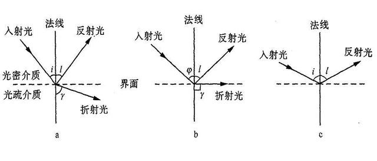
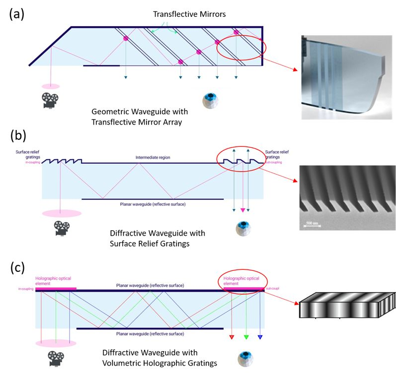

# AR

光波导 Optical WaveGuide，引导光波在其中传播的介质装置，又称介质光波导

分类
1. 集成光波导
   1. 平面(薄膜)介质光波导 (Planar Waveguide)
   2. 条形介质光波导 (Rib Waveguide)
2. 圆柱形光波导 - 光纤 (Optical Fiber)

核心原理是 **全内反射(全反射)** (Total Internal Reflection, TIR)
1. 当光线从 较**高**折射率介质 进入 较**低**折射率介质 时
2. 如果 入射角 **大于** 某一临界角θc(光线远离法线)时
3. 折射光线将会消失，所有的入射光线将被反射，而不进入低折射率的介质
4. 

组成部分
1. 芯层 Core     : 较高的折射率，用于传输光
2. 包层 Cladding : 较低的折射率，用于限制光波传播范围

耦入 耦出

技术路线 (空间计算是统一的)
1. OST : Optic See-Through 光学透视
   1. 允许用户通过透明的光学显示器直接看到真实世界，同时将虚拟内容投影到用户视野中
2. VST : Video See-Through 视频透视
   1. 通过摄像头捕获现实世界的图像，然后将虚拟内容与摄像头图像合成，最终在屏幕上显示给用户
   2. Apple Vision Pro, Meta Quest

衍射表面浮雕斜光栅 SRG

衍射表面浮雕纳米柱光波导

全息体光栅波导 VHG/VBG (成本低)

公司
1. [WaveOptics](https://waveoptics.ar/) - 衍射表面浮雕纳米柱光波导

[一文看懂主流AR眼镜的核心显示技术--光波导（完整篇）](https://www.eet-china.com/mp/a42617.html)

☆ [Fundamentals of display technologies for Augmented and Virtual Reality](https://hackernoon.com/fundamentals-of-display-technologies-for-augmented-and-virtual-reality-c88e4b9b0895)

[一文看懂：AR产业金钥匙——衍射光波导](https://xueqiu.com/8552745795/133678299)

