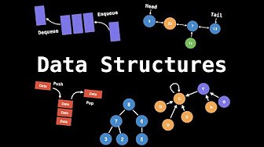

# Easy to Advanced Data Structure

[WilliamFiset - YouTube Channel](https://www.youtube.com/@WilliamFiset-videos)

[WilliamFiset - Github](https://github.com/williamfiset/Algorithms)

[Easy to Advanced Data Structure - YouTube](https://www.youtube.com/watch?v=Qmt0QwzEmh0&list=PLDV1Zeh2NRsB6SWUrDFW2RmDotAfPbeHu)

## Table of Contents

- [Easy to Advanced Data Structure](#easy-to-advanced-data-structure)
  - [Table of Contents](#table-of-contents)
- [01 - Introduction](#01---introduction)
- [02 - Abstract Data Types (ADT 抽象数据类型)](#02---abstract-data-types-adt-抽象数据类型)
- [03 - Computational Complexity Analysis - Big-O](#03---computational-complexity-analysis---big-o)
- [04 - Static \& Dynamic Arrays](#04---static--dynamic-arrays)
- [05 - Dynamic Array Source Code](#05---dynamic-array-source-code)

---

# 01 - Introduction

A **data structure** is a way of **organizing data** so that it can be used(queried, updated) efficiently

essential ingredients in creating powerful algorithms

# 02 - Abstract Data Types (ADT 抽象数据类型)

an abstraction of a data structure which provides only the interface

define how a data structure should behave and what method it should have

no detail about how to implement and program

eg:
1. ADT - List
   1. Dynamic Array
   2. Linked List
2. ADT - Queue
   1. Linked List based Queue
   2. Array based Queue
   3. Stack based Queue
3. ADT - Map
   1. Tree Map
   2. Hash Map/Table

# 03 - Computational Complexity Analysis - Big-O

[Time complexity - Wikipedia](https://en.wikipedia.org/wiki/Time_complexity)

**Time** & **Space**

Big-O
1. Upper Bound
2. Worst Case
3. quantify(量化) performance as the input size becomes arbitrarily large

|Name                |Notation      |
|--------------------|--------------|
|Constant Time       |$O(1)$        |
|Logarithmic Time    |$O(log(n))$   |
|Linear Time         |$O(n)$        |
|Linearithmic Time   |$O(n·log(n))$ |
|Quadric Time        |$O(n^2)$      |
|Cubic Time          |$O(n^3)$      |
|Exponential Time    |$O(b^n) (b>1)$|
|Factorial Time      |$O(n!)$       |

ignore constants

focus on dominant variables

# 04 - Static & Dynamic Arrays

|           |Static Array   |Dynamic Array  |
|-----------|---------------|---------------|
|Access     |$O(1)$         |$O(1)$         |
|Search     |$O(n)$         |$O(n)$         |
|Insertion  |N/A            |$O(n)$         |
|Appending  |N/A            |$O(1)$         |
|Deletion   |N/A            |$O(n)$         |

static array - fixed length - indexable `[0, n)`

zero-based - first element is in position 0

dynamic array - grow & shrink in size (`.add()`, `.remove()`)

# 05 - Dynamic Array Source Code

