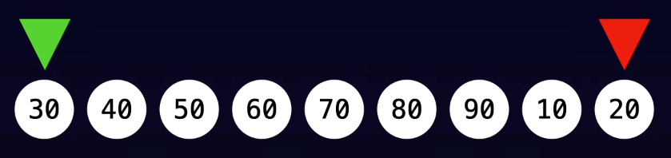

[LeetCode Patterns - Problem Stats](https://algo.monster/problems/stats)


Data Structure
1. Linear
   1. Array
   2. String
   3. Linked List
2. Non-Linear
   1. Tree - no cycle
   2. Graph - have cycle


Patterns
1. `Prefix Sum`
   1. multiple queries **sum of subarray**
   2. 很多时候不需要创建新 array，就在 input array 直接修改即可，avoid extra space
2. `Two Pointers`
   1. reduce time complexity : $O(n^2) → O(n)$
   2. 
   3. Same Direction
      1. `Fast & Slow Pointers`
         1. detect cycles in linked list，如果链表中有环，那么快指针最终会追上慢指针，如果没有环，快指针会先到达链表末尾
         2. find the middle of the linked list，当 fast pointer 到达结尾，slow pointer 正好在中间
   4. Opposite Direction
      1. find pairs - eg: `Two Sum II`，从两边开始，和大则右指针左移，和小则左指针右移
      2. compare elements in the opposite direction
3. `Sliding Window`
   1. 实现上还是 使用 2 pointers(start & end)
   2. eg : 寻找不重复的最长字符串
   3. 
   4. 3 - Longest Substring Without Repeating Characters
4. `Modified Binary Search` (in a sorted array)
   1. Time Complexity : $O(log n)$
   2. check the middle element
   3. 
   4. 适用于 Monotonic Function(单调函数)
   5. 也适用于 Rotated Array
   6. 
5. `Depth-First Search` - one path as far as possible
   1. 
   2. **stack**
   3. 常使用 **recursion**递归 实现
   4. 适用于 exploring all paths
   5. Template
      1. Tree DFS - 只有左右子节点，不需要 额外记录 visited
         ```python
         def dfs(root, target):
            if root is None:
               return None
            if root.val == target:
               return root
            left = dfs(root.left, target)
            if left is not None:
               return left
            return dfs(root.right, target)
         ```
      2. Graph DFS - 有多个后续
         ```python
         def dfs(root, visited):
         visited.add(root)  # 立即标记 root 为已访问
         for neighbor in get_neighbors(root):
            if neighbor not in visited:
                  dfs(neighbor, visited)
         ```
   6. 133, 113, 210
      3. 200 - Number of Island
6. `Breadth-First Search` - level by level
   1. **queue** : first in first out
   2. 适合
      1. 最短路径 shortest path
      2. level by level traversal
      3.
   3. Template
      ```python
      from collections import deque
      def bfs_by_queue(root):
         visited = set()
         queue = deque([root]) # at least one element in the queue to kick start bfs
         visited.add(root)
         while len(queue) > 0: # as long as there is an element in the queue
               node = queue.popleft() # dequeue
               for child in node.children: # enqueue children
                  if OK(child): # early return if problem condition met
                     return FOUND(child)
                  if child not in visited:
                     queue.append(child)
                     visited.add(child)
         return NOT_FOUND
      ```
   4. 102, 994, 127
7. `BackTracking` 回溯
   1. DFS 的延伸
   2. exploring all potential solution paths and backtracking the paths that do not lead to a valid solution
   3. 
   4. 需要自己构建 structure
   5. 回溯 可以理解为 traverse遍历 未构建完的结构的过程，是一种通过探索所有可能的选择来构建解的过程
   6. eg : Sudoku, N-Queens
   7. 17 - Letter Combinations of a Phone Number
   8. 46, 78, 51
8. `Priority Queue`(`Top K`)
   1. 最常见的实现是 Heap堆，是一种特殊的树形数据结构
   2. 堆通常用完全二叉树来表示，并用数组存储以节省空间
   3. 如果使用 sorting，则时间复杂度为 `O(n log n)`，使用 堆后变为 `O(n log k)`
   4. Heap 保证
   5. 
   6. 找 **最大值** 用 **Min Heap 最小堆**
      1. 对于每一个节点，节点的值都小于或等于它的子节点的值，根节点最小
      2. ` heapq.nlargest()`
   7. 找 **最小值** 用 **Max Heap 最大堆**
      1. 对于每一个节点，节点的值都大于或等于它的子节点的值，根节点最大
      2. `heapq.nsmallest()`
   8. 理解
      1. 堆只保证 当前节点 和 子节点 的大小关系，与其他兄弟节点的子节点关系并不能保证
   9. 时间复杂度 `O(log n)`
9.  `Dynamic Programming`
   1. break down into overlap problem & re-use
   2. 变种很多
   3. Top-Down : start from main problem, recursive, store the result of sub-problems
   4. Bottom-Up : solve the smallest problem first, 类似 fill in the table
   5. 70, 300, 322, 416, 1143, 312
10. Linked List In-Place Reversal(Swap Nodes In-Place)
    1. 
11. Monotonic Stack
    1. eg : 找下一个更大的值，如果没找到则一直 压栈(栈从低到顶为降序，否则可以出栈)
    2. 496， 739， 84
12. Quick Select
13. Overlapping Intervals
    1. merging intervals
    2. interval intersection
    3. insert interval
    4. Find Minimum Meeting Rooms
14. Matrix Traversal
    1. 类似于 Graph Traversal
    2. 733, 200, 130
15. Binary Tree Traversal
    1. 
    2. 
    3. 257, 230, 124, 107


