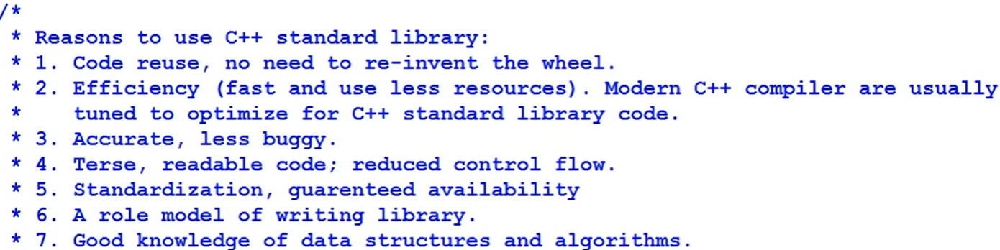
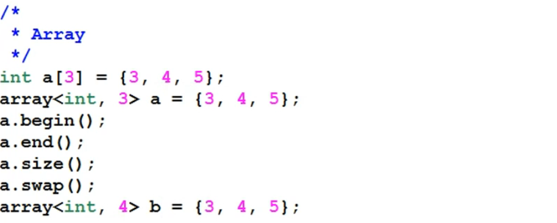

# STL --- 标准模板库

[toc]

# Portal
[学习C++标准模版库（STL）](https://www.bilibili.com/video/BV18s411a7id/)


# 学习C++标准模版库（STL） Bo Qian

## P01 Learn STL_ Introduction of Templates

**==Function Template==**

**对于函数模板，可以不显式说明数据类型，编译器会从变量推断**

```cpp
template <typename T>
T square(T x)
{
	return x * x;
}

int main()
{
	cout << square<int>(5) << endl;
	cout << square<double>(5.5) << endl;

    // 可以不显式说明数据类型，编译器会从变量推断

	cout << square(5) << endl;
	cout << square(5.5) << endl;

	return 0;
}
```

==副作用==代码膨胀（英语：**Code bloat**）是指代码有着不必要的长度、缓慢或者其他浪费资源的情况。

C++中采用的模板系统的一些原生实现是编译该语言的编译器之不足之处的例子。


**==Class Template==**

**对于类模板，必须显式说明数据类型**

```cpp
template <typename T>
class myVector
{
private:
	T arr[10];
	int size;
public:
	myVector():size(0){}
	void push(T x)
	{
		arr[size] = x; size++;
	}
	void print() const
	{
		for (int i = 0; i < size; i++)
		{
			cout << arr[i] << " ";
		}
		cout << endl;
	}
};

int main()
{
	myVector<int> mV;
	mV.push(1); mV.push(-1); mV.push(3);
	mV.print();

	myVector<double> mVD;
	mVD.push(1.1); mVD.push(-1.1); mVD.push(3.1);
	mVD.print();

	return 0;
}
```

**==结合==**

```cpp
template <typename T>
T square(T x)
{
	return x * x;
}

template <typename T>
class myVector
{
private:
	T arr[10];
	int size;
public:
	myVector():size(0){}
	void push(T x)	{arr[size] = x; size++;}
	void print() const
	{
		for (int i = 0; i < size; i++)
		{cout << arr[i] << " ";}
		cout << endl;
	}
	T getItem(int i) const { return this->arr[i]; }
	int getSize() const { return this->size; }
};

template <typename T>
myVector<T> operator* (const myVector<T>& mv1, const myVector<T>& mv2)
{
	myVector<T> newMV;
	for (int i = 0; i < mv1.getSize(); i++)
	{
		newMV.push(mv1.getItem(i) * mv2.getItem(i));
	}
	return newMV;
}

int main()
{
	myVector<int> mV;
	mV.push(1); mV.push(-1); mV.push(3);
	mV.print();

	myVector<int> newMV = square(mV);
	newMV.print();

	return 0;
}
```
 main函数中的square调用函数模板，其中的*调用运算符重载。


## P02 Introduction of STL #1_ Overview


algorithms：操作container中的数据
containers：存储数据，data structures

STL希望algorithms可以作用于不同containers上
不同于面向对象，STL分离了algorithm和container，其数据结构和算法是多对多

由于container接口不同，为了使用相同algorithms，引入迭代器iterator
通过iterator，containers提供相同interface

algorithm不管container而是与iterator交互，这样以后**拓展时更方便**
1. 新algorithm可以使用iterator，让每个container调用
2. 新container提供iterator后，可以调用之前实现的algorithm


原先为了给M个containers都分别实现N个algorithms，需要M*N个implementations
现在引入iterator，只需M+N个implementations


**所有STL库都定义在namspace std中**

**例子**


```cpp
#include <iostream>
#include <vector>
#include <algorithm>
using namespace std;
int main()
{
	vector<int> vec;
	vec.push_back(1); vec.push_back(9); vec.push_back(5);
	vector<int>::iterator iter1 = vec.begin(), iter2 = vec.end();

	for (vector<int>::iterator iter = iter1; iter != iter2; iter++)
	{
		cout << *iter << " ";
	}

	sort(iter1, iter2);

	for (vector<int>::iterator iter = iter1; iter != iter2; iter++)
	{
		cout << *iter << " ";
	}
	return 0;
}
```




tune:调整
terse：简洁的


==P.S. c++中的::==
```cpp
#include <iostream>

using namespace std;

class A
{
public:
	class Pos
	{
	public: 
		int x; int y;
		Pos() :x(0), y(0) {}
		void disp()
		{cout << "A-Pos: " << x << " " << y << endl;}
	};
};

class B
{
public:
	class Pos
	{
	public: 
		int x; int y;
		Pos() :x(0), y(0) {}
		void disp()
		{cout << "B-Pos: " << x << " " << y << endl;}
	};
};

int main()
{
	A::Pos apos;
	B::Pos bpos;
	apos.disp();
	bpos.disp();

	return 0;
}
```


## P03 Introduction of STL #2_  Sequence Containers


### Vector


### Deque


### List


存储不连续，所以traverse很慢

而且存储内容多了两个指针，更占用空间

但是分片插入更加方便


从list2切出[itr_a,itr_b)，然后插入list1的itr前面。

### Array

使用array_container可以使得数组可以使用STL的方法。



array大小不能改变


## P04 Introduction of STL #3_ Associative Containers

用binary_tree实现的

总是排好序的，再insert后


## P05 Introduction of STL #4_  Unordered Containers

## P06 Introduction of STL #5_ Iterators and Algorithms

## P07 Introduction of STL #6_ Functors

## P08 STL Algorithms #1_ Non-modifying Algorithms

## P09

## P10

## P11

## P12

## P13

## P14

## P15

## P16

## P17

## P18

## P19

## P20

## P21

## P22

## P23


