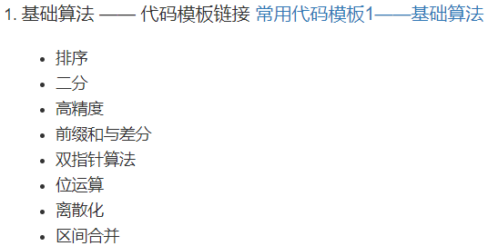

# AcWing算法基础课

[toc]

# Portals

[AcWing 算法基础课](https://www.acwing.com/activity/content/11/)
[AcWing 算法提高课](https://www.acwing.com/activity/content/16/)
[AcWing LeetCode究极班](https://www.acwing.com/activity/content/31/)


# 第一章 算法基础（一） 快排+归并+二分

[常用代码模板1——基础算法](https://www.acwing.com/blog/content/277/)
[AcWing视频课](https://www.acwing.com/video/10/)



## 快速排序（分治）

步骤：
1. 确定分界值（左值，右值，中间位置的值，随机位置的值）
2. （==重点==）重新划分区间，小于等于在左边，大于等于在右边
   1. 笨（占用额外空间）：暴力开两个数组
   2. 优美（不占用额外空间）：两个指针指两边分别向内移动，两个指针都找到两个不应该在该区间的数，交换...直至相遇
3. **递归**处理左&右

```cpp


```


