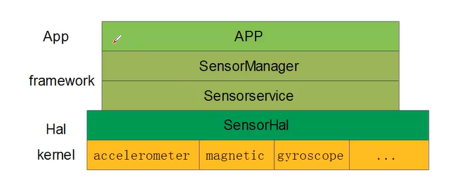

# Android Sensor

[toc]

## Portals

[Android官方 Sensor](https://developer.android.google.cn/reference/android/hardware/Sensor)

[Android官方 Sensor Overview](https://developer.android.google.cn/guide/topics/sensors/sensors_overview)

[B站 Android Sensor框架说明](https://www.bilibili.com/video/BV18P4y1Y7wX)

# Android Sensor框架

1. 应用层（APP）
2. 中间层（framework hal）
   1. SeneorManager向上提供接口，支撑APP
   2. SensorService向SensorManager提供服务
   3. SensorHAL是动态库，根据不同平台load不同动态库
3. 底层（kernel）
   1. 设备的驱动（实体Sensor），生成设备节点

在应用层获取数据时，向SensorManager注册一个监听接口。SensorManager与SensorService建立通讯。

# 常见Sensor

[Android官方 Sensor Overview](https://developer.android.google.cn/guide/topics/sensors/sensors_overview)

1. 方向传感器：：Sensor.TYPE_ORIENTATION
2. 加速度(重力)传感器：sensor.TYPE_ACCELEFOMETER
3. 光线传感器：sensor.TYPT_LIGHT
4. 磁场传感器：sensor.TYPE_MANGNETIC_FIELD
5. 距离(临近性)传感器:Sensor.TYPE_FROXIMITY
6. 温度传感器：Sensor.TYPE_TEMPERATURE

