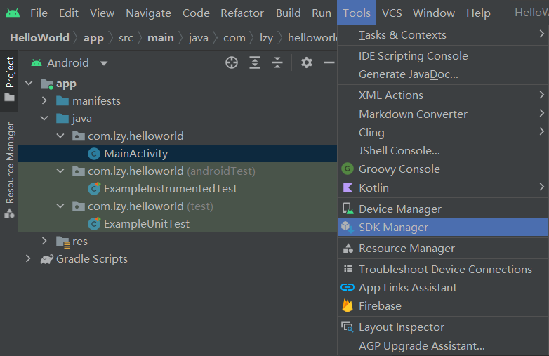
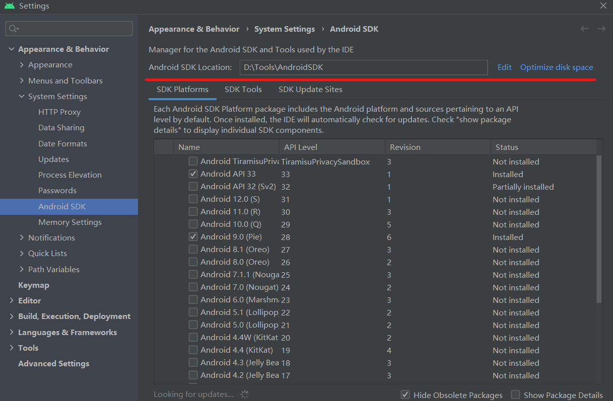
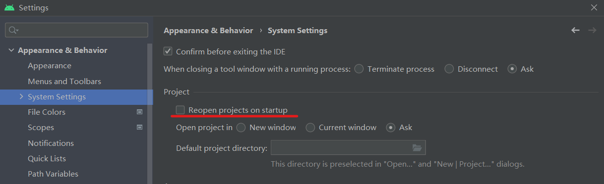
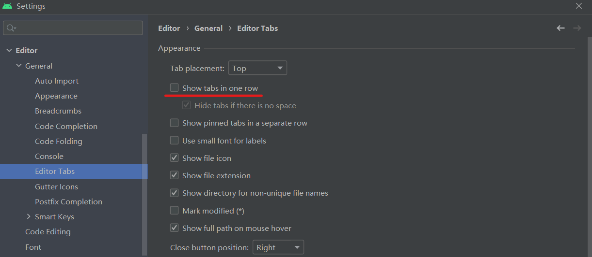
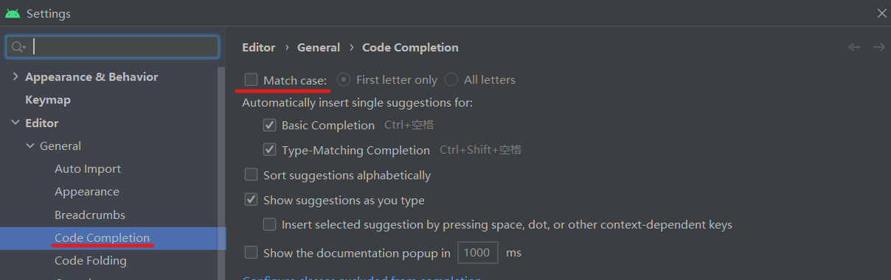
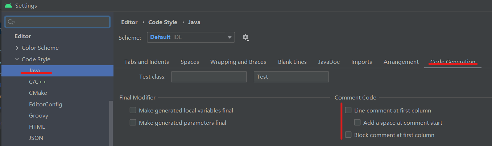
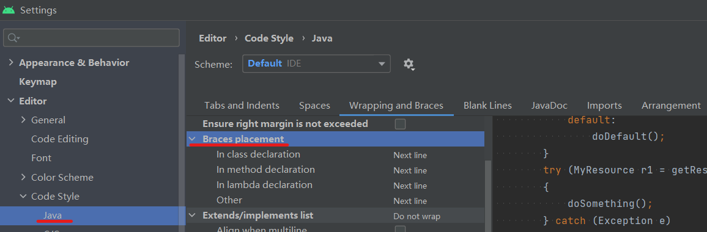

# 安装&配置Android Studio

[toc]


## .android&.gradle

[将.android和.gradle配置到其他盘](https://blog.csdn.net/Carson1145/article/details/105252454)

找到Android Studio安装目录下的\bin\idea.properties文件

```
#---------------------------------------------------------------------
# Uncomment this option if you want to customize a path to the settings directory.
#---------------------------------------------------------------------
idea.config.path=D:/Tools/AndroidStudio/.AndroidStudio/config

#---------------------------------------------------------------------
# Uncomment this option if you want to customize a path to the caches directory.
#---------------------------------------------------------------------
idea.system.path=D:/Tools/AndroidStudio/.AndroidStudio/system

#-----------------------------------------------------------------------
# Add new gradle path
#-----------------------------------------------------------------------
gradle.user.home=D:/Project/Java/GradleRepository
```

## SDK位置设置





## 不默认打开文件



## 分行显示文件标签



## 代码自动补全大小写不敏感



## 不顶格注释



## 大括号自动换行




## Tips

安装插件时应该不用挂VPN
