# Android

[toc]

## Portals

[Android Studio 官网下载](https://developer.android.google.cn/studio)

[Android开发从入门到精通 --- 传感器](https://www.bilibili.com/video/BV1jW411375J?p=176)


# B站 Android开发教程

[B站 Android开发教程](https://www.bilibili.com/video/BV1w4411t7UQ)

## HelloWorld 创建第一个项目

Project
1. manifests
   1. AndroidManifest.xml(APP清单)
2. java
   1. MainActivity.java
3. res(资源)
   1. drawable(图片，xml)
   2. layout(布局文件，xml)
   3. mipmap(图标)
   4. values(常量，xml)

### 生成APK

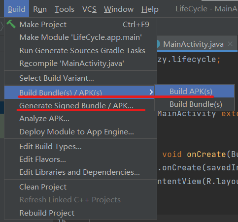


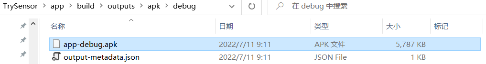


## ConstraintLayout：在图形化下设计UI界面


## Activity声明周期

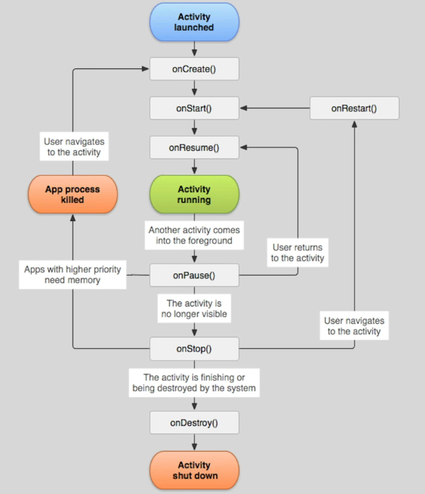


**Android四大组件**
1. Activity
   1. 由多个activity构成应用程序，可以灵活的启动或调用（**分块**）
   2. onCreate,onStart,onResume,onPause,onStop,onDestroy被称为回调Callback。系统调用我们的内容。
   3. onCreate创建对象，onStart时activity还没有正式进入活跃，将所有内容准备好后进入onResume。onPause暂停（还可见），如果变为不可见（退到后台）则调用onStop。onStop和onPause可能会被系统killed。如果用户重新调用，则调用onRestart，重新进入流程。onDestroy表示最终被关闭。
2. BroadcastReceiver
3. Service
4. ContentProvider


### 观察生命周期

```java
String TAG="myTag";

@Override
protected void onCreate(Bundle savedInstanceState) {
   super.onCreate(savedInstanceState);
   setContentView(R.layout.activity_main);
   Log.d(TAG,"onCreate");
}
```

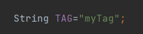

启动后在logcat中查看（在virtual device中进行操作）


启动时log输出onCreate、onStart、onResume

退到后台时log输出onPause、onStop

关闭应用后log输出onDestroy

**自动翻转会将Destroy再Create**

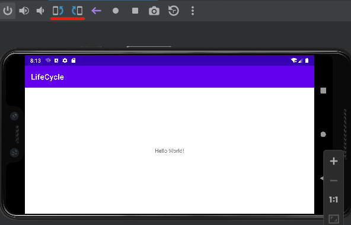

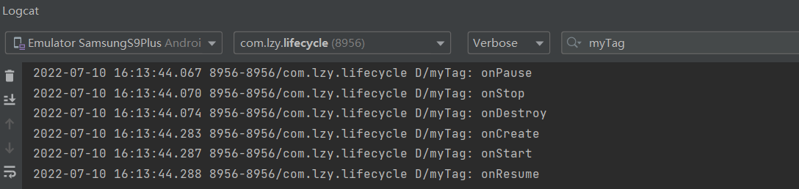


## UI控件

MVC模式(model view controller)

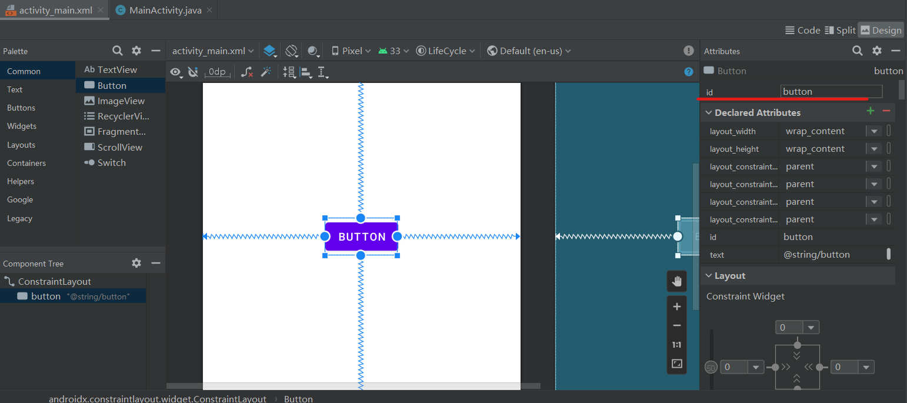

每一个拖拽出来的控件都有一个==id==。控制逻辑是通过id让控件与变量建立逻辑。

在MainActivity.java中编写代码

```java
import android.widget.Button;

public class MainActivity extends AppCompatActivity {

    Button myButton;

    String TAG="myTag";

    @Override
    protected void onCreate(Bundle savedInstanceState) {
        super.onCreate(savedInstanceState);
        setContentView(R.layout.activity_main);
        Log.d(TAG,"onCreate");

        myButton = findViewById(R.id.testButton);
//        R表示resource目录下的资源
//        R.drawable.xxx表示图片
//        R.raw.xxx表示视频音频文件
//        R.layout.xxx表示layout文件
    }

    @Override
    protected void onPause() {
        super.onPause();
        // setText修改内容
        myButton.setText("onPause");
    }
}
```

### 常见控件

**Common**
1. TextView
2. Button
3. ImageView

**Text**
1. TextView
2. PlainText(对应完整键盘)
3. Password(对应完整键盘)(文字变为*号)
4. Number(对应数字键盘)
5. Date
6. Time

**Buttons**
1. CheckBox
2. RadioGroup&RadioButton(放在group中实现互斥，单独RadioButton选择后无法还原)
3. Switch&ToggleButton(两者功能类似)

**Widgets**
1. WebView显示浏览器
2. VideoView播放视频
3. CalendarView显示日历
4. ProgressBar(进度条)
   1. 圆形（旋转）
   2. 水平（indeterminate）
5. SeekBar(拖动条)
   1. 连续
   2. 离散
6. RatingBar
7. SearchView

**Google**
1. AdView(广告)
2. MapView(地图)


### 按键的动作（动态使用）

```java
public class MainActivity extends AppCompatActivity 
{
    TextView textView;
    Button LButton,RButton;

    String TAG="myTag";

    @Override
    protected void onCreate(Bundle savedInstanceState) {
        super.onCreate(savedInstanceState);
        setContentView(R.layout.activity_main);
        Log.d(TAG,"onCreate");

        textView = findViewById(R.id.textView);
        LButton = findViewById(R.id.button3);
        RButton = findViewById(R.id.button4);

        textView.setText("Which Button?");

        // Button按下是一个事件，需要一个Listener监听事件

        // 内部匿名类
        LButton.setOnClickListener(new View.OnClickListener()
        {
            @Override
            public void onClick(View view) {
                textView.setText(("Left"));
            }
        });

        RButton.setOnClickListener(new View.OnClickListener()
        {
            @Override
            public void onClick(View view) {
                textView.setText(("Right"));
            }
        });
    }

    @Override
    protected void onPause() {
        super.onPause();
        textView.setText(("Which Button?"));
    }
}
```

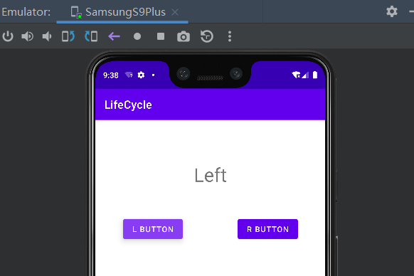


## Localization 本地化与多语言支持

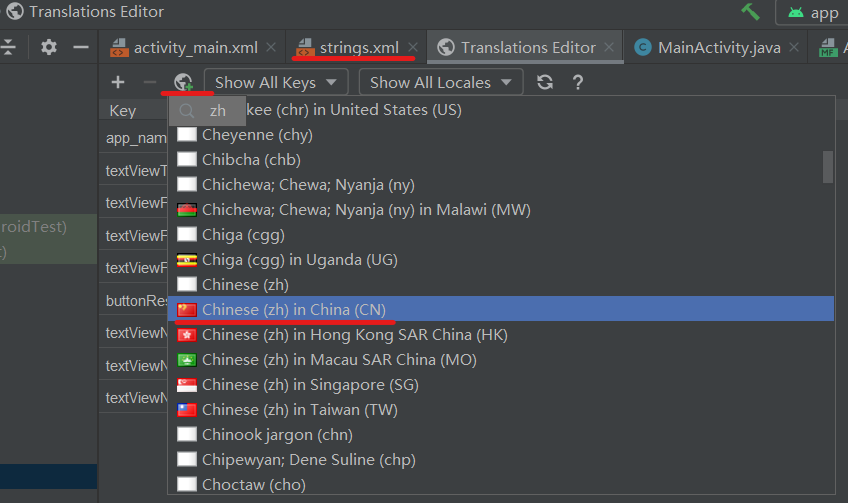

## Screen Orientation 屏幕方向旋转&数据保存

记得打开设备的自动旋转

### 锁定旋转

若想要锁定屏幕方向，可以在Manifest.xml中的activity添加一行即可

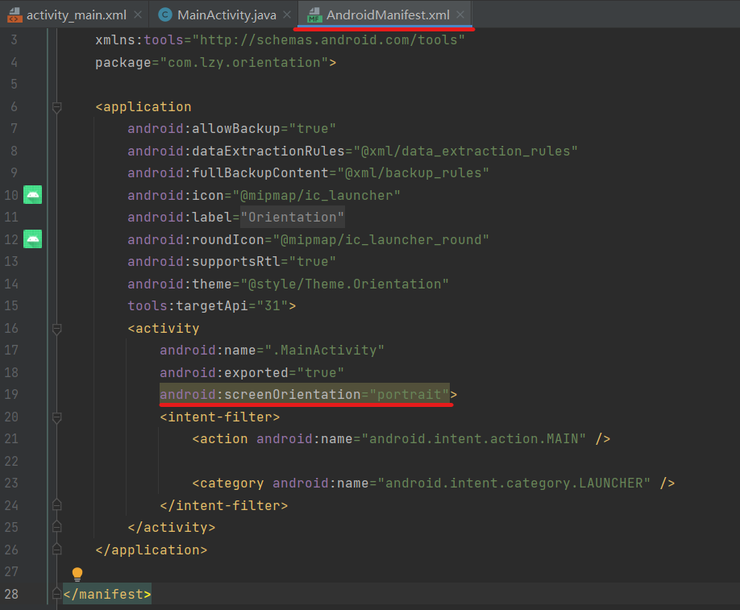


### 处理旋转

如果需要对不同手机方向都分别进行处理，则可以新增layout。

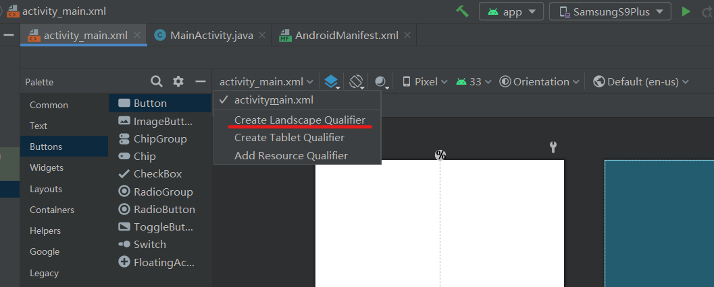

在res中的layout中可以看到。

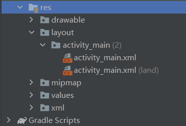


**另外在进行手机处理旋转时，会回调onDestroy**。所以需要对数据提前进行保存，否则数据随着屏幕翻转而不复存在。

可以利用**Bundle savedInstanceState**。可以在onCreate方法中看到。

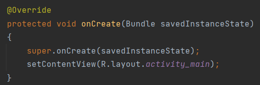

Bundle是key-value数据结构

```java
TextView textView;

@Override
protected void onCreate(Bundle savedInstanceState)
{
    super.onCreate(savedInstanceState);
    setContentView(R.layout.activity_main);

    if(savedInstanceState!=null)  // 先要判断非空
    {
        String s = savedInstanceState.getString("MYKEY");
        textView.setText(s);
    }
}

@Override
protected void onSaveInstanceState(@NonNull Bundle outState)
{
    super.onSaveInstanceState(outState);
    outState.putString("MYKEY", textView.getText().toString());
}
```

重写onSaveInstanceState方法，注意有重载，不要用错了。

在onCreate时候进行存储数据的获取。

并不是永久保存。

### onSaveInstanceState解释

[Android onSaveInstanceState()和onRestoreInstanceState()调用](https://blog.csdn.net/fenggering/article/details/53907654)

Android系统的回收机制会在未经用户主动操作的情况下销毁activity，而为了避免系统回收activity导致数据丢失，Android为我们提供了onSaveInstanceState(Bundle outState)和onRestoreInstanceState(Bundle savedInstanceState)用于保存和恢复数据。

当activity有可能被系统回收的情况下，而且是在onStop()之前。注意是有可能，如果是已经确定会被销毁，比如用户按下了==返回键==（左边三角），或者调用了finish()方法销毁activity，则onSaveInstanceState不会被调用。或者也可以说，此方法只有在activity被异常终止的情况下会被调用。

onSaveInstanceState(Bundle outState)会在以下情况被调用：
1. 当用户按下==HOME键==时。（中间圆形）
2. 从最近应用中选择运行其他的程序时。
3. 按下电源按键（关闭屏幕显示）时。
4. 从当前activity启动一个新的activity时。
5. **屏幕方向切换时**(无论竖屏切横屏还是横屏切竖屏都会调用)。


## ViewModel 从MVC到MVVM

[Android官网 Jetpack](https://developer.android.google.cn/jetpack/)

属于Jetpack的一个类。

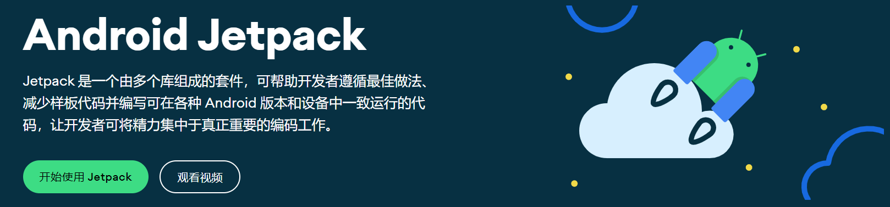

独立于Android底层API。

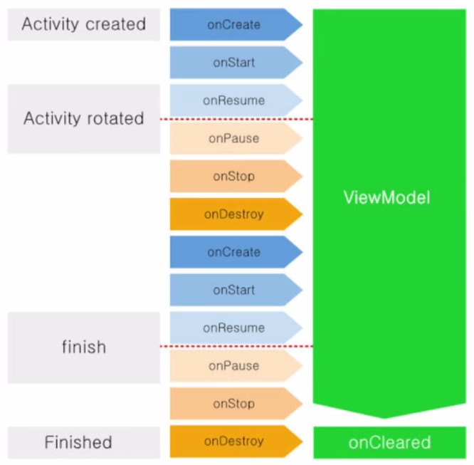

使用ViewModel管理的数据，在屏幕旋转或切换语言时，不会丢失。

LiveData实现数据刷新。

自己创建ViewModel用于管理数据。

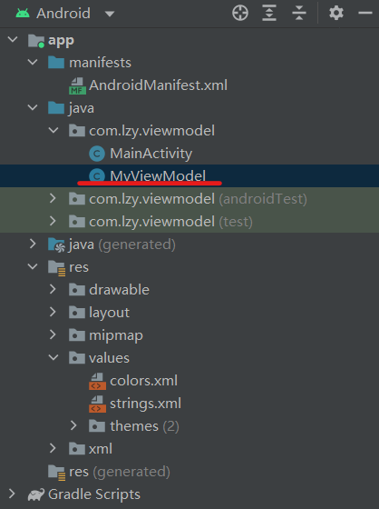

```java
// ViewModel中引入

package com.lzy.viewmodel;

import androidx.lifecycle.ViewModel;

public class MyViewModel extends ViewModel
{
    public int number = 0;
}

// MainActivity中引入
import androidx.lifecycle.ViewModelProvider;
```

## LiveData 感知数据的变化 & 自动刷新

在底层数据库更改时通知视图。

简化Controller。


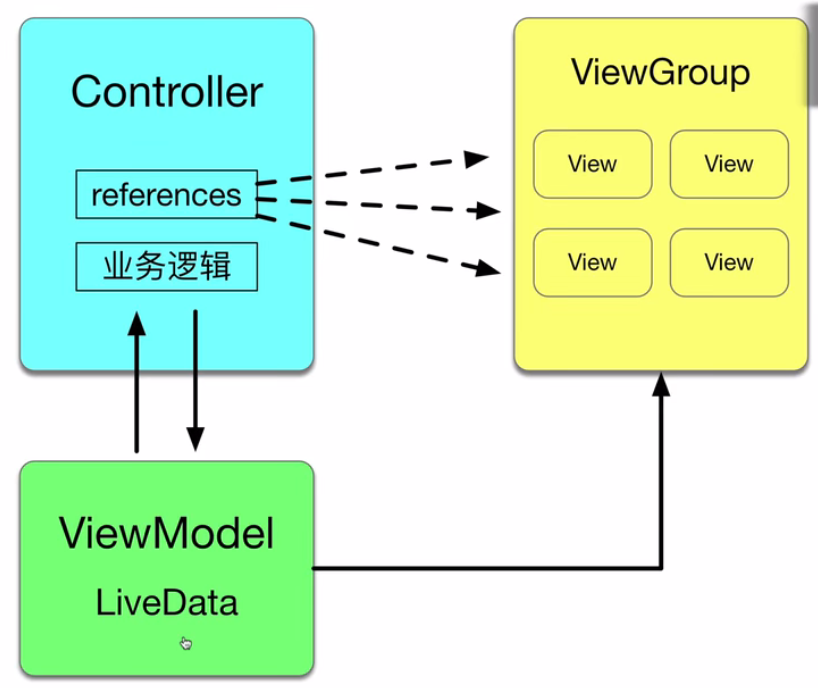


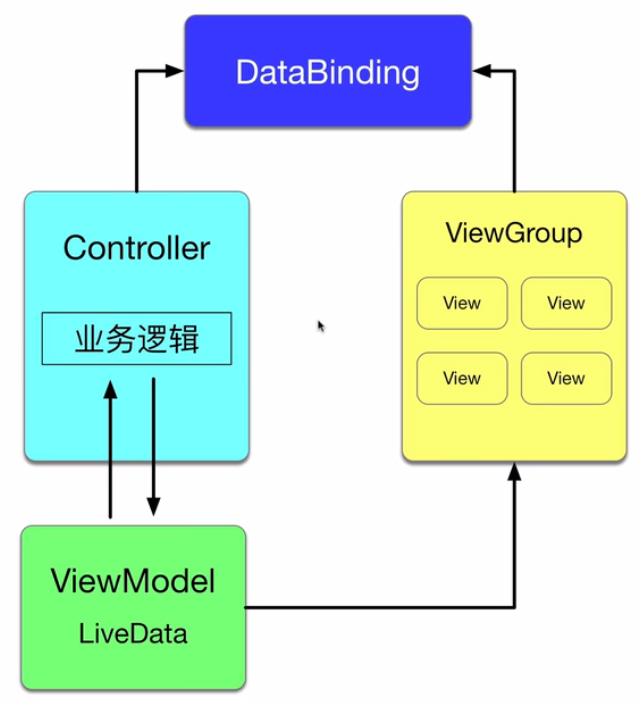


## Navigation 组件

页面间的切换

实现Navigation的四个内容
1. NavHost：容器&控制器，存放页面
2. Fragment：碎片化，分割大屏幕。fragment栈
3. NavController：控制导航逻辑（action），定义切换路线
4. NavGraph：


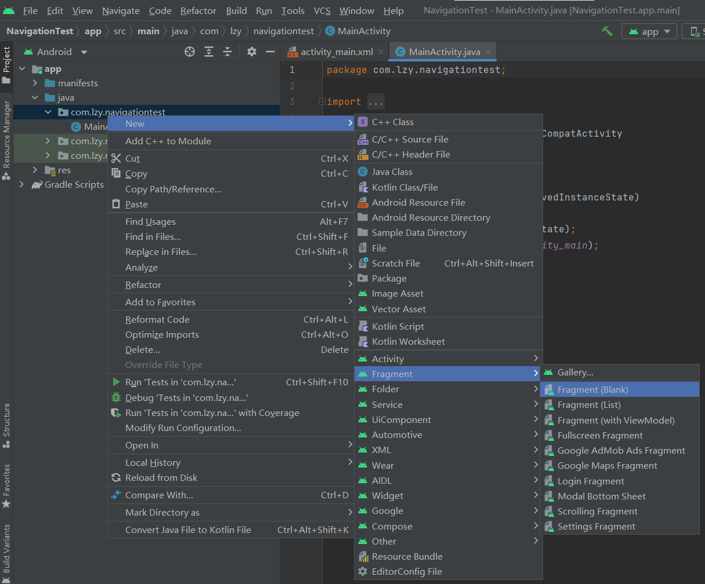


为了方便后续操作和布局，添加Constraint Layout

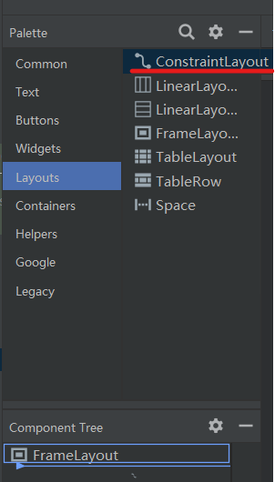


# B站 Android开发从入门到精通

## 文件存储

通过Java的IO流读取磁盘文件

输入流 ：文件到App ：openFileInput()
输出流 ：App到文件 ：openFileOutput()

**文件存储方式**
1. 内部存储（≠内存）
   1. 默认只能被创建它的应用访问
   2. 应用卸载后，内部存储中的文件也被删除
   3. 内部存储空间耗尽，手机无法使用
2. 外部存储（≠SD卡）
   1. 将手机连接电脑，能被识别到的就是外部存储


**内部存储路径示例**

eg:/data/data/com.lzy.file/files/memo

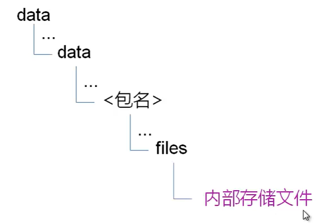

**内部存储**

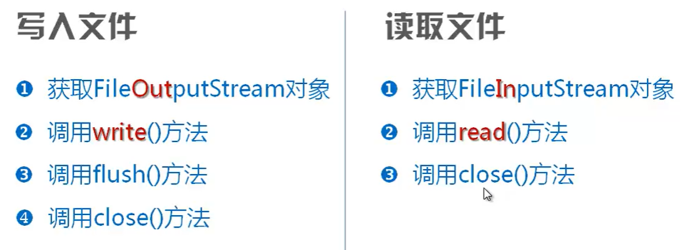

openFileOutput


**外部存储**

File对象

```java
file = new File(Environment.getExternalStorageDirectory(),"text.txt");
```

manifest中添加权限
```xml
<uses-permission android:name="android.permission.READ_EXTERNAL_STORAGE"/>
<uses-permission android:name="android.permission.WRITE_EXTERNAL_STORAGE"/>
```


## 传感器


**开发步骤**


### 方向传感器

原有Orientation已经deprecated。

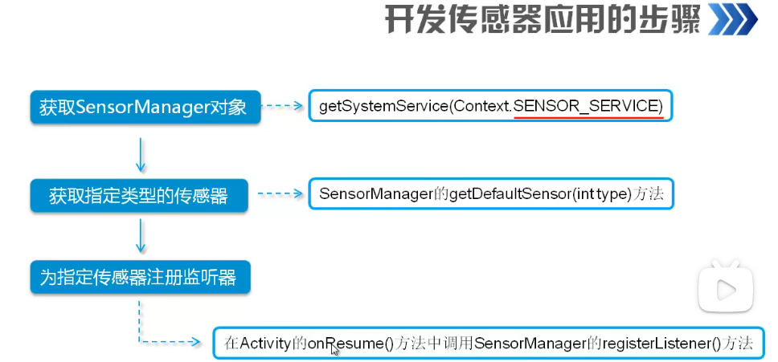


# 常见错误

## Use SwitchCompat from AppCompat or SwitchMaterial from Material library

**报错信息如下**

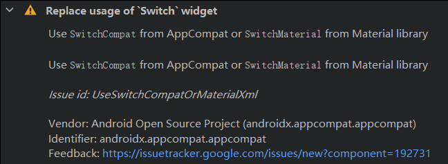

**解决方案**

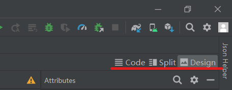

将可视化界面切换为xml文件后再进行修改

```xml
<!-- 将activity_main.xml中的 -->
<Switch/>
<!-- 替换为 -->
<androidx.appcompat.widget.SwitchCompat/>
<!-- 即可 -->
```


## Variable 'xxx' is accessed from within inner class, needs to be final or effectively final

在些内部匿名类的时候，必须满足：内部类中使用但未声明的任何局部变量必须在内部类的正文之前明确分配。

目前只知道如果使用的String可以换用StringBuffer解决。


