# Android

[toc]

## Portals

[Android Studio 官网下载](https://developer.android.google.cn/studio)


# B站 Android开发教程

[B站 Android开发教程](https://www.bilibili.com/video/BV1w4411t7UQ)

## HelloWorld 创建第一个项目

Project
1. manifests
   1. AndroidManifest.xml(APP清单)
2. java
   1. MainActivity.java
3. res(资源)
   1. drawable(图片，xml)
   2. layout(布局文件，xml)
   3. mipmap(图标)
   4. values(常量，xml)

### 生成APK

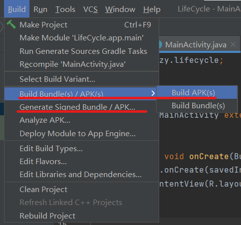

## ConstraintLayout：在图形化下设计UI界面


## Activity声明周期

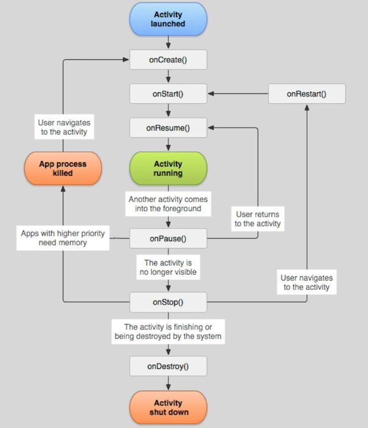


**Android四大组件**
1. Activity
   1. 由多个activity构成应用程序，可以灵活的启动或调用（**分块**）
   2. onCreate,onStart,onResume,onPause,onStop,onDestroy被称为回调Callback。系统调用我们的内容。
   3. onCreate创建对象，onStart时activity还没有正式进入活跃，将所有内容准备好后进入onResume。onPause暂停（还可见），如果变为不可见（退到后台）则调用onStop。onStop和onPause可能会被系统killed。如果用户重新调用，则调用onRestart，重新进入流程。onDestroy表示最终被关闭。
2. BroadcastReceiver
3. Service
4. ContentProvider


### 观察生命周期

```java
String TAG="myTag";

@Override
protected void onCreate(Bundle savedInstanceState) {
   super.onCreate(savedInstanceState);
   setContentView(R.layout.activity_main);
   Log.d(TAG,"onCreate");
}
```

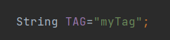

启动后在logcat中查看（在virtual device中进行操作）

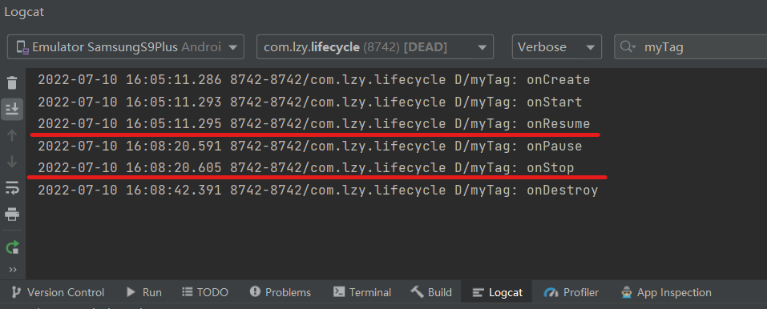

启动时log输出onCreate、onStart、onResume

退到后台时log输出onPause、onStop

关闭应用后log输出onDestroy

**自动翻转会将Destroy再Create**

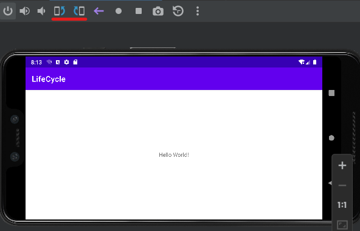

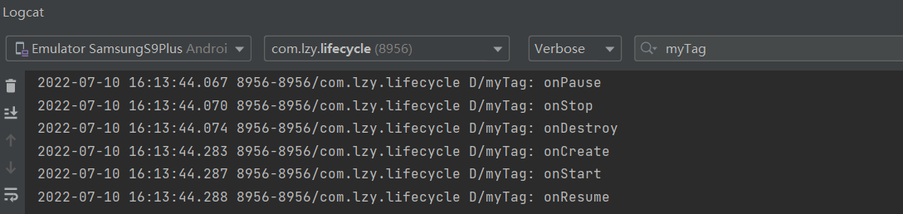


## UI控件

MVC模式(model view controller)

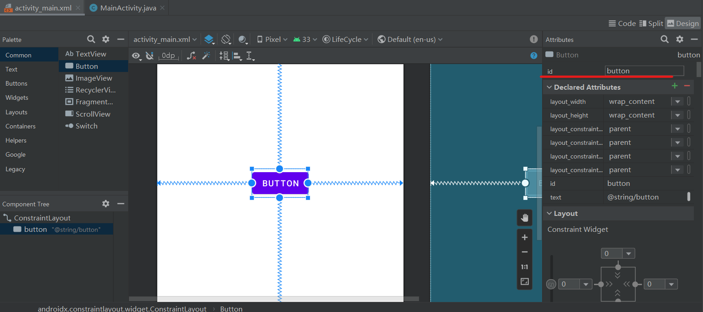

每一个拖拽出来的控件都有一个==id==。控制逻辑是通过id让控件与变量建立逻辑。

在MainActivity.java中编写代码

```java
import android.widget.Button;

public class MainActivity extends AppCompatActivity {

    Button myButton;

    String TAG="myTag";

    @Override
    protected void onCreate(Bundle savedInstanceState) {
        super.onCreate(savedInstanceState);
        setContentView(R.layout.activity_main);
        Log.d(TAG,"onCreate");

        myButton = findViewById(R.id.testButton);
//        R表示resource目录下的资源
//        R.drawable.xxx表示图片
//        R.raw.xxx表示视频音频文件
//        R.layout.xxx表示layout文件
    }

    @Override
    protected void onPause() {
        super.onPause();
        // setText修改内容
        myButton.setText("onPause");
    }
}
```

### 常见控件

**Common**
1. TextView
2. Button
3. ImageView

**Text**
1. TextView
2. PlainText(对应完整键盘)
3. Password(对应完整键盘)(文字变为*号)
4. Number(对应数字键盘)
5. Date
6. Time

**Buttons**
1. CheckBox
2. RadioGroup&RadioButton(放在group中实现互斥，单独RadioButton选择后无法还原)
3. Switch&ToggleButton(两者功能类似)

**Widgets**
1. WebView显示浏览器
2. VideoView播放视频
3. CalendarView显示日历
4. ProgressBar(进度条)
   1. 圆形（旋转）
   2. 水平（indeterminate）
5. SeekBar(拖动条)
   1. 连续
   2. 离散
6. RatingBar
7. SearchView

**Google**
1. AdView(广告)
2. MapView(地图)


### 按键的动作（动态使用）

```java
public class MainActivity extends AppCompatActivity 
{
    TextView textView;
    Button LButton,RButton;

    String TAG="myTag";

    @Override
    protected void onCreate(Bundle savedInstanceState) {
        super.onCreate(savedInstanceState);
        setContentView(R.layout.activity_main);
        Log.d(TAG,"onCreate");

        textView = findViewById(R.id.textView);
        LButton = findViewById(R.id.button3);
        RButton = findViewById(R.id.button4);

        textView.setText("Which Button?");

        // Button按下是一个事件，需要一个Listener监听事件

        // 内部匿名类
        LButton.setOnClickListener(new View.OnClickListener()
        {
            @Override
            public void onClick(View view) {
                textView.setText(("Left"));
            }
        });

        RButton.setOnClickListener(new View.OnClickListener()
        {
            @Override
            public void onClick(View view) {
                textView.setText(("Right"));
            }
        });
    }

    @Override
    protected void onPause() {
        super.onPause();
        textView.setText(("Which Button?"));
    }
}
```

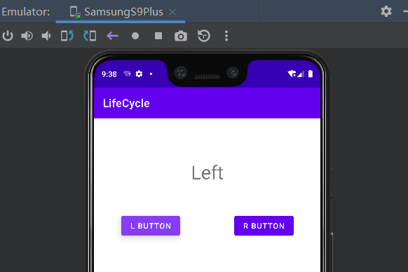


## Localization 本地化与多语言支持

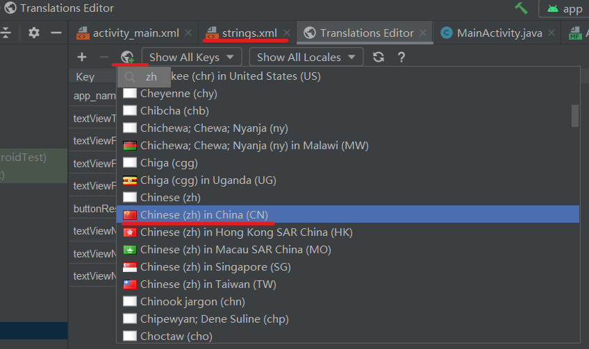

## Screen Orientation 屏幕方向与状态保存


# 常见错误

## Use SwitchCompat from AppCompat or SwitchMaterial from Material library

**报错信息如下**

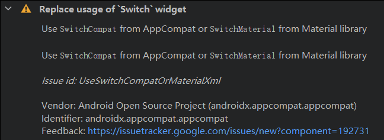

**解决方案**

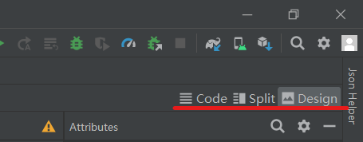

将可视化界面切换为xml文件后再进行修改

```xml
<!-- 将activity_main.xml中的 -->
<Switch/>
<!-- 替换为 -->
<androidx.appcompat.widget.SwitchCompat/>
<!-- 即可 -->
```


## Variable 'xxx' is accessed from within inner class, needs to be final or effectively final

在些内部匿名类的时候，必须满足：内部类中使用但未声明的任何局部变量必须在内部类的正文之前明确分配。

目前只知道如果使用的String可以换用StringBuffer解决。


