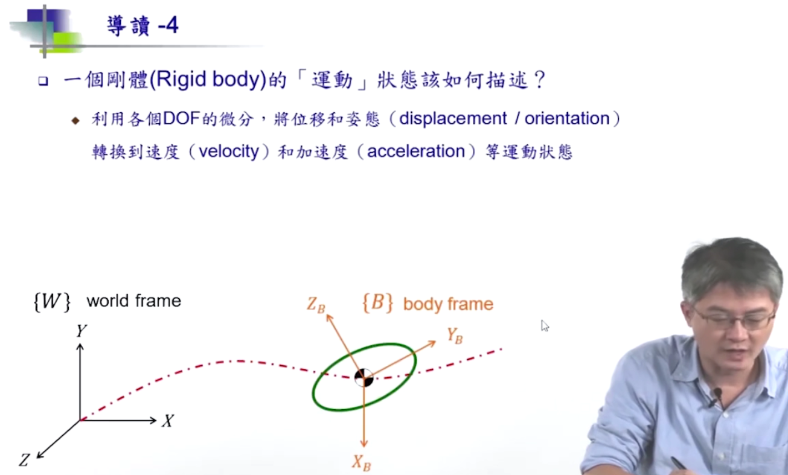
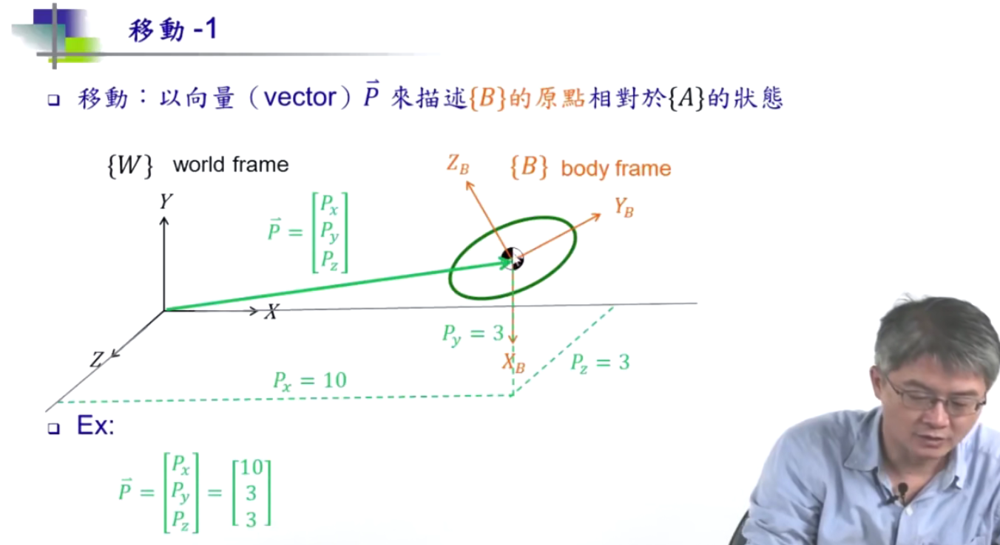
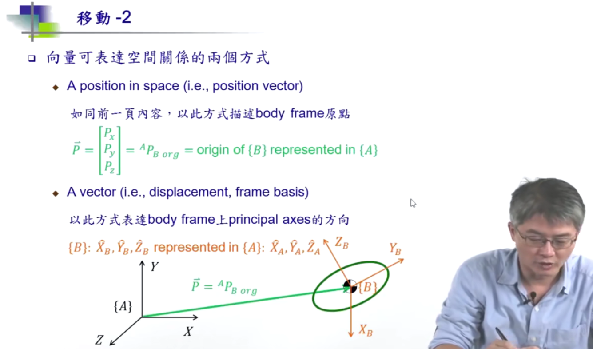
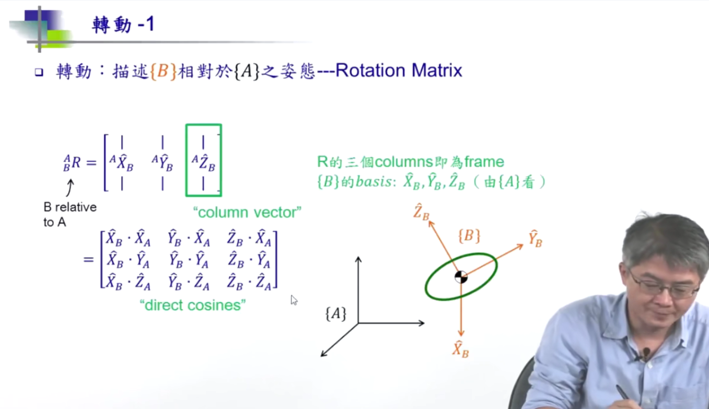

# 机器人学

[toc]

## Portals

[台大机器人学之运动学](https://www.bilibili.com/video/BV1v4411H7ez)

[台湾交通大学机器人学](https://www.bilibili.com/video/BV19z4y197cf)

[斯坦福机器人学](https://www.bilibili.com/video/BV16s411q7o7)

# 台湾交通大学机器人学

# 

# 台湾大学机器运动人学

## 导论

## 刚体运动状态描述

刚体(rigid body)

二维平面上，3个自由度描述（2个平动，1个转动）

三维平面上，6个自由度描述（3个平动，3个转动）

整合表达更替状态

## 移动

## 转动

旋转矩阵

从A的视角看B（左上角表示基准）

将B的各个基向量从A的视角看

## 选择矩阵

## Rotation Matrix与转角

## Fixed Angles

## Euler Angles

## Mapping

## Operators

## Trans Matrix

## 顺向运动学

## 手臂几何表述

## DH标识法

## Link Trans

## Actuator Joint and Cartesian Spaces

## 逆向运动学

## 多重解

## Piepers Solution
