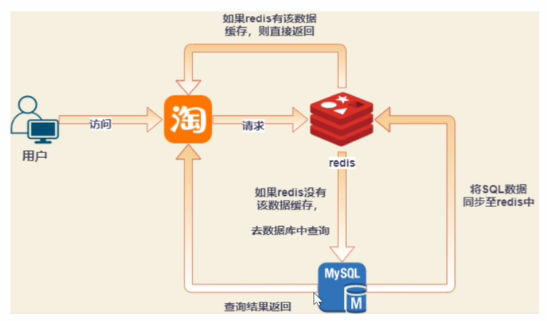
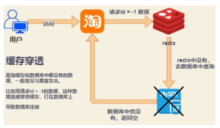

# Bilibili

[toc]

# 本人面经

【面试职位】：数据产品（产品平台方向）【2023届】
一面：2022/12/12
面试官问题：
1. 你这个专业为什么选择这个岗位？不去开发？你对工作的理解？
2. 项目描述*2？
3. 什么数据库？mysql+postgresql
4. mysql的bench？
5. 哪款IDE？为什么？Dbeaver
6. 您会怎么向我推荐B站？
7. 广告投放策略？
8. 哪些用户行为分析值得关注？
9. 你是否为知识区付费？
10. 哪些可以改进的点？

一个小时后，打电话。说有一个数据仓库开发岗位，纯实习。

# 提问

提升用户粘性，提升up主粘性（头部、底层）花火商单
扩展用户，目标用户

营收（广告、大会员、直播礼物、会员购）

硬币抵扣会员购、大会员（正、反）

优化审核

用户能看到的数据分析，

PC端、Web端、IOS、Android

工作时间
薪资待遇

# JD

## 数据产品（一面挂）
【面试职位】：数据产品（产品平台方向）【2023届】
【面试时间】：2022-12-12 15:00

是技术面试，这个是校招岗位

工作职责
1. 负责对业务日常数据进行整理和分析，与团队协作进行底层行业知识库的搭建，赋能数据产品上层建设；
2. 通过数据分析、用户调研、需求收集等方式，发现潜在需求和优化点，并落地为数据产品，赋能业务增长；
3. 跟进需求开发与上线，并协调推动相关的业务团队高质量执行。

任职要求
1. 统计学或计算机、数学相关专业； 
2. 自我驱动力强，有较强的团队协作意识和能力； 
3. 思维开放、善于学习创新，较强的逻辑分析能力； 
4. 灵活使用Office工具，Xmind，AxureXP完成产品规划和原型设计； 
5. 具备关系型数据库，SQL知识与经验, 能使用数理统计方法进行数据分析；

## 大数据数仓（自己查的）

[哔哩哔哩bilibili大数据数仓团队](https://ac.nowcoder.com/discuss/672582)

数据仓库工程师（数据平台部）【2022届】 实习生
工作职责：
1、负责数据抽取、转换、加载，数据维护等工作；
2、完成业务需求分析整理，分析模块/主题的编码实现；
3、数据仓库模型设计及优化工作；
4、参与ETL设计、开发、维护或项目管理。

岗位要求：
1、熟练掌握主流数据库使用，如Oracle/SQL Server/MySQL等一种关系型数据库；
2、熟悉Linux平台，了解Shell、Java、Python至少一种脚本；
3、责任心强、良好的对外沟通和团队协作能力；
4、数学/计算机相关专业本科及以上学历优先；
5、有Hadoop/Hive大数据平台、MPP数据库等学习经验优先。

# Bilibili业务

营收（广告、大会员、直播礼物、会员购）

[bilibili用户画像分析_B站用户数据分析最新](https://www.bilibili.com/read/cv18496411)
哔哩哔哩近82%的用户是Z世代用户，大多数是中学生和大学生，是生长在互联网下的一代人。也就是90-09年出生的一代人
三个特点——文化自信、道德自律和知识素养

北上广的大学生和中学生，占哔哩哔哩用户的半壁江山
B站起家于ACG文化，但随着用户数量的增加，开始往多元化发展，游戏，动漫，科技，音乐，时尚，美妆，生活，影视等内容也变得非常丰富
"ACG"是Animation（卡通动画）、Comics（漫画）、Game（游戏）

MAU（Monthly Active User）

用“用户喜欢的方式”进行交流
1. 一般标题使用动漫人物和二次元常用语，既关联了用户的使用场景，又能够拉近和用户的距离
2. 在B站，图片和标题一样，占据着非常重要的分量，甚至图片要比标题更重要

品牌年轻化到底应该如何走？
1. 代际冲突不同代际之间，对事物有不同的理解和解读，甚至是完全相反的。拿本次的宅舞事件
2. 品效合一难保证目前在B站(恰饭视频转化)，虽然部分品牌实现了不错的涨粉数据和播放数据，但内容均以品牌本身无关。尽管部分品牌会在评论区挂出产品链接，但又有多少人会看完视频后点击广告呢？除视频内容外，很难让用户对品牌本身有深入了解——数据繁华之外，到底对品牌宣传帮助几何？
3. 模式尚需探索据营销实验室《B站品牌营销指南》表示，目前入驻B站的品牌仍不算多，且这些品牌账号的粉丝数多在50万以下，整个品牌积极性及用户池都没有被调动起来。

在线视频市场已经形成了短、长视频分而治之的基本形态。短视频以抖音系、快手为主（微信的视频号功能正在内测阶段）；长视频方面，腾讯视频、爱奇艺、优酷三家独大。B站若要继续破圈，承受着来自短视频的流量分发和变现压力，以及长视频的资金版权压力

国外Youtube。广告收入，“5秒可跳过广告”。

B站的月平均付费用户（MPUs）仅为630万，用户付费率为5.72%

[运营分析报告](read://https_www.wycfw.com/?url=https%3A%2F%2Fwww.wycfw.com%2Fwangluozhuanqian%2Fwltg%2Fks%2F42808.html%3Fivk_sa%3D1024320u)

**内容运营机制**
1. 由up主创作投稿的UGC内容：
   1. 流量入口丰富
   2. 对腰部以下up主在推荐上友好：B站的算法：视频权重=硬币*0.4+收藏*0.3+弹幕*0.4+评论*0.4+播放*0.25+点赞*0.4+分享*0.6。去中心化
   3. 内容消费者和创作者之间的强粘性
   4. 审核
2. 由B站出品的自制内容
   1. 人生一串
   2. 我在故宫修文物
   3. 守护解放西
3. 版权购买获得播放权的内容
   1. 三体
   2. 刺客五六七
   3. 按照年轻人喜好购买较小众电影的版权

**用户运营机制**
1. 建立用户激励体系
   1. 虚拟物品或虚拟货币体系
   2. 用户等级
2. 会员等级
   1. 赋予不同的社区特权，其实不是那么有力
   2. 投币行为作为经验值的重要参考，在一定程度上了对用户站内活跃的激励作用
3. 硬币
   1. 在社区内的流通，给up主和普通用户都创造了更好的社交体验
   2. 维系粉丝和up主之间的感情
4. 大会员
   1. 内容特权、装扮特权、身份特权、视听特权
5. B站up主线下交流会

数据一致性(consistency)：如果系统对一个写操作返回成功，那么之后的读请求都必须读到这个新数据；如果返回失败，那么所有读操作都不能读到这个数据，对调用者而言数据具有强一致性(strong consistency) (又叫原子性 atomic、线性一致性 linearizable consistency)
服务可用性(availability)：所有读写请求在一定时间内得到响应，可终止、不会一直等待

[B站万亿级数据库选型与架构设计实践](https://www.modb.pro/db/569738)

按业务进行拆分

总体来说，B站的数据库特点是Redis和MySQL为主，其它数据库主要是基于我们的使用场景进行选择和提供。

1. 点播类业务：大家经常看的视频以及稿件之类相关的业务（弹幕）
   1. 数据一致性要求较高
   2. 耗时敏感
   3. 可用性要求高
   4. 流量大
2. 直播类业务：B站的S12、跨晚、拜年祭等
   1. 数据一致性要求较高
   2. 热点数据
   3. 平时流量中等，大型直播流量会呈现爆炸性增长
   4. 可用性要求高
3. 游戏类业务：
   1. 数据一致性要求较高
   2. 耗时敏感
   3. 流量大
   4. 可用性要求高
4. 电商类业务：如B站本身的会员购
   1. 数据一致性要求较高
   2. 热点数据，集中在秒杀场景及热门番剧
   3. 平时流量中等，热门番剧及商品会呈现爆炸性增长
   4. 可用性要求高
5. 支付类业务：
   1. 数据一致性要求极高
   2. 可用性要求高
6. 广告业务

# 前台后台中台

前台 主要面向客户以及终端销售者，实现营销推广以及交易转换。

中台 主要面向运营人员，完成运营支撑。

后台 主要面向后台管理人员，实现流程审核、内部管理以及后勤支撑，比如采购、人力、财务和OA等系统。

# 面经

[暑期实习末班车｜哔哩哔哩游戏｜数据分析师](https://leetcode.cn/circle/discuss/pv8560/)

python2和python3的区别：
1. python3里面默认所有类都是继承的object，所以python3都是新式类
2. python3：没有xrange，range函数就是python2中的xrange。是一个可迭代对象（惰性求值，使用的时候再生成）
3. python3中input得到的数据都是str型，python2中input默认是int型，str要使用引号包裹，raw_input得到的都是str
4. python2的print不一定要求函数形式使用
5. python2中的整数相除属于地板除，要想真除就得变成浮点数  python3中的整数相除就是真除
6. python2的编码是ascii码，python3的默认编码是utf-8

[Bilibili数仓实习一面面经 2022-03-07 21:48:29 发布](https://blog.csdn.net/weixin_44546393/article/details/123340575)

**http,https：**
1. HTTP 超文本传输协议（Hyper Text Transfer Protocol，HTTP）（传输过程中不加密）（请求和响应的报文都是明文）
2. HTTPS（全称：Hyper Text Transfer Protocol Secure），HTTPS 在HTTP 的基础下加入SSL/TLS，HTTPS 的安全基础是 SSL，因此加密的详细内容就需要 SSL
3. SSL(Secure Sockets Layer 安全套接字协议)[HTTPS是什么？加密原理和证书。SSL/TLS握手过程](https://www.bilibili.com/video/BV1KY411x7Jp/)

**面向对象**
继承是使用已存在的类的定义作为基础建立新类的技术，新类的定义可以增加新的数据或新的功能，也可以用父类的功能，但不能选择性地继承父类。通过使用继承，可以快速地创建新的类，可以提高代码的重用，程序的可维护性，节省大量创建新类的时间 ，提高我们的开发效率;

多态，顾名思义，表示一个对象具有多种的状态，具体表现为父类的引用指向子类的实例。父类的引用指向子类的对象，person p = new student()
多态不能调用“只在子类存在但在父类不存在”的方法；
如果子类重写了父类的方法，真正执行的是子类覆盖的方法，如果子类没有覆盖父类的方法，执行的是父类的方法
引用类型变量发出的方法调用的到底是哪个类中的方法，必须在程序运行期间才能确定

对象类型和引用类型之间具有继承（类）/实现（接口）的关系

如果子类和父类在同一个包中，那么，子类自然地继承了其父类中不是private的成员变量作为自己的成员变量，并且也自然地继承了父类中不是private的方法作为自己的方法,继承的成员变量或方法的访问权限保持不变。

如果子类与父类不在同一个包中，则子类只会继承父类public、protected的变量和方法，继承的变量和方法的访问权限保持不变。（能继承，但是子类继承过来之后，也不能对它进行直接引用访问，那是父亲的私有部分，只能对父类中的成员开放。）

**Redis 主要的数据结构**
程序用来存储 key-value 数据，key都是字符串（set get mset mget）
1. String
2. Hash
3. Bitmap
4. List
5. Set无序不可重复
6. SortedSet，有序集合zset

缓存管理
定期删除+惰性删除+内存淘汰策略（lru、random、lfu）*（allkeys、volatile）  **Least Recently Used** 、 **Least Frequently Used** 、 **Time To Live**
+分布式锁
缓存穿透，黑客不断用用没有的数据进行请求，redis无法拦截。空值也缓存进redis，数据合法性校验，布隆过滤器

缓存雪崩（redis的可以同时间大量失效）：过期时间均匀分布，热点数据永不过期，定时任务。
缓存击穿（雪崩的一个特例）：由于并发用户特别多,同时读缓存没读到数据,又同时去数据库去取数据,引起数据库压力瞬间增大,造成过大压力。分布式锁，只有一个线程能抢到锁，访问数据库。

布隆过滤器：
很长的二进制数组，数据不存在为0，数据存在为1；
经过多个hash，避免哈希冲突
插入、查询快，占用空间少，保密性好，
很难做删除操作，存在误判（不可避免）

持久化存储
持久化存储，RDB，AOF append only file(aof_buf，指令合并)

哨兵与高可用

redis集群
扩容，三次握手，哈希表slot槽位
上线、下线
set(k,v)，不是我负责就返回moved(ip,port)

Redis（Remote Dictionary Server）
[趣话Redis](https://www.bilibili.com/video/BV1Fd4y1T7pD/)
给数据库加一个缓存
应用场景：Shiro为每个用户的角色和权限信息提供缓存支持，在应用中通常使用redis作为缓存服务器，因此使用redis来作为shiro的缓存。

**innoDB**
引擎
1. 插入缓存，提升插入性能
2. 二次写，减小IO消耗
3. 自适应哈希索引
4. 预读，线性预读、随机预读

**数仓（Data warehouse）**
1. 对数据仓库进行设计
2. 作用：业务数据汇总，分析处理
3. 数据存储分层，更规范，维护方便，数据处理流程简单化

分层规则
1. ods层（数据准备区），操作数据存储层，来自业务系统
2. dwd层（数据细节detail层），对ods进行数据清理工作
3. dws层（数据服务层），轻度汇总层，用于提供后续的业务查询，OLAP分析，数据分发
4. ads层（数据应用层），数据展示、数据参评

层与层之间的复用度，尽可能不要跨层依赖

清晰数据结构：让每个数据层都有自己的作用和职责，在使用和维护的时候能够更方便和理解
复杂问题简化：将一个复杂的任务拆解成多个步骤来分步骤完成，每个层只解决特定的问题
统一数据口径：通过数据分层，提供统一的数据出口，统一输出口径
减少重复开发：规范数据分层，开发通用的中间层，可以极大地减少重复计算的工作

数据细化程度越高，粒度级就越小；相反，细化程度越低，粒度级就越大。粒度是数据仓库主要设计问题，因为它极大地影响存放在数据仓库中的数据量的大小，同时影响数据仓库所能回答的查询类型。

粒度：数据仓库的数据单位中保存数据的细化或综合程度的级别
粒度越小，细节程度越高，综合程度越低，查询类型越多
粒度越高，综合程度越高，查询的效率也越高
在数据仓库中可将小粒度的数据存储在低速存储器上，大粒度的数据存储在高速存储器上

mysql：索引B+Tree
nosql优势：
1. 易扩展
2. 大数据量，高性能
3. 灵活的数据模型
4. 高可用

[2022字节跳动数据仓库实习面经](https://liuxiaocong.blog.csdn.net/article/details/123433269)
[2022字节跳动数仓实习面经（2、3面、hr面）](https://huaweicloud.csdn.net/6335792bd3efff3090b5841d.html)

## 
[MySQL与PostGreSQL的区别](https://blog.csdn.net/m0_37787662/article/details/124997217)
​​​​​​​一.PostgreSQL相对于MySQL的优势
1、在SQL的标准实现上要比MySQL完善，而且功能实现比较严谨；
2、存储过程的功能支持要比MySQL好，具备本地缓存执行计划的能力；
3、对表连接支持较完整，优化器的功能较完整，支持的索引类型很多，复杂查询能力较强；
4、PG主表采用堆表存放，MySQL采用索引组织表，能够支持比MySQL更大的数据量。
5、PG的主备复制属于物理复制，相对于MySQL基于binlog的逻辑复制，数据的一致性更加可靠，复制性能更高，对主机性能的影响也更小。
6、MySQL的存储引擎插件化机制，存在锁机制复杂影响并发的问题，而PG不存在。

二、MySQL相对于PG的优势
1、innodb的基于回滚段实现的MVCC机制，相对PG新老数据一起存放的基于XID的MVCC机制，是占优的。因此MySQL的速度是高于PG的；
2、MySQL采用索引组织表，这种存储方式非常适合基于主键匹配的查询、删改操作，但是对表结构设计存在约束；
3、MySQL的优化器较简单，系统表、运算符、数据类型的实现都很精简，非常适合简单的查询操作；
4、MySQL分区表的实现要优于PG的基于继承表的分区实现，主要体现在分区个数达到上千上万后的处理性能差异较大。

总结：
PG具备更高的可靠性，对数据一致性完整性的支持高于MySQL，因此PG更加适合严格的企业应用场景（比如金融、电信、ERP、CRM）；而MySQL查询速度较快，更加适合业务逻辑相对简单、数据可靠性要求较低的互联网场景（比如google、facebook、alibaba）

# 面试题

## 杂

ETL，是英文Extract-Transform-Load的缩写，用来描述将数据从来源端经过抽取（extract）、转换（transform）、加载（load）至目的端的过程。ETL一词较常用在数据仓库，但其对象并不限于数据仓库。

## excel会什么工具？vlookup函数

[VLOOKUP函数使用全集(建议收藏)](https://www.bilibili.com/video/BV1sC4y1W7KK/)

vlookup函数（属性是vertical排列）（还有hlookup，属性horizontal排列）

注意数据格式一致

Vlookup函数中，FALSE代表精确匹配，如果找不到，则返回错误值 #N/A；TRUE代表近似匹配，也就是说，如果找不到精确匹配值，则返回小于“查找值”的最大数值。
对于字符串使用精确匹配，false

$表示的是绝对引用，因为在使用excel的时候，公式之类的东西能够应用于多个单元格，excel会智能化的发生变化，一般放在单元格地址的行标或列标之前。

=VLOOKUP(F7&G7,CHOOSE({1,2},B:B&C:C,D:D),2,FALSE)
Choose函数的使用格式：CHOOSE(index_num，value1，value2，...)，参数Index_num是用来指明待选参数序号的值

CTRL+SHIFT+ENTER在Excel中是用于计算数组公式使用的

[excel批量查找函数filter的使用方法](https://www.bilibili.com/video/BV1K44y1Y7Hd/)

=FILTER(B3:D8,(B3:B8=F16)*(C3:C8=G16))
wps需要CTRL+SHIFT+ENTER

## axure

①先画功能流程图（visio、process on、drawio），确定内容（结构层）；再画页面原型（框架层）375*667（安卓ViewModel）
②流程图页面化
③绘制低保真原型图
④绘制高保真原型图

## sql

## PowerBI（Business Intelligence）

## tableau

## 指标权重怎么确定？

## 做了哪些可视化工作？

