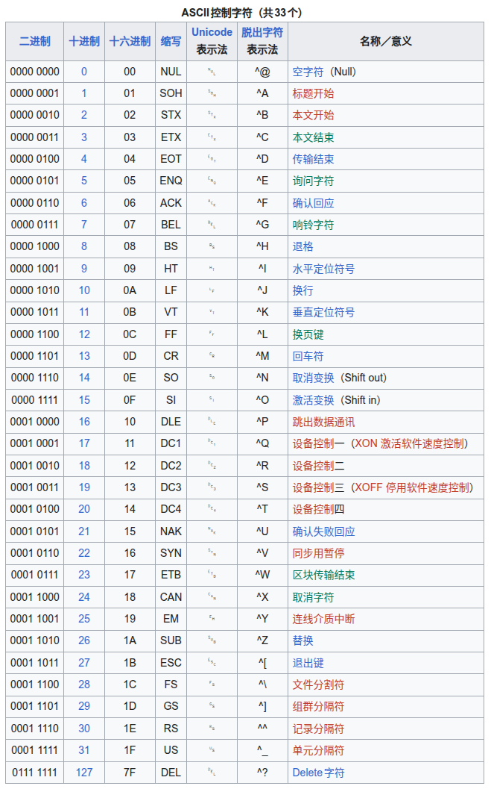
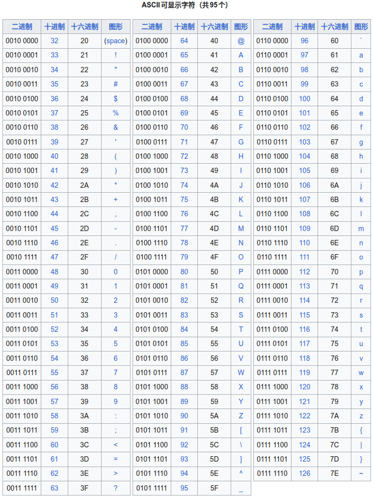
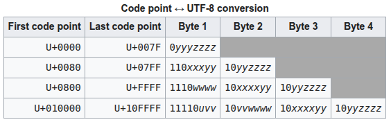

# Character Encoding

---

# ASCII

[ASCII - Wikipedia](https://zh.wikipedia.org/wiki/ASCII)

American Standard Code for Information Interchange，美国信息交换标准代码

ASCII 由 美国国家标准学会(American National Standard Institute，ANSI) 制定的

只能表示 **128** 个字符(英文字母 & 数字 & 一些控制符号)
1. control (0-31 & 127，共33个字符)
   1. 
2. visible (32-126，共95个字符)
   1. 48 ~ 57  : 0 到 9，十个阿拉伯数字
   2. 65 ~ 90  : 26个大写英文字母
   3. 97 ~ 122 : 26个小写英文字母，其余为一些标点符号、运算符号等
   4. 

E-ASCII(Extended ASCII) 解决了部分西欧语言的显示问题，但对更多其他语言依然无能为力

---

# Unicode

[Unicode - Wikipedia](https://zh.wikipedia.org/wiki/%E7%BB%9F%E4%B8%80%E7%A0%81)

一种 **字符集**(Character Set)

Unicode 本身不是编码方案，是一个巨大的 字典/索引表，为全球 每一个字符 指定了一个唯一的 ID (专业术语 : 码点，Code Point)

编号通常写作 `U+XXXX`，目前定义了从 `U+0000` 到 `U+10FFFF`

在实际传输过程中，由于不同系统平台的设计不一定一致，以及出于节省空间的目的，对Unicode编码的实现方式有所不同(没有规定在电脑硬盘里怎么存)

Unicode 的 **实现方式** 称为 Unicode转换格式 (Unicode Transformation Format，简称为UTF)

---

# UTF-8 (变长 1 ~ 4 字节)

[UTF-8 - Wikipedia](https://zh.wikipedia.org/wiki/UTF-8)

Unicode Transformation Format **8-bit**

针对 Unicode 的 可变宽度编码 & 字符编码，可以用 1~4 个字节 对 Unicode 字符集 进行编码

直接使用 Unicode 编码 效率低下，大量浪费内存空间

| 字节数 | 代表语言/字符类型           |  例子      |
|-------|--------------------------|------------|
| 1 字节 | 基础拉丁字母(英语)、数字     | A, 1, &    |
| 2 字节 | 欧语变音符号、俄语、阿拉伯语  | ø, Я, ش   |
| 3 字节 | 中日韩、泰语、印地语、欧元符  | 汉, あ, ฿  |
| 4 字节 | Emoji、生僻古文字、麻将牌符号 | 😂, 𓀀, 🀄 |

对于 UTF-8 编码中的 任意字节 B
1. 如果 B 的 第一位为0，则 B 独立的表示一个字符(ASCII码)
2. 如果 B 的 第一位为1，第二位为0，则 B 为 一个 多字节字符 中的 一个字节
3. 如果 B 的 前两位为1，第三位为0，则 B 为 两个字节表示的字符 中的 第一个字节
4. 如果 B 的 前三位为1，第四位为0，则 B 为 三个字节表示的字符 中的 第一个字节
5. 如果 B 的 前四位为1，第五位为0，则 B 为 四个字节表示的字符 中的 第一个字节

---

# UTF-16 (变长 2 或 4 字节)

# UTF-32 (定长 4 字节)

