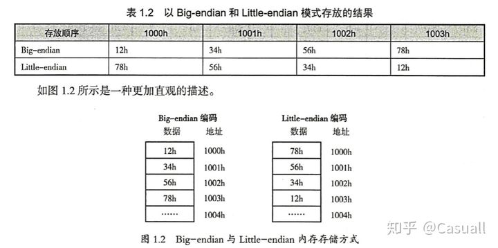

# 字节序

[大端序和小端序](https://zhuanlan.zhihu.com/p/77436031)

Big-Endian : 高位字节存入低地址，低位字节存入高地址

Little-Endian : 低位字节存入低地址，高位字节存入高地址

x86 系列 CPU 都是 Little-Endian 字节序，PowerPC 通常是 Big-Endian字节序。

网络协议也都是采用 Big-Endian方式传输数据的，所以有时也把 Big-Endian 方式称为网络字节序

**内存中的高地址低地址和数据的高字节低字节相反。**
1. 高字节指的是 左边的(前面的)，低字节指的是右边的(后面的)
2. 高地址 就是 内存地址大的，低地址 就是 内存地址小的

0x12345678 中 0x12 是高字节，按照Little-endian，存在第四个字节(高地址)

