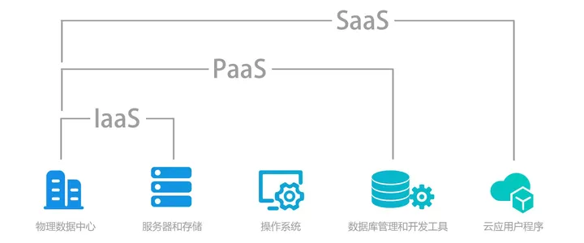
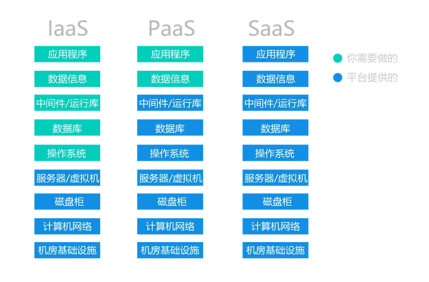

# 云服务概念

云计算的资源是动态扩展且虚拟化的，通过互联网提供

终端用户不需要了解云中基础设施的细节，也无须直接进行控制，只要关注自身真正需要什么样的资源以及如何通过网络来获得相应的服务即可

服务层次
1. **IaaS** - Infrastructure as a Service - 基础架构即服务
   1. 通过 虚拟化、动态化 将**IT基础资源(计算、网络、存储)**聚合形成资源池，具有高度灵活和高度可扩展性
   2. 要多少资源租多少(AWS、阿里云、腾讯云、华为云 **租服务器**)
2. **PaaS** - Platform as a Service - 平台即服务
   1. 提供基础计算能力，还具备了业务的开发运行环境，提供包括应用**代码、SDK、操作系统以及API在内的IT组件**，供个人开发者和企业将相应功能模块嵌入软件或硬件，以提高开发效率。用户或者企业可以基于PaaS平台快速开发自己需要的应用和产品
   2. 提供一个平台，你自己开发想要的应用(微信小程序)
3. **SaaS** - Software as a Service - 软件即服务
   1. 软件 **拿来即用** 的，不需要用户安装，软件升级与维护也无须终端用户参与
   2. 直接使用应用(百度网盘，钉钉，企业微信)
4. **DaaS** - Data as a Service - 数据即服务
   1. 对数据资源的集中化管理，并把数据场景化
   2. 可以向其他公司购买所需数据，通过分工协作提升企业竞争力

