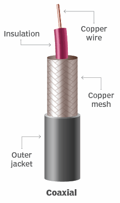
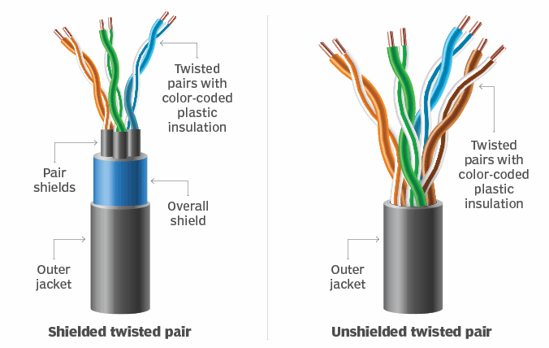
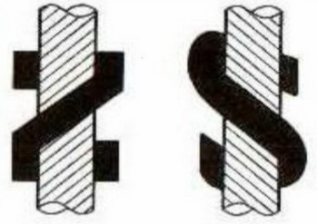
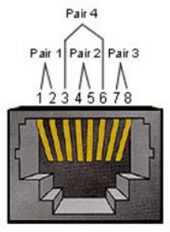
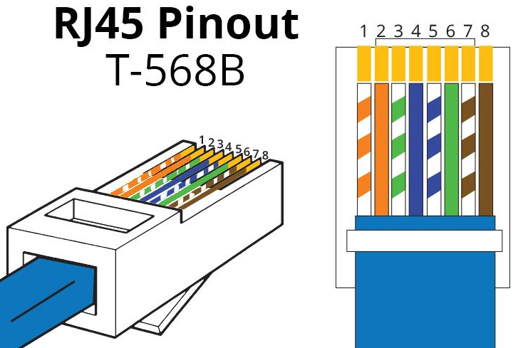

COAX (coaxial cables，**同轴电缆**)
1. 

TP (Twisted Pair，**双绞线**)
1. 
2. 完整写法 : `X`/`Y` TP
   1. `X` : 整体层/外层，U/F/S/SF
   2. `Y` : 对绞层/内层，U/F
   3. 说明 (按 **屏蔽能力** 排序)
      1. U  : Unshielded，非屏蔽
      2. F  : Foiled    ，铝箔屏蔽
      3. S  : Shielded  ，金属编织网屏蔽
      4. SF : Shielded & Foiled，双重屏蔽
      5. AS : Armoured Shielded，铠装屏蔽，金属铠装(钢带/钢丝)
3. **绞**的作用 : 为了 抗干扰、少串扰、少辐射
   1. 抵消 外界干扰(共模噪声抵消) : 两根线 不断互换相对位置，外界电磁干扰对两根线的耦合更趋于一致
   2. 减少 对外辐射(自我抵消) : 一段段的小回路方向交替，电流产生的电磁场更容易相互抵消，整根线对外的辐射更小
      1. 差分信号，两根线上的电流通常是 大小相等、方向相反(+I 和 −I)，在外部空间产生的 磁场方向相反(右手螺旋定则)
      2. 绞起来 抵消的更干净，不会出现 平行放置的 近的强/远的弱
   3. 降低 串扰(crosstalk) : 绞合能让一对线的耦合更稳定，也能让不同线对之间的耦合平均化，整体串扰更低
   4. 阻抗 更稳定 : 几何结构更一致，有利于保持特性阻抗稳定，对高速信号很关键
4. **绞向**
   1. Z向绞 : 外层单线向右上方倾斜，逆时针绞合方向
   2. S向绞 : 外层单线向左上方倾斜，顺时针绞合方向
   3. 
   4. 相邻绞层必须采用相反绞向

网线
1. 每一对的 **绞距(lay length)** 都不同
2. RJ45 (Registered Jack) - **水晶头**
   1. 学名 : 8P8C(8 Position 8 Contact)
   2. 关键部分
      1. 金属触点 (Gold-plated Contacts) : 铜片表面必须镀金以防止氧化
      2. 燕尾夹 (Strain Relief) : 水晶头尾部，压线钳压下后，这就变成了一个卡扣，紧紧压扁并卡住网线的外皮，拉扯的受力点在外皮上
   3. 插座
      1. 
3. 线序标准
   1. T568A 线序 : 绿白，绿，橙白，蓝，蓝白，橙，棕白，棕
      1. 较少见
   2. ==T568B 线序 : 橙白，橙，绿白，蓝，蓝白，绿，棕白，棕== (蓝绿对调)
      1. 最主流
      2. 
   3. T568 A/B区别
      1. 1236 线序不同(12 & 36 位置交换) : 负责 数据 收发
         1. 交叉连接 可以 让 一端的发送对 TX 接到 另一端的接收对 RX
      2. 4578 线序一致 : 备用线路
   4. 接法
      1. 直通 : 一端是 T568A标准，另一端是 T568B 标准，用于 不同设备间 连接
      2. 交叉 : 两端都是 T568A 标准 或 T568B 标准，用于 相同设备间 连接
      3. 现在 基本都支持 Auto MDI/MDI‑X 端口自动翻转，不用再纠结 直通/交叉
         1. PHY(网口芯片) 在建链时，会 探测信号来自哪一对线，在芯片内部 把 线对 做逻辑 映射/交换，必要时 还会做 极性翻转
         2. X 表示 crossover
   5. 速度
      1. 百兆 : 只使用了 1236 四根线，12 TX±，36 RX±，其他备用
      2. 千兆 : 8根线 都 用到，12 MDI0±，36 MDI1±，45 MDI2±，78 MDI3±
         1. MDI(Medium Dependent Interface，介质相关接口)
         2. 介质，就是 网线，接口，就是 RJ45
         3. **差分信号 ±**，如果同时 受到 相同干扰，相互抵消，接收端做减法
4. **Cat**egory
   1. Cat 5 : 标称带宽 100 MHz
   2. Cat 5e (e = enhanced) : 100 MHz，但对串扰等指标更严格
   3. Cat 6 : 标称带宽 250 MHz

