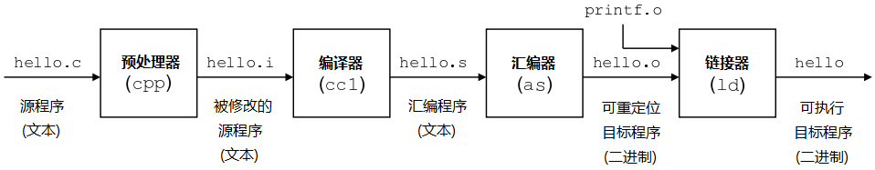
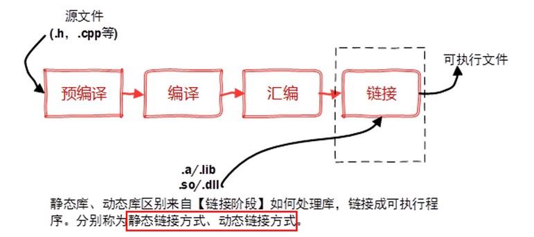
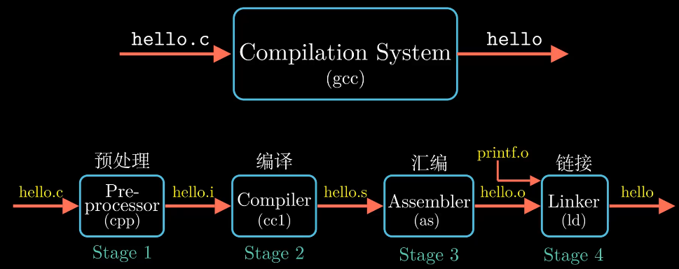
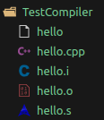
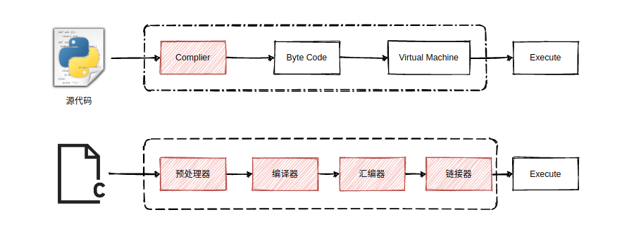
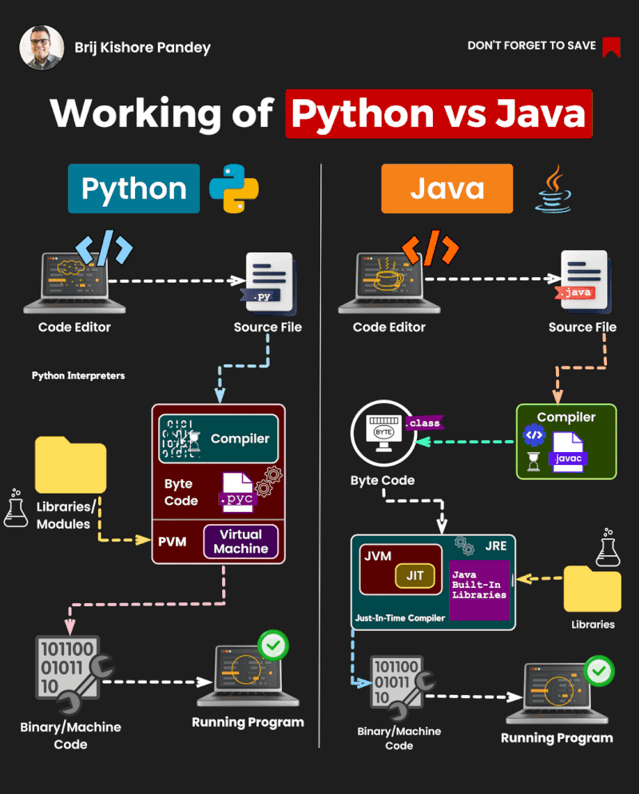

# Compiler 编译器

---
## Table of Contents

- [Compiler 编译器](#compiler-编译器)
  - [Table of Contents](#table-of-contents)
- [编译器(compiler)](#编译器compiler)
  - [编译过程](#编译过程)
  - [主流编译器](#主流编译器)
  - [G++ 编译参数](#g-编译参数)
  - [编译测试](#编译测试)
    - [小项目](#小项目)
  - [生成库文件并编译](#生成库文件并编译)
    - [静态库](#静态库)
    - [动态库](#动态库)
- [解释器(interpreter)](#解释器interpreter)
- [编译 \& 解释 (Python, Java, C++)](#编译--解释-python-java-c)
- [库文件](#库文件)

---


# 编译器(compiler)

##  编译过程







**编译过程**
1. 预处理 Pre-Processing `.i文件`
   1. 预处理器处理源代码文件(`.c`/`.cpp`)
   2. 宏替换、条件编译和文件包含(`#include`)
   3. 输出的文件通常是 `.i` 文件，仍为**文本文件**
   4. > g++ -E test.cpp -o test.i
2. 编译 compiling `.s文件`
   1. 词法分析，语法分析，语义分析，优化
   2. 得到 **汇编语言** 文件
   3. > g++ -S test.i -o test.s
3. 汇编 assembling `.o文件`(可重定位目标文件)
   1. 汇编器取得 `.s` 文件中的汇编代码，将其转换为机器语言
   2. 包含了机器代码但还不是完全可以执行的程序
   3. > g++ -c test.s -o test.o
4. 链接 linking `bin文件`
   1. 链接器取得一个或多个 `.o` 文件，将它们与库文件(标准库 & 外部库)合并
   2. 解决程序中的外部依赖，最终生成可执行文件 bin，可以加载进内存执行
   3. > g++ test.o -o test



使用 `ldd [executableFile]` 可以查看链接的 **动态链接库** `.so` 文件，无法查看 **静态链接库** `.a` 文件

```bash
ldd main_cmake
      linux-vdso.so.1 (0x00007ffd77ff2000)
      libMyGun.so (0x0000731b18762000)       # 自定义的 .so 文件
      libMySoldier.so (0x0000731b1875d000)   # 自定义的 .so 文件
      libstdc++.so.6 => /lib/x86_64-linux-gnu/libstdc++.so.6 (0x0000731b18400000)
      libgcc_s.so.1 => /lib/x86_64-linux-gnu/libgcc_s.so.1 (0x0000731b1870f000)
      libc.so.6 => /lib/x86_64-linux-gnu/libc.so.6 (0x0000731b18000000)
      libm.so.6 => /lib/x86_64-linux-gnu/libm.so.6 (0x0000731b18319000)
      /lib64/ld-linux-x86-64.so.2 (0x0000731b1876f000)
```


## 主流编译器

**主流编译器**
1. `GCC` - **GNU Compiler Collection** - 原先是 GNU C Compiler，现在除了C，还支持 C++、java、Pascal等
   1. `G++` - GCC套件中的C++编译器部分，会自动链接 C++ 标准库
2. `MSVC` - **Microsoft Visual C++** - **微软**提供的一个 C 和 C++ 编译器和开发环境，是Visual Studio IDE 的一部分
3. `MinGW` - **Minimalist GNU for Windows** - 将 GCC编译器 和 相关工具 移植到Windows平台
4. `Clang/LLVM` - 是 LLVM 项目的一部分，主要聚焦于 C, C++ 和 Objective-C 的编译。Clang 完全兼容 GCC，可以作为 GCC 的替代品


## G++ 编译参数

编译参数
1. `-E` - PreProcess only; do not compile, assemble or link.
2. `-S` - Compile only; do not assemble or link.
3. `-c` - Compile and assemble, but do not link.
4. `-o` - Place the output into <file>.
5. `-g` - 产生能被 GDB 使用的调试信息，以调试程序
6. `-o` - 指定输出文件名
7. `-O[n]` - 优化源代码，提高运行效率，省略未使用的变量，常量表达式用结果值代替
   1. `-O0` - 不做优化
   2. `-O1` - 默认优化
   3. `-O2`、`-O3`
8. `-l` - 指定**库文件** (link file)
   1. `/lib`, `/usr/lib`, `/usr/local/lib` 中的库直接 `-l` 链接
   2. eg - `g++ -l glog test.cpp` 链接 glog 库
9. `-L` - 指定**库文件路径** (link folder)
   1. 对于不在 `/lib`, `/usr/lib`, `/usr/local/lib` 中的库，使用 `-L` 指定库文件所在目录
   2. eg - `g++ -L/path/to/folder -l mylib test.cpp`
10. `-I` - 指定**头文件**搜索目录 (include)
   1. `/usr/include` 无需指定
   2. eg - `g++ -I myinclude test.cpp`
11. `-Wall` - 打印警告信息
12. `-w` - 关闭警告信息
13. `-std=c++11` - 设置编译标准(使用新特性)
14. `-D` - 定义宏 (代码内部 `#ifdef` ,`#endif`)
    1.  `#ifdef DEBUG`, `g++ -DDEBUG hello.cpp -o hello`
    2.  如果单独要写，需要在PreProcess的时候添加 `g++ -E hello.cpp -DDEBUG -o hello.i`

```bash
gcc [-c|-S|-E] [-std=standard]
    [-g] [-pg] [-Olevel]
    [-Wwarn...] [-Wpedantic]
    [-Idir...] [-Ldir...]
    [-Dmacro[=defn]...] [-Umacro]
    [-foption...] [-mmachine-option...]
    [-o outfile] [@file] infile...
```

## 编译测试

### 小项目

目录结构
```bash
.
├── include
│   └── swap.h
├── main
├── main.cpp
└── src
    └── swap.cpp
```

```bash
g++ main.cpp src/swap.cpp -o main            # 需要在各个文件中明确写明头文件位置，否则 fatal error: No such file or directory
g++ main.cpp src/swap.cpp -o main -Iinclude  # 不需要写明头文件位置
```

`main.cpp`

```cpp
#include <iostream>
#include "swap.h"
// #include "./include/swap.h"  // 如果编译时，命令行不添加 -Iinclude，则需要明确写明位置

using namespace std;

int main()
{
    int a = 1;
    int b = 2;
    swap(a, b);
    cout << "a = " << a << endl;
    cout << "b = " << b << endl;
    return 0;
}
```

`./include/swap.h`
```cpp
void swap(int& a, int& b);
```

`./src/swap.h`
```cpp
#include "swap.h"
// #include "../include/swap.h"  // 如果编译时，命令行不添加 -Iinclude，则需要明确写明位置

void swap(int& a, int& b)
{
    int t = a;
    a = b;
    b = t;
}
```

## 生成库文件并编译

前缀 `lib` 和后缀 `.a` 或 `.so` 是约定的库文件命名格式

当你指定 `-l [name]` 时，链接器会自动寻找名为 `lib[name].a`(静态库) 或 `lib[name].so`(动态库) 的文件

### 静态库

**静态库** (需要先生成 `.o` 文件，静态库本质上是 归档)
1. 进入 src
2. `g++ -c swap.cpp -I ../include -o myswap.o`
3. `ar rs libmyswap.a myswap.o` 出现 `libmyswap.a`
   1. `ar` - archive，用于创建、修改以及从静态库(`.a`文件)中提取文件
   2. `rs` - r(replace or insert) - s(create an archive index)
   3. 静态库的**命名**遵循 **`lib<name>.a`**，链接器会自动寻找完整名称的静态库
4. 回到 上级目录
5. `g++ main.cpp -I include -L src -l myswap -o TestStaticLib`
   1. `-l` 不能直接指定库文件的完整名称，不要 前缀 & 后缀


### 动态库

**动态库**
1. 进入 src
2. `g++ swap.cpp -I ../include -fPIC -shared -o libmyswap.so` 出现 `libmyswap.so`，相当于两步命令
   1. `g++ -c swap.cpp -I ../include -fPIC -o myswap.o`，(PIC=Position Independent Code，生成位置无关代码)
   2. `g++ -shared myswap.o -o libmyswap.so`，`-shared`告诉编译器生成共享库(动态库)而不是可执行文件
3. 回到 上级目录
4. `g++ main.cpp -I include -L src -l myswap -o TestSharedLib`
5. 运行 `LD_LIBRARY_PATH=src ./TestSharedLib`，不像静态库编译时已被包含，自己的动态库不在系统的默认搜索路径下，需要手动指定动态库搜索路径

如果没有指定特定的链接选项，链接器通常倾向于使用动态库，因为动态链接可以减少最终程序的大小并允许库在多个程序之间共享

如果强制使用 静态库，最后一步生成 bin 文件步骤中 使用 `-static`，eg `g++ -static main.cpp -I include -L src -l myswap -o TestStaticLib`


---

# 解释器(interpreter)

1. 工作流程
   1. 读取代码
   2. 分析代码
   3. 执行代码
   4. 错误反馈 - 解释器通常会在运行时抛出错误或异常
   5. 交互式环境
   6. 动态类型检查 - 在运行时进行类型检查，变量的类型在程序执行过程中才确定
   7. 内存管理 - 管理程序运行时的内存分配和释放
2. 常见解释器
   1. Python解释器 - 执行Python脚本
   2. JavaScript解释器 - 在Web浏览器或Node.js环境中执行JavaScript代码
   3. Bash解释器 - 执行Shell脚本，用于自动化命令行任务

# 编译 & 解释 (Python, Java, C++)

**Java** : 编译并解释 - 首先被 Java 编译器 javac 编译成字节码(.class，中间形式，既不是完全的机器语言，也不是原始的源代码)，字节码在运行时由 Java 虚拟机 JVM 解释执行


**Python** : 解释型语言 - 代码在运行时由 Python 解释器直接处理，通常是逐行解释。在更现代的 Python 实现中，源代码首先被编译成 Python 字节码 .pyc 文件，然后这些字节码被 Python 虚拟机 PVM 解释执行


**C++** : 编译型语言 - C++ 源代码通过 编译器 直接编译成机器语言代码，编译生成的目标代码通常是多个对象文件(.o 或 .obj 文件)，需要通过一个链接器组合成一个可执行文件

**区别**
1. Java 和 Python 提供了更多的平台独立性和易用性，牺牲了一些性能
2. Java 和 Python都使用虚拟机 JVM 和 PVM 来执行编译后的字节码，虚拟机抽象层允许代码在不同的操作系统和硬件上运行
3. C++ 提供了更高的性能和更低级的系统访问，但牺牲了一定的可移植性(跨平台性)，提高了编写难度





# 库文件

1. 外部库
   1. 静态库(`.a`) - 在编译链接的时候把库的代码链接到可执行文件中，程序运行的时候将不再需要静态库，运行时也是比较占内存 - Windows中是 `.lib` (Static Libraries)
   2. 动态库(`.so`或`.sa`) - 也称 共享库 - 程序在运行的时候才去链接共享库的代码，多个程序共享使用库的代码，这样就减少了程序的体积 - Windows中是 `.dll` (Dynamic Link Library)
2. 头文件 & 库文件 的位置
   ```bash
   # 头文件(.h & .hpp)
   cd /usr/include
   cd /usr/local/include
   cd /usr/include/linux
   # 库文件(.so & .a)
   cd /usr/lib
   cd /usr/lib/x86_64-linux-gnu
   cd /lib
   cd /lib64
   ```
