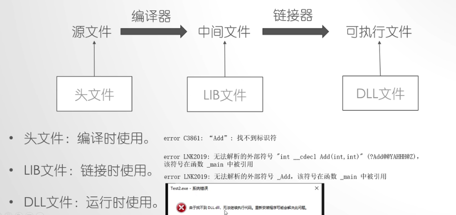
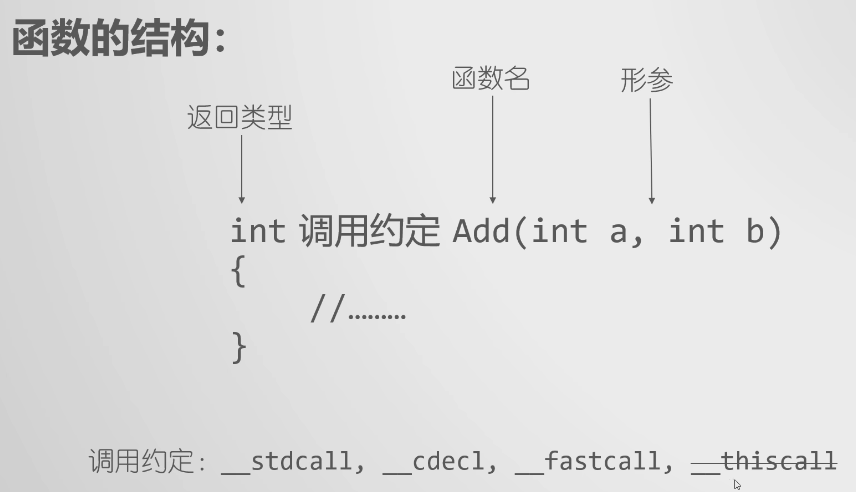

# 动态链接库和静态链接库

[toc]

## 00 传送门

[动态链接库和静态链接库](http://c.biancheng.net/dll/)

[C语言DLL(动态链接库开发)](http://c.biancheng.net/cpp/u/dll/)

[动态库与静态库讲解](https://www.bilibili.com/video/BV1XE411k7PN)

[动态库的使用方式](https://www.bilibili.com/video/BV1hE411Y7vd)

## 01 引言

编程语言中，常常将包含大量函数（类、方法）的文件称为库文件。库文件是最常用的共享代码的方式，根据使用方法的不同，库文件可以分为
1. 静态链接库（简称“静态库文件”或者“静态库”）
2. 动态链接库（“动态库文件”或者“动态库”）

静态链接库和动态链接库的作用时机不同，静态链接库会在程序载入内存之前完成所有的链接操作，而动态链接库是在程序载入内存后再进行链接操作。

在不同的平台（操作系统）上，静态库和动态库的创建方式不同，使用方式也不尽相同。




## 02 链接库是什么

### A 什么是链接库

计算机中，有些文件专门用于存储可以重复使用的代码块，例如功能实用的函数或者类，我们通常将它们称为库文件，简称“库”（Library）。

实际开发中引入他人编写好的库文件可以省略某些功能的开发环节。

“开源”的库文件很难找到，多数程序员并不会直接分享源代码，他们更愿意分享库文件的二进制版本——链接库。

链接库，其实就是将开源的库文件进行编译、打包操作后得到的二进制文件。**虽然链接库是二进制文件，但无法独立运行，必须等待其它程序调用，才会被载入内存。**

一个完整的 C 语言项目可能包含多个 .c 源文件，项目的运行需要**经过“编译”和“链接”两个过程：**
1. 编译：由编译器逐个对源文件做词法分析、语法分析、语义分析等操作，最终生成**多个目标文件**。**每个目标文件都是二进制文件，但由于它们会相互调用对方的函数或变量，还可能会调用某些链接库文件中的函数或变量，编译器无法跨文件找到它们确切的存储地址，所以这些目标文件无法单独执行**。
2. 链接：对于各个目标文件中**缺失的函数和变量的存储地址（后续简称“缺失的地址”），由链接器负责修复**，并最终将所有的目标文件和链接库组织成一个**可执行文件**。

注意，一个目标文件中使用的函数或变量，可能定义在其他的目标文件中，也可能定义在某个链接库文件中。链接器完成完成链接工作的方式有两种，分别是：
1. 无论缺失的地址位于其它目标文件还是链接库，链接器都会逐个找到各目标文件中缺失的地址。采用此链接方式生成的可执行文件，可以独立载入内存运行；
2. 链接器先从所有目标文件中找到部分缺失的地址，然后将所有目标文件组织成一个可执行文件。如此生成的可执行文件，仍缺失部分函数和变量的地址，待文件执行时，需连同所有的链接库文件一起载入内存，再由链接器完成剩余的地址修复工作，才能正常执行。

我们通常将第一种链接方式称为静态链接，用到的链接库称为静态链接库；第二种链接方式中，链接所有目标文件的方法仍属静态链接，而载入内存后进行的链接操作称为动态链接，用到的链接库称为动态链接库。

静态链接的过程由静态链接器负责完成，动态链接的过程由动态链接器负责完成。链接器的实现机制和操作系统有关，例如 Linux 平台上，动态链接器本质就是一个动态链接库。

### B 静态链接库和动态链接库

程序完成链接操作的方式有两种，一种是在生成可执行文件之前完成所有链接操作，使用的库文件称为静态链接库；另一种是将部分链接操作推迟到程序执行时才进行，此过程使用的库文件称为动态链接库。

(1)**静态链接库**

静态链接库用来和所有的目标文件一起组织成可执行文件，生成的可执行文件可以独立运行。

函数和数据被编译进一个二进制文件（通常扩展名为.**LIB**）。在使用静态库的情况下， 在编译链接可执行文件时，链接器从库中复制这些函数和数据并把它们和应用程序的其他模块组合起来创建最终的可执行文件（.EXE文件）。当发布产品时，只需要发布这个可执行文件，并不需要发布被使用的静态库。

采用静态链接库完成链接操作，存在诸多缺点：
1. 首先，内存空间占用大。可执行文件内部拷贝了所有目标文件和静态链接库的指令和数据，文件本身的体积会很大。当系统中存在多个链接同一个静态库的可执行文件时，每个可执行文件中都存有一份静态库的指令和数据，就会造成内存空间的极大浪费。
2. 此外，更新会对程序造成影响。一旦程序中有模块更新，整个程序就必须重新链接后才能运行。假设一个程序有 20 个模块构成，每个模块的大小为 1 MB，那么每次更新任何一个模块，用户就必须重新获取 20 MB 的程序，对用户很不友好。

(2)**动态链接库**

DLL 是 Dynamic Link Library 的缩写，译为“动态链接库”。DLL也是一个被编译过的二进制程序，可以被其他程序调用，但与 exe 不同，DLL不能独立运行，必须由其他程序调用载入内存。

代码的解耦、重用

DLL 中封装了很多函数，只要知道函数的入口地址，就可以被其他程序调用。

在使用动态库的时候，往往提供两个文件：
1. 一个引入库(.lib)文件
2. 一个DLL(.dll)文件

虽然引入库的后缀名也是“lib”，但是，动态库的引入库文件和静态库文件有着本质上的区别，对一个DLL来说，其**引入库文件(.lib)包含该DLL导出的函数和变量的符号名**，**而.dll文件包含该DLL实际的函数和数据**。

在使用动态库的情况下，**在编译链接可执行文件时，只需要链接该DLL的引入库文件，该DLL中的函数代码和数据并不复制到可执行文件中，直到可执行程序运行时，才去加载所需的DLL，将该DLL映射到进程的地址空间中，然后访问DLL中导出的函数**。这时，在发布产品时，除了发布可执行文件以外，同时还要发布该程序将要调用的动态链接库。

实际上，动态链接库是 Windows 平台上对动态链接过程所用库文件的称谓，Linux 平台上习惯称为共享库或者共享对象文件，它们表达的是一个意思。

所谓动态链接，指的是将链接的时机推迟到程序运行时再进行。具体来讲，对于一个以动态链接方式运行的项目，首先由静态链接器将所有的目标文件组织成一个可执行文件，运行时将所需的动态链接库全部载入内存，由动态链接器完成可执行文件和动态库文件的链接工作。

**动态链接库可以随可执行文件一同载入内存，也可以在可执行文件运行过程中载入，即可执行文件什么时候需要，动态链接库才会载入内存。**

和静态链接库相比，动态链接库可以很好地解决空间浪费和更新困难的问题。动态链接库和可执行文件是分别载入内存的，因此动态链接库的体积通常会小一些。当有多个程序使用同一个动态链接库时，所有程序可以共享一份动态链接库的指令和数据，避免了空间的浪费。采用动态链接的方式也可以方便程序的更新和升级，当程序的某个模块更新后，只需要将旧的模块替换掉，程序运行时会自动将所有模板载入内存并动态地链接在一起。

动态链接确实会损失一部分程序性能，但实践证明，动态链接库和静态链接相比，性能损失大约在 5% 以下，由此换取程序在空间上的节省以及更新时的便利，是相当值得的。


### C

## 03 Windows下静态链接库的创建和使用

## 04 Linux下静态链接库的创建和使用

## 05 Windows下动态链接库的创建和使用

## 06 Linux下动态链接库的创建和使用

## 07 Windows下显式调用动态链接库

## 08 Linux下显式调用动态链接库

## 09 动态链接库DLL的加载：隐式加载(载入时加载)和显式加载(运行时加载)

静态链接库在链接时，编译器会将 .obj 文件和 .LIB 文件组织成一个 .exe 文件，程序运行时，将全部数据加载到内存。

如果程序体积较大，功能较为复杂，那么加载到内存中的时间就会比较长。

动态链接库有两种加载方式：
1. **隐式加载，又叫载入时加载**，指在主程序载入内存时搜索DLL，并将DLL载入内存。隐式加载**也会有静态链接库的问题**，如果程序稍大，加载时间就会过长，用户不能接受。
2. **显示加载，又叫运行时加载**，指主程序在运行过程中需要DLL中的函数时再加载。显式加载是**将较大的程序分开加载的**，程序运行时只需要将主程序载入内存，软件打开速度快，用户体验好。

### 隐式加载

.lib 文件包含DLL导出的函数和变量的符号名，只是用来为链接程序提供必要的信息，以便在链接时找到函数或变量的入口地址

.dll 文件才包含实际的函数和数据。所以首先需要将 dllDemo.lib 引入到当前项目。

两种方法：
1. 配置工程
2. 在源码中引入

最好是在源码中引入 .lib 文件

```cpp
#pragma comment(lib, "dllDemo.lib")//引用lib文件
```

在 main.c 中除了用 extern 关键字声明 add() 和 sub() 函数来自外部文件，还可以用 _declspec(dllimport) 标识符声明函数来自动态链接库。

### 显式加载

显式加载动态链接库时，需要用到 LoadLibrary() 函数，该函数的作用是将指定的可执行模块映射到调用进程的地址空间。


## 动态链接库的使用方式



返回类型和函数名直接由一个调用约定


