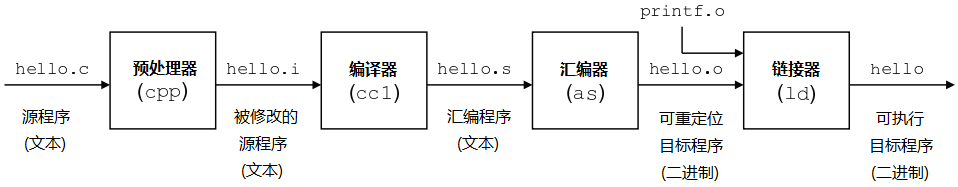
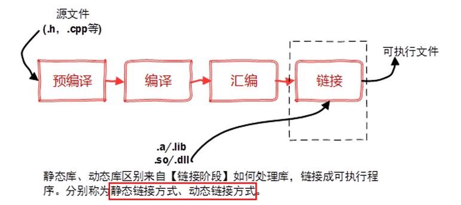
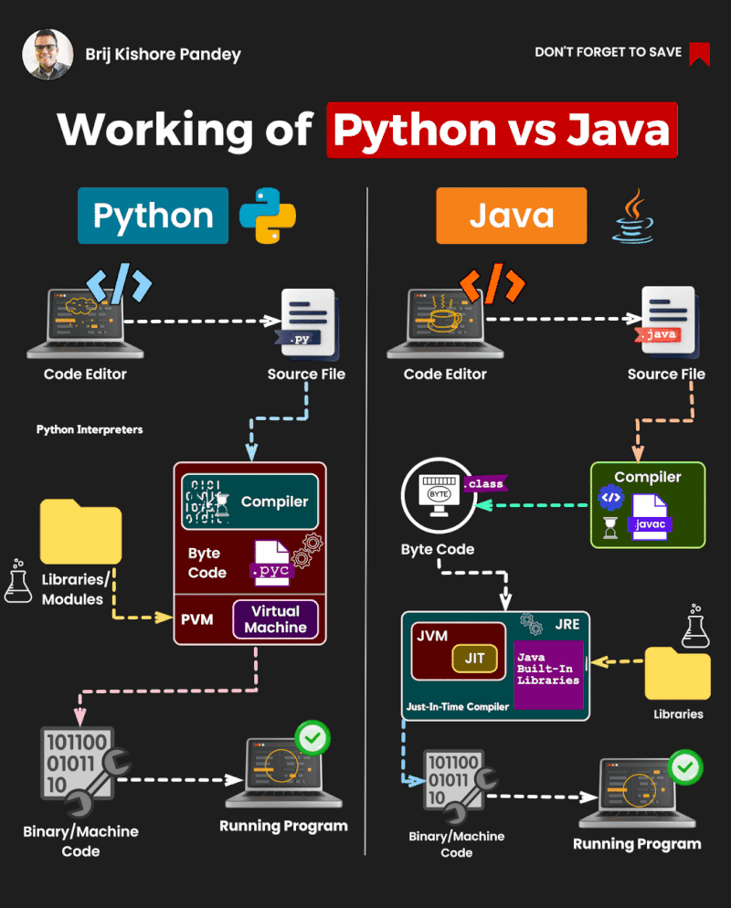

# Compiler 编译器

---
## Table of Contents

- [Compiler 编译器](#compiler-编译器)
  - [Table of Contents](#table-of-contents)
- [编译器 compiler](#编译器-compiler)
- [解释器 interpreter](#解释器-interpreter)
- [编译 \& 解释 (Python, Java, C++)](#编译--解释-python-java-c)
- [库文件](#库文件)

---


# 编译器 compiler

1. 将高级语言(C、C++、Java) 转换为 机器语言
2. 工作流程
   
   
   1. 预处理 Preprocessing - 将头文件、宏进行展开
   2. 编译 Compilation - 编译程序的过程中调用不同的工具，执行语法分析、语义分析、生成抽象语法树(AST)，然后从AST生成中间代码
   3. 汇编 Assembly - 转换为机器语言的对象代码，二进制格式，还不能直接运行，还需要和其他对象文件或库一起被链接
   4. 链接 Linking - 将程序所需要的目标文件进行链接成可执行文件
3. 代表
   1. gcc - GNU Compiler Collection - 原先是 GNU C Compiler，现在除了c语言，还支持C++、java、Pascal等
   2. g++ - GCC套件中的C++编译器部分
   3. msvc - Microsoft Visual C++ - 微软提供的一个C和C++编译器和开发环境，是Visual Studio IDE的一部分
   4. mingw - Minimalist GNU for Windows - 将GCC编译器和相关工具移植到Windows平台
   5. clang - C、C++、Objective-C和Objective-C++编程语言的编译器前端，它使用LLVM作为其后端
   6. llvm - Low Level Virtual Machine


# 解释器 interpreter

1. 工作流程
   1. 读取代码
   2. 分析代码
   3. 执行代码
   4. 错误反馈 - 解释器通常会在运行时抛出错误或异常
   5. 交互式环境
   6. 动态类型检查 - 在运行时进行类型检查，变量的类型在程序执行过程中才确定
   7. 内存管理 - 管理程序运行时的内存分配和释放
2. 常见解释器
   1. Python解释器 - 执行Python脚本
   2. JavaScript解释器 - 在Web浏览器或Node.js环境中执行JavaScript代码
   3. Bash解释器 - 执行Shell脚本，用于自动化命令行任务

# 编译 & 解释 (Python, Java, C++)

**Java** : 编译并解释 - 首先被 Java 编译器 javac 编译成字节码(.class，中间形式，既不是完全的机器语言，也不是原始的源代码)，字节码在运行时由 Java 虚拟机 JVM 解释执行


**Python** : 解释型语言 - 代码在运行时由 Python 解释器直接处理，通常是逐行解释。在更现代的 Python 实现中，源代码首先被编译成 Python 字节码 .pyc 文件，然后这些字节码被 Python 虚拟机 PVM 解释执行


**C++** : 编译型语言 - C++ 源代码通过 编译器 直接编译成机器语言代码，编译生成的目标代码通常是多个对象文件(.o 或 .obj 文件)，需要通过一个链接器组合成一个可执行文件

**区别**
1. Java 和 Python 提供了更多的平台独立性和易用性，牺牲了一些性能
2. Java 和 Python都使用虚拟机 JVM 和 PVM 来执行编译后的字节码，虚拟机抽象层允许代码在不同的操作系统和硬件上运行
3. C++ 提供了更高的性能和更低级的系统访问，但牺牲了一定的可移植性(跨平台性)，提高了编写难度




# 库文件

1. 外部库
   1. 静态库(`.a`) - 在编译链接的时候把库的代码链接到可执行文件中，程序运行的时候将不再需要静态库，运行时也是比较占内存 - Windows中是 `.lib` (Static Libraries)
   2. 动态库(`.so`或`.sa`) - 也称 共享库 - 程序在运行的时候才去链接共享库的代码，多个程序共享使用库的代码，这样就减少了程序的体积 - Windows中是 `.dll` (Dynamic Link Library)
2. 头文件 & 库文件 的位置
   ```bash
   # 头文件(.h & .hpp)
   cd /usr/include
   cd /usr/local/include
   cd /usr/include/linux
   # 库文件(.so & .a)
   cd /usr/lib
   cd /usr/lib/x86_64-linux-gnu
   cd /lib
   cd /lib64
   ```
