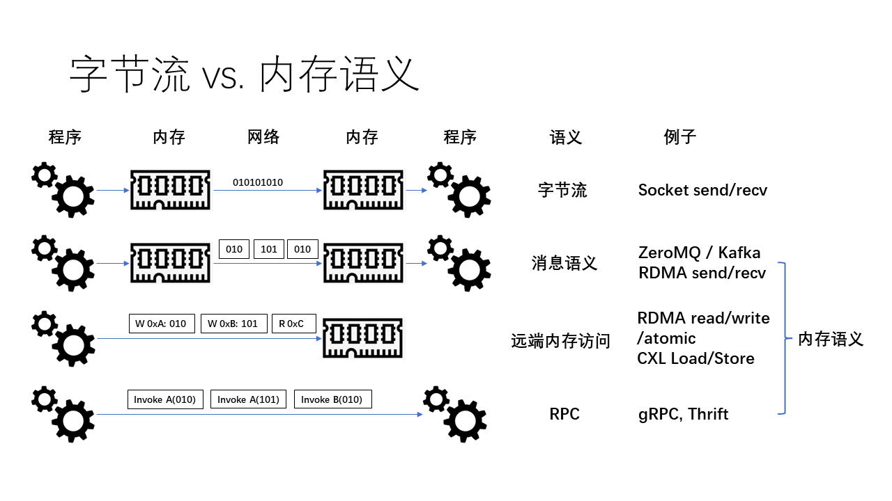

# Computer Network

---

## Table of Contents

- [Computer Network](#computer-network)
  - [Table of Contents](#table-of-contents)
- [计算机网络的新黄金时代 - 李博杰](#计算机网络的新黄金时代---李博杰)
  - [第一篇：计算机网络的新黄金时代（一）：数据中心](#第一篇计算机网络的新黄金时代一数据中心)
  - [第二篇：计算机网络的新黄金时代（二）：广域网](#第二篇计算机网络的新黄金时代二广域网)
  - [第三篇：计算机网络的新黄金时代（三）：无线网络](#第三篇计算机网络的新黄金时代三无线网络)

---

# 计算机网络的新黄金时代 - 李博杰

[计算机网络的新黄金时代](https://01.me/2022/12/new-golden-age-for-network/)

[计算机网络的新黄金时代 PDF](./计算机网络的新黄金时代_202212_PKU.pdf)

[计算机网络的新黄金时代 PPT](./计算机网络的新黄金时代_202212_PKU.pptx)

日常接触到的计算机网络主要由三大部分组成
1. **无线网络**
   1. 手机、PC、手表、智能家居、智能汽车
   2. 通过无线方式(`Wi-Fi` 或 `5G`)访问网络
2. **广域网**
   1. 经过 `5G` 基站和 `Wi-Fi` 热点之后，设备将进入广域网
   2. **CDN** 是内容分发网络 - **Content Delivery Network**
      1. 将内容(网页、图片、视频)缓存到靠近用户地理位置的服务器上，从而减少网络延迟、提高访问速度，并降低原始服务器的负载压力
      2. CDN 服务器 属于 **边缘数据中心**
3. **数据中心网络**
   1. 网关、服务器 等设备

## 第一篇：计算机网络的新黄金时代（一）：数据中心

[第一篇：计算机网络的新黄金时代（一）：数据中心](https://01.me/2023/05/new-golden-age-for-network-1)

传统的 Web 服务
1. 传统的数据中心网络是为了易于并行处理的 Web 服务而设计的
2. 请求进入一个四层负载均衡器，然后再进入一个七层负载均衡器
   1. Nginx 就是一个典型的七层负载均衡器
3. Web 服务器在处理 HTTP 请求的业务逻辑时，可能会访问内存缓存服务器，也可能会访问数据库
4. 为了容灾，数据库服务器一般有多个副本
5. **传统的 Web 服务对于数据中心网络的延迟并不敏感**
   1. 处理网页的延迟在百毫秒量级
   2. 广域网的延迟通常在几十毫秒到几百毫秒量级
   3. 数据中心内网的延迟是毫秒级
   4. **用户很难感知到百毫秒以内的延迟**

AI, HPC, 大数据 对 数据中心网络的 需求
1. 需要多张 GPU 卡组成分布式集群
2. 训练需要存储反向传播中的状态，需要的内存容量更大
3. 模型对算力的需求增长速度 快过 **摩尔定律**

传统的网络协议 设计于上世纪七八十年代，那时**处理器速度的发展速度超过网络的发展速度**，而且应用对网络通信的时延和带宽并不敏感，因此网络协议都是 CPU 上的软件在处理

虽然数据中心网络**硬件的延迟是微秒级**，但是由于**网络协议栈的复杂性**，到了**应用层**，延迟可能会增加几十倍，甚至在 RPC 层次上达到百微秒级别

**CPU 资源被浪费在了网络协议栈上**，包括内存拷贝、RPC 调用、序列化、内存分配和压缩等

对于微秒级时延的事件，**CPU 的流水线深度不足以隐藏时延**，因此 CPU 就会卡住等待这个慢速的指令，其效率是很低下的。**对于微秒级的时延，操作系统的任务切换实际上是在浪费时间**

原来用的都是基于字节流语义的 socket，体现了 UNIX 操作系统 “一切皆文件” 的设计原则，把网络通信管道也当成是文件。字节流的抽象 **没有消息边界的概念**

ZeroMQ 和 RabbitMQ 等消息队列系统，它们提供了基于消息的抽象，数据被组织成一个个独立的消息，每个**消息都有明确的边界**

最新的网络协议栈直接在不可靠的数据报文基础上构建消息语义，例如 RDMA。发送方将消息放入一个发送缓冲区，然后让网卡发送，接收方首先将接收缓冲区注册到网卡，然后网卡将数据写入接收缓冲区，并通知接收方。**提前注册缓冲区的方法避免了基于字节流的消息语义中数据必须拷贝的问题**

[RDMA 相关笔记](../../DeepLearning/Hardware/RDMA&NVMe-oF.md)

更进阶的编程抽象 - 让程序直接访问远程的内存
1. 内存池化 - 多个程序共享一块远程的内存
2. 在不打扰对方 CPU 的情况下完成了数据结构的增删改查

## 第二篇：计算机网络的新黄金时代（二）：广域网

[第二篇：计算机网络的新黄金时代（二）：广域网](https://01.me/2023/05/new-golden-age-for-network-2)

## 第三篇：计算机网络的新黄金时代（三）：无线网络

[第三篇：计算机网络的新黄金时代（三）：无线网络](第三篇：计算机网络的新黄金时代（三）：无线网络)

