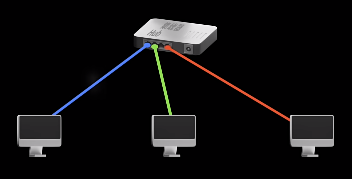
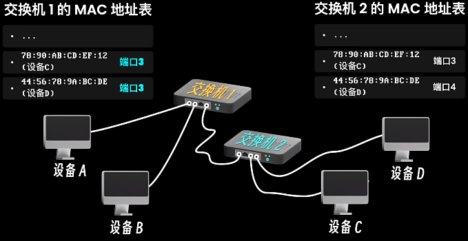

# Computer Network

---

## Table of Contents

- [Computer Network](#computer-network)
  - [Table of Contents](#table-of-contents)
- [计算机网络](#计算机网络)
  - [OSI七层网络模型 (Open System Interconnection Reference Model)](#osi七层网络模型-open-system-interconnection-reference-model)
- [10分钟速通计算机网络](#10分钟速通计算机网络)
  - [集线器 Hub](#集线器-hub)
  - [交换机 Switch](#交换机-switch)
  - [路由器 Router](#路由器-router)
  - [IPv4 \& IPv6](#ipv4--ipv6)
- [DNS、IP、MAC](#dnsipmac)
  - [IP地址](#ip地址)
  - [MAC地址](#mac地址)
  - [DNS - Domain Name System](#dns---domain-name-system)
    - [DNS 劫持 \& 污染 (域名正确，但 IP地址不符)](#dns-劫持--污染-域名正确但-ip地址不符)
    - [DNS 根服务器](#dns-根服务器)
- [广播 Broadcast \& 泛洪 Flooding](#广播-broadcast--泛洪-flooding)
- [255.255.255.255 \& 0.0.0.0](#255255255255--0000)
- [DHCP](#dhcp)
- [海底光缆](#海底光缆)
- [计算机网络的新黄金时代 - 李博杰](#计算机网络的新黄金时代---李博杰)
  - [第一篇：计算机网络的新黄金时代（一）：数据中心](#第一篇计算机网络的新黄金时代一数据中心)
  - [第二篇：计算机网络的新黄金时代（二）：广域网](#第二篇计算机网络的新黄金时代二广域网)
  - [第三篇：计算机网络的新黄金时代（三）：无线网络](#第三篇计算机网络的新黄金时代三无线网络)

---

# 计算机网络

[计算机网络知识点全面总结](https://blog.csdn.net/Royalic/article/details/119985591)

## OSI七层网络模型 (Open System Interconnection Reference Model)


[网络通讯协议图2023版-科来.pdf](./网络通讯协议图2023版-科来.pdf)


<!-- <center></center> -->

<!--  -->

**概念性架构**，不是用来提供实现的方法，而是透过观念描述，协调各种网路功能发展时的标准制定

现实世界中许多网络协议并不完全按照OSI模型设计

OSI七层

1. 应用层 Application
   1. 为应用软件提供网络服务，涉及的协议和服务直接支持各种最终用户应用
   2. **Web浏览器(HTTP协议)、电子邮件(SMTP协议)、文件传输(FTP协议)**
2. 表示层 Presentation
   1. 确保从一个网络设备传输的数据在另一个网络设备上被正确读取
   2. 处理数据格式化问题 (加密解密、数据压缩、数据转换、字符编码)
3. 会话层 Session
   1. 建立、管理和终止会话
   2. 设置和维护计算机之间的通信连接，也负责安全性和登录验证
4. 传输层 Transport
   1. 确保数据传输的可靠性和有效性
   2. 通过TCP (传输控制协议) 实现面向连接的可靠传输
   3. 通过UDP (用户数据报协议) 实现无连接的传输
5. 网络层 Network
   1. 在多个网络间进行数据发送和路由选择，确保数据包从源头到达目的地
   2. IP协议和路由器工作在这一层
6. 数据链路层 Data Link
   1. 在物理链接上实现可靠的数据传输
   2. 包括错误检测和修正，以及控制两台设备之间的数据传输的方式
   3. Ethernet、WiFi 等技术
7. 物理层 Physical
   1. 传输原始的比特流(0和1)，通过物理媒介(电缆、光纤、无线)
   2. 包括了所有电气、机械、过程和功能规范

# 10分钟速通计算机网络

[10分钟速通计算机网络](https://www.bilibili.com/video/BV1jx421X7zH/)

---

## 集线器 Hub

**直接连线法** - 两两设备连接 -太费线 $C = \frac{n \times (n-1)}{2}$


使用 **集线器 Hub** 改进，用于转发消息，增加设备仅需增加一根线



**集线器** 不知道具体哪个设备 采用**群发**，由设备自己判断是否使用数据，隐私性差


**集线器** **半双工**，无法同时双向通信，实时性差，费时间

## 交换机 Switch

使用 **交换机 Switch** 替代 **集线器**，交换机 记录 设备唯一标识(**MAC地址**)，区分不同设备

设备的 MAC 地址，出厂时就确定，并且 **全球唯一，无法修改**

**交换机** 将各设备 **MAC 地址 & 端口号** 记录为 **MAC 地址表**


**交换机** 支持 **全双工**，可以同时进行双向的数据传输，提高带宽的利用率


**交换机** 支持 **桥接**，用线连接两个交换机

1. **交换机1** 将 **交换机2** 的网络设备端口 记录为 **桥接连接端口**
2. 通过 **交换机2** 的 **MAC地址表** 查找 **设备具体端口**



**交换机** 问题

1. 在较小的局域网中使用没问题，但难以覆盖城市、国家
2. 交换机 记录的 MAC地址 有限 (几千、几万)，设备过多将导致表被写满，交换机的桥接也不会扩大表的容量(只会增加新的 MAC地址 记录)
3. 多个交换机连接，导致消息传播路径变长，可能导致冗余链路、环路、广播风暴

## 路由器 Router

**路由器 Router** (不是*wifi 路由器*)

**路由器 作用** - 基于路由算法，找到两个网络之间的 更优路径，适用于多个网络的**互联 & 数据转发**

使用 **IP地址** 区分 不同**网络 & 网络设备**


路由器 给不同网络 分配 **网段** (`192.168.1.0/24`，`192.168.2.0/24`)

**默认网关IP** - 不同网络连接到 路由器的IP (`192.168.1.1`，`192.168.2.1`)


**IP地址** 只是设备的临时标识，最终通信还是通过 **MAC地址** 完成

**路由器** 中存在 **路由表**，记录 **IP 和 端口映射关系**

设备 A1 向 B1 发送消息

1. 初次通信
   1. 先在 网络A 中寻找 IP 对应设备
   2. 若找不到，将数据发送给 路由器
   3. 路由器 根据 路由表 决定 如何将数据包转发到 网络B
   4. 在网络B 中 找到 目标IP 对应的 B1 的 MAC地址
   5. A1 记录 B1 的 MAC 地址
2. 后续 通信仍需 路由器 转发

## IPv4 & IPv6

IPv4

1. 可标识的网络设备数量 $2^{32}$ 个 ≈ 43亿个
2. 4组 - 8位 2进制数 == 共 32 位
3. 在 2019年11月26日 耗尽

IPv6

1. 可标识的网络设备数量 $2^{128}$ 个
2. 8组 - 4位 16进制数 == 8组 - 16位 2进制数 == 共 128位

---

# DNS、IP、MAC

## IP地址

作用

1. 网络界定
2. 路由

IP地址更多关注于设备在全球或局域网络中的逻辑位置和互联网通信

设置 IP 两种方式

1. 手动设置
   1. 配置 - IP地址、子网掩码、默认网关
   2. 配置固定 IP 有利于对网络统一管理
      
2. 动态获取
   1. [DHCP 协议](#dhcp)

## MAC地址

作用

1. 设备标识

MAC地址更多关注于物理网络设备在本地网络环境中的数据传输和物理寻址

## DNS - Domain Name System

IP 地址难以记忆，一般通过域名访问

电脑内 hosts 文件中 (`/etc/hosts`) 记录了部分 域名&IP 的关系

互联网不能直接通过域名访问，系统查询 hosts 文件中 域名对应的IP

hosts 文件有限，仅保存常用 域名&IP，不可能存储全部对应关系

DNS 记录 域名&IP 映射表(类似 通讯录 姓名&手机号)

电脑先去 DNS 服务器 查询 域名对应的IP (如果查不到，问 根域名服务器)


```bash
lzy@legion:~ $ sudo nmcli device show | grep DNS
IP4.DNS[1]:                             211.136.112.50
IP4.DNS[2]:                             211.136.150.66

lzy@legion:~ $ sudo resolvectl status
Global
       Protocols: -LLMNR -mDNS -DNSOverTLS DNSSEC=no/unsupported
resolv.conf mode: stub

Link 3 (wlp0s20f3)
    Current Scopes: DNS
         Protocols: +DefaultRoute +LLMNR -mDNS -DNSOverTLS DNSSEC=no/unsupported
Current DNS Server: 211.136.112.50
       DNS Servers: 211.136.112.50 211.136.150.66
```

软件客户端(QQ、微信) 内部配置所有 IP，不涉及域名解析操作

### DNS 劫持 & 污染 (域名正确，但 IP地址不符)


### DNS 根服务器

[什么是 DNS 根服务器？ - cloudflare](https://www.cloudflare-cn.com/learning/dns/glossary/dns-root-server/)

**根服务器** (`.org` + `.com` + `.net` + `...`) 是在根区域中运行的 DNS 域名服务器 (知道所有的顶级域名服务器的IP地址)

通常并不直接把待查询的域名直接转换成IP地址，而是告诉本地域名服务器下一步应当找哪个顶级域名服务器(TLD)进行查询

**TLD服务器是** (`.org`,`.com`,`.net`) DNS 层次结构中比根服务器低一级的 DNS 服务器组，它们是解析 DNS 查询的必要部分


互联网名称和数字地址分配机构 (ICANN - Internet Corporation for Assigned Names and Numbers) 为根区域中 13 个 IP 地址之一操作服务器，并将其他 12 个 IP 地址的操作委托给其他组织 (NASA、马里兰大学、Verisign)

**13个？**

DNS 原始架构的限制要求根区域中最多只能有 13 个服务器地址

在 Internet 面世之初，这 13 个 IP地址 的每一个都只有一台服务器，其中大多数位于美国

如今，这 13 个 IP地址 中的每一个都有多个服务器，这些服务器使用 Anycast 路由基于负荷和距离分发请求

---

# 广播 Broadcast & 泛洪 Flooding

Unicast 单播

1. 从一个发送者到一个接收者的数据传输
2. **eg** : 浏览网页、电子邮件

Multicast 多播

1. 从一个发送者到多个选定接收者的数据传输
2. **eg** : 视频会议、实时流媒体广播

Broadcast 广播

1. 将数据包从一个发送者发送到同一网络中的**所有设备**
2. **目的IP** 255.255.255.255 (全1)
3. **目的MAC** FFFF-FFFF-FFFF (全F)
4. **eg** : DHCP(Dynamic Host Configuration Protocol - 动态主机配置协议)中分配IP地址，集中对用户IP地址进行动态管理和配置

Anycast 任意播

1. 网络寻址和路由方法，数据从一个发送者传送到最近的或最佳位置的一个接收者中的一个
2. **eg** : DNS(Domain Name System)、CDN(Content Delivery Network - 内容分发网络)

Flooding 泛洪

1. 每个接收到信息的节点将其复制并发送给它的所有邻居节点，直到消息到达所有可达节点或者满足某些条件(如跳数限制)
2. 交换机在转发一个数据时，发现没有目标的MAC地址记录，通过除这个接口外的所有接口复制转发数据
3. **目的MAC** FFFF-FFFF-FFFF (全F)
4. **目的IP** 可以是单播或广播
5. **eg** : 路由算法

# 255.255.255.255 & 0.0.0.0

**255.255.255.255**

1. 特殊的广播地址，称为 **有限广播地址**(Limited Broadcast Address)
2. 用于在同一个局域网 (LAN - Local Area Network) 内的所有设备之间进行广播通信
3. 当设备发送数据包到这个地址时，**网络上的所有设备都会接收到这个包**
4. 通常用在设备刚接入网络且尚未获得有效IP配置时，例如在DHCP请求过程中用于寻找DHCP服务器

**0.0.0.0**

1. 网络配置 -在一个网络设备的配置中，0.0.0.0 可用来表示 **任何IP地址** 或 **没有IP地址**
2. 路由选择 - 在路由表中，0.0.0.0 通常用来表示默认路由，当没有适用的具体路由时，网络流量会被发送到这个路由指定的网关
3. 服务器编程 - 在服务器编程中，一个服务可能会在 0.0.0.0 地址上监听，这表示该服务对所有可用的网络接口都开放，允许从任何IP地址达到的连接

---

# DHCP

[一条视频讲清楚什么是DHCP协议-电脑是如何自动获取IP的](https://www.bilibili.com/video/BV1YQ4y1J7EA/)

DHCP(Dynamic Host Configuration Protocol - 动态主机配置协议)

DHCP 分配IP地址，集中对用户IP地址进行动态管理和配置，保证不冲突

完整流程

1. 需要 IP地址的主机 启动时， 使用 UDP协议 广播发送 **Discover包**(包含 MAC 地址，源IP地址0.0.0.0，目标IP地址255.255.255.255(广播地址))
2. 网络中所有设备都能收到此广播报文，但只有 DHCP服务器 才回答此广播报文
3. 家庭网络中，Wifi 路由器 作为 DHCP 服务器
4. DHCP服务器 从 IP地址池 中 取得空闲IP，并将其封装为 **Offer包**
5. DHCP服务器 通常会通过 **广播方式发送 Offer包**。即使服务器知道客户端的MAC地址，也需要广播，因为客户端在正式获得IP地址之前，无法直接接收到定向消息
6. 主机收到 **Offer包** 后，要决定是否使用该 IP地址 (网络中可能存在多个 DHCP服务器，收到多个 Offer包)
7. 主机广播自己的决定 **Request包**
8. 服务器收到 **Request包** 后，回复 **Acknowledge包**，表示接受主机的选择


当计算机重启，前两步非必须，仅需确认即可

1. 主机发送 **Request包**
2. 服务器判断 IP 是否可用
   1. 不可用则返回 **NACK包**，主机进行完整四步流程

---

# 海底光缆

[`` - Submarine Cable Map](https://www.submarinecablemap.com/)


---

# 计算机网络的新黄金时代 - 李博杰

[计算机网络的新黄金时代](https://01.me/2022/12/new-golden-age-for-network/)

[计算机网络的新黄金时代 PDF](./计算机网络的新黄金时代_202212_PKU.pdf)

[计算机网络的新黄金时代 PPT](./计算机网络的新黄金时代_202212_PKU.pptx)

日常接触到的计算机网络主要由三大部分组成

1. **无线网络**
   1. 手机、PC、手表、智能家居、智能汽车
   2. 通过无线方式(`Wi-Fi` 或 `5G`)访问网络
2. **广域网**
   1. 经过 `5G` 基站和 `Wi-Fi` 热点之后，设备将进入广域网
   2. **CDN** 是内容分发网络 - **Content Delivery Network**
      1. 将内容(网页、图片、视频)缓存到靠近用户地理位置的服务器上，从而减少网络延迟、提高访问速度，并降低原始服务器的负载压力
      2. CDN 服务器 属于 **边缘数据中心**
3. **数据中心网络**
   1. 网关、服务器 等设备


## 第一篇：计算机网络的新黄金时代（一）：数据中心

[第一篇：计算机网络的新黄金时代（一）：数据中心](https://01.me/2023/05/new-golden-age-for-network-1)


传统的 Web 服务

1. 传统的数据中心网络是为了易于并行处理的 Web 服务而设计的
2. 请求进入一个四层负载均衡器，然后再进入一个七层负载均衡器
   1. Nginx 就是一个典型的七层负载均衡器
3. Web 服务器在处理 HTTP 请求的业务逻辑时，可能会访问内存缓存服务器，也可能会访问数据库
4. 为了容灾，数据库服务器一般有多个副本
5. **传统的 Web 服务对于数据中心网络的延迟并不敏感**
   1. 处理网页的延迟在百毫秒量级
   2. 广域网的延迟通常在几十毫秒到几百毫秒量级
   3. 数据中心内网的延迟是毫秒级
   4. **用户很难感知到百毫秒以内的延迟**

AI, HPC, 大数据 对 数据中心网络的 需求

1. 需要多张 GPU 卡组成分布式集群
2. 训练需要存储反向传播中的状态，需要的内存容量更大
3. 模型对算力的需求增长速度 快过 **摩尔定律**

传统的网络协议 设计于上世纪七八十年代，那时**处理器速度的发展速度超过网络的发展速度**，而且应用对网络通信的时延和带宽并不敏感，因此网络协议都是 CPU 上的软件在处理

虽然数据中心网络**硬件的延迟是微秒级**，但是由于**网络协议栈的复杂性**，到了**应用层**，延迟可能会增加几十倍，甚至在 RPC 层次上达到百微秒级别

**CPU 资源被浪费在了网络协议栈上**，包括内存拷贝、RPC 调用、序列化、内存分配和压缩等

对于微秒级时延的事件，**CPU 的流水线深度不足以隐藏时延**，因此 CPU 就会卡住等待这个慢速的指令，其效率是很低下的。**对于微秒级的时延，操作系统的任务切换实际上是在浪费时间**


原来用的都是基于字节流语义的 socket，体现了 UNIX 操作系统 “一切皆文件” 的设计原则，把网络通信管道也当成是文件。字节流的抽象 **没有消息边界的概念**

ZeroMQ 和 RabbitMQ 等消息队列系统，它们提供了基于消息的抽象，数据被组织成一个个独立的消息，每个**消息都有明确的边界**

最新的网络协议栈直接在不可靠的数据报文基础上构建消息语义，例如 RDMA。发送方将消息放入一个发送缓冲区，然后让网卡发送，接收方首先将接收缓冲区注册到网卡，然后网卡将数据写入接收缓冲区，并通知接收方。**提前注册缓冲区的方法避免了基于字节流的消息语义中数据必须拷贝的问题**

[RDMA 相关笔记](../../DeepLearning/Hardware/RDMA&NVMe-oF.md)

更进阶的编程抽象 - 让程序直接访问远程的内存

1. 内存池化 - 多个程序共享一块远程的内存
2. 在不打扰对方 CPU 的情况下完成了数据结构的增删改查

## 第二篇：计算机网络的新黄金时代（二）：广域网

[第二篇：计算机网络的新黄金时代（二）：广域网](https://01.me/2023/05/new-golden-age-for-network-2)

## 第三篇：计算机网络的新黄金时代（三）：无线网络

[第三篇：计算机网络的新黄金时代（三）：无线网络](第三篇：计算机网络的新黄金时代（三）：无线网络)
