# 网络 & 信安 基本概念

---

## Table of Contents

- [网络 \& 信安 基本概念](#网络--信安-基本概念)
  - [Table of Contents](#table-of-contents)
- [【硬核翻墙系列】 - 电丸科技AK](#硬核翻墙系列---电丸科技ak)
  - [第一期 - 防火墙/GFW是什么？为什么会有墙？墙的真正用意是什么？你为什么要搞清楚翻墙的原理？](#第一期---防火墙gfw是什么为什么会有墙墙的真正用意是什么你为什么要搞清楚翻墙的原理)
  - [第二期 - GFW原理和Shadowsocks/V2ray/Trojan又是如何突破封锁的？](#第二期---gfw原理和shadowsocksv2raytrojan又是如何突破封锁的)
  - [第三期 - 翻墙软件 路由器 软路由硬件翻墙 和网关模式翻墙等多种翻墙方式的利弊和特点 你更适合哪一种？](#第三期---翻墙软件-路由器-软路由硬件翻墙-和网关模式翻墙等多种翻墙方式的利弊和特点-你更适合哪一种)
  - [第四期 - 各种线路详解 CN2/BGP/IPLC/GCP/AWS/Azure](#第四期---各种线路详解-cn2bgpiplcgcpawsazure)
  - [第五期 - 机场还是VPS？选择哪一种更适合你？](#第五期---机场还是vps选择哪一种更适合你)
  - [第六期 - 协议之战 原版SS SSR V2Ray的WS+TLS还是trojan？](#第六期---协议之战-原版ss-ssr-v2ray的wstls还是trojan)
  - [第七期 - VPN才是主流？比Shadowsocks和v2ray好在哪里？](#第七期---vpn才是主流比shadowsocks和v2ray好在哪里)
- [中国骨干网](#中国骨干网)
- [特殊 端口 \& IP](#特殊-端口--ip)
  - [特殊 端口](#特殊-端口)
  - [特殊 IP](#特殊-ip)
- [VPN - Virtual Private Network](#vpn---virtual-private-network)
- [Cookie Session Token](#cookie-session-token)
- [IDC 机房](#idc-机房)
- [数字签名 及 数字证书](#数字签名-及-数字证书)
- [RSA 加密算法原理](#rsa-加密算法原理)
- [CA - Certificate Authority](#ca---certificate-authority)
- [SSH - Secure Shell](#ssh---secure-shell)
- [SSL/TLS - Secure Sockets Layer/Transport Layer Security](#ssltls---secure-sockets-layertransport-layer-security)
- [HTTP(超文本传输协议) \& HTTPS(HTTP安全)](#http超文本传输协议--httpshttp安全)
- [DNS服务器](#dns服务器)
- [BT、种子、磁力、直链、PT](#bt种子磁力直链pt)
  - [直链 - Direct Links](#直链---direct-links)
  - [BT - BitTorrent](#bt---bittorrent)
  - [种子 - Torrent Seed File](#种子---torrent-seed-file)
  - [Tracker 服务器](#tracker-服务器)
  - [磁力 - Magnet Links](#磁力---magnet-links)
  - [PT - Private Tracker](#pt---private-tracker)
- [热点 Hotspot](#热点-hotspot)
- [桥接(Bridging) \& 中继(Repeater)](#桥接bridging--中继repeater)
- [WAP(无线接入点) \& Router(路由器)](#wap无线接入点--router路由器)
- [裸金属服务器 - Bare Metal Server](#裸金属服务器---bare-metal-server)
- [防火墙 Firewall](#防火墙-firewall)
- [长城防火墙 Great Fire Wall(GFW)](#长城防火墙-great-fire-wallgfw)
- [shadowsocks \& Vmess](#shadowsocks--vmess)
- [Trojan](#trojan)
- [CDN](#cdn)
- [调制解调器 Modem \& 路由器 Router](#调制解调器-modem--路由器-router)
- [集线器 Hub \& 交换机 Switch \& 路由器 Router](#集线器-hub--交换机-switch--路由器-router)
- [WAN LAN 子网](#wan-lan-子网)
- [公共和私有IP地址](#公共和私有ip地址)
- [MAC地址](#mac地址)
- [堡垒机](#堡垒机)
- [静电保护](#静电保护)

---

[PowerCert Animated Videos - Youtube](https://www.youtube.com/@PowerCertAnimatedVideos)

# 【硬核翻墙系列】 - 电丸科技AK

## [第一期 - 防火墙/GFW是什么？为什么会有墙？墙的真正用意是什么？你为什么要搞清楚翻墙的原理？](https://www.youtube.com/watch?app=desktop&v=XKZM_AjCUr0)

GFW - great firewall

阻止大陆互联网用户访问境外网站和服务

## [第二期 - GFW原理和Shadowsocks/V2ray/Trojan又是如何突破封锁的？](https://www.youtube.com/watch?v=k80cu16M-rw)

GFW封锁方式
1. DNS污染 - 解析错误地址或不解析
2. 过滤关键字 /关键字阻断 - 数据包发送方式为http(明文的流量)，有敏感词会中断连接
3. 端口阻断 - GFW在某些特定IP服务器的主机的特定端口进行阻断，eg：443、22
4. IP地址批量封锁

随着时间推进有很多新的阻断连接方式，也会有新的方式突破封锁

主流的翻墙方式工作原理
1. VPN SSH HTTP代理 : 通过连接一台GFW认为合理的服务器作为中转，传输信息，过程全部加密
    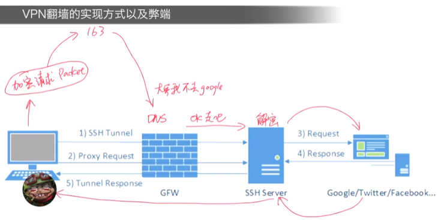
    1. 数据流量加密，不是明文，GFW看不到关键
    2. DNS解析的时候，访问对象是允许的服务器
    3. 但是GFW发现越来越多流量都是这种模式，特征较为明显，因此GFW进行干预
       1. VPN通讯端口被封锁，政企用户需要申报审核，个人用户凉凉
       2. 积累提供VPN服务的主机IP，并批量封
    4. 此类翻墙手段逐渐消亡
2. Shadowsocks : 把代理服务器拆分成本地和远程，实现经过GFW的流量全部加密，消除明显的流量特征
    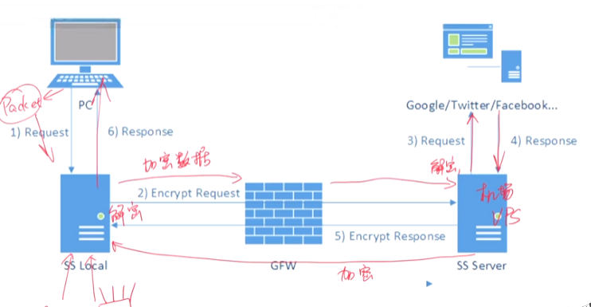
    1. 后面出现的 SSR、V2ray 原理基本一致
    2. 主要是用于对GFW前伪装和消除特征
    3. 相比翻墙的流量，99%都是正常需求
    4. 相比之下VPN的特征很明显，需要先发送建立加密通道的数据包，Shadowsocks直接在本地完成加密，使得GFW无法探测其模式和特征

## [第三期 - 翻墙软件 路由器 软路由硬件翻墙 和网关模式翻墙等多种翻墙方式的利弊和特点 你更适合哪一种？](https://www.youtube.com/watch?v=f9ohvZyQrmY)

翻墙手段三大类
1. 软件翻墙
   1. VPN - Virtual Private Network 虚拟私有网络，VPN ≠ 翻墙，场景为私密通讯，原理为端对端加密。由于加密特征明显，可以被GFW探测、封锁
   2. Shadowsocks/SSR/V2Ray/Trojan - 采用本地服务器加密流量，发送至远程服务器再进行转发。GFW会用其他方式判断流量意图，都不是绝对安全。协议需要在应用层使用，有些协议和软件同名(Shadowsocks)。越新的加密协议和算法往往相对安全。选择的时候需要考虑设备性能(加密解密需要算了)和具体需求，甚至要考虑CPU指令集是否支持
   3. **缺点** - 大多数软件没有底层权限，只能代理应用层的网络流量，即使打开全局代理模式(翻墙软件本身所接管到的所有流量全部转发到代理服务器)，但是有些软件跑在系统层，可能不遵守系统代理规则，不把通讯流量交给翻墙软件接管，如UWP应用、Windows应用商店、VR设备客户端、游戏流量等
   4. 有些翻墙软件功能全面，可以在硬件层模拟出虚拟网卡，强制接管所有的出口流量，实现真正意义上的全局代理
   5. 翻墙加速游戏 - TUN/TAP工具，强制接管指定程序的网络流量，走虚拟网卡，通过SS代理转发流量
2. 硬件翻墙(路由器翻墙)
   1. 路由器是本地网络接入互联网的最后一个环节，独立于电脑。因此可以无视计算机操作系统的代理规则，强制接管所有的网络流量，实现真全局代理
   2. 原理 - 翻墙软件部署在路由器上，原理、实现、协议、算法都和软件部分一致。
   3. 优点 - 可以应用于无法安装翻墙软件的网络设备，帮助设备实现透明代理
   4. 缺点 - 路由器CPU算力低，难以进行大量的加密解密算法，导致网络卡顿
   5. 软路由 - 改造过的路由器，性能好，可以理解为小型计算机，甚至可以装操作系统。缺点 - 价格高，配置繁琐(涉及虚拟机、Linux)，维护繁琐
3. 网关模式翻墙
   1. 在局域网中不需要专属的路由器硬件，而是通过计算机上跑的软件来实现路由器功能，eg: Clash、Surge
   2. 在本地局域网里部署了运行Clash、Surge的电脑当作网关，可以接管局域网里面其他所有网络设备的所有流量同时翻墙
   3. 优点 - 方便(无论是切换节点还是调试，可以直接在电脑软件上操作)，性能好，便于集中管理(不需要逐一安装翻墙软件)
   4. 缺点 - 需要一台电脑长期开机，保证网关模式的运行

## [第四期 - 各种线路详解 CN2/BGP/IPLC/GCP/AWS/Azure](https://www.youtube.com/watch?v=S_qo6qu4wm0)

**CN2 - Chinatelecom Next Carrier Network - 中国电信下一代承载网络** : 相较于老的163骨干网更加通畅，搭载了先进的QoS技术，主要面向政企大客户，保证高质量的国际访问。普通民众走的是163的老骨干网。但是CN2的价格很高，并且分为两种
1. CN2GT - Global Transit - 相对便宜
2. CN2GIA - Global Internet Access - 最贵、最好、最通畅、最稳定
3. 注意购买的是单向/双向CN2

**QoS - Quality of Service - 服务质量** : QoS能够识别网络中的流量需求，需要延迟低的服务优先通行。能够动态的根据服务内容调节网络带宽的通畅性

**BGP协议 - Border Gateway Protocol - 边界网关协议** : 可以自动识别线路是电信/移动/联通，自动使用最适合你连接服务器的线路，如果当前网络不同还会自动切换到其他的线路。BGP机房，也叫多线机房

不太推荐的(敏感时期会抽风)
1. GCP - Google Cloud Platform
   1. 流量贵
2. AWS - Amazon Web Service
   1. 流量少
3. Azure - 微软
   1. 申请麻烦

**PCCW - 香港电讯盈科** : 到大陆的线路走的是PCCW自己接的直连(比较推荐)，优于 HKT HKBN

**IPLC - International Private Leased Circuit - 国际私有租用线路(也称专线)** : 价格巨贵，往往带宽小、流量低。IPLC不过GFW审查，不用翻。IPLC游戏加速器效果最好

## [第五期 - 机场还是VPS？选择哪一种更适合你？](https://www.youtube.com/watch?v=kf90r28t4f0)

[DuyaoSS-机场测速和简介](https://www.duyaoss.com/ )

VPS
1. 挑选VPS主机 - [VPS御三家（Linode，DO，Vultr）横向测评](https://zhuanlan.zhihu.com/p/28079919)
   1. Linode
   2. Vultr
   3. DO
   4. Bandwagon
2. 挑选线路、BGP等
3. 如果需要用伪装的方式还需要购买域名，改A记录
4. 尝试加密、协议
5. VPS也不是绝对的安全

机场
1. 大多数没有保障，不是很稳定
2. 一定要从大机场开始选，小机场可能跑路
3. 先体验和试用，可以选择高峰期(周末的晚上)
4. 选择节点不要仅仅看 延迟，RTT - Round Trip Time 数据包通讯周期， 不代表网络的速度和带宽

## [第六期 - 协议之战 原版SS SSR V2Ray的WS+TLS还是trojan？](https://www.youtube.com/watch?v=ePxnyW7iju4)

所有的协议都不绝对安全，只有相对安全

ShadowSocks
1. 早期存在技术漏洞，涉及到采用非AEAD的加密的流量可能会被主动探测，已被修正
2. 目前拥有最快的RTT，数据包在握手的时候用时最短

ShadowSocksR
1. 是ShadowSocks的优化版，并非同一个作者开发

V2Ray
1. 极具弹性的平台，支持的协议和算法多，机制和花样多
2. 安全性综合来看更高，部署难度大
3. 通讯延时上比 ShadowSocks 更多
4. 由于Vmess协议以及两次TLS加密，CPU占用也更高

Vmess + WebSocket + TLS
1. 目前来说最稳定的方法之一
2. 其 HTTPS 流量在 GFW 看来和正常 HTTPS 流量没啥差别
3. 但是GFW主动探测会发现流量目的没有任何一个网站，这就是明显的特征，V2Ray + WebSocket + TLS + Web

GFW和突破GFW封锁的博弈状态就像破解和反破解，双方不断进化

Trojan
1. 解决 V2Ray 的缺点
   1. 解决部署难度大的问题，轻量化
   2. 没有用到 Vmess，仅仅用到 TLS
2. 核心原理还是 WebSocket + TLS
3. 缺点
   1. 弹性比较差，定死了唯一的通讯协议
   2. 多平台的支持和兼容差一点
   3. 不支持反代理

TLS的加密方式非常成熟，政府和银行也是用TLS

## [第七期 - VPN才是主流？比Shadowsocks和v2ray好在哪里？](https://www.youtube.com/watch?v=wAxOjL_gDzk)

# 中国骨干网

[大话中国骨干网（上）](https://zhuanlan.zhihu.com/p/335599924)

[大话中国骨干网（下）](https://zhuanlan.zhihu.com/p/354749781)

ChinaNet，中国第一骨干网，也被称为163网络(与网易无关)

# 特殊 端口 & IP

## 特殊 端口

21 - 用于 FTP(File Transfer Protocol，文件传输协议) 服务

22 - ssh 应用端口，ssh 用于远程连接 Linux 云服务器

23 - Telnet，用于不安全的文本通信

25 - SMTP 简单邮件传输协议，用于电子邮件传输

53 - DNS 域名系统，用于域名到 IP 地址的解析

80 - http 协议的默认端口

443 - https 协议的默认端口

3306 - mysql

8080 - 通常被用作 http 服务的备用端口

## 特殊 IP

***斜杠符号 / 后面跟随的数字，表示子网掩码的位长度（从前面开始数）***

127.0.0.1 - 回环地址，通常用localhost来访问，用于让计算机通过网络协议与自己通信

100.64.0.0/10 - 运营商保留地址段，用于运营商级 NAT地址转换

169.254.0.0/16 - 用于自动配置 IP 地址，计算机配置为使用DHCP获取IP地址，但没有找到DHCP服务器时，将自动分配这个范围的地址

192.168.0.0/16 - 私有地址空间，通常用于本地网络

224.0.0.0/4 - 多播地址范围，用于多播群组

255.255.255.255 - 广播地址

DHCP(动态主机配置协议，Dynamic Host Configuration Protocol)

# VPN - Virtual Private Network

[VPN概念，技术原理和误区](https://www.bilibili.com/video/BV1KY411t75D/)

HTTP协议的缺点是明文，没有对数据进行加密的规定

VPN类型
1. 站点---站点
   1. 两头配置VPN集线器，发送的数据，都通过VPN集线器加密，加密数据通过ISP进入互联网，到达另一头的VPN集线器后解密，再发送给指定的主机
   2. 数据包发送到VPN集线器的时候，数据包上的源地址会被更改为当前VPN集线器的地址，目的地址会被更改为目的VPN集线器的地址，数据包会被加密。中间人看来，就是这两个集线器之间在通信。并且隐藏了实际源地址和实际目的地址
   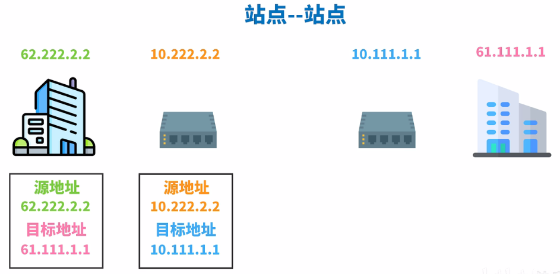
   3. 核心：数据在公用网络里面是加密状态
   4. 应用：
      1. 同一公司，但不同地点的内部网
      2. 不同公司的外部网
   5. 特点：两端或多端地点相对固定，链接不间断
2. 客户端---站点(远程登录VPN)
   1. 相对灵活，适合不需要长时间进行链接的方式，一般可以用浏览器直接通信，也可以安装客户端软件
   2. 有全隧道和半隧道模式
      1. 全隧道：所有的网络数据都走公司网
      2. 半隧道：可以摸鱼
   3. 应用：
      1. 适合居家办公情景

VPN职责(需要结合很多协议)
1. 保密 AES、3DES (E = encryption)
2. 保护数据完整性 Hash 哈希值 MD5、SHA系列
3. 认证 PSK、RSA

VPN主要用到的两大框架 (S = security)
1. IPsec = IP security (可用于客户端-站点，多用于站点-站点)，IP协议在网络层，使用IPsec可以把网络层上面的数据全部加密再发送出去
2. SSL/TLS (用于客户端-站点类型的VPN)，SSL/TLS在表示层，加密应用层数据再往下发送

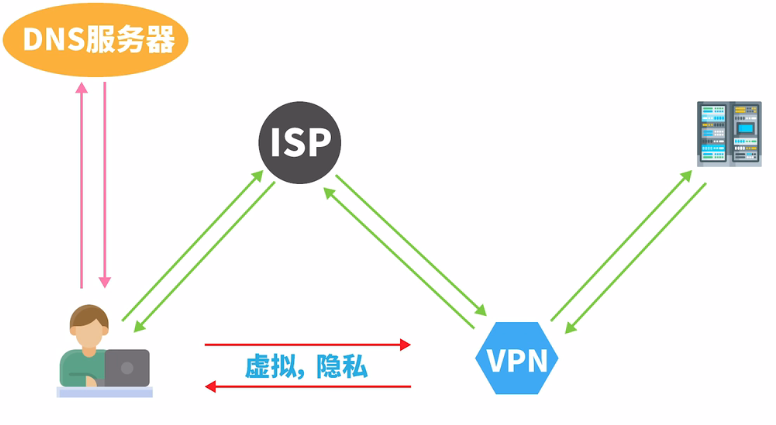

目标地址被修改后的数据通过ISP发送给VPN服务器，VPN服务器再把数据解密发送到真实的服务器，建立了无形的通道

VPN不能完美隐藏自己要访问的网站，在DNS域名解析的时候可能向ISP访问网站的IP地址

VPN也不能隐藏自己对IP地址

很多网站服务器也是知道你在使用VPN的
1. IP地址检查 - VPN服务通常使用特定的IP地址范围
2. IP地址共享 - 如果许多人同时使用相同的IP地址，这可能表明该IP地址由VPN服务提供
3. DNS泄露
4. 流量分析 - 加密流量的特征可能不同于普通流量
5. 已知VPN端口和协议 - VPN服务可能使用特定的网络端口和协议

# Cookie Session Token

[Cookie、Session、Token究竟区别在哪？](https://www.bilibili.com/video/BV1ob4y1Y7Ep/)

第一次需要注册账户和密码，后续很长时间不要再输入用户名和密码

HTTP是无状态的

GDPR - General Data Protection Regulation (欧盟) - 数据隐私法案 - 国外的网站总喜欢弹窗Cookie请求

# IDC 机房

Internet Data Center - 互联网数据中心

**电信部门 利用已有的互联网通信线路、带宽资源，建立标准化的电信专业级机房环境**

为 **企业、政府、互联网内容提供商ICP、媒体** 提供 **服务器托管、空间租用、网络批发带宽 以及 ASP(Application Service Provider 应用服务提供商)、EC(Electronic Commerce 电子商务)** 等业务

数据储存 & 数据流通

特点
1. 位于网络的核心节点，提供多种网络连接选项和高带宽接入，通常与多个 **互联网服务提供商 ISP** 直接连接
2. 具有极高的物理和网络安全措施，包括生物识别安全系统、闭路电视监控、防火墙、入侵检测系统等，以保护存储的数据和设备

应用范围
1. **网站发布**
   1. 公司或组织可以在IDC机房托管自己的服务器
   2. 从电信部门分配到互联网静态IP地址后，发布自己的www站点
   3. 将自己的产品或服务通过互联网广泛宣传
   4. 享受到机房提供的高速网络连接、安全保护和稳定的电力供应
2. **虚拟主机**
   1. 公司或组织不仅自己使用 IDC 机房托管的服务器，还将这些服务器上的硬盘空间分租给其他客户，提供虚拟主机服务，使自己成为ICP服务提供商
   2. 多个客户的网站可以共享同一台物理服务器的资源
3. **电子商务**
   1. 单位通过托管主机，建立自己的电子商务系统，通过这个商业平台来为供应商、批发商、经销商和最终用户提供完善的服务

# 数字签名 及 数字证书

[数字签名 及 数字证书 原理](https://www.bilibili.com/video/BV18N411X7ty/)

**数字签名并不是加密**

**数字签名算法**
1. RSA
2. DSA
3. ECDSA

哈希算法
1. 单向不可逆加密算法，只能加密不能解密
2. 算法对目标信息生成一段特定长度的唯一哈希值
3. 不能通过该哈希值重新获得目标信息
4. 常用哈希算法(MD5、SHA-1、SHA-256、SHA-512)

对称及非对称加密算法为双向算法，即可加密也可解密

**RSA数字签名算法具体运算过程**

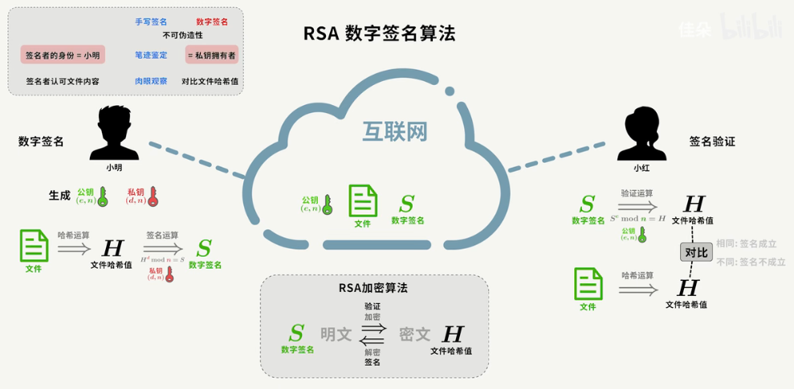

如果文件被篡改，则文件的哈希值就会发生变化，由数字签名和文件分别得到的哈希值不相同

其他人自己也可以生成一套公钥、私钥，并进行数字签名，冒充
使用冒充者的公钥和数字签名也能得到匹配的哈希值

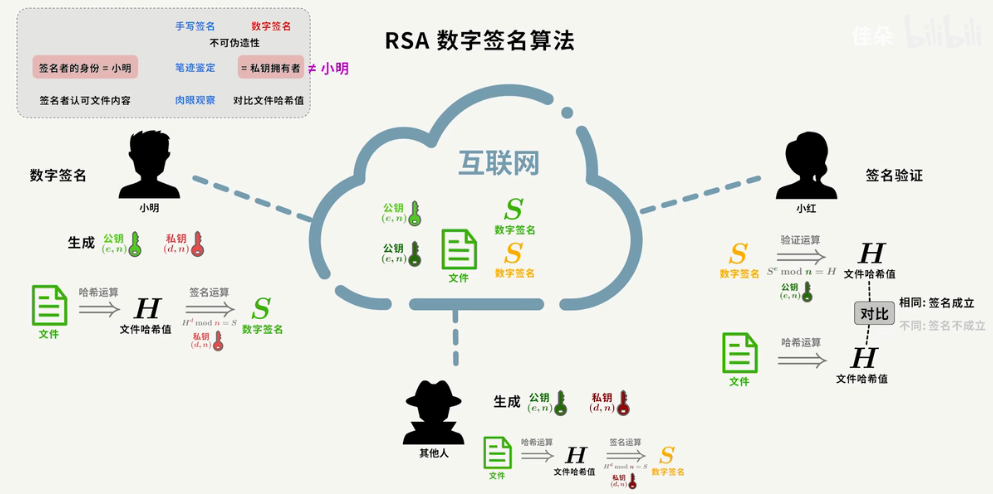

数字证书可以解决冒充的问题
1. 公钥、私钥是配对生成的
2. 私钥对应唯一的公钥
3. 私钥拥有者就是对应公钥的生成者
4. 文件发送方将**公钥和个人身份信息**发送给CA机构
5. CA机构颁发数字证书(包含公钥和个人身份信息)
6. 文件发送方将证书放在互联网
7. 文件接收方通过证书可以确定文件发送方公钥

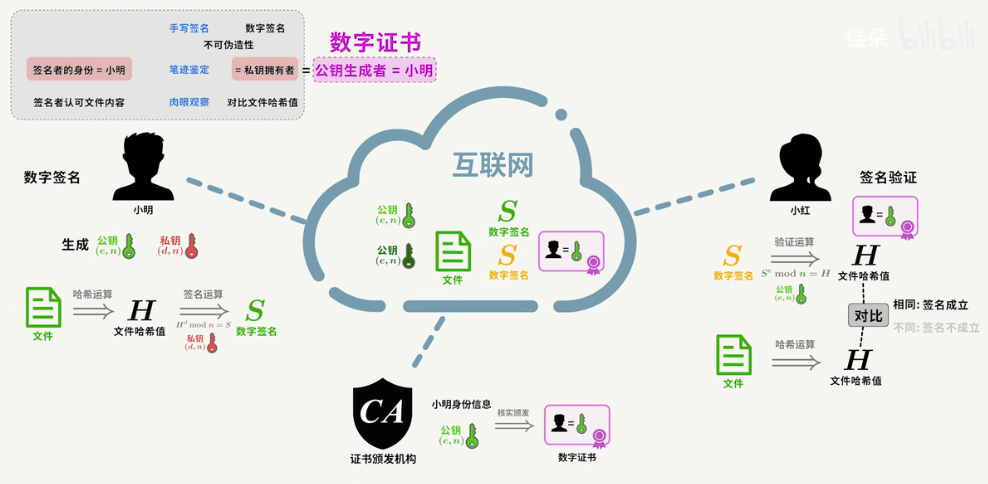

需要确保数字证书不会被伪造
1. 数字证书经过CA机构数字签名
2. CA机构也生成一套公钥私钥
3. 使用私钥对**发送方身份信息及发送方公钥**内容进行数字签名，并放入数字证书
4. 个人电脑和手机系统中默认安装**根证书**
5. **根证书**内记录可信赖的CA机构信息及其公钥
6. **根证书**预安装可以杜绝CA机构公钥被伪造的可能
7. 通过CA机构公钥即可验证数字证书内的数字签名

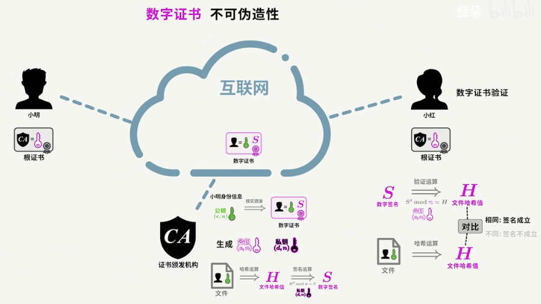

# RSA 加密算法原理

[RSA加密算法原理](https://www.bilibili.com/video/BV1gf4y1r75B/)

信息通过密钥加密为密文发送，密钥解密密文后可获知信息内容

没有密钥的人不能从密文中解密出信息

加密解密算法
1. 对称加密
   1. 又称为单密钥加密，加密解密使用同一个密钥
   2. 常见的对称加密算法：DES、3DES、AES
2. 非对称加密
   1. 又称为公开密钥加密，加密和解密使用不同的密钥
   2. 解决了密钥传输的问题，可以把公钥发送给对方而不怕被其他人截获，没有私钥不能解读出信息
   3. 常见的对称加密算法：RSA、ECC

RSA算法目前使用最广泛，主要应用于简短信息加密和数字签名领域

由罗纳德·李维斯特（Ron Rivest）、阿迪·萨莫尔（Adi Shamir）和伦纳德·阿德曼（Leonard Adleman）在1977年提出的，因此得名RSA（取自他们三人姓氏的首字母）

具体步骤
1. 接受方生成公钥私钥
2. 将公钥发送给发送方(可能会被他人获知)
3. 发送方使用公钥加密文件为密文
4. 发送方将密文交给接收方(可能会被他人获知)
5. 接收方用公钥将密文解密

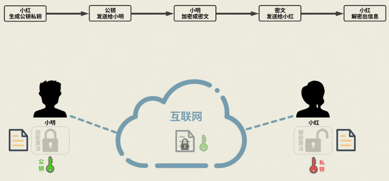

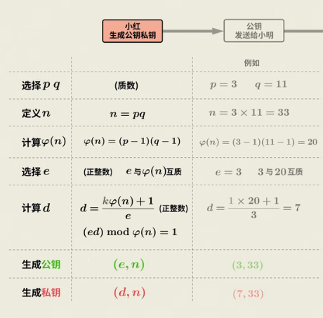

任意选择两质数 $p、q$, $n = pq$

$\varphi(n)$ 为 $p、q$ 的欧拉函数 $\varphi(n) = (p-1)(q-1)$

选择一个正整数 e (encryption，加密) 与 $\varphi(n)$ 互质 (公约数只有1)

e 一般取 $65537 = 2^{16}+1$ 为质数

计算出 d (decrpytion，解密) $d=\frac{k \varphi(n)+1}{e}$，即 $(ed)MOD(\varphi(n))=1$

k为**满足d为正整数**的自然数，不是任意的

d为整数解的条件是 $ e $ 与 $\varphi(n)$互质

e、n组成公钥
d、n组成私钥

最后只保留公钥私钥

文件发送方使用公式 $(M^e)MOD(n)=C$

M(message，信息)

C(ciphertext，密文)

需要 M < n， 否则需要把信息拆分成多份，分开加密

接收方使用解密公式 $(C^d)MOD(n)=M$

传输过程其他人会获得 e、n、C (公钥和密文)

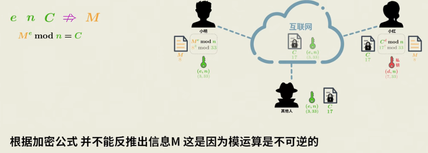

但无法通过 e、n、C 求得 信息 M，因为模运算不可逆

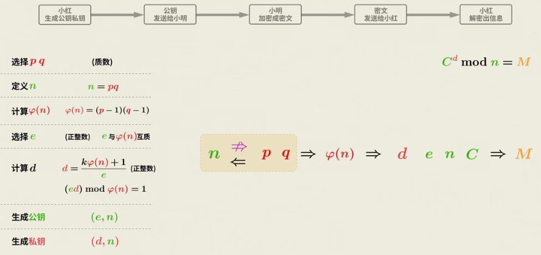

RSA加密算法的核心原理 : 多位数n的因式分解

已知两质数可以简单的求乘积，但是已知乘积很难因式分解

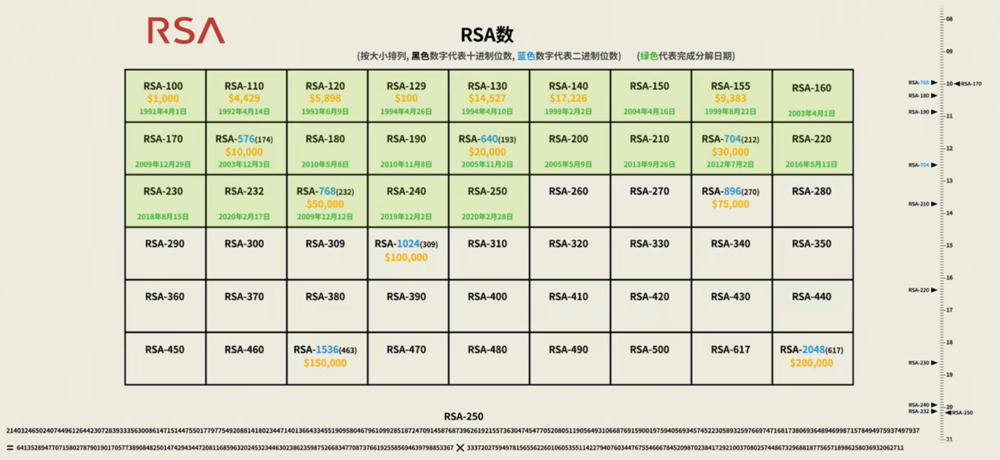

**证明**

欧拉函数 $\varphi(x)$ 定义：小于或等于x的正整数中，与x互质的数的个数

根据欧拉函数积性公式，若m与n互质，则$\varphi(mn) = \varphi(m) \varphi(n)$

下面证明解密公式(两次二项式定理)

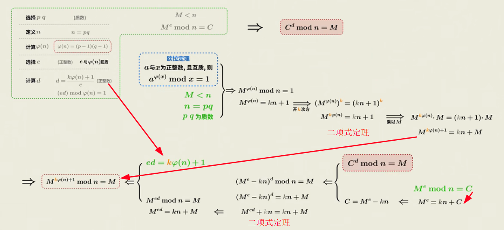

二项式展开 $(M^e-kn)^d$

欧拉定理:a与x为正整数且互质，则 $a^{\varphi(x)}MODx=1$

在 M < n ，n为两质数乘积条件下，M不需要与n互质也适用欧拉定理

# CA - Certificate Authority

CA 是一个负责发放和管理安全证书的机构

当你访问一个使用 HTTPS 的网站时，该网站的安全证书往往是由某个 CA 机构颁发的

CA 通过验证实体（如个人、公司、网站）的身份，并为它们颁发一个数字证书，从而为其他方提供信任的基础

在 SSL 证书颁发过程中，CA 会为客户端和服务器生成公钥和私钥，并使用这些密钥来建立安全连接

CA 还会为客户端和服务器颁发数字证书，该证书包含客户端和服务器的身份信息、过期时间和签名等信息

CA证书可以基于多种密码算法生成，如RSA、ECDSA等，而不局限于某一特定的国家或地区的标准

# SSH - Secure Shell

SSH 是一种网络协议，用于安全地访问远程计算机

SSH 通常用于远程连接到服务器

SSH 使用公钥加密技术来确保数据在传输过程中不会被篡改

# SSL/TLS - Secure Sockets Layer/Transport Layer Security

[SSL，HTTPS，TLS三者的区别](https://zhuanlan.zhihu.com/p/158711125)

SSL(安全套接字层)/TLS(传输层安全性) 是两种协议，用于在互联网上提供安全的通信，它们在网络通信中起到加密和验证的作用，确保数据的安全性和隐私

SSL是最早的加密协议之一，由网景公司(Netscape)在1990年代中期开发

TLS是SSL的继承者，被设计来解决SSL的某些安全问题

应用场景
1. 网站安全：在HTTPS (HTTP over SSL/TLS)中，这些协议被用来加密网页浏览器和服务器之间的通信
2. 电子邮件安全：在电子邮件传输过程中，如使用SMTPS、IMAPS和POP3S
3. 其他应用：包括VPN和安全的文件传输协议等

主要特点和作用
1. 加密：SSL/TLS通过对数据进行加密，保护数据在互联网上传输时不被拦截和读取
2. 验证：这些协议通过证书（通常由第三方证书机构颁发）验证通信双方的身份，确保用户正在与预期的服务器进行通信，防止“中间人攻击”
3. 完整性：它们还确保数据在传输过程中不被篡改，保持通信的完整性

CA（证书颁发机构）颁发的SSL/TLS证书通常是针对域名发放的，而不是针对IP地址。这是因为SSL/TLS证书的主要目的是为了验证一个网络实体的身份，这个实体通常是通过其域名来识别的。证书中包含了所保护的域名信息，使得访问这些域名的用户可以确认他们正在与正确的服务器进行通信。

---

# HTTP(超文本传输协议) & HTTPS(HTTP安全)

**最常见的超文本示例是网页**，电子书和在线文档

超文本关键特征
1. 链接，允许文档相互连接，链接可以是文本或图像
2. 多媒体集成，除了文本，超文本还可以包含图像、声音、视频等
3. 允许非线性的阅读路径，可以根据兴趣选择不同的链接
4. 交互性，超文本环境通常更加互动

**HTML(超文本标记语言)** HyperText Markup Language

**HTTP(超文本传输协议)**
1. 定义：HTTP用于传输超文本的标准网络协议
2. 无加密：在HTTP中，数据以==明文==形式传输，这意味着数据在传输过程中==可能被拦截或读取==
3. 端口：HTTP通常使用**端口80**进行通信

**HTTPS(HTTP安全)**
1. 安全版HTTP：在HTTP的基础上添加了SSL/TLS加密层
2. 加密通信：在HTTPS中，传输的数据被加密，免受拦截和篡改
3. 验证：HTTPS还包括对网站身份的验证，这通过使用SSL/TLS证书实现，证书由认证机构(CA)颁发
4. 端口：HTTPS通常使用**端口443**进行通信

区别
1. 安全性：HTTPS提供了加密和安全保证，而HTTP没有
2. 性能：由于加密过程，HTTPS可能稍微减慢数据传输速度。但随着技术的发展，这种差异越来越小
3. 使用场景：对于需要保护数据安全的网站（如在线银行、电子商务等），HTTPS是必需的

---

# DNS服务器

如果直接访问网站的IP地址，你的请求可以不经过DNS服务器

DNS（域名系统）的主要功能是将域名转换为相应的IP地址，当直接使用IP地址访问网站时，你实际上绕过了这一转换过程

使用IP地址直接访问可能不支持HTTPS(降低连接的安全性),一些网站可能仅配置了基于域名的HTTPS访问，而没有为直接通过IP地址访问的情况配置SSL/TLS证书

在实际的互联网应用中，基于域名的证书更为常见，因为它们更加灵活且易于管理。域名提供了一个固定的网络身份标识，而IP地址可能会变化

---

# BT、种子、磁力、直链、PT

[BT、磁力、种子、直链、PT，天天都用，但你却不懂？](https://www.bilibili.com/video/BV1tm421W7Fv/)

## 直链 - Direct Links

文件放在服务器上

网络地址 直接链接到 文件，用户可以通过点击这种链接直接开始文件的下载

直链下载通常通过 HTTP/FTP/HTTPS 服务器进行，而不通过P2P网络

下载方式简单直接，但对服务器带宽的需求较高

下载歌曲、文件、软件

缺点
1. 分享者只有一个 -网络带宽有限，如果都在一个地方下载会造成下载卡顿，影响所有人
2. 中心化 - 如果取消分享、停电、服务器宕机 则无法下载

## BT - BitTorrent

**Client/Server - P2P**

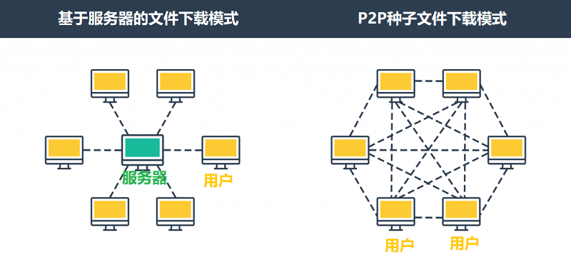

一种 点对点 P2P(peer to peer) 的 **文件共享协议**，用于分布式数据传输

允许用户分散文件的各个部分，而不是从单一服务器下载整个文件

对于同一个文件，多人分别从服务器下载文件的不同部分，然后再各自交换，合成完整文件 -> **参与的人越多，下载速度越快**

需要最初的分享者制作种子文件

提高大文件下载的效率并减少网络拥堵

## 种子 - Torrent Seed File

种子文件 通常以 **.torrent** 为扩展名

包含有关文件(如电影、游戏、软件等)内容和结构的小型元数据文件

种子文件 **不包含 文件本身的内容**，而是 包含 两种信息
1. 文件分块的信息(文件名、体积、分块大小、块的哈希值)
2. 至少一个 Tracker 信息(Tracker 服务器的地址和设置) 用于 连接到可以分享这些文件的其他用户(即种子用户或做种者)的信息

## Tracker 服务器

负责协调不同用户之间的文件传输

**帮助用户找到并连接到拥有所需文件片段的其他用户**，Tracker **不参与实际的文件传输**，它只**告诉各个对等点其他对等点的存在**

高效地管理大量用户的连接和数据传输，但也依赖于良好的网络行为和对等点之间的合作分享

**工作原理**(From ChatGPT4)
1. **种子 中包括至少一个 Tracker 服务器 的 URL**
2. 当下载文件时，需要**下载该文件的种子文件(包含 Tracker 信息)**
3. 用户的 BitTorrent 客户端打开种子文件，**提取 Tracker 的 URL**，并向 Tracker 发送请求，包含：
   1. 用户 **IP地址和端口号**
   2. 文件 **唯一标识** (通常是文件的信息散列值)
   3. 状态信息 (如用户是否已经拥有部分文件等)
4. Tracker 收到来自用户(即对等点)的信息后，**添加到其数据库中**，维护 **对等用户清单**
5. Tracker 响应请求，并返回一份当前拥有该文件片段的活跃对等点的列表
6. 用户客户端 直接与这些对等点建立连接，开始文件的P2P传输
7. 更新与监控
   1. 在下载过程中，对等点会定期向Tracker报告其状态，如下载进度、上传和下载速度
   2. Tracker 更新其数据库，确保能为新加入的对等点提供最新的对等点列表
8. 减轻Tracker负担
   1. 种子文件中经常包含多个Tracker地址，形成所谓的Tracker群
   2. 现代BitTorrent客户端也支持使用 DHT(分布式哈希表) 和 PEX(对等交换)，允许客户端在完全没有Tracker的情况下发现其他对等点

缺点
1. 该下载方式仍然需要 Tracker 服务器，如果被打击(往往是各个版权组织)
   1. 解决方案 - 自己指定 Tracker 服务器 **[TrackersListCollection](https://trackerslist.com/)** (Motrix 已经关联，可以在进阶设置中选择即可)
2. 上传全凭自愿 - 用户下载完文件后限制上传速度(没有分享精神)，导致只有下载没有上传 - 点名批评 **迅雷** (依靠此方式囤积资源，并限制其他下载器从其服务器获取资源，逼用户只能使用它的下载器)

## 磁力 - Magnet Links

彻底摆脱对服务器的依赖，没有固定的 Tracker 服务器，将每个人都变成 Tracker 服务器

磁力链接是一种链接方法，它不依赖于种子文件

通过 包含哈希值的 URI (统一资源标识符) 来标识和下载文件

用户可以点击磁力链接直接在兼容的 BitTorrent 客户端中开始下载文件，无需先下载种子文件

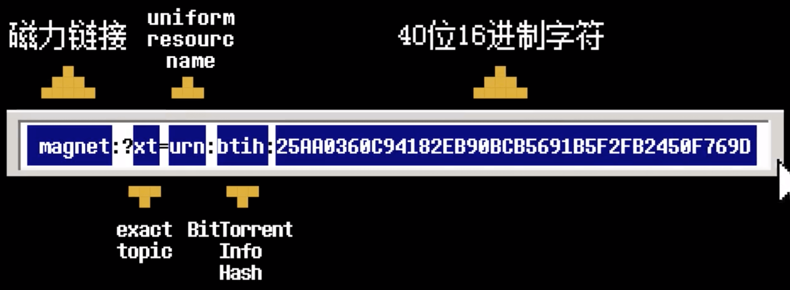

**磁力链接类比 (from ChatGPT4)**
> **开始搜索** - 有一张纸条(磁力链接) 写着你要找的书的编号
> **寻求帮助 DHT** - 向在图书馆里碰到的每个人询问他们是否看过这本书，每个人都记得一小部分书的编号和位置，这就类似于分布式哈希表 DHT，没有固定的Tracker，需要寻找其他用户当Tracker，每个人 (对等点) 都存储网络中一部分的信息
> **广泛搜索 PEX** - 假设你找到了几个人知道这本书的位置，当你去找这本书时，**你也会问他们是否还知道其他人可能知道更多类似书籍的位置**，这就是对等交换 PEX，通过现有的联系来发现更多资源
> **找到书籍** - 一旦你找到书的具体位置，你就可以直接去那个书架取书。在实际的磁力链接中，这就是你从其他用户那里下载文件的片段
> **额外帮助 Tracker** - 如果图书馆里有服务台(Tracker服务器)，虽然你可以不用它，但如果你在一开始找不到任何知道书位置的人，你可以去服务台寻求帮助。服务台有一个更广泛的联系网络，可以帮助你快速找到书的位置

查询过程
1. **哈希值定位**
   1. 每个参与的节点(对等点) 负责维护 DHT 网络中一部分的数据，这些数据是按照哈希值分配的
   2. 当客户端想要找到特定文件的对等点时，它会使用文件的唯一哈希值 (通常是磁力链接中的BTIH，BitTorrent信息哈希) 来确定负责该哈希值范围的节点
2. **迭代查询**
   1. 客户端会向最接近文件哈希值的已知节点发送查询请求
   2. 这个节点会返回它所知道的 **更接近目标哈希值的其他节点** 信息
   3. 客户端随后会向这些更接近的节点发送查询，这个过程会持续进行，直到找到实际拥有文件数据的对等点
3. **效率**
   1. 这种方法非常高效，因为 ==避免了向整个网络广播查询==
   2. 而是通过逐步接近目标数据的方式，快速定位信息，类似于 **跳点搜索**，每一步都更接近目标数据的位置

**磁力格式**

> **magnet:?xt=urn:btih:[哈希值]&dn=[显示名称]&tr=[Tracker地址1]&tr=[Tracker地址2]&...**
1. magnet: - 这指明链接是一个磁力链接
2. xt (exact topic) - 指定文件的确切主题，通常是文件的哈希值
   1. urn:btih: 后面跟的是文件的 BitTorrent 信息哈希 BTIH (文件标识)
   2. 通常使用 **SHA-1** 算法计算得出的 **40字符 十六进制 字符串**，用于 唯一标识文件
3. dn (display name) - (可选) 用于指定文件的显示名称，通常是文件本身的名字或描述
4. tr (tracker) - (可选) Tracker的URL地址，可以包含多个Tracker地址，每个地址都是以 tr 为参数名的键值对

例子:

> magnet:?xt=urn:btih:12345abcde67890fghij12345abcde67890fghij&dn=example_file.mp4&tr=udp%3A%2F%2Ftracker.example.org%3A80
1. 指定了文件的 BTIH 哈希值为 - 12345abcde67890fghij12345abcde67890fghij
2. 显示名称为 - example_file.mp4
3. 使用一个UDP协议的 Tracker 地址 - udp://tracker.example.org:80

磁力链接的设计 **允许它们在没有Tracker的情况下通过 DHT(分布式哈希表) 和 PEX(对等交换) 技术找到对等点**，但在链接中 **包含 Tracker 地址可以为文件传输提供更多的可靠性和速度**，尤其是在网络中对等点较少的情况下

磁力 与 BT 的区别
1. BT 是找 固定的 Tracker 服务器，再通过服务器 找 有对应文件的用户
2. 磁力 使用 DHT(分布式哈希表) 网络技术

## PT - Private Tracker

在 BT 的基础上增加规则，防止 "吸血鬼"

将使用者限定在一个小圈子内(xx群、xx论坛)

私有种子跟踪器 是一种需要注册和登录才能访问的 BitTorrent 跟踪器

与公开跟踪器不同，私有跟踪器通常需要邀请才能加入，并且会对用户的上传和下载比例进行监控(eg:积分机制)

想象一下，你在一个巨大的图书馆里寻找一本特定的书。这本书非常独特，所以图书馆里的每本书都有一个独一无二的编号（这就像文件的哈希值）。但是，图书馆非常大，没有集中的索引告诉你每本书的具体位置。

---

# 热点 Hotspot

hotspot 其实是指 location

可以是公共的(有风险)，也可以是私人的

一种是由 WiFi路由器 或 无线接入点 创建，连接到 ISP网络服务提供商，然后它们广播WiFi信号，以便附近的人可以连接和访问

另一种，**Tethering - “网络共享”或“手机热点”**，将移动设备(如智能手机或平板电脑)作为无线接入点，以便其他设备(如笔记本电脑、其他智能手机或平板电脑)可以通过这个设备连接到互联网的方法。这通常通过移动网络实现，如3G、4G或5G网络。

常见形式
1. Wi-Fi Tethering(Wi-Fi热点)：这是最常见的形式，移动设备创建一个无线网络，其他设备可以搜索并连接到这个网络，就像连接到任何其他Wi-Fi网络一样
2. 蓝牙Tethering：通过蓝牙连接分享互联网。这通常比Wi-Fi慢，但可能更节能
3. USB Tethering：将移动设备通过USB线连接到另一设备，如电脑，通过USB线分享互联网连接。这种方式比较安全，因为不涉及无线信号传输

注意事项
1. 数据使用：Tethering会使用移动设备的数据流量
2. 电池消耗：Tethering可能会快速消耗移动设备的电池
3. 安全性：确保设置安全的Wi-F

mobile hotspot (有单独的设备，也可也集成在手机中) 感觉和 wifi-tethering 差不多

# 桥接(Bridging) & 中继(Repeater)

**桥接(Bridging)**
1. 功能：桥接器**用于连接两个或多个网络段，它们可以是同种类型的网络(如以太网与以太网)或不同类型的网络(如无线与有线)**。桥接器工作在OSI模型的**数据链路层**。
2. 用途：用于连接分隔开的网络，同时可以帮助减少网络流量。
3. **数据处理**：桥接器**能够检查通过其的数据包，并根据MAC地址决定是否转发这些数据包**。
4. **筛选和管理**：桥接器能对流量进行一定的管理和筛选，提高网络效率和安全性。

**中继(Repeater)**
1. 功能：中继器的**主要功能是接收信号，放大后再传输出去，以延长信号的传输距离**。它工作在OSI模型的**物理层**。
2. 用途：主要用于增强信号强度，扩大无线网络的覆盖范围。
3. 信号处理：中继器**不处理或不检查流经其的数据包**，**仅仅是对信号进行放大**。
4. **透明性**：对于数据发送和接收设备来说，中继器是透明的，不涉及地址识别或过滤功能。

**WLAN信号桥 (中继模式)**
手机连接路由器WiFi后，把这个WiFi通过手机再分享出去，让其他手机连接手机的WiFi

需要手机的网卡支持Virtual Access Point，即**VAP**功能
允许单个物理无线接入点(AP)创建多个独立的虚拟网络接入点
这意味着一个物理硬件设备可以同时提供多个独立的无线网络服务

华为上的 WLAN信号桥

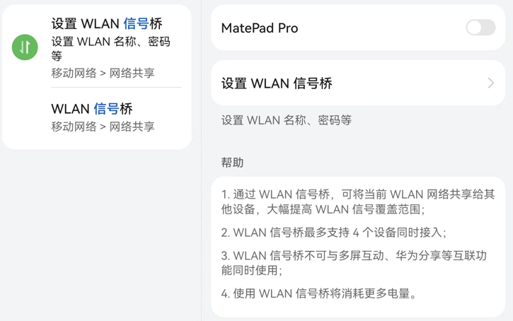

# WAP(无线接入点) & Router(路由器)

**路由器**是一种支持有线和无线连接的网络设备。作为一种智能设备，它能以最快和最有效的方式引导网络上的流量传入和传出，相当于一个转发器，它可将网络带宽信号通过天线转发给附近的无线网络设备

**路由器(Router)**
1. 数据路由：路由器的主要功能是连接不同的网络，并决定数据包从源头到目的地的路径。它在多个网络之间传递信息，比如连接家庭网络到互联网
2. 网络管理：路由器通常负责分配内部网络中的IP地址(通过DHCP)，管理网络流量，执行网络地址转换(NAT)等
3. 安全功能：许多路由器提供防火墙功能，可以保护内部网络免受外部威胁
4. 多种连接方式：路由器不仅支持有线连接(例如通过以太网端口)，也可能内置无线接入点功能，提供无线连接

**无线接入点**(即无线AP或WAP)相当于是连接有线网和无线网的桥梁，它可通过将流量从无线网桥接到有线网中，为现有的有线网增加无线功能。无线接入点可充当独立设备，也可作为路由器的组件使用

**无线接入点(Wireless Access Point, WAP)**
1. 提供无线网络覆盖：无线接入点的主要功能是提供无线网络连接。它允许Wi-Fi设备(如智能手机、笔记本电脑)连接到有线网络
2. 扩展无线覆盖范围：在大型建筑或需要覆盖更广区域的情况下，无线接入点可以用来扩展无线网络的覆盖范围
3. 简单的网络管理：虽然无线接入点可以进行一些基本的网络管理，但其功能远不及路由器全面
4. 通常不提供路由功能：无线接入点通常不涉及决定数据包的路由，它只是桥接无线设备和有线网络

# 裸金属服务器 - Bare Metal Server

裸金属服务器 是一种 物理服务器，通常提供给 **单一租户使用**

与虚拟化服务器环境不同，在虚拟化环境中，多个用户或客户可以共享同一台物理服务器的资源，通过 虚拟机VM 分割(每个虚拟机可以运行不同的操作系统和应用)

**优势**
1. **性能** - 没有任何虚拟化的开销，裸金属服务器可以提供更高的性能，用户可以直接访问物理服务器的所有资源，包括CPU、内存和存储
2. **安全** - 不与其他租户共享硬件，可以提供更高的安全性和隔离性
3. **定制** - 提供更高的可定制性，用户可以根据具体需求选择操作系统、硬件配置和软件堆栈
4. **预测** - 资源不被其他租户共享，裸金属服务器提供了更可预测的性能
5. **无嘈杂邻居效应**(虚拟化虽然承诺了资源配额，但当其它租户突发高负荷的时候，你的使用体验还是会受到影响)

**场景** - 常用于需要大量计算资源和高性能的应用场景和任何对性能要求极高的任务
1. 大数据分析
2. 核心数据库
3. 政企、金融、银行
4. 科学计算
5. 高性能计算
6. 游戏业务

裸金属服务器依然是租，云服务提供商 租 给你一个 **专属的物理服务器**(唯一的租户)

裸金属 意味 它不包括相应的操作系统和软件，是客户后期自选配置的
1. 提供 CPU 和 内存
2. 存储 采用 云盘，实现快速装机，镜像直接装机，便于 业务迁移 或 故障恢复

通常可以无缝对接和兼容云厂商提供的其它云服务 - 网络服务 & 云数据库服务 等

# 防火墙 Firewall

# 长城防火墙 Great Fire Wall(GFW)

[墙究竟在干什么，为什么你的梯子会没了？](https://www.youtube.com/watch?v=AIOMcbk-UL8)

长城防火墙主要指TG监控和过滤互联网内容的软硬件系统，由服务器和路由器等设备，加上相关的应用程序所构成

GFW的主要作用在于分析和过滤中国境内外网络的资讯互相访问

GFW对网络内容的过滤和分析是双向的，GFW不仅针对国内读者访问中国境外的网站进行干扰，也干扰国外读者访问主机在中国大陆的网站

工作原理
1. 关键字过滤 : 发现连接有敏感词，马上就会伪装成连接两方，向真正的对方发送 RST 数据包(RST标示复位、用来异常的关闭连接)
2. IP 封锁 : 直接封独立 IP ，这样可能因为某个敏感站点，导致跟他同一台主机的其他站点也无法访
3. DNS 污染、劫持 : 墙内DNS服务器维护黑名单。一旦发现有黑名单里的域名，它就会伪装成目标域名的解析服务器给查询者返回虚假结果
4. 特定端口封锁 : 对于一些特点的 IP ，GFW 会丢弃特定端口上的数据包，使得某些功能无法使用，比如 443端口SSL，22端口的SSH
5. 加密连接的干扰 : 在遇到 “黑名单” 加密连接时，它会发送RST数据包，干扰双方正常的 TCP 连接，进而切断加密连接的握手
6. 流量监控 : 监控跨境的互联网流量，以识别和阻止不符合规定的通信

打包后的请求可以被墙嗅探，可以解读包装好的请求，因此买了梯子也需要经常更换

被动嗅探+机器学习
1. 信息熵
2. 可打印字符
3. 握手次数

主动刺探
1. 重放攻击，将请求复制一份，再向目标IP发送。普通服务器的反应和梯子服务器的反应可能有所不同
2. 主动制造错误请求，试探服务器

# shadowsocks & Vmess

通过密码学的方式将真实请求加密

设置自己专用的协议，协议会将请求加密，使得请求看起来像是随机的字符串，信息熵很大，墙获取不到信息，不知道你的真实目的

但是墙也可以通过信息熵来判断你是否在翻墙

# Trojan

# CDN

用内容分发服务商的服务器搭梯子

wireguard VPN加密协议

# 调制解调器 Modem & 路由器 Router

# 集线器 Hub & 交换机 Switch & 路由器 Router

# WAN LAN 子网

# 公共和私有IP地址

# MAC地址

# 堡垒机

堡垒机(堡垒服务器，运维审计系统)，用于管理&控制敏感系统和服务器
1. 保护 敏感数据资源 & 网络资源
2. 免受 黑客、内部威胁、未经授权的访问

堡垒机 由 跳板机(前置机) 的概念演变而来

**主要功能** (4A)
1. 认证 authentication
2. 账号 account
3. 授权 authorization
4. 审计 audit 事间监察

事前授权、事间监察、事后审计

**工作原理**
1. 设立安全的中转服务器，实现对敏感系统的访问控制
2. 用户需要首先通过堡垒机进行身份认证，包括用户名、密码、双因素认证等方式
3. 通过认证后，用户可通过堡垒机访问授权目标服务器，堡垒机充当用户和目标服务器之间的中转角色
4. 堡垒机会监控用户的操作行为，防范恶意行为，并记录供审计使用，便于安全团队进行调查和追溯

**应用领域**
1. 企业内部安全 : 用于管理和控制内部员工对敏感系统和服务器的访问，防止内部人员账号滥用、权限滥用、数据泄漏
2. 云安全 : 用于管理云服务器的访问，提供额外的安全保护，确保云上的敏感数据

# 静电保护

[笔记本死机解决方案](https://www.dell.com/support/kbdoc/zh-cn/000147955/)

有静电太正常了，不光是笔记本，所有计算机有静电都开不了机

放掉静电才能开机也是计算机的保护机制，如果没有这种保护机制一旦造成静电放电，瞬间电压是可以打坏硬件的

释放静电就好
1. 关机
2. 拨掉电源和外接设备
3. 长按电源20s(放电过程)，建议重复操作一次，保证静电彻底释放
4. 静置一段时间
5. 插上电源，开机

还有个更方便的方法先把笔记本关机拔掉电源，然后在笔记本关机后接上电源适配器但不插电这时候笔记本背后的灯如果亮了一下，那么就说明静电释放了，然后再直接开机就算还有残余的静电，也会随着电源适配器导掉

