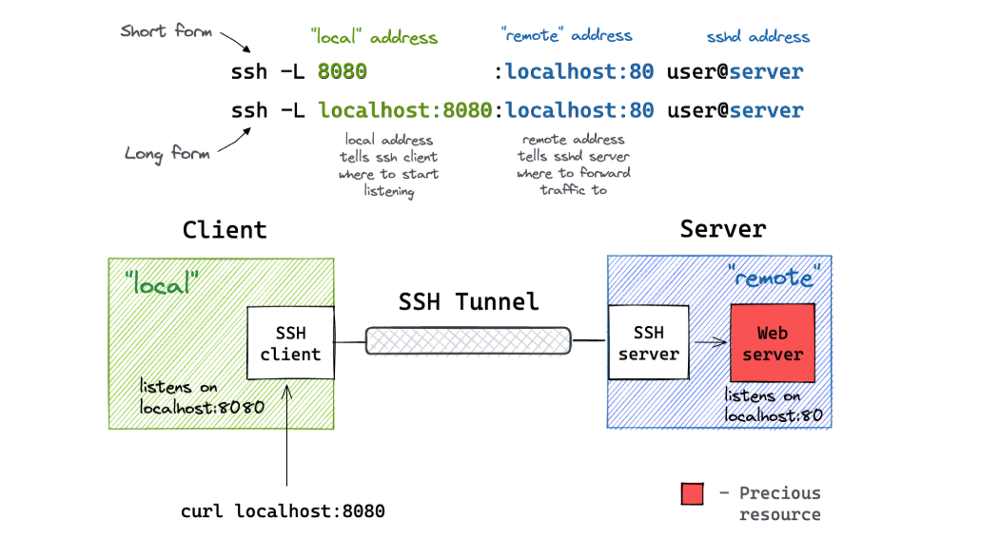
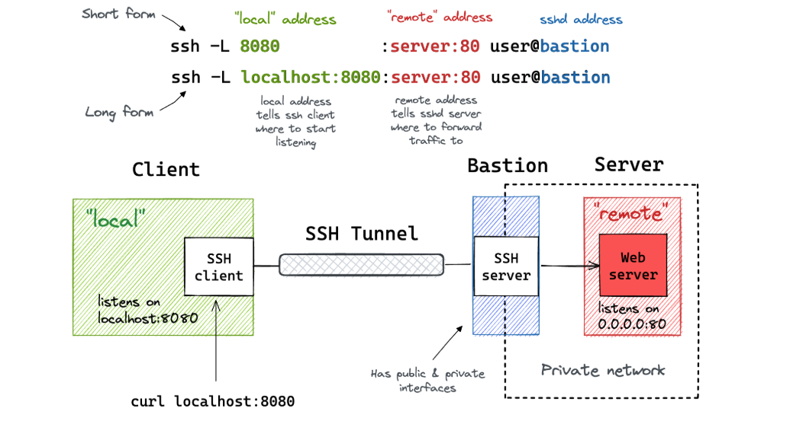
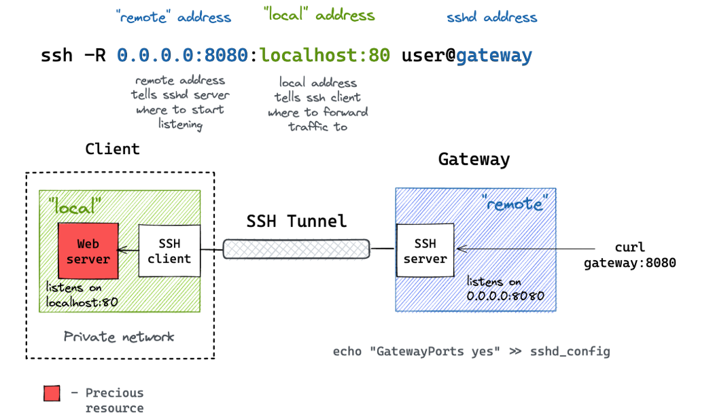

# SSH (Secure Shell)

---

## Table of Contents

- [SSH (Secure Shell)](#ssh-secure-shell)
  - [Table of Contents](#table-of-contents)
- [SSH Basic](#ssh-basic)
- [SSH 连接 \& 验证 \& 加密](#ssh-连接--验证--加密)
- [SSH 使用技巧](#ssh-使用技巧)
  - [SSH 客户端的用户级配置文件 `~/.ssh/config`](#ssh-客户端的用户级配置文件-sshconfig)
  - [SSH 端口转发(Tunneling)](#ssh-端口转发tunneling)
  - [SSH 保持连接不断开](#ssh-保持连接不断开)
    - [SSH 架构](#ssh-架构)
  - [SSH 客户端](#ssh-客户端)
    - [简介](#简介)
    - [基本用法](#基本用法)
    - [连接流程](#连接流程)
    - [服务器密钥变更](#服务器密钥变更)
    - [执行远程命令](#执行远程命令)


---

# SSH Basic

[SSH 教程 - 菜鸟教程](https://www.cainiaojc.com/ssh/ssh-index.html)


Intro
1. SSH - Secure Shell
2. **建立在 TCP 连接 之上的应用层协议**
3. 用于加密两台计算机之间的通信，保证 远程登录 & 远程通信的安全，任何网络服务都可以用这个协议来加密
4. 支持各种身份验证机制，能对 操作者 进行 认证(authentication) & 授权(authorization)

`ssh User@IP_ADDR [command]`
1. `IP_ADDR` 可以是 能被 DNS 解析的
2. 如果写 `command` 则会 被远程服务器执行，输出后断开连接
3. 第1次 链接 会 提示 & 询问，可以去 server 控制台确认
   1. `authenticity of host [IP_ADDR] can't be established.`
   2. `fingerprint is [hash].`
   3. `Are you sure you want to continue connecting (yes/no)?`
   4. **关键点** : 输入 `yes` 意味着你接受了 **TOFU (Trust On First Use)** 策略
      1. 提示 : `Permanently added '[IP_ADDR]' to the list of known hosts.`
      2. 相信此刻回应你的就是真正的目标机（而不是中间人）
      3. SSH 会把这个指纹永久写入 `~/.ssh/known_hosts`
      4. 以后再连接，如果指纹变了，SSH 就会立刻报警并断开连接


ssh 登录方式
1. 密码
2. 公钥/私钥


https://www.bilibili.com/video/BV1nk4y1k742/


---

# SSH 连接 & 验证 & 加密

双向验证
1. 服务器(目标机) 验证 是不是合法用户
2. 本机 验证 服务器(目标机) 是不是真的目标机，而不是中间人的伪造机

==建立安全信道 (Key Exchange) / 传输层握手 (Handshake)==
1. **目标** : 协商 **会话密钥 (Session Key)**  & 验证服务器身份
2. **算法** : **非对称算法** (不是加密)
3. **流程**
   1. **服务器认证 (本机 验 目标机)**
      1. 目标机发来公钥/指纹，本机检查 `~/.ssh/known_hosts`
      2. **TOFU (Trust On First Use 首次使用信任)** : 首次连接记录指纹，防止后续中间人篡改
         1. 巨大的风险点 : 第一次连接 (First Contact) : 第一次连接的时候，如果跳板机是坏人，会给自己的公钥，假装它是目标机
         2. SSH 在 第一次 防君子不防小人
   2. **密钥协商**
      1. 双方利用 **非对称算法** 算出完全一样的 **会话密钥**
      2. 最常用的算法是 **Diffie-Hellman (DH)** 密钥交换算法
         1. [DH 密钥交换算法 - 个人笔记](../Cryptology/crypto.md#diffie-hellman-dh-密钥交换算法)
4. **注意** : 此后所有通信都由该密钥进行 **对称加密** 保护
5. 服务器还不知道用户是谁

==用户认证 (User Auth)==
1. **目标** : **目标机 验证 用户** 是否有权限登录 (在 加密隧道 中进行)
2. **算法** : **挑战-应答 (Challenge-Response)**
3. **流程**
   1. **配置** : 目标机 持有公钥 (`~/.ssh/authorized_keys`)，本机持有私钥
      1. 该公钥 (authorized_keys) 由用户 上传到 目标服务器
   2. **挑战** : 目标机 生成 随机乱码，用 **公钥加密** 发给本机
   3. **应答** : 本机用 **私钥解密**，发回结果
   4. **验证** : 目标机核对结果，通过则允许登录
4. 传输层(外层) 使用 会话秘钥 **对称加密**
5. 认证逻辑(内核) 使用 本机 公钥/私钥 **非对称加密**

==数据传输 (Data Transmit)==
1. **目标** : 传输 Shell 命令、文件等，使用 **会话密钥 (Session Key)** 进行 **对称加密** 传输(非对称加密 太慢)
2. **算法** : **对称加密** (Symmetric Encryption)
3. **原因** : 非对称加密计算消耗大，对称加密速度快

---

# SSH 使用技巧


## SSH 客户端的用户级配置文件 `~/.ssh/config`

跳板机(Gateway / Bastion Host)
1. 入口服务器，通常暴露在 公网 / 公司大内网，可以直接连上
2. **所有数据通信** 都必须经过 跳板机，目标机 没有外网能力 / 被防火墙严密隔离
3. 跳板机 知道 目标机(Hostname 和 Port)，不知道 实际操作(内容是加密的)
4. 明文传输 (需要 DNS 解析)
   1. 目标地址 (HostName)
   2. 目标端口 (Port)
   3. 你的来源 IP
   4. 连接时间
5. 端到端加密
   1. SSH 的 ProxyJump 建立的是 端到端加密 (End-to-End Encryption) 隧道
   2. 无法 获取 : 密码/私钥，输入的命令，传输的文件，屏幕输出


目标机(Target)
1. 真正想去工作的机器

多个 目标机 可以使用 同一个 跳板机


```python
# ------ 公共跳板机 (大门) ------
Host jump-sh
    HostName jump.xxx.link
    User root
    Port 2222
    IdentityFile ~/.ssh/id_rsa

# ------ 目标机 1 (办公室 A) ------
Host my-gpu-01
    HostName 192.168.1.101      # 内网 IP 或 域名
    ProxyJump jump-sh           # <--- 指向同一个跳板机
    Port 22098
    User root
    ForwardAgent yes
    IdentityFile ~/.ssh/id_rsa

# ------ 目标机 2 (办公室 B) ------
Host my-gpu-02
    HostName bifrost-xxx-master-0.default.svc.cluster.local      # 另一个内网 IP 或 域名
    ProxyJump jump-sh           # <--- 指向同一个跳板机
    Port 22005
    User root
    ForwardAgent yes
    IdentityFile ~/.ssh/id_rsa_shared
```

参数
1. Host
   1. 给服务器起的 昵称 (可以改动)
2. HostName
   1. 服务器的 真实地址 (不可修改)
   2. 可能需要经常更新
   3. 任务重启，或者重新申请了一个新的开发环境，这个名字里的 时间戳 或 哈希值 通常会变
3. ProxyJump
   1. 告诉 SSH，不要直接连 HostName，先连上 ProxyJump 指定的那台机器，然后从那台机器转发
   2. 自动穿透内网
4. ForwardAgent yes
   1. 密钥转发
   2. 目标机器 只信任你的 本地电脑 的公钥，不信任 跳板机 的公钥
   3. 跳板机会像传声筒一样，把目标机的验证请求传回给你的本地电脑，不需要把私钥复制到跳板机上
5. Port
   1. 服务器 SSH 服务监听的端口，默认是 22
6. IdentityFile
   1. 电脑上 可能 同时存储 多个 私钥，用于指定 不同 使用场景
      1. eg : 使用从 其他电脑 复制的 私钥
   2. `IdentityFile ~/.ssh/id_rsa_shared` / `IdentityFile ~/.ssh/id_rsa`


## SSH 端口转发(Tunneling)


**本地转发** (Local Port Forwarding) `-L`
1. 本地端口，远程转发
2. 
3. 
4. 客户端用于访问服务，目标就是服务方
5. 命令 : `ssh -L [本地IP]:本地Port:目标IP:目标Port 跳板机User@跳板机Server`
   1. `目标IP` 如果是 host name 则是相对于 转发服务器的
6. 流程
   1. 访问 `[本地IP]:本地Port` 时，流量会钻进 SSH 隧道
   2. 流量从 跳板机 那头钻出来
   3. 跳板机 把流量 转发给 `目标IP:目标Port`


**远程转发** (Remote Port Forwarding) `-R`
1. 远程端口，本地转发
2. 
3. 
4. 目标外 有一个 跳板机，由 跳板机 发球请求 & 创建隧道，将 私网服务 暴露出来
5. 命令 : `ssh -R [远程IP]:远程Port:目标IP:目标Port User@Server`
   1. `User@Server` 是 转发服务器


**动态转发**


## SSH 保持连接不断开

要保持 SSH 连接不断开，可以使用 SSH 的 KeepAlive 机制

KeepAlive 机制可以在 SSH 连接保持空闲状态时发送保活消息，防止连接因为长时间没有活动而被服务器断开

2种方法
1. 命令行选项：使用 -o 选项设置 SSH KeepAlive 参数
   ```bash
   ssh -o ServerAliveInterval=60 user@host

   # 这将在 SSH 连接空闲 60 秒时发送保活消息
   ```
2. SSH 配置文件：在 ~/etc/ssh/ssh_config 文件中添加
   ```bash
   Host *  #这表示要让所有的ssh连接自动加上此属性，文件本身已经已经存在该字段
   ServerAliveInterval 60  # 该配置将对所有 SSH 主机生效，当 SSH 连接空闲 60 秒时发送保活消息
   ```


### SSH 架构

SSH 的软件架构是服务器-客户端模式（Server - Client）。在这个架构中，SSH 软件分成两个部分：向服务器发出请求的部分，称为客户端（client），OpenSSH 的实现为 ssh；接收客户端发出的请求的部分，称为服务器（server），OpenSSH 的实现为 sshd

```bash
lzy@legion:/etc/ssh$ ls
ssh_config  ssh_config.d
```

## SSH 客户端

### 简介

OpenSSH 的客户端是二进制程序 ssh。它在 Linux/Unix 系统的位置是 /usr/local/bin/ssh ，Windows 系统的位置是 \Program Files\OpenSSH\bin\ssh.exe

安装
```bash
sudo apt install openssh-client  # Ubuntu 和 Debian
sudo dnf install openssh-clients  # CentOS 和 Fedora

ssh -V  # 查看版本  # OpenSSH_8.9p1 Ubuntu-3ubuntu0.1, OpenSSL 3.0.2 15 Mar 2022
```

### 基本用法

ssh 最常见的用途就是登录服务器，这要求服务器安装并正在运行 SSH 服务器软件

```bash
# ssh 登录服务器的命令
ssh hostname
# hostname是主机名，它可以是域名，也可能是 IP 地址或局域网内部的主机名。不指定用户名的情况下，将使用客户端的当前用户名，作为远程服务器的登录用户名

# 如果要指定用户名，可以采用下面的语法，用户名和主机名写在一起了，之间使用@分隔
ssh user@hostname

# 用户名也可以使用ssh的-l参数指定，这样的话，用户名和主机名就不用写在一起了
ssh -l username host

# ssh 默认连接服务器的22端口，-p参数可以指定其他端口
ssh -p 8821 foo.com
```

### 连接流程

ssh 连接远程服务器后，首先有一个验证过程，验证远程服务器是否为陌生地址

如果是第一次连接某一台服务器，命令行会显示一段文字，表示不认识这台机器，提醒用户确认是否需要连接

```bash
lzy@legion:/etc/ssh$ ssh xxx@xx.xx.xx.xx
The authenticity of host 'xx.xx.xx.xx (xx.xx.xx.xx)' cant be established.
ED25519 key fingerprint is SHA256:Fb15i1NtPa+SG7fIKl3xG0+9gIEMn5TtN2vNLaKiSK4.
This key is not known by any other names
Are you sure you want to continue connecting (yes/no/[fingerprint])? yes

# 需要手动输入'yes'， 就可以将当前服务器的指纹也储存在本机~/.ssh/known_hosts文件中，并显示下面的提示。以后再连接的时候，就不会再出现警告了
Warning: Permanently added 'xx.xx.xx.xx' (ED25519) to the list of known hosts.
# 然后，客户端就会跟服务器建立连接。接着，ssh 就会要求用户输入所要登录账户的密码。用户输入并验证密码正确以后，就能登录远程服务器的 Shell 了。
```
上面这段文字告诉用户，这台服务器的指纹是陌生的，让用户选择是否要继续连接（输入 yes 或 no）

所谓“服务器指纹”，指的是 SSH 服务器公钥的哈希值。每台 SSH 服务器都有唯一一对密钥，用于跟客户端通信，其中公钥的哈希值就可以用来识别服务器

下面的命令可以查看某个公钥的指纹

```bash
ssh-keygen -l -f xxx.pub
```

ssh 会将本机连接过的所有服务器公钥的指纹，都储存在本机的~/.ssh/known_hosts文件中。每次连接服务器时，通过该文件判断是否为陌生主机（陌生公钥）


### 服务器密钥变更

服务器指纹可以防止有人恶意冒充远程主机。如果服务器的密钥发生变更（比如重装了 SSH 服务器），客户端再次连接时，就会发生公钥指纹不吻合的情况。这时，客户端就会中断连接，并显示一段警告信息

```bash
@@@@@@@@@@@@@@@@@@@@@@@@@@@@@@@@@@@@@@@@@@@@@@@@@@@@@@@@@@@
@    WARNING: REMOTE HOST IDENTIFICATION HAS CHANGED!     @
@@@@@@@@@@@@@@@@@@@@@@@@@@@@@@@@@@@@@@@@@@@@@@@@@@@@@@@@@@@
IT IS POSSIBLE THAT SOMEONE IS DOING SOMETHING NASTY!
Someone could be eavesdropping on you right now (man-in-the-middle attack)!
It is also possible that the RSA host key has just been changed.
The fingerprint for the RSA key sent by the remote host is
77:a5:69:81:9b:eb:40:76:7b:13:04:a9:6c:f4:9c:5d.
Please contact your system administrator.
Add correct host key in /home/me/.ssh/known_hosts to get rid of this message.
Offending key in /home/me/.ssh/known_hosts:36
```

文字的意思是，该主机的公钥指纹跟~/.ssh/known_hosts文件储存的不一样，必须处理以后才能连接。这时，你需要确认是什么原因，使得公钥指纹发生变更，到底是恶意劫持，还是管理员变更了 SSH 服务器公钥。

如果新的公钥确认可以信任，需要继续执行连接，你可以执行下面的命令，将原来的公钥指纹从~/.ssh/known_hosts文件删除。

删除 公钥的指纹
```bash
ssh-keygen -R hostname  # hostname是发生公钥变更的主机名，除了使用上面的命令，你也可以手工修改known_hosts文件，将公钥指纹删除
# 删除了原来的公钥指纹以后，重新执行 ssh 命令连接远程服务器，将新的指纹加入known_hosts文件，就可以顺利连接了

lzy@legion:/etc/ssh$ ssh-keygen -f "/home/lzy/.ssh/known_hosts" -R "xx.xx.xx.xx"

# Host 10.184.12.37 found: line 4
# Host 10.184.12.37 found: line 5
/home/lzy/.ssh/known_hosts updated.
Original contents retained as /home/lzy/.ssh/known_hosts.old
```

### 执行远程命令

SSH 登录成功后，用户就进入了远程主机的命令行环境，所看到的提示符，就是远程主机的提示符。这时，你就可以输入想要在远程主机执行的命令。


