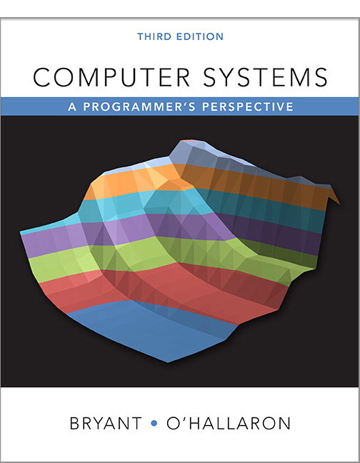

# CSAPP - 深入理解计算机系统

[CSAPP - 九曲阑干](https://space.bilibili.com/354767108/channel/collectiondetail?sid=373847)

[CSAPP - 在线阅读](https://hansimov.gitbook.io/csapp)

## Table of Contents

- [CSAPP - 深入理解计算机系统](#csapp---深入理解计算机系统)
  - [Table of Contents](#table-of-contents)
- [第0部分 - 计算机系统漫游](#第0部分---计算机系统漫游)
- [第1部分 - 程序结构和执行](#第1部分---程序结构和执行)
- [第2部分 - 在系统上运行程序](#第2部分---在系统上运行程序)
- [第3部分 - 程序间的交互和通信](#第3部分---程序间的交互和通信)

# 第0部分 - 计算机系统漫游

[编译器详解](../Compiler/Compiler&Interpreter.md#编译器compiler)

---

# 第1部分 - 程序结构和执行

---

# 第2部分 - 在系统上运行程序

---

# 第3部分 - 程序间的交互和通信

---
