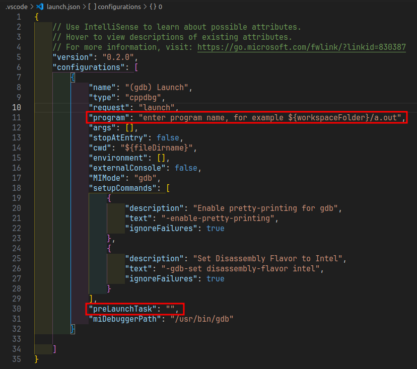

# CMake & VSCode for C++

## Table of Contents

- [CMake \& VSCode for C++](#cmake--vscode-for-c)
  - [Table of Contents](#table-of-contents)
- [基于VSCode和CMake实现C/C++开发 | Linux篇](#基于vscode和cmake实现cc开发--linux篇)
  - [01 - Linux系统介绍](#01---linux系统介绍)
  - [02 - 开发环境搭建](#02---开发环境搭建)
  - [03 - GCC 编译器](#03---gcc-编译器)
  - [04 - GDB 调试器](#04---gdb-调试器)
  - [05 - VSCode](#05---vscode)
  - [06 - CMake](#06---cmake)
    - [语法特性](#语法特性)
    - [重要指令](#重要指令)
    - [常用变量](#常用变量)
    - [编译工程](#编译工程)
  - [07 - 项目开发](#07---项目开发)
    - [配置 json文件 并 调试项目](#配置-json文件-并-调试项目)
      - [`launch.json`](#launchjson)
      - [`tasks.json`](#tasksjson)

---

# 基于VSCode和CMake实现C/C++开发 | Linux篇

[手把手教会VSCode的C++环境搭建，多文件编译，Cmake，json调试配置 | Windows篇](https://www.bilibili.com/video/BV13K411M78v/)

[基于VSCode和CMake实现C/C++开发 | Linux篇](https://www.bilibili.com/video/BV1fy4y1b7TC/)

## 01 - Linux系统介绍

Linux
1. 多用户 - 支持多个用户同时登录和操作(远程登录)
2. 多任务 - 每个用户可以运行多个程序
3. 一切皆文件

[linux-目录配置](../../../Linux/LinuxSystemic.md#linux-目录配置)

指令 - `命令 [选项] [操作对象]`

`pwd`   - print current working directory

`ls`    - list directory contents
1. `ls [Path]` eg : `./`, `../`, `/home`
2. `ls [Code]` eg : `-l` 列表形式, `-a` 显示所有(包括隐藏文件), `-h` 较高可读性

`cd`    - change directory - 相对路径、绝对路径

`mkdir` - make directory
1. `mkdir -p ~/a/b/c` 一次性创建多层
2. `mkdir -p a b c` 一次性创建多个

`touch` - 创建新文件

`rm` - remove
1. `rm -r` = `rm --recursive`
2. `rm -f` = `rm --force`


`cp [src] [dst]` - copy
1. `cp -r` = `cp --recursive`

`mv` - move/rename

`man` - 查看命令手册 - eg:`man ls`/`man cd`/`man man` - q 退出

## 02 - 开发环境搭建

```bash
sudo apt install build-essential gdb
sudo apt install cmake
```

```bash
lzy@legion:~ $ gcc --version
gcc (Ubuntu 11.4.0-1ubuntu1~22.04) 11.4.0
Copyright (C) 2021 Free Software Foundation, Inc.


lzy@legion:~ $ g++ --version
g++ (Ubuntu 11.4.0-1ubuntu1~22.04) 11.4.0
Copyright (C) 2021 Free Software Foundation, Inc.

lzy@legion:~ $ gdb --version
GNU gdb (Ubuntu 12.1-0ubuntu1~22.04) 12.1
Copyright (C) 2022 Free Software Foundation, Inc.
License GPLv3+: GNU GPL version 3 or later <http://gnu.org/licenses/gpl.html>

lzy@legion:~ $ cmake --version
cmake version 3.25.1
CMake suite maintained and supported by Kitware (kitware.com/cmake).

```


## 03 - GCC 编译器

gcc 编译器支持 go, objective-C, objective-C++, fortran 等

vscode 通过调用 gcc 编译器

实际
1. gcc 编译 C
2. g++ 编译 C++

[编译器详解](../../Compiler/Compiler&Interpreter.md#编译器compiler)

[生成动态库 & 静态库](../../Compiler/Compiler&Interpreter.md#生成库文件并编译)

## 04 - GDB 调试器

GNU Debugger，用来调试 `C/C++`

vscode 通过调用 GDB 调试器实现 `C/C++` 调试工作

编译程序是需要加上 `-g` 才能使用 gdb 调试

GDB主要功能
1. 设置**断点**(断点可以是条件表达式)
2. 使程序在指定的代码行上**暂停执行**，便于观察
3. **单步执行程序**，便于调试
4. 查看程序中**变量值的变化**
5. 动态改变程序的执行环境
6. 分析崩溃程序产生的core文件


调试命令参数，使用 `gdb [可执行文件名]` 进入 gdb 调试程序
1. `help + [命令]` - `h` - 查看帮助命令
2. `run` - `r` - 重新开始运行文件
3. `start` - 单步执行，运行程序，停在第一行执行语句
4. `list` - `l` - 查看源代码(默认显示上下5行)
5. `set` - 设置变量值
6. `next` - `n` - 单步调试(逐过程，不跳入函数)
7. `step` - `s` - 单步调试(逐语句，跳入函数)
8. `backtrace` - `bt` - 查看函数的调用的栈帧和层级关系
9. `frame` - `f` - 切换函数的栈帧
10. `info` - `i` - 查看函数内部局部变量数值
11. `finish` - 结束当前函数，返回函数调用点
12. `continue` - `c` - 继续运行
13. `print` - `p` - 打印值&地址
14. `quit` - `q` - 退出 GDB (exit 也可以)
15. `break+num` - `b` - 在第num行设置断点
16. `info breakpoints` - 查看设置的所有断点
17. `delete breakpoints num` - `d` - 删除第num个断点
18. `display` - 追踪查看具体变量值
19. `undisplay` - 取消追踪查看具体变量值
20. `watch` - 被设置观察点的变量发生改变时，打印显示
21. `i watch` - 显示观察点
22. `enable breakpoints` - 启用断点
23. `disable breakpoints` - 禁用断点
24. `x` - 查看内存，显示20个单元，16进制，4字节/单元
25. `run argv[1] argv[2]` - 调试时，命令行传参
26. `set follow-fork-mode child` - Makefile项目管理：选择跟踪父子进程

```cpp
#include <iostream>

using namespace std;

int main(int argc, char **argv)
{
    int N = 100;
    int sum = 0;
    int i = 1;

    while (i <= N)
    {
        sum = sum + i;
        i = i + 1;
    }

    cout << "sum = " << sum << endl;

    return 0;
}
```

包含了更多调试信息，所以 使用 `-g` 编译的可执行文件体积更大


```bash
g++ -g  sum.cpp -o sumWithGDB
g++     sum.cpp -o sumWithoutGDB

ls -l

total 60
-rw-rw-r-- 1 lzy lzy   258 Jun 20 17:19 sum.cpp
-rwxrwxr-x 1 lzy lzy 33464 Jun 20 17:36 sumWithGDB
-rwxrwxr-x 1 lzy lzy 16568 Jun 20 17:36 sumWithoutGDB
```

对于 没有 使用 `-g` 进行编译的可执行文件会提示 `no debugging symbols`，表明不能被 GDB 调试
```bash
gdb sumWithoutGDB

(No debugging symbols found in sumWithoutGDB)
```

```bash
run
break 11
continue
break 13
info breakpoints
delete breakpoints 1
run
print i, sum
continue
print i, sum
list
display sum
```

## 05 - VSCode

插件
1. C/C++
   1. 内置了基于 Clang 的 IntelliSense 支持
   2. 可能需要修改 `compiler path` 来解决报错
   3. 可以添加多个 `include path`
   4. 进入设置方式 - 点击报错小灯泡
2. CMake
3. CMake Tools

快捷键
1. **Ctrl+Shift+P** 命令面板 或者 **Ctrl+P**再输入`>`
2. **Ctrl+`** 打开终端
3. **F12** 转到定义
4. **F2** 变量统一重命名


```cpp
#pragma once
```


## 06 - CMake

CMake 是一个 跨平台的 安装编译工具

**without CMake**

不同平台使用不同的 构建文件


如果需要添加 cpp 文件，需要对各个 构建文件 进行修改


**with CMake**

写 CMakeLists


仅需修改 CMakeLists


### 语法特性

参数使用 `()` 包括，参数之间 使用 `空格`/`;` 间隔

指令 **大小写无关**，参数和变量 **大小写相关**

变量使用 `${}` 方法取值，在 `IF` 控制语句中 直接使用变量名

```cmake
set(HELLO hello.cpp)

add_executable(hello main.cpp hello.cpp)

ADD_EXECUTABLE(hello main.cpp ${HELLO})
```

### 重要指令

重要指令
1. **==cmake_minimum_required==** - 指定CMake的最小版本要求
   1. `cmake_minimum_required(VERSION versionNumber [FATAL_ERROR])`
   2. `cmake_minimum_required(VERSION 2.8.3)` - 指定 CMake最小版本要求为2.8.3

2. **==project==** - 定义工程名称，并可指定工程支持的语言
   1. `project(projectName [CXX] [C] [Java])`
   2. `project(HELLOWORLD)` - 指定工程名为HELLOWORLD

3. **==set==** - 显式的定义变量
   1. `set(VAR [VALUE] [CACHE TYPE DOCSTRING [FORCE]])`
   2. `set(SRC sayHello.cpp hello.cpp)` - 定义SRC变量，其值为main.cpp hello.cpp

4. **==include_directories==** - 向工程添加多个特定的**头文件**搜索路径
   1. `include_directories([AFTER|BEFORE] [SYSTEM] dir1 dir2 ...)`
   2. `include_directories(/usr/include/folder ./include)` - 添加到头文件搜索路径，相当于 g++ 的 `-I` 参数

5. **==link_directories==** - 向工程添加多个特定的**库文件**搜索路径，相当于 g++ 的 `-L` 参数
   1. `link_directories(dir1 dir2 ...)`

6. **==add_library==** - 生成库文件
   1. `add_library(libName [SHARED|STATIC|MODULE] [EXCLUDE_FROM_ALL] source1 source2 ...)`
   2. `add_library(hello SHARED ${SRC})` - 通过变量 SRC 生成 共享库

7. **==add_compile_options==** - 添加编译参数
   1. `add_compile_options(-Wall -std=c++11 -O2)`

8. **==add_executable==** - 生成可执行文件
   1. `add_library(executeFile source1 source2 ... sourceN)`
   2. `target_link_libraries(main hello)` - 编译 main.cpp 生成可执行文件 main

9. **==target_link_libraries==** - 为 target 添加需要链接的 库，相当于指定 g++ 编译器 `-l` 参数
    1. `target_link_libraries(target library1 library2)`
    2. `target_link_libraries(main hello)` - 将 hello 动态库文件链接到可执行文件main

10. **==add_subdirectory==** - 向当前工程添加存放源文件的子目录，并可以指定中间二进制和目标二进制存放的位置
    1. `add_subdirectory(source_dir [binary_dir] [EXCLUDE_FROM_ALL])`
    2. `add_subdirectory(src)` - src中需有一个CMakeLists.txt

11. **==aux_source_directory==** - 发现一个目录下所有的源代码文件并将列表存储在一个变量中，这个指令临时被用来自动构建源文件列表
    1. `aux_source_directory(dirPath VARIABLE)`
    2. `aux_source_directory(. SRC)  add_executable(main ${SRC})` - 定义SRC变量，其值为当前目录下所有的源代码文件，编译SRC变量所代表的源代码文件，生成main可执行文件

```cmake
add_executable(MyApp main.cpp)
add_library(MyStaticLib STATIC my_static_lib.cpp)
add_library(MySharedLib SHARED my_shared_lib.cpp)

target_link_libraries(MyApp MyStaticLib MySharedLib)
```

### 常用变量

常用变量
1. **==CMAKE_C_FLAGS==** - gcc 编译选项
2. **==CMAKE_CXX_FLAGS==** - g++ 编译选项
   1. `set( CMAKE_CXX_FLAGS "${CMAKE_CXX_FLAGS} -std=c++11")` - 在CMAKE_CXX_FLAGS编译选项后追加-std=c++11
3. **==CMAKE_BUILD_TYPE==** - 编译类型(Debug, Release)
   1. `set(CMAKE_BUILD_TYPE Debug)` - 调试时需要选择 debug
   2. `set(CMAKE_BUILD_TYPE Release)` - 发布时需要选择 release
4. **==CMAKE_BINARY_DIR==** | **==PROJECT_BINARY_DIR==** | **==ProjectName_BINARY_DIR==** - 三个变量指代的内容是一致的
   1. 如果是 in source build，指的就是工程顶层目录
   2. 如果是 out-of-source 编译，指的是工程编译发生的目录
5. **==CMAKE_SOURCE_DIR==** | **==PROJECT_SOURCE_DIR==** | **==ProjectName_SOURCE_DIR==** - 三个变量指代的内容是一致的
   1. 不论采用何种编译方式，都是工程顶层目录
   2. 在 in source build 时，他跟 CMAKE_BINARY_DIR 等变量一致
6. **==CMAKE_C_COMPILER==** - 指定C编译器
7. **==CMAKE_CXX_COMPILER==** - 指定C++编译器
8. **==EXECUTABLE_OUTPUT_PATH==** - 可执行文件输出的存放路径
9.  **==LIBRARY_OUTPUT_PATH==** - 库文件输出的存放路径

### 编译工程

CMake目录结构：项目主目录存在一个CMakeLists.txt文件

两种方式设置编译规则
1. 包含源文件的 子文件夹 包含 CMakeLists.txt 文件，主目录的 CMakeLists.txt 通过 add_subdirectory 添加 子目录
2. 包含源文件的 子文件夹 未包含 CMakeLists.txt 文件，子目录编译规则 体现在主目录的 CMakeLists.txt

步骤
1. 手动编写 `CMakeLists.txt`
2. 执行命令 `cmake PATH` 生成 `Makefile` (PATH 是顶层CMakeLists.txt 所在的目录)
3. 执行命令 `make` 进行编译

两种构建方式
1. 内部构建(in-source build) - 不推荐
   1. 会在同级目录下产生一大堆中间文件，这些中间文件并不是我们最终所需要的，和工程源文件放在一起会显得杂乱无章
   2. `cmake .`
   3. `make`
2. 外部构建(out-of-source build) - 推荐
   1. 将编译输出文件与源文件放到不同目录中，可执行文件生成在 build文件夹中
   2. `mkdir build`
   3. `cd build`
   4. `cmake ..`  编译上级目录的CMakeLists.txt，生成Makefile和其他文件
   5. `make`

在同一个 CMake 项目中构建的库，不需要显式地使用 link_directories() 来指定库目录


## 07 - 项目开发

```cmake
cmake_minimum_required(VERSION 3.0)

project(SoldierGun)

set (CMAKE_CXX_FLAGS "${CMAKE_CXX_FLAGS} -Wall")  # 追加编译选项

set (CMAKE_BUILD_TYPE Debug)

include_directories(${PROJECT_SOURCE_DIR}/include)

add_library(MyGun src/gun.cpp)

add_library(MySoldier src/soldier.cpp)

add_executable(main_cmake main.cpp)

target_link_libraries(main_cmake MyGun MySoldier)
```

### 配置 json文件 并 调试项目

两个 json
1. `launch.json`
2. `tasks.json`

#### `launch.json`

创建 `.vscode`

点击 调试 并生成 `launch.json`


选择 `C++ (GDB/LLDB)`


需要添加 Configuration，点击右下角 `Add Configuration` 选择添加的 Configuration


还需添加

```json
"preLaunchTask": "",
"miDebuggerPath": "/usr/bin/gdb"
```

点击后，效果如下



重要参数
1. `program` - 需要调试的 **可执行文件** 的绝对路径
   1. Full path to program executable.
   2. `${workspaceFolder}/build/[exeName]`
2. `preLaunchTask` - 调试 launch 前的任务
   1. Task to run before debug session starts.
   2. `C/C++: g++ build active file`


`F5` 进行调试

#### `tasks.json`


[taskss.json 模板](./Test/SoldierGun/.vscode/launch.json)

修改 源文件

`options` 的 `cwd` 相当于进入文件夹

`label` 表示 tasks 的 名字

`launch.json`  文件 中的 `preLaunchTask` 中的 名字 改为 `build` (目标 `task` 名词) 即可进行 **自动化调试**

不需要重新手动进行 cmake，直接进行调试，会自动进行编译


