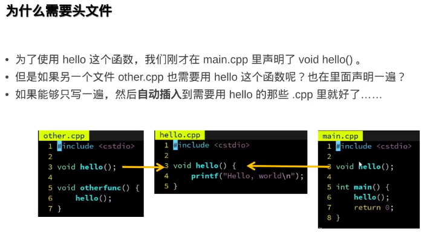

# CMake

## Table of Contents

- [CMake](#cmake)
  - [Table of Contents](#table-of-contents)
- [Portals](#portals)
  - [视频](#视频)
- [基于 VSCode 和 CMake 实现 C/C++ 开发](#基于-vscode-和-cmake-实现-cc-开发)
- [学C++从CMake学起 双笙子佯谬](#学c从cmake学起-双笙子佯谬)
- [现代CMake高级教程 双笙子佯谬](#现代cmake高级教程-双笙子佯谬)
- [CMake进阶之初识CMake - Blog](#cmake进阶之初识cmake---blog)
- [CMake进阶之CMake原理与关键概念](#cmake进阶之cmake原理与关键概念)
- [CMake简明教程以及现代CMake](#cmake简明教程以及现代cmake)
- [从零开始详细介绍CMake](#从零开始详细介绍cmake)
  - [说明](#说明)
  - [CMake的HelloWorld编译](#cmake的helloworld编译)
  - [CMakeLists语法介绍](#cmakelists语法介绍)
  - [CMake内部构建和外部构建](#cmake内部构建和外部构建)
    - [PROJECT关键字](#project关键字)
    - [SET关键字](#set关键字)
    - [MESSAGE关键字](#message关键字)
    - [ADD\_EXECUTABLE关键字](#add_executable关键字)
    - [ADD\_SUBDIRECTORY](#add_subdirectory)
  - [语法基本规则](#语法基本规则)
    - [语法注意事项](#语法注意事项)
  - [CMake内部构建和外部构建](#cmake内部构建和外部构建-1)
  - [让HelloWorld更像一个工程](#让helloworld更像一个工程)
- [Conan Center](#conan-center)


# Portals

## 视频


[现代CMake模块化项目管理指南 双笙子佯谬](https://www.bilibili.com/video/BV1V84y117YU/)


# 基于 VSCode 和 CMake 实现 C/C++ 开发

[基于 VSCode 和 CMake 实现 C/C++ 开发 | Linux](https://www.bilibili.com/video/BV1fy4y1b7TC)

[基于 VSCode 和 CMake 实现 C/C++ 开发 | Windows](https://www.bilibili.com/video/BV13K411M78v)


[个人笔记](./cmake&vscode.md)


# 学C++从CMake学起 双笙子佯谬

[学C++从CMake学起 双笙子佯谬](https://www.bilibili.com/video/BV1fa411r7zp/)

**01**


GNU

LLVM

MSVC

```cpp
// 01
// main.cpp
#include <iostream>
using namespace std;
int main()
{
    cout<<"HelloWorld"<<endl;
    return 0;
}

// g++ main.cpp -o hello.out
// ./hello.out
```

**02**
```cpp
// 02
// hello.cpp
#include <iostream>
using namespace std;
void hello()
{
    cout<<"hello hello"<<endl;
    return;
}

// main.cpp
#include "hello.cpp"
int main()
{
    hello();
    return 0;
}

// g++ main.cpp -o main.out  // 不需要再链接 hello.cpp 否则提示重定义
// ./main.out
```


```cpp
// 02
// hello.cpp
#include <iostream>
using namespace std;
void hello()
{
    cout<<"hello hello"<<endl;
    return;
}

// main.cpp
#include <iostream>
using namespace std;
void hello();
int main()
{
    hello();
    return 0;
}

// -c 表示暂时编译，不是可执行文件。这样可以分离编译
// g++ -c hello.cpp -o hello.o
// g++ -c main.cpp -o main.o
// g++  main.o hello.o -o main.out
// ./main.out

// 也可以
// ./maincpp.out
```

**03 Makefile**


```cpp
// 03
// hello.cpp
#include <iostream>
using namespace std;
void hello()
{
    cout<<"hello hello"<<endl;
    return;
}

// main.cpp
#include <iostream>
using namespace std;
void hello();
int main()
{
    hello();
    return 0;
}

// Makefile 反映了相互依赖关系，且如果只是改动了一个文件，其他文件不会重新编译
hello.out: hello.o main.o
	g++ hello.o main.o -o hello.out
hello.o  : hello.cpp
	g++ -c hello.cpp -o hello.o
main.o   : main.cpp
	g++ -c main.cpp -o main.o

// make
// ./main.out
```


**04 CMake**


```cpp
// 04
// main.cpp 和原来一样

// hello.cpp 和原来一样

// CMakeLists.txt
cmake_minimum_required(VERSION 3.12)
project(hellocmake LANGUAGES CXX)
add_executable(main.out main.cpp hello.cpp)

// cmake -B build  // 输出 make 文件的目录
// cd build
// make  // ./build 中有 Makefile
// ./main.out
```

**05 动态库&静态库**


lib 静态库 .a 类似于 .o 编译后，删了 .o main.out 仍能使用
dll 动态库 .so 节省空间和内存 编译后，删了 .o main.out 不能使用

引用 dll 也需要有一个配套的 lib， lib 里存放有用的**插桩**函数


```cpp
// 05
// main.cpp 和原来一样

// hello.cpp 和原来一样

// CMakeLists.txt
cmake_minimum_required(VERSION 3.12)
project(hellocmake LANGUAGES CXX)

add_library(helloA STATIC hello.cpp)  # 静态库 .a
add_library(helloSO SHARED hello.cpp)  # 动态库 .so

add_executable(main.out main.cpp)
target_link_libraries(main.out PUBLIC helloA)  # 用 .so 也行

// cmake -B build  // 输出 make 文件的目录
// cd build
// make  // ./build 中有 Makefile
// ./main.out
// ldd main.out 可以查看链接信息
```

**06 声明**


**07 头文件**




hello.cpp 最好也写上 #include <hello.h>


**08 子模块**


下面这样写需要对 main.cpp 中 include 的头文件进行改写

```cpp
// 06
// main.cpp
#include "lib/hello.h"
#include <iostream>
using namespace std;
int main()
{
    hello();
    return 0;
}
// CMakeLists.txt
cmake_minimum_required(VERSION 3.22)
project(hellosub LANGUAGES CXX)
add_subdirectory(lib)
add_executable(main.out main.cpp)
target_link_libraries(main.out PUBLIC hellolibSO)

// lib/hello.h
#pragma once
void hello();
// lib/hello.cpp
#include "hello.h"
#include <iostream>
using namespace std;
void hello()
{
    cout << "hello cmake sub" << endl;
}
// lib/CMakeLists.txt
add_library(hellolibSO SHARED hello.cpp)

// cmake -B build  // 输出 make 文件的目录
// cd build
// make  // ./build 中有 Makefile
// ./main.out
// ldd main.out 可以查看链接信息
```


这样在 main 中可以使用尖括号，但是在 CMakeLists.txt 中会有重复

```cpp
// 07
// main.cpp
#include <hello.h>
#include <iostream>
using namespace std;
int main()
{
    hello();
    return 0;
}
// CMakeLists.txt
cmake_minimum_required(VERSION 3.22)
project(hellosub LANGUAGES CXX)
add_subdirectory(lib)
add_executable(main.out main.cpp)
target_link_libraries(main.out PUBLIC hellolibSO)
target_include_directories(main.out PUBLIC lib)

// lib/hello.h
#pragma once
void hello();
// lib/hello.cpp
#include "hello.h"
#include <iostream>
using namespace std;
void hello()
{
    cout << "hello cmake sub" << endl;
}
// lib/CMakeLists.txt
add_library(hellolibSO SHARED hello.cpp)

// cmake -B build  // 输出 make 文件的目录
// cd build
// make  // ./build 中有 Makefile
// ./main.out
// ldd main.out 可以查看链接信息
```


```cpp
// 08
// main.cpp
#include <hello.h>
#include <iostream>
using namespace std;
int main()
{
    hello();
    return 0;
}
// CMakeLists.txt
cmake_minimum_required(VERSION 3.22)
project(hellosub LANGUAGES CXX)
add_subdirectory(lib)
add_executable(main.out main.cpp)
target_link_libraries(main.out PUBLIC hellolibSO)

// lib/hello.h
#pragma once
void hello();
// lib/hello.cpp
#include "hello.h"
#include <iostream>
using namespace std;
void hello()
{
    cout << "hello cmake sub" << endl;
}
// lib/CMakeLists.txt
add_library(hellolibSO SHARED hello.cpp)
target_include_directories(hellolibSO PUBLIC .)

// cmake -B build  // 输出 make 文件的目录
// cd build
// make  // ./build 中有 Makefile
// ./main.out
// ldd main.out 可以查看链接信息
```


**09 第三方库**


**感谢小彭老师**


---

# 现代CMake高级教程 双笙子佯谬

[现代CMake高级教程 双笙子佯谬](https://www.bilibili.com/video/BV16P4y1g7MH/)


cmake -B build 会自动创建 build 目录以及 Makefile等
cmake --build build --parallel 4 会自动调用 build 中的 make


---

# CMake进阶之初识CMake - Blog

[CMake进阶之初识CMake](https://blog.csdn.net/ztemt_sw2/article/details/81355096)

**CMake的历史**

CMake最初是ITK项目的一部分，ITK项目始于1999年，由美国麦迪逊国家实验室赞助。ITK项目规模比较庞大，并且需要在多个平台上运行，同时还依赖于其他一些软件库。为了满足软件的构建需求，需要一个功能足够强大同时又简单易用的构建工具，于是ITK项目的开发者设计出了CMake来满足需求。


**跨平台：一份make可以支持多个平台。**

让make的编写对特定的平台透明：开发者只需要按照CMake的语法写make，不需要考虑具体平台，最终由CMake为我们生成原生的构建工具（比如Windows上的visual studio，Mac上的XCode，unix/linux的make）所需要的构建文件。

---

# CMake进阶之CMake原理与关键概念

[CMake进阶之CMake原理与关键概念](https://blog.csdn.net/ztemt_sw2/article/details/81384538)


---

# CMake简明教程以及现代CMake

[CMake简明教程以及现代CMake](https://www.bilibili.com/video/BV1A7411f7jT)

```cmake

cmake_minimum_required(VERSION xxx)

project(project_name)

include(xxxx.cmake)  # 添加配置文件

add_subdirectory(xxx)  # 添加子文件夹，这个子文件夹中也需要拥有CMakeLists.txt文件
```

一个project可以有多个target，每个target对应一个源文件或cpp

现代cmake不建议在add_executable、add_library直接添加源文件

```cmake
target_sources(
PRIVATE
    ${CMAKE_CURRENT_SOURCE_DIR}
)
```

```cmake
target_include_directories(
INTERFACE
    ${CMAKE_CURRENT_SOURCE_DIR}
)
```

```cmake
target_link_libraries()
```

**REMIAN没看完**

---

# 从零开始详细介绍CMake

[从零开始详细介绍CMake](https://www.bilibili.com/video/BV1vR4y1u77h)

## 说明

通过编译CMakeLists.txt

当多个人使用多种或单个语言或者编译器开发一个项目，最终要输出一个可执行文件或者共享库（dll、so等）

## CMake的HelloWorld编译

1. 写程序
2. 写CMakeLists.txt
3. cmake .
4. make

## CMakeLists语法介绍


## CMake内部构建和外部构建

### PROJECT关键字

用于制定工程的名字和支持的语言，默认支持所有语言

PROJECT(HELLO)          指定工程名字，支持所有语言

PROJECT(HELLO CXX)      指定工程名字，支持C++

PROJECT(HELLO CXX C)    指定工程名字，支持C和C++

指定隐含两个CMake变量

\<projectname\>_BINARY_DIR

\<projectname\>_SOURCE_DIR

MESSAGE关键字可以直接使用两个变量，当前都指向当前的工作目录

可以使用两个预定义的变量：PROJECT_BINARY_DIR 和 PROJECT_SOURCE_DIR

### SET关键字

用来显示指定变量

可以SET(SRC_LIST a.cpp b.cpp c.cpp)

SRC_LIST就包含了这些cpp文件

### MESSAGE关键字

向终端输出用户自定义信息

主要有三种
1. SEND_ERROR   产生错误，生产过程被跳过
2. STATUS       输出前缀为--（杠）的信息
3. FATAL_ERROR  立即终止所有CMake过程

### ADD_EXECUTABLE关键字

生成可执行文件

ADD_EXECUTABLE(helloworld_cmake_cpp ${SRC_LIST})

生成的可执行文件名helloworld_cmake_cpp

源文件读取变量SRC_LIST的内容

工程名和生成的可执行文件名没有关系

### ADD_SUBDIRECTORY

ADD_SUBDIRECTORY(sourec_dir [binary_dir] [EXCLUDE_FROM_ALL])

用于向当前工程添加存放源文件的子目录，并可以指定中间二进制和目标二进制存放的位置

EXCLUDE_FROM_ALL函数将写的目录从编译中排除


## 语法基本规则

变量使用$()方式读取，但在IF控制语句中是直接使用变量名

参数使用()方式实现，参数之间使用空格或者分号隔开

指令大小写无关，参数和变量是大小写相关的，推荐全部使用大写指令


### 语法注意事项

指令的参数（文件名）可以不使用双引号进行括起，但如果文件名中含有空格，就必须加上双引号

## CMake内部构建和外部构建

内部构建产生的临时文件多，不方便清理

外部构建，会将生产的临时文件放在build目录下，不会对源文件有任何影响

推荐使用外部构建方式

创建一个build文件夹，cd到其中，cmake ..

也可以不使用..而是使用CMakeLists.txt的绝对路径

两个变量
1. PROJECT_SOURCE_DIR：还是工程路径
2. PROJECT_BINARY_DIR：编译路径 build

## 让HelloWorld更像一个工程

为工程添加一个子目录src，用来放置工程源代码（也需要CMakeLists.txt文件），build文件夹不需要，但是要cd到build中进行cmake ..以及make

在工程目录文件夹添加文本文件COPYRIGHT，README

在工程目录添加一个脚本，用来调用二进制

将构建后的目标文件放入构建目录的bin子目录

在工程目录中的CMakeLists.txt写入ADD_SUBDIRECTORY(src bin)，在src的CMakeLists.txt中写入生成可执行文件的语句

在那里进行cmake的二进制bin目录就在哪里


# Conan Center


