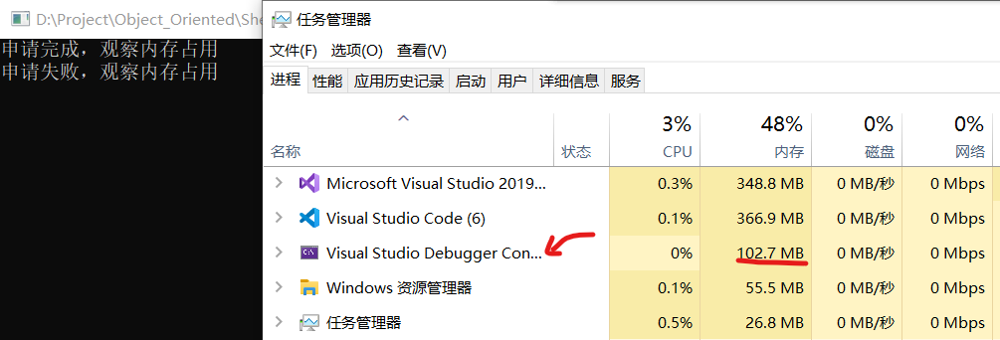

# 动态内存申请

## 一、复习：结构体类型的定义及使用

1. 结构体类型的声明
2. 字节对齐
3. 结构体变量的定义和初始化
4. 指向结构体变量的指针和指向结构体变量中某个成员的指针
5. 结构体(struct)和类(class)的区别


## 二、指向结构体变量的指针与链表

### 2.1 链式结构的基本概念

①数组的不足

1. 大小必须在定义时确定，导致空间浪费
   
    是否可以按需分配空间

2. 占用连续空间，导致小空间无法充分利用

    是否可以充分利用不连续的空间

3. 在插入/删除时必须前后移动元素

    插入/删除时是能否不移动元素

②链表

&emsp;&emsp;**不连续存放数据，用指针指向下一数据的存放地址**

&emsp;&emsp;**注意：的确会由于增加了指针域导致存储相同内容要占用更多空间（对于32位系统是多4个字节用于存储指针变量），但是这并不是链表的缺点。对于一个大型的结构体或者类，这一点空间微不足道，会比用数组省去更多空间。**


结点：存放数据的基本单位

1. 数据域：存放数据的值

2. 指针域：存放下一个同类型节点的地址

链表：由若干结点构成的链式结构

表头结点：第一个结点

表尾结点：链表的最后一个结点，指针域为NULL（空）

头指针：指向链表的表头结点的指针

**另外，结构体中的成员不允许是自身的结构体类型，但可以是指针，因为指针的占用空间已知**

### 2.2 链表与数组的比较

| 数 组 | 链 表 |
|----|------|
| 大小在声明时固定 | 大小不固定 |
|处理的数据个数有差异时，须按最大值声明|可以根据需要随时增减结点|
|内存地址连续，可直接计算得到某个元素的地址|内存地址不连续，须依次查找|
|逻辑上连续，物理上连续|逻辑上连续，物理上不连续|
|**顺序存储 随机存取**|**随机存取 顺序存储**|


## 三、内存的动态申请与释放

### 3.1 C中的相关函数

①void* malloc(unsigned size);

1. 申请size字节的**连续**内存空间，返回该空间**首地址**，对申请到的空间**不做初始化**

2. **如果申请不到，返回NULL**

3. 注意返回类型是**void\*** ，一般需要配合**强制类型转换**

②void* calloc(unsigned n,unsigned size);

1. 申请n*size字节的**连续**内存空间，返回该空间**首地址**，对申请到的空间**初始化为0(\0)**

2. 如果申请不到空间，返回NULL

③void* realloc(void* ptr,unsigned newsize);

1. 

④void free(void *p);

1. 释放p所指向的内存空间,**p必须是malloc、calloc、realloc返回的首地址**

<br>

因为是系统库函数，需要包含头文件
```cpp
#include <stdlib.h> //c方式
#include <cstdlib>  //c++方式
```

### 3.2 C++中的相关运算符

①用new运算符申请空间

1. 如果申请不到空间，new会抛出bad_alloc异常，需要用try-catch方式处理异常
2. 也可以在new时加(nothrow)来强制禁用抛出异常值，并返回NULL
   ```cpp
   int *p=new(nothrow) int[10];
   ```
3. try-throw-catch称为c++的异常处理机制
4. 为什么不像C方式一样如果申请失败返回NULL？ 因为C++中有类，类的构造函数没有任何返回值（不是void）。因此在类的构造函数中，如果有动态内存申请，并且申请失败，将无从检查

②用delete运算符释放空间

③注意：对于C++，**new**和**delete**都是**运算符**，故不需要添加其他的头文件

④**用malloc/calloc等申请的空间用free释放，用new申请的空间用delete释放，不要混用**

&emsp;&emsp;不要为了realloc的便捷性而将C++的动态内存申请降级为C函数方式。

⑤**不能重复释放**

⑥**记得申请完检查申请成功/失败，否则VS会有warning**

```cpp
#include <iostream>
#include <cstdlib>

using namespace std;

int main()
{
	int* pc = (int*)malloc(sizeof(int));
	*pc = 0;

	int* pcpp = new int;
	*pcpp = 0;

	return 0;
}
```
上述代码会被IntelliSense认为有问题：


### 3.3 C/C++语法

1. 申请普通变量

    ①C的函数方式

   1. 先定义指针变量再申请
        ```c
        int *p;
        p=(int*)malloc(sizeof(int));
        p=(int*)calloc(1,sizeof(int));
        p=(int*)realloc(NULL,sizeof(int));//一般不用
        ```
   2. 定义指针变量的同时申请
       ```c
       int *p=(int*)malloc(sizeof(int));
       int *p=(int*)calloc(sizeof(int));
       ```

    ②C++的运算符

   3. 先定义指针变量再申请
       ```cpp
       int *p;
       p=new int;
       ```
   4. 定义指针变量的同时申请
       ```cpp
       int *p=new int;
       ```
   5. 申请空间时赋初值
       ```cpp
       int *p=new int(10);
          ```

2. 申请一维数组

    ①C的函数方式

   1. 先定义指针变量再申请
      ```c
      int *p;
      p=(int*)malloc(10 * sizeof(int));
      p=(int*)calloc(10 , sizeof(int));
      ```
   2. 定义指针变量的同时申请
       ```c
       char *name=(char*)malloc(10 * sizeof(char));
       char *name=(char*)calloc(10 , sizeof(char));
       char *name=(char*)realloc(NULL,10 * sizeof(char));//一般不用
       ```

    ②C++的运算符

   3. 先定义指针变量再申请
       ```cpp
       int *p;
       p=new int[10];//申请10个int型空间
       ```
   4. 定义指针变量的同时申请
       ```cpp
       char *name=new char[10];//申请10个char
       ```
   5. 申请空间时赋初值
       
       动态内存申请的一维数组可以再申请时赋初值，方法为后面跟{}
       注意：**{}前不要加=，而且[]内必须有数**，其余规则同一维数组定义时初始化
       ```cpp
       int *p；
       p=new int[5] {1,2,3,4,5};  //correct
       p=new int[5] {1,2,3,4,5,6};//wrong
       p=new int[5] {1,2,};       //correct，后面自动为0
       p=new int[5]={1,2,3,4,5};  //wrong，不要加等号
       p=new int[] {1,2,3,4,5};   //wrong，[]内必须有数字

       char *s;
       s=new char[5] {'h','e','l','l','o'};//correct
       s=new char[5] {"hello"};//wrong，没有给尾零留位置
       s=new char[6] {"hello"};//correct
       ```

3. 申请二维数组

    ①C的函数方式

   1. 先定义指针变量再申请（注意括号，**左右两侧**）
      ```c
      int (*p)[4];//指向一维数组的指针，高维数组以此类推
      p=(int (*)[4])malloc(3 * 4 * sizeof(int));
      p=(int (*)[4])calloc(3 * 4 , sizeof(int));
      p=(int (*)[4])relloc(NULL,3 * 4 * sizeof(int));//一般不用
      ```
   2. 定义指针变量的同时申请
       ```c
       int (*p)[4]=(int (*)[4])malloc(3 * 4*sizeof(int));
       int (*p)[4]=(int (*)[4])calloc(3 * 4,sizeof(int));
       ```

    ②C++的运算符

   3. 先定义指针变量再申请
       ```cpp
       int *p;//wrong
       p=new int[3][4];//wrong
       int *p[4];
       p=new int[3][4];//correct   
       ```
   4. 定义指针变量的同时申请
       ```cpp
       float (*f)[4]=new float[3][4];
       ```
   5. 申请空间时赋初值
      
      动态内存申请的二维数组可以在申请时赋初值，方法为后面跟**双层{}**，{}前不要加=，且[]内必须有数，其余规则同二维数组定义时初始化
       ```cpp
       int (*p)[3];
       p=new int[2][3] {1,2,3,4,5,6};    //wrong，要两层{}
       p=new int[2][3] {{1,2,3},{4,5,6}};//correct
       p=new int[2][3] {{1,2},{3,4,5,6}};//wrong，第二个数组过大
       p=new int[2][3] {1,4};            //wrong，要两层{}
       p=new int[2][3] {{1},{4}};        //correct

       char (*p)[6];
       p=new char[2][6] {'A','B','C'};     //wrong，要两层{}
       p=new char[2][6] {{'A'},{'B','C'}}; //correct
       p=new char[2][6] {"hello","china"}; //correct
       p=new char[2][6] {"hello1","china"};//wrong，第一个字符串过长
       ```
       注意：字符型再使用字符串方式时，少一层{}，双引号相当于一层

4. 释放普通变量

    ①C的函数方式

    ```c
    free(p);
    ```

    ②C++的运算符

    ```cpp
    delete p;
    ```

5. 释放一维数组

    ①C的函数方式

    ```c
    free(p);
    ```

    ②C++的运算符

    ```cpp
    delete []p;
    ```
    某些资料上说可以不用[]，因为一维数组地址可以理解为首元素地址（这种说法实际并不严谨，必须加）

    ```cpp
    int *p = new int[4];
    delete p;
    ```

    

    对于int/char等基本类型的数组，加不加均正确；但对于用户自定义的class，必须加

    ```cpp
    #include <iostream>
    #include <cstdlib>

    using namespace std;

    class T
    {
    private:
        int t;
    public:
        T(int x);
        ~T();
    };
    T::T(int x) : t(x)
    {
        cout << "Time Begin" << t << endl;
    }
    T::~T()
    {
        cout << "Time End" << t << endl;
    }

    int main()
    {
        T* tt = new T[5]{ 1,2,3,4,5 };

        delete tt;//使用构造和析构

        return 0;
    }
    ```
    运行报错，并且有弹窗，此外从结果看，析构函数没有被正确执行

    


6. 释放二维数组

    ①C的函数方式

    ```c
    free(p);
    ```

    ②C++的运算符

    ```cpp
    delete []p;
    ```

    二维及以上必须加上一个[]，否则编译警告


7. C 可通过强制类型转换将void型指针转为其他类型

8. C++ 申请时自动确定类型

9. 静态数据区、动态数据区、动态内存分配区（堆空间）的地址各不相同

    ```cpp
    #include <iostream>
    #include <cstdlib>

    using namespace std;

    int a;

    int main()
    {
        int b;
        int* c;
        c = (int*)malloc(sizeof(int));
        if (c == NULL)
        {
            cout << "Application Failure" << endl;
            return -1;
        }
        cout << &a << endl;//a:静态数据区
        cout << &b << endl;//b:动态数据区
        cout << &c << " " << c << endl;
        //&c:动态数据区(&c是c的地址和&b类似)
        //c:堆空间(c本身是申请空间的地址)

        return 0;
    }
    ```
    结果图：

    

10. Windows任务管理器观察“动态申请与释放”
    ```cpp
    #include <iostream>
    #include <cstdlib>
    #include <conio.h>

    using namespace std;

    int main()
    {
        char* p;
        p = (char*)malloc(100 * 1024 * 1024 * sizeof(char));//100MB

        if (p == NULL)
        {
            cout << "Application Failure" << endl;
            return -1;
        }

        cout << "申请完成，请在任务管理器中观察内存占用" << endl;
        int temp_a = _getche();//暂停
        cout << (int)temp_a << endl;

        free(p);
        cout << "释放完成，请在任务管理器中观察内存占用" << endl;
        int temp_b = _getche();//暂停
        cout << (int)temp_b << endl;

        return 0;
    }
    ```
    附两张结果图

    申请后：

    

    释放后：(图中32是我输入的空格的ascii码)

    

11. C/C++申请返回的指针可以进行指针运算，但释放时必须给出申请时返回的首地址，否则释放会出错

12. 动态内存的申请若不释放，会造成**内存泄露**，**不会**产生**即时错误**，但是最终会耗尽内存
    
    1. C方式

        ```c
        int main()
        {
            char* p;
            int num = 0;
            while (1)
            {
                //每次申请1MB
                p = (char*)malloc(1024 * 1024 * sizeof(char));
                if (p == NULL)
                    break;
                num++;
            }
            //申请后不释放，且p不再指向原来神奇的位置，内存泄漏
            cout << "一共申请了： ";
            cout << num << "MB" << endl;
            int temp=_getch();

            return 0;
        }
        ```

        

    1. C++方式

        ```cpp
        int main()
        {
            char* p;
            int num = 0;
            while (1)
            {
                //每次申请1MB
                p = new(nothrow) char[1024 * 1024];//注意这里的nothrow
                if (p == NULL)
                    break;
                num++;
            }
            //申请后不释放，且p不再指向原来神奇的位置，内存泄漏
            cout << "一共申请了： ";
            cout << num << "MB" << endl;
            int temp=_getch();

            return 0;
        }
        ```

        

13. 对于try-catch的详细说明

    在新版C++标准中，new申请失败会抛出异常bad_alloc，需要使用try-catch来处理异常

    ①方法1（循环在try中）
    ```cpp
    int main()
    {
        char* p;
        int count = 0;
        try 
        {
            while (1)
            {
                p = new char[1024 * 1024];
                count++;
            }
        }
        catch (const bad_alloc& mem_fail)
        {
            cout << mem_fail.what() << endl;//打印原因
        }
        cout << count << "MB" << endl;
        return 0;
    }
    ```
    
    

    ②方法2（try在循环中）

    ```cpp
    int main()
    {
        char* p;
        int count = 0;
        while (1)
        {
            try
            {
                p = new char[1024 * 1024];
            }
            catch (const bad_alloc& mem_fail)
            {
                cout << mem_fail.what() << endl;
                break;
            }
            count++;
        }
        cout << count << "MB" << endl;
        return 0;
    }
    ```
    

14. 虽然申请的空间会在程序运行结束后，由操作系统进行回收，但这并不代表不需要手动释放空间。因为有的程序会持续运行，不会关闭；有的操作系统不会自动回收空间。
    
15. C申请空间时，只算总大小（简单变量、数组没有分别）。而C++对不同情况申请方法不同。
    
16. 用一个指针记住申请的首地址，方便释放
    
17. C/C++如果出现需要嵌套进行动态申请的情况，需要按从外到内的顺序进行申请，反序进行释放
    ```cpp
    #define _CRT_SECURE_NO_WARNINGS
    #include <iostream>
    #include <cstring>

    using namespace std;

    struct stu
    {
        int num;
        char* name;
    };

    int main()
    {
        stu* lzy;
        lzy = new(nothrow) stu;
        if (lzy == NULL)
        {
            cout << "application failure" << endl;
            return -1;
        }
        lzy->num = 1950083;
        lzy->name = new(nothrow) char[10];
        if (lzy->name == NULL)
        {
            cout << "application failure" << endl;
            return -1;
        }

        //这里需要用strcpy
        strcpy(lzy->name, "leizhenyu");

        cout << "No: " << lzy->num << endl << "Name: " << lzy->name << endl;

        //注意顺序不能反（反序释放）
        delete[]lzy->name;//释放lzy->name指向的空间
        delete lzy;//释放lzy指向的空间
        //指针变量lzy本身会被操作系统进行回收
        
        return 0;
    }
    ```

    

18. realloc专题讨论
    
    函数形式：
    ```c
    void* realloc(void* ptr, unsigned newsize);
    ```

    1. 表示为指针ptr**重新申请**newsize大小的空间
    2. ptr必须是**malloc、calloc、realloc返回的指针**（否则会弹窗）
    

    1. 如果ptr为NULL，等同于malloc
    2. 如果ptr为NULL，newsize为0，则等同于**free**，并**返回NULL**
    3. 新老空间可能重合，可能不重合，若不重合原空间所以内容会被复制到新空间，再释放原空间
    4. 对申请到的空间不做初始化
    5. 若申请不到，返回NULL，**此时已有指针ptr不释放**
    6. 网上常见的**不正确**用法（传入参数和返回指针用同一个时，一旦申请失败，原内存就丢失了）
        ```c
        int main()
        {
            char* p, * q;
            p = (char*)malloc(100 * 1024 * 1024 * sizeof(char));//100MB

            if (p == NULL)
                return -1;

            cout << "申请完成，观察内存占用" << endl;

            int temp1 = _getch();

            q = (char*)realloc(p, 2048U * 1024 * 1024 * sizeof(char));//此处要保证失败
            //加U是因为超出了有符号数的范围

            if (q == NULL)
            {
                cout << "申请失败，观察内存占用" << endl;
            }

            int temp2 = _getch();
            free(p);

            return 0;
        }
        ```
        
        
        

        如果改成下面这句，VS会给出Warning

        ```cpp
        p = (char*)realloc(p, 2048U * 1024 * 1024 * sizeof(char));//此处要保证失败
        ```

        

        C6308	“realloc”可能返回 null 指针: 将 null 指针赋给“p”(后者将作为参数传递给“realloc”)将导致原始内存块泄漏。
    
    7. C++中没有类似于realloc的renew，如果需要扩大、缩小原动态申请空间，要自己处理。

        ```cpp
        int* renew(int* p,int oldsize,int newsize)
        {
            int* pnew;
            pnew=new(nothrow) int[newsize];
            for(int i=0;i<oldsize;i++)
                pnew[i]=p[i];
            delete []p;//释放原空间
            p=pnew;//原指针指向新空间
            return p;
        }
        ```

        上面的简单例子十分简陋，缺少以下情况：
        1. newsize<oldsize情况
        2. 申请失败情况
        3. 其他类型的指针（可使用重载、模板解决）
        
        重要提示：
        由renew这个例子可以看出，C/C++的动态内存申请和释放可能会在不同函数间进行。因此，大型程序中想做到无内存泄露是很困的事情，这也是C/C++相比较于其他语言的难点所在。

19. 在C++的动态内存申请中最好不要使用C函数方式
    
    例子：

    &emsp;&emsp;C++的string类，内部使用C++的动态内存申请。外部如果使用C函数方式释放申请的空间，将可能出现运行错误。

20. 链表举例（学生信息）
    
    ```cpp
    #include <iostream>
    #include <string>

    using namespace std;

    struct student
    {
        string name = "lzy";
        int num = 0;
        char sex = 'm';
        struct student* next = NULL;
    };

    int main()
    {
        student* head = NULL, * p = NULL, * q = NULL;
        int i = 0;

        for (int i = 0; i < 3; i++)//3代表学生数量
        {
            if (i > 0)
                q = p;
            p = new(nothrow) student;
            if (p == NULL)//申请失败
            {
                cout << "Application Failure" << endl;
                return -1;
            }
            if (i == 0)//头指针赋值
                head = p;
            else//链接两个结点
                q->next = p;

            cout << "请输入第" << i + 1 << "个人的基本信息" << endl;
            cin >> p->name >> p->num >> p->sex;
            p->next = NULL;
        }
        int count = 0;
        p = head;

        cout << endl << endl;

        while (p!=NULL)
        {
            cout << "第" << count + 1 << "个人的基本信息" << endl;
            cout << "Name: " << p->name << "  ";
            cout << "Num: " << p->num << "  ";
            cout << "Sex: " << p->sex << "  ";
            cout << endl;
            count++;
            p = p->next;
        }
        p = head;
        while (p != NULL)
        {
            q = p->next;
            delete p;
            p = q;
        }
        //head、p、q本身不是动态申请空间，由操作系统回收
        return 0;
    }
    ```
    
    

### 3.4 链表参数传递

实际上就是指针作为函数参数传递

1. 例子
   1. 结构体及常量定义
        ```cpp
        struct student 
        {
            string name;
            int num;
            char sex;
            struct student *next;//指向结构体自身的指针(下个结点)
        };

        #define OK	1
        #define ERROR	0
        ```
    2. 创建链表
        ```cpp
        int linklist_create(student *head)
        {
            student *p = NULL, *q = NULL;
            int i;

            for (i = 0; i < 5; i++) //5表示学生数量
            {
                if (i > 0)
                    q = p;
                p = new(nothrow) student; //思考：为什么不能用malloc
                if (p == NULL)
                    return ERROR;	//注:此处未释放之前的链表节点，就借助操作系统来释放（非标用法）
                if (i == 0)
                    head = p; //head指向第1个结点
                else
                    q->next = p;
                cout << "请输入第" << i + 1 << "个人的基本信息" << endl;
                cin >> p->name >> p->num >> p->sex; //键盘输入基本信息
                p->next = NULL;
            }
            return OK;
        }
        ```
    3. 输出链表
        ```cpp
        int linklist_traverse(student *head)
        {
            student *p;

            p = head; //p复位，指向第1个结点
            while (p != NULL) { //循环进行输出
                cout << p->name << " " << p->num << " " << p->sex << endl;
                p = p->next;
            }
            return OK;
        }
        ```
    4. 释放链表
        ```cpp
        int linklist_destroy(student *head)
        {
            student *p, *q;

            p = head; //p复位，指向第1个结点
            while (p) {  //循环进行各结点释放
                q = p->next;
                delete p;
                p = q;
            }
            return OK;
        }
        ```
    5. 主函数
        ```cpp
        int main()
        {
            student *head = NULL;

            if (linklist_create(head) == OK) {
                linklist_traverse(head);
                linklist_destroy(head);
            }
            else
                cout << "LinkList Create failed." << endl;

            return 0;
        }
        ```
2. 分析
    1. 错误分析

        &emsp;&emsp;这有点类似于之前写过的交换两个数的函数。当我们将变量本身作为参数传递进交换函数中时，并没有起到交换作用。因为**函数是单向传值**。我们所进行交换的只是两个数的拷贝，实际这两个数并没有被交换。

        &emsp;&emsp;但是如果我们将指针作为参数传入，则通过**间接访问的方式修改了二者的实际值**。本例也是一样，我们将指针变量传入，我们只是将指针所指向的位置进行保留，但是由于后续又进行了动态内存申请和**单向传值**的原因，只有形参指向了申请的空间，实参并没有指向申请的空间。所以虽然链表创建了，但是头指针却是形参的head。就像是下图所示。

        
        
        &emsp;&emsp;所以，这又间接导致了链表的建立实际上是不成功的，所以遍历也无法正常进行，销毁自然也无法进行。另外程序存在内存丢失的情况，因为在建立链表的函数中，我们只是建立了链表并没有对其进行释放，所以会出现内存丢失的情况。

    2. 正确写法

        &emsp;&emsp;其实改动并不多，因为实际上遍历和销毁链表都可以维持原状。因为链表已经建立好了，需要delete的指针也已经确定，所以单项传值也不影响。唯一需要改动的就是创建链表的函数以及主函数中的少部分。我们需要传递指针的指针，也就是二维指针，进行间接访问。具体原理见下图。

        

        &emsp;&emsp;当然我们也可以使用引用的方式。

3. 正确代码（二维指针）
    ```cpp
    int linklist_create(student** head);//注意：二维指针
    int linklist_traverse(student* head);
    int linklist_destroy(student* head);

    int linklist_create(student** head)//注意：二维指针
    {
        student* p = NULL, * q = NULL;
        int i;

        for (i = 0; i < 5; i++) {
            if (i > 0)
                q = p;
            p = new(nothrow) student; //思考：为什么不能用malloc
            if (p == NULL)
                return ERROR;	//注:此处未释放之前的链表节点，就借助操作系统来释放（非标用法）
            if (i == 0)
                *head = p; //head指向第1个结点//注意：这里要多加一个*
            else
                q->next = p;
            cout << "请输入第" << i + 1 << "个人的基本信息" << endl;
            cin >> p->name >> p->num >> p->sex; //键盘输入基本信息
            p->next = NULL;
        }
        return OK;
    }

    int main()
    {
        student* head = NULL;

        if (linklist_create(&head) == OK) 
        {//注意：这里要多加一个&，取地址
            linklist_traverse(head);
            linklist_destroy(head);
        }
        else
            cout << "LinkList Create failed." << endl;

        return 0;
    }
    ```

4. 正确代码（引用方式）
    ```cpp
    int linklist_create(student* (&head));//注意：指针的引用
    int linklist_traverse(student* head);
    int linklist_destroy(student* head);

    int linklist_create(student* (&head))//注意：指针的引用
    {
        student* p = NULL, * q = NULL;
        int i;

        for (i = 0; i < 5; i++) {
            if (i > 0)
                q = p;
            p = new(nothrow) student; //思考：为什么不能用malloc
            if (p == NULL)
                return ERROR;	//注:此处未释放之前的链表节点，就借助操作系统来释放（非标用法）
            if (i == 0)
                head = p; //head指向第1个结点//注意：这里不用加*
            else
                q->next = p;
            cout << "请输入第" << i + 1 << "个人的基本信息" << endl;
            cin >> p->name >> p->num >> p->sex; //键盘输入基本信息
            p->next = NULL;
        }
        return OK;
    }

    int main()
    {
        student* head = NULL;

        if (linklist_create(head) == OK) 
        {//注意：这里不用加一个&
            linklist_traverse(head);
            linklist_destroy(head);
        }
        else
            cout << "LinkList Create failed." << endl;

        return 0;
    }
    ```


## 四、含动态内存申请的类和对象

### 4.1 对象的动态建立和释放

C++中一般不建议使用C方法动态申请
1. **C方式动态内存申请和释放的时候不会调用构造和析构函数**
2. 前面说过，struct中有string类对象，则malloc、free出错

C++中delete时，只要是数组，必须加[]，否则
1. VS系列编译器运行出错
2. GNU系列（Dev、Linux）虽然表面不出错，但若含有动态内存申请，则因为不调用析构函数，仍会导致内存丢失


# 传送门

[优质博客：关于链表参数传递](https://blog.csdn.net/weixin_42073412/article/details/101289980)
