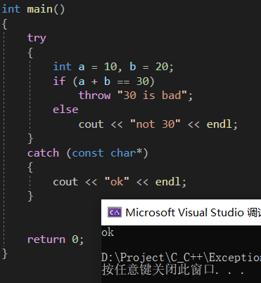

# C++异常处理

## 传送门

[C++异常处理（try catch）从入门到精通](http://c.biancheng.net/cplus/exception/)

[C++异常处理（try catch throw）完全攻略](http://c.biancheng.net/view/422.html)//还没看

## 注意点

①**try和catch都是C++ 中的关键字，后跟语句块，不能省略{ }**

②**注意向上转型(Upcasting)的行为**

③**异常必须显式地抛出，才能被检测和捕获到；如果没有显式的抛出，即使有异常也检测不到**

## C++异常处理入门

C++ 异常处理机制可以让我们捕获并处理错误，然后我们可以让程序沿着一条不会出错的路径继续执行，或者不得不结束程序，但**在结束前可以做一些必要的工作**，例如将内存中的数据写入文件、关闭打开的文件、释放分配的内存等。

程序的错误大致可以分为三种，分别是语法错误、逻辑错误和运行时错误：
1. **语法错误**在编译和链接阶段就能发现，只有 100% 符合语法规则的代码才能生成可执行程序。语法错误是最容易发现、最容易定位、最容易排除的错误，程序员最不需要担心的就是这种错误。

2. **逻辑错误**是说我们编写的代码思路有问题，不能够达到最终的目标，这种错误可以通过调试来解决。

3. **运行时错误**是指程序在运行期间发生的错误，例如
   1. 除数为 0
   2. 内存分配失败
   3. 数组越界
   4. 文件不存在等
   
C++ 异常（Exception）机制就是为解决运行时错误而引入的。

运行时错误如果放任不管，**系统就会执行默认的操作，终止程序运行**，也就是我们常说的**程序崩溃（Crash）**。

C++ 提供了异常（Exception）机制，让我们能够捕获运行时错误，给程序一次“起死回生”的机会，或者至少告诉用户发生了什么再终止程序。

一个发生运行时错误的程序
```cpp
#include <iostream>
#include <string>
using namespace std;

int main(){
    string str = "http://c.biancheng.net";
    char ch1 = str[100];  //下标越界，ch1为垃圾值
    cout<<ch1<<endl;
    char ch2 = str.at(100);  //下标越界，抛出异常
    cout<<ch2<<endl;
    return 0;
}
```
运行代码，在控制台输出 ch1 的值后程序崩溃。下面我们来分析一下原因。

at() 是 string 类的一个成员函数，它会根据下标来返回字符串的一个字符。与[]不同，at() 会检查下标是否越界，如果越界就抛出一个异常；而[]不做检查，不管下标是多少都会照常访问。

所谓抛出异常，就是报告一个运行时错误，程序员可以根据错误信息来进一步处理。


### 捕获异常

借助 C++ 异常机制来捕获上面的异常，避免程序崩溃。捕获异常的语法为：
```cpp
try{
    // 可能抛出异常的语句
}catch(exceptionType variable){
    // 处理异常的语句
}
```

**try和catch都是C++ 中的关键字，后跟语句块，不能省略{ }。**

try 中包含可能会抛出异常的语句，一旦有异常抛出就会被后面的 catch 捕获。从 try 的意思可以看出，它只是“检测”语句块有没有异常，如果没有发生异常，它就“检测”不到。

catch 是“抓住”的意思，用来捕获并处理 try 检测到的异常；如果 try 语句块没有检测到异常（没有异常抛出），那么就不会执行 catch 中的语句。

catch 告诉 try：你去检测一下程序有没有错误，有错误的话就告诉我，我来处理，没有的话就不要理我！

catch 关键字后面的exceptionType variable指明了当前 catch 可以处理的异常类型，以及具体的出错信息。


发生异常时必须将异常明确地抛出，try 才能检测到；如果不抛出来，即使有异常 try 也检测不到。所谓抛出异常，就是明确地告诉程序发生了什么错误。

第二个 try 检测到了异常，并交给 catch 处理，执行 catch 中的语句。需要说明的是，异常一旦抛出，会立刻被 try 检测到，并且不会再执行异常点（异常发生位置）后面的语句。

检测到异常后程序的执行流会发生跳转，从异常点跳转到 catch 所在的位置，位于异常点之后的、并且在当前 try 块内的语句就都不会再执行了；即使 catch 语句成功地处理了错误，程序的执行流也不会再回退到异常点，所以这些语句永远都没有执行的机会了。

执行完 catch 块所包含的代码后，程序会继续执行 catch 块后面的代码，就恢复了正常的执行流。


### 发生异常的位置

异常可以发生在当前的 try 块中，也可以发生在 try 块所调用的某个函数中，或者是所调用的函数又调用了另外的一个函数，这个另外的函数中发生了异常。这些异常，都可以被 try 检测到。

#### try 块中直接发生的异常

```cpp
#include <iostream>
#include <string>
#include <exception>
using namespace std;

int main(){
    try{
        throw "Unknown Exception";  //抛出异常
        cout<<"This statement will not be executed."<<endl;
    }catch(const char* &e){
        cout<<e<<endl;
    }

    return 0;
}

//运行结果：
//Unknown Exception
```

throw关键字用来抛出一个异常，这个异常会被 try 检测到，进而被 catch 捕获。

#### try 块中调用的某个函数中发生了异常

```cpp
#include <iostream>
#include <string>
#include <exception>
using namespace std;

void func(){
    throw "Unknown Exception";  //抛出异常
    cout<<"[1]This statement will not be executed."<<endl;
}

int main(){
    try{
        func();
        cout<<"[2]This statement will not be executed."<<endl;
    }catch(const char* &e){//const 一定要写，否则系统报异常
        cout<<e<<endl;
    }

    return 0;
}
//运行结果：
//Unknown Exception
```

func() 在 try 块中被调用，它抛出的异常会被 try 检测到，进而被 catch 捕获。从运行结果可以看出，func() 中的 cout 和 try 中的 cout 都没有被执行。

#### try 块中调用了某个函数，该函数又调用了另外的一个函数，这个另外的函数抛出了异常

```cpp
#include <iostream>
#include <string>
#include <exception>
using namespace std;

void func_inner(){
    throw "Unknown Exception";  //抛出异常
    cout<<"[1]This statement will not be executed."<<endl;
}

void func_outer(){
    func_inner();
    cout<<"[2]This statement will not be executed."<<endl;
}

int main(){
    try{
        func_outer();
        cout<<"[3]This statement will not be executed."<<endl;
    }catch(const char* &e){
        cout<<e<<endl;
    }

    return 0;
}
//运行结果：
//Unknown Exception
```

发生异常后，程序的执行流会沿着函数的调用链往前回退，直到遇见 try 才停止。在这个回退过程中，调用链中剩下的代码（所有函数中未被执行的代码）都会被跳过，没有执行的机会了。

<br>
<br>

## C++异常类型以及多级catch匹配

```cpp
try{
    // 可能抛出异常的语句
}catch(exceptionType variable){
    // 处理异常的语句
}
```

exceptionType是异常类型，它指明了当前的 catch 可以处理什么类型的异常；variable是一个变量，用来接收异常信息。

当程序抛出异常时，会创建一份数据，这份数据包含了错误信息，程序员可以根据这些信息来判断到底出了什么问题，接下来怎么处理。

异常既然是一份数据，那么就应该有数据类型。C++ 规定，异常类型可以是 int、char、float、bool 等基本类型，也可以是指针、数组、字符串、结构体、类等聚合类型。C++ 语言本身以及标准库中的函数抛出的异常，都是 exception 类或其子类的异常。也就是说，抛出异常时，会创建一个 exception 类或其子类的对象。

exceptionType variable和函数的形参非常类似，当异常发生后，会将异常数据传递给 variable 这个变量，这和函数传参的过程类似。当然，只有跟 exceptionType 类型匹配的异常数据才会被传递给 variable，否则 catch 不会接收这份异常数据，也不会执行 catch 块中的语句。换句话说，catch 不会处理当前的异常。

将 catch 看做一个没有返回值的函数，当异常发生后 catch 会被调用，并且会接收实参（异常数据）。

<br>

但是 catch 和真正的函数调用又有区别：
1. 真正的函数调用，形参和实参的类型必须要匹配，或者可以自动转换，否则在编译阶段就报错了。
2. 对于 catch，异常是在运行阶段产生的，它可以是任何类型，没法提前预测，所以不能在编译阶段判断类型是否正确，只能等到程序运行后，真的抛出异常了，再将异常类型和 catch 能处理的类型进行匹配，匹配成功的话就“调用”当前的 catch，否则就忽略当前的 catch。
3. catch 和真正的函数调用相比，多了一个「在运行阶段将实参和形参匹配」的过程

**如果不希望 catch 处理异常数据，也可以将 variable 省略掉。只会将异常类型和 catch 所能处理的类型进行匹配，不会传递异常数据了。**



### 多级catch

其实，一个 try 后面可以跟多个 catch：
```cpp
try{
    //可能抛出异常的语句
}catch (exception_type_1 e){
    //处理异常的语句
}catch (exception_type_2 e){
    //处理异常的语句
}
//其他的catch
catch (exception_type_n e){
    //处理异常的语句
}
```
当异常发生时，程序会按照从上到下的顺序，将异常类型和 catch 所能接收的类型逐个匹配。一旦找到类型匹配的 catch 就停止检索，并将异常交给当前的 catch 处理（其他的 catch 不会被执行）。如果最终也没有找到匹配的 catch，就只能交给系统处理，终止程序的运行。

```cpp
#include <iostream>
#include <string>
using namespace std;
class Base{ };
class Derived: public Base{ };
int main(){
    try{
        throw Derived();  //抛出自己的异常类型，实际上是创建一个Derived类型的匿名对象
        cout<<"This statement will not be executed."<<endl;
    }catch(int){
        cout<<"Exception type: int"<<endl;
    }catch(char *){
        cout<<"Exception type: char *"<<endl;
    }catch(Base){  //匹配成功（向上转型）
        cout<<"Exception type: Base"<<endl;
    }catch(Derived){
        cout<<"Exception type: Derived"<<endl;
    }
    return 0;
}

//运行结果：
//Exception type: Base
//在 catch 中，我们只给出了异常类型，没有给出接收异常信息的变量
```

定义了一个基类 Base，又从 Base 派生类出了 Derived。抛出异常时，我们创建了一个 Derived 类的匿名对象，也就是说，异常的类型是 Derived。

我们期望的是，异常被catch(Derived)捕获，但是从输出结果可以看出，异常提前被catch(Base)捕获了，这说明 catch 在匹配异常类型时发生了**向上转型(Upcasting)**，注意catch的顺序

如果异常向上转型后与catch接收的类型匹配，则catch会执行。例如：
```cpp
//example1
//无法被捕获，结果系统报异常
try
    throw "abcd";
catch(char *)
    cout<<"got exception"<<endl;
//example1
//可以被捕获，结果：got exception//和预计相符
try
{
    char a[5]="abcd";
    throw a;
}
catch(const char *)
{
    cout<<"got exception"<<endl;
}
```
上面catch无法捕获异常，下面的可以正确捕获到异常

### catch 在匹配过程中的类型转换

C/C++ 中存在多种多样的类型转换，以普通函数（非模板函数）为例，发生函数调用时，如果实参和形参的类型不是严格匹配，那么会将实参的类型进行适当的转换，以适应形参的类型，这些转换包括：
1. 算数转换：例如 int 转换为 float，char 转换为 int，double 转换为 int 等。
2. 向上转型：也就是派生类向基类的转换
   [C++将派生类赋值给基类（向上转型）](http://c.biancheng.net/view/2284.html)
3. const 转换：也即将非 const 类型转换为 const 类型，例如将 char * 转换为 const char *。
4. 数组或函数指针转换：如果函数形参不是引用类型，那么数组名会转换为数组指针，函数名也会转换为函数指针。
5. 用户自定的类型转换。

catch 在匹配异常类型的过程中，也会进行类型转换，但是这种转换受到了更多的限制，仅能进行：
1. 「向上转型」
2. 「const 转换」
3. 「数组或函数指针转换」
4. 其他的都不能应用于 catch

<br>
<br>

## C++ throw（抛出异常）详解

异常必须显式地抛出，才能被检测和捕获到；如果没有显式的抛出，即使有异常也检测不到

使用 throw 关键字来显式地抛出异常

```cpp
throw exceptionData;
```

exceptionData 是“异常数据”的意思，它可以包含任意的信息，完全有程序员决定。exceptionData 可以是 int、float、bool 等基本类型，也可以是指针、数组、字符串、结构体、类等聚合类型

### 一个动态数组的例子

C/C++ 规定，数组一旦定义后，它的长度就不能改变了；换句话说，数组容量不能动态地增大或者减小。这样的数组称为静态数组（Static array）。静态数组有时候会给编码代码不便，我们可以通过自定义的 Array 类来实现动态数组（Dynamic array）。所谓动态数组，是指数组容量能够在使用的过程中随时增大或减小。

```cpp
#include <iostream>
#include <cstdlib>
using namespace std;

//自定义的异常类型
class OutOfRange
{
public:
    OutOfRange(): m_flag(1){ };
    OutOfRange(int len, int index): m_len(len), m_index(index), m_flag(2){ }
public:
    void what() const;  //获取具体的错误信息
private:
    int m_flag;  //不同的flag表示不同的错误
    int m_len;  //当前数组的长度
    int m_index;  //当前使用的数组下标
};

void OutOfRange::what() const {
    if(m_flag == 1){
        cout<<"Error: empty array, no elements to pop."<<endl;
    }else if(m_flag == 2){
        cout<<"Error: out of range( array length "<<m_len<<", access index "<<m_index<<" )"<<endl;
    }else{
        cout<<"Unknown exception."<<endl;
    }
}

//实现动态数组
class Array
{
public:
    Array();
    ~Array(){ free(m_p); };
public:
    int operator[](int i) const;  //获取数组元素
    int push(int ele);  //在末尾插入数组元素
    int pop();  //在末尾删除数组元素
    int length() const{ return m_len; };  //获取数组长度
private:
    int m_len;  //数组长度
    int m_capacity;  //当前的内存能容纳多少个元素
    int *m_p;  //内存指针
private:
    static const int m_stepSize = 50;  //每次扩容的步长
};

Array::Array(){
    m_p = (int*)malloc( sizeof(int) * m_stepSize );
    m_capacity = m_stepSize;
    m_len = 0;
}
int Array::operator[](int index) const {
    if( index<0 || index>=m_len ){  //判断是否越界
        throw OutOfRange(m_len, index);  //抛出异常（创建一个匿名对象）
    }

    return *(m_p + index);
}
int Array::push(int ele){
    if(m_len >= m_capacity){  //如果容量不足就扩容
        m_capacity += m_stepSize;
        m_p = (int*)realloc( m_p, sizeof(int) * m_capacity );  //扩容
    }

    *(m_p + m_len) = ele;
    m_len++;
    return m_len-1;
}
int Array::pop(){
    if(m_len == 0){
         throw OutOfRange();  //抛出异常（创建一个匿名对象）
    }

    m_len--;
    return *(m_p + m_len);
}

//打印数组元素
void printArray(Array &arr){
    int len = arr.length();

    //判断数组是否为空
    if(len == 0){
        cout<<"Empty array! No elements to print."<<endl;
        return;
    }

    for(int i=0; i<len; i++){
        if(i == len-1){
            cout<<arr[i]<<endl;
        }else{
            cout<<arr[i]<<", ";
        }
    }
}

int main()
{
    Array nums;
    //向数组中添加十个元素
    for(int i=0; i<10; i++){
        nums.push(i);
    }
    printArray(nums);

    //尝试访问第20个元素
    try{
        cout<<nums[20]<<endl;//之前对[]运算符也进行重载会throw异常
    }catch(OutOfRange &e){
        e.what();
    }

    //尝试弹出20个元素
    try{
        for(int i=0; i<20; i++){
            nums.pop();
        }
    }catch(OutOfRange &e){
        e.what();
    }

    printArray(nums);

    return 0;
}

//运行结果：
//0, 1, 2, 3, 4, 5, 6, 7, 8, 9
//Error: out of range( array length 10, access index 20 )
//Error: empty array, no elements to pop.
//Empty array! No elements to print.
```

我们通过重载过的[ ]运算符来访问数组元素，如果下标过小或过大，就会抛出异常；在抛出异常的同时，我们还记录了当前数组的长度和要访问的下标。

在使用 pop() 删除数组元素时，如果当前数组为空，也会抛出错误。

### throw 用作异常规范

throw 关键字除了可以用在函数体中抛出异常，还可以**用在函数头和函数体之间，指明当前函数能够抛出的异常类型，这称为异常规范（Exception specification），有些教程也称为异常指示符或异常列表**。

```cpp
double func (char param) throw (int);
```

声明了一个名为 func 的函数，它的返回值类型为 double，有一个 char 类型的参数，并且只能抛出 int 类型的异常。如果抛出其他类型的异常，try 将无法捕获，只能终止程序。

如果函数会抛出多种类型的异常，那么可以用逗号隔开

```cpp
double func (char param) throw (int, char, exception);
```

如果函数不会抛出任何异常，那么( )中什么也不写，即使抛出了，try 也检测不到

```cpp
double func (char param) throw ();
```

#### ①虚函数中的异常规范

C++ 规定，派生类虚函数的异常规范必须与基类虚函数的异常规范一样严格，或者更严格。只有这样，当通过基类指针（或者引用）调用派生类虚函数时，才能保证不违背基类成员函数的异常规范。(派生类throw的内容是父类throw的子集)

```cpp
class Base{
public:
    virtual int fun1(int) throw();
    virtual int fun2(int) throw(int);
    virtual string fun3() throw(int, string);
};

class Derived:public Base{
public:
    int fun1(int) throw(int);   //错！异常规范不如 throw() 严格
    int fun2(int) throw(int);   //对！有相同的异常规范
    string fun3() throw(string);  //对！异常规范比 throw(int,string) 更严格
}
```

#### ②异常规范与函数定义和函数声明

C++ 规定，异常规范在函数声明和函数定义中必须同时指明，并且要严格保持一致，不能更加严格或者更加宽松。

```cpp
//错！定义中有异常规范，声明中没有
void func1();
void func1() throw(int) { }

//错！定义和声明中的异常规范不一致
void func2() throw(int);
void func2() throw(int, bool) { }

//对！定义和声明中的异常规范严格一致
void func3() throw(float, char*);
void func3() throw(float, char*) { }
```

### 请抛弃异常规范，不要再使用它

异常规范的初衷是好的，它希望让程序员看到函数的定义或声明后，立马就知道该函数会抛出什么类型的异常，这样程序员就可以使用 try-catch 来捕获了。如果没有异常规范，程序员必须阅读函数源码才能知道函数会抛出什么异常。

不过这有时候也不容易做到。例如，func_outer() 函数可能不会引发异常，但它调用了另外一个函数 func_inner()，这个函数可能会引发异常。

再如，您编写的函数调用了老式的库函数，此时不会引发异常，但是库更新以后这个函数却引发了异常。总之，异常规范的初衷实现起来有点困难，所以大家达成的一致意见是，最好不要使用异常规范。

异常规范是 C++98 新增的一项功能，但是后来的 C++11 已经将它抛弃了，不再建议使用。

<br>
<br>

## C++ exception类：C++标准异常的基类

C++语言本身或者标准库抛出的异常都是 exception 的子类，称为标准异常（Standard Exception）。你可以通过下面的语句来捕获所有的标准异常：

```cpp
try{
    //可能抛出异常的语句
}catch(exception &e){
    //处理异常的语句
}
```

**之所以使用引用，是为了提高效率。如果不使用引用，就要经历一次对象拷贝（要调用拷贝构造函数）的过程。**

exception 类位于 <exception> 头文件中，它被声明为：

```cpp
class exception{
public:
    exception () throw();  //构造函数
    exception (const exception&) throw();  //拷贝构造函数
    exception& operator= (const exception&) throw();  //运算符重载
    virtual ~exception() throw();  //虚析构函数
    virtual const char* what() const throw();  //虚函数
}
```

这里需要说明的是 what() 函数。what() 函数返回一个能识别异常的字符串，正如它的名字“what”一样，可以粗略地告诉你这是什么异常。不过C++标准并没有规定这个字符串的格式，各个编译器的实现也不同，所以 what() 的返回值仅供参考。


#### exception 类的直接派生类

异常名称	|说明
---|---
logic_error	|逻辑错误。
runtime_error	|运行时错误。
bad_alloc	|使用 new 或 new[ ] 分配内存失败时抛出的异常。
bad_typeid	|使用 typeid 操作一个 NULL 指针，而且该指针是带有虚函数的类，这时抛出 bad_typeid 异常。
bad_cast	|使用 dynamic_cast 转换失败时抛出的异常。
ios_base::failure|	io 过程中出现的异常。
bad_exception	|这是个特殊的异常，如果函数的异常列表里声明了 bad_exception |异常，当函数内部抛出了异常列表中没有的异常时，如果调用的 unexpected()| 函数中抛出了异常，不论什么类型，都会被替换为 bad_exception 类型。

#### logic_error 的派生类

异常名称	|说明
---|---
length_error	|试图生成一个超出该类型最大长度的对象时抛出该异常，例如 vector 的 resize 操作。
domain_error	|参数的值域错误，主要用在数学函数中，例如使用一个负值调用只能操作非负数的函数。
out_of_range	|超出有效范围。
invalid_argument	|参数不合适。在标准库中，当利用string对象构造 bitset 时，而 string 中的字符不是 0 或1 的时候，抛出该异常。

#### runtime_error 的派生类

异常名称	|说明
---|---
range_error	|计算结果超出了有意义的值域范围。
overflow_error	|算术计算上溢。
underflow_error	|算术计算下溢。


