# 输入输出流

## 一、C++的输入与输出

### 1.1 基本概念回顾

### 1.2 输入输出的基本概念

## 二、标准输出流

## 三、标准输入流

## 四、文件操作与文件流

### 4.1 文件的基本概念

1. 文件及文件夹名
   1. 文件：存储在存储器上的数据集合
   2. 文件名：操作系统用于访问文件的依据
2. 文件的分类
   1. 按设备
   2. 按文件的类型
   3. 按数据的组织形式
      1. ASCII码文件（文本文件）：按数据的ASCII代码形式存放的文件
      2. 二进制文件：按数据的内存存放形式存放的文件
         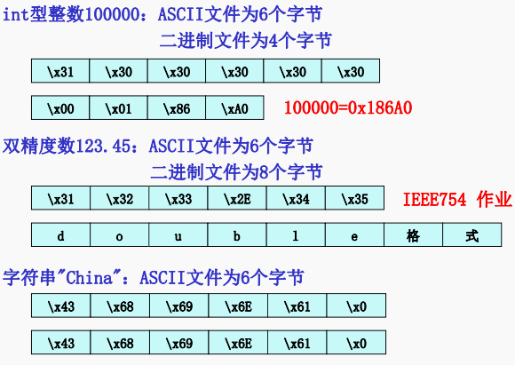


### 4.2 文件流类及文件流对象

1. 与磁盘文件有关的流类
   1. 输入     ifstream类，从istream类派生
   2. 输出     ofstream类，从ostream类派生
   3. 输入/输出 fstream类，从iostream类派生
2. 流对象的建立
   1. ifstream 流对象名  ：用于输入文件的操作
   2. ofstream 流对象名  ：用于输出文件的操作
   3. fstream  流对象名  ：用于输入/输出文件的操作

### 4.3 文件的打开与关闭
1. 打开
    1. 文件流对象名.open(文件名，打开方式);
    2. 加 #include \<fstream\>
    3. 有多种打开方式（多种打开方式可以用位或运算符|进行组合）
   
        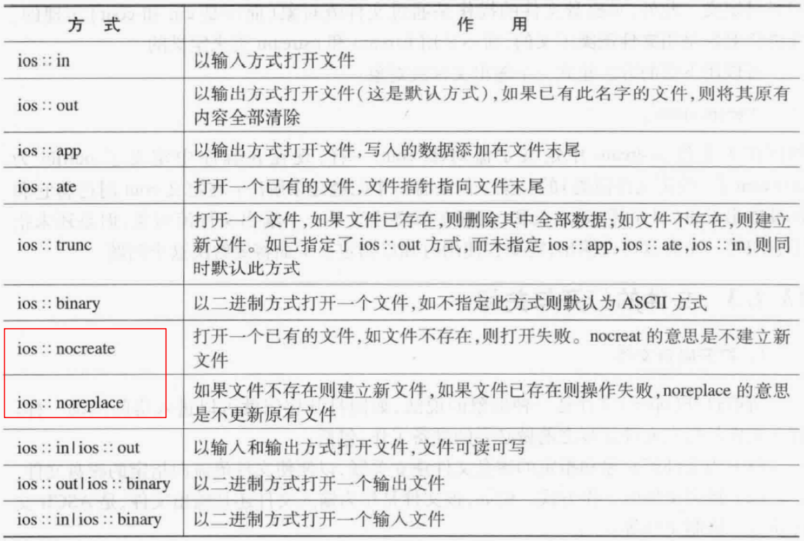

        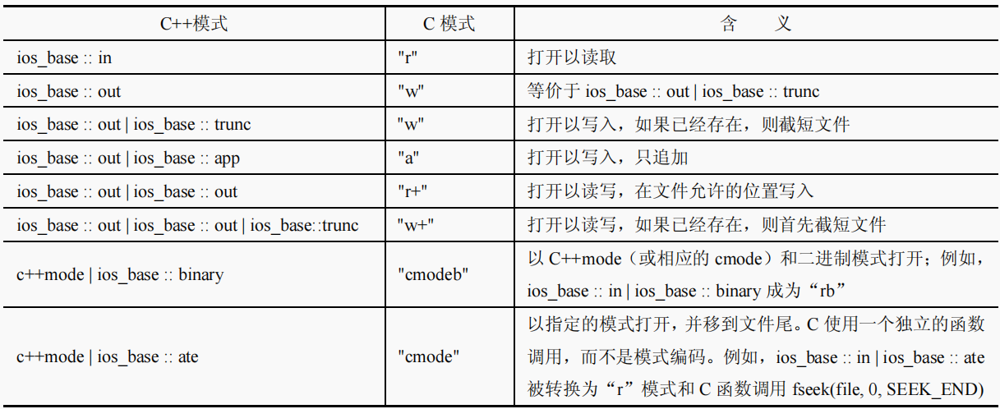

    4. 文件名允许带全路径，若不带路径，则表示与可执行文件同目录
    5. 写完整路径的时候记得用两个斜杠\\\\否则会被当做转义符
    6. VS2019等编译器，如果在集成环境内运行，则当前目录是指源程序文件（\*.cpp）所在目录，离开集成开发环境，则当前目录是指可执行文件（\*.exe）所在目录
    7. 用\\\\表示目录间分隔符在Linux下无效，用/在Windows和Linux下**均有效**
    8. 可以在声明文件流对象时直接打开
   
        ofstream  out("文件名",打开方式);

    9. 打开方式与文件流对象之间要兼容，否则无意义
        eg:in对象用out打开，无意义
    10. 每个文件打开后，都有一个文件指针，初始指向开始/末尾的位置
    11. 执行open操作后，要判断文件是否打开成功
        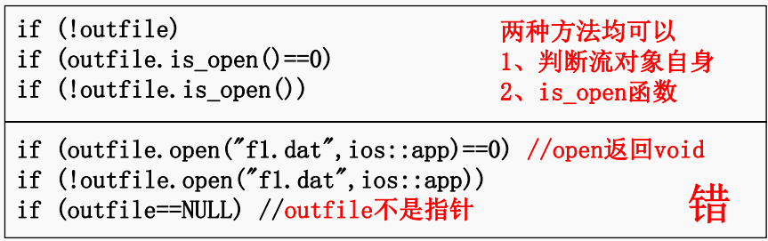
2. 文件流的关闭
   1. 文件流对象名.close();
3. 一些操作
   
    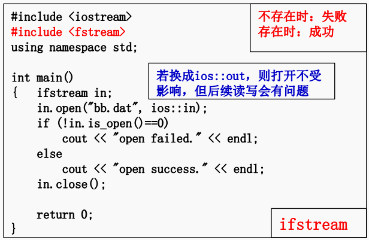

    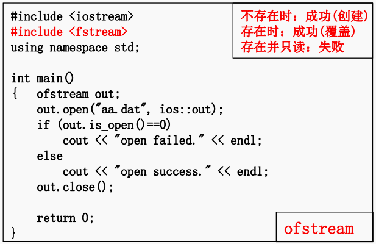

    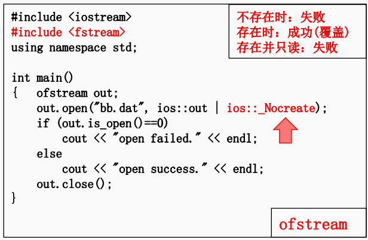


### 4.4 对ASCII文件的操作

1. 基本方法：将文件流对象名当作cin/cout对象，用>>和<<进行格式化的输入和输出
   
    infile>>变量

    outfile<<变量

2. 关于cin/cout的get/getline/put/eof/peek/putchar/ignore等成员函数也可以被文件流对象所使用
3. 成员函数的使用方法类似
4. 流对象与打开方式、流插入/流提取运算符之间要求匹配
   
### 4.5 对二进制文件的操作

1. 用像ASCII文件的字符方式进行操作
    1. 仅能按字节读写
    2. 如果文件中有0x1A(Ctrl+Z)则无法继续读取（文本文件中不可能有该字符）
2. 用read/write进行操作
    1. 文件流对象名.read(内存空间首指针,长度);
        从文件中读取长度个字节，放入首指针开始的空间中。
    2. 文件流对象名.write(内存空间首指针,长度);
        将从首指针开始的连续长度个字节写入文件中
    3. read/write均为纯字节，无尾零等任何附加信息
    4. read/write一般仅用于二进制读写，如果用于实际中读写，则仅受长度的限制，不考虑格式化（是否有尾零/数据是否合理等，相当于二进制） 
3. 一些例子
    1. ASCII方式写入（endl变为0x0D、0x0D）
    
        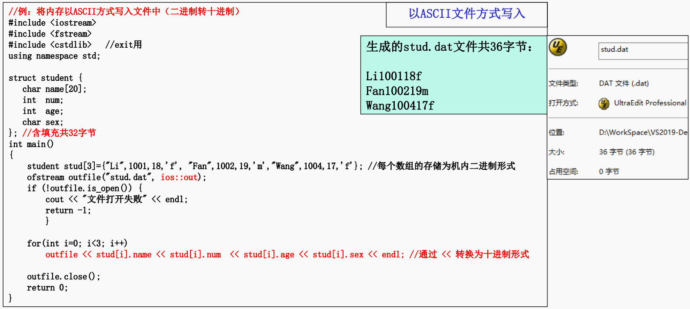
    
    2. 二进制方式写入

        最后三个为字节对齐所导致的填充字符

        其中两个int是存储的时候大小端导致反序

        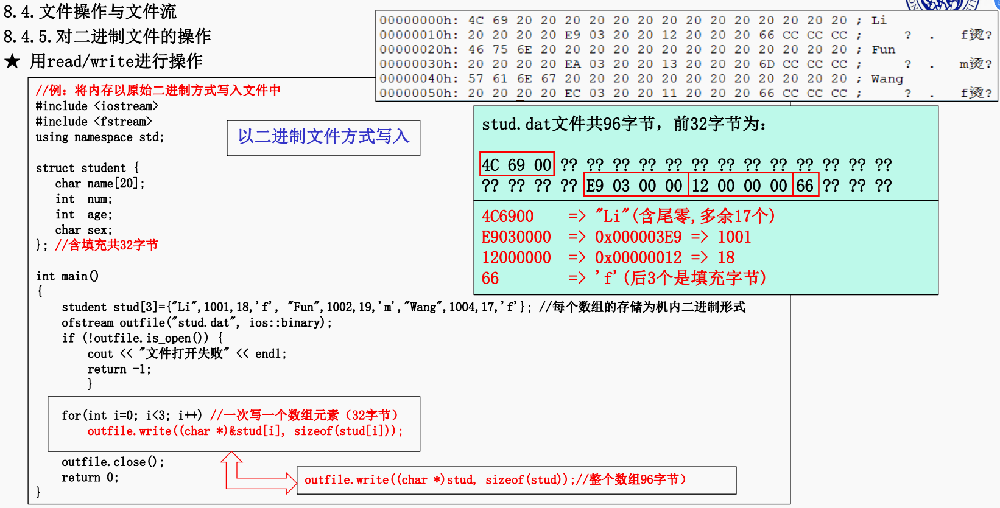

    3. 二进制方式读取

        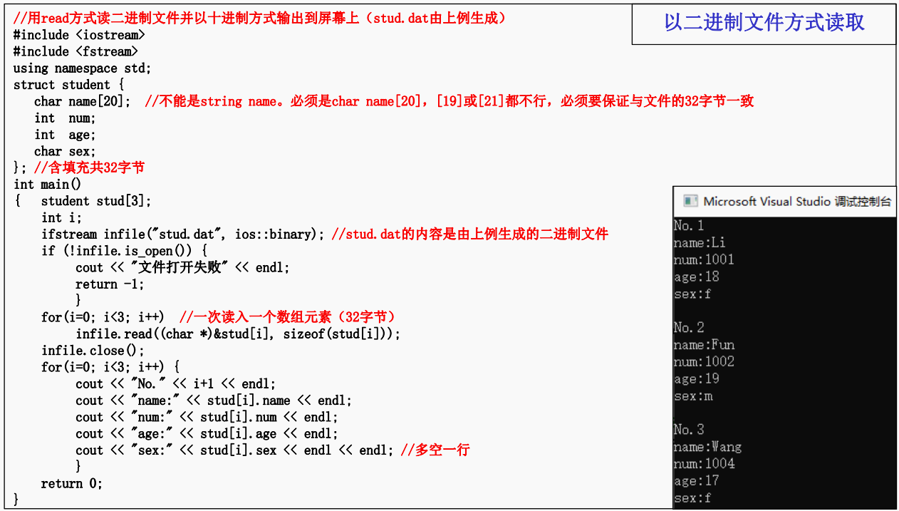

    4. 综合应用：读写同步进行

        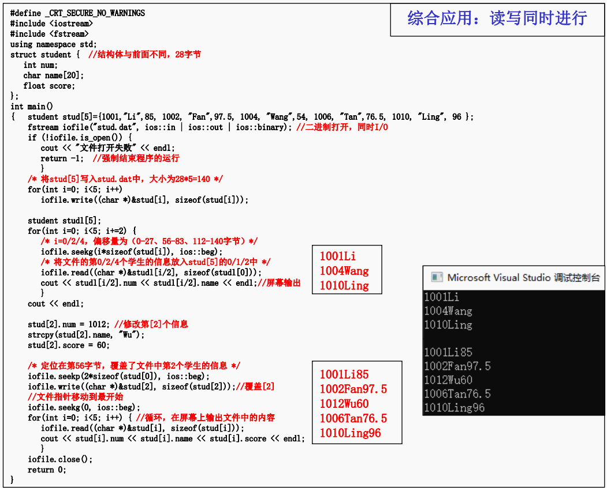

### 4.5 对二进制文件的操作

1. 与文件指针有关的流成员函数（g->get | p->put）
    1. 适用于输入文件的：
        1. gcount():返回最后一次读入的字节数
   
         streamsize gcount() const;

         streamsize is a signed integral type.

        2. tellg():返回输入文件的当前指针
        3. seekg(位移量，位移方式):移动输入文件指针
        4. 注意：
            ①get先读到分界符，分界符不算在gcount()中
            ②getline先读到分界符，分界符算在gcount()中
            ③get和getline读到读满，gcount等于[容量-1]

            
    2. 适用于输出文件的：
        1. tellp():返回输出文件的当前指针
        2. seekp(位移量，位移方式):移动输出文件指针
    3. 位移方式：
        1. ios::beg : 从文件头部移动，位移量必须为正
        2. ios::cur : 从当前指针处移动，位移量可正可负
        3. ios::end : 从文件尾部移动，位移量必须为负
2. 随机访问二进制数据文件

    在文件的读写过程中，可前后移动文件指针，达到按需读写的目的

    1. ifstream无tellp
    2. ofstream无tellg
    3. fstream的tellp、tellg是同步移动的
    4. 文件读写后，文件指针会自动后移(C/C++都是如此)

3. 注意事项
   1. read/write虽然是内存首地址，实际编程中使用字符数组，不是字符串，不处理尾零
   2. read参数中的长度是最大读取长度不是实际读取长度，因此read后需要用gcount()返回真实读到的字节数
   3. 如果读写方式打开(ios::in|ios::out)，则只有一个文件指针，seekg()、seekp()是同步的，tellg()、tellp()是同步的。
   4. 在文件的操作超过正常范围后（eg:read()已到EOF、seekg()/seekp()超文件首尾范围等），再次对文件进行seekg()/seekp()/tellg()/tellp()等操作都可能会返回与期望不同的值，建议在文件操作过程中多使用good()/fail()/eof()/clear()等函数。

## 五、C++的字符串流(sstream)


## 六、C语言的文件操作

### 6.1 文件指针

1. FILE *文件指针变量;
2. FILE是系统定义的结构体
3. C语言中文件操作的基本依据，所有针对文件的操作均需要依据该指针
4. #include <stdio.h>
5. VS2019认为不安全，需要加 #define _CRT_SECURE_NO_WARNINGS
6. 文件读写后，文件指针会自动后移(C/C++都是如此)

### 6.2 文件的打开和关闭

1. 假设：FILE *fp; 定义一个文件指针
2. 文件的打开
    
    FILE *fopen("文件名",打开方式);

    打开失败返回NULL

3. 基本打开方式
   
    r:只读&emsp;w:只写&emsp;a:追加&emsp;+:可读可写&emsp;b:二进制&emsp;t:文本方式

    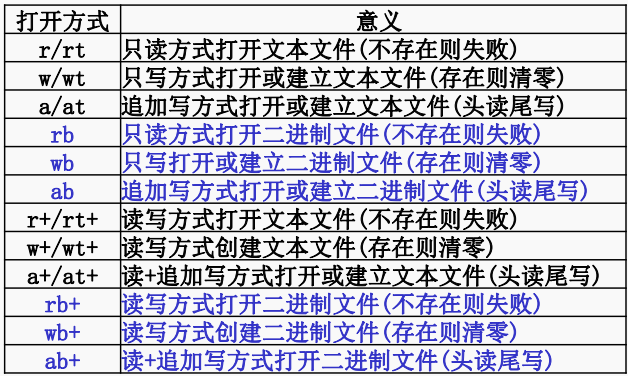

4. 文件的关闭

    fclose(文件指针);

### 6.3 文本文件的读写

1. 按字符读写文件按
    1. 读：int fgetc(文件指针)

        返回读到的字符的ASCII码（返回值同getchar）
    
    2. 写：int fputc(字符常量/字符变量 , 文件指针)

        返回写入的字符的ASCII码（返回值同putchar）

    3. **必须保证文件的打开方式符合要求**

2. 判断文件是否到达尾部

    int feof(文件指针)

    若到达尾部，返回1，否则返回0

3. 按格式读写文件
    1. 读：int fscanf(文件指针 , 格式串 , 输入表列)
        返回读取正确的数量（返回值同scanf）
    2. 写：int fprintf(文件指针 , 格式串 , 输入表列)
        返回输出字符的数量（返回值同scanf）
    3. 格式串、输入/输出表列的使用同scanf/printf

4. 用文件方式进行标准输入输出

5. 用freopen重定向标准输入输出

### 6.4 二进制文件的读写


## 七、C语言中实现与C++的字符串流相似的功能

### 7.1 向字符数组输出格式化的数据


<br>
<br>

## 八、cin、cout相关函数

### 8.1 cin

cin将忽略空格和换行符

### 8.2 cin.get()成员函数

&emsp;实质：类istream所定义对象cin的重载成员函数

①用于读取单字符：

&emsp;istream& get(char&)

&emsp;int get(void)

②用于读取字符串

&emsp;istream &get(char*,int)

&emsp;istream &get(char*,int,char)

③详解

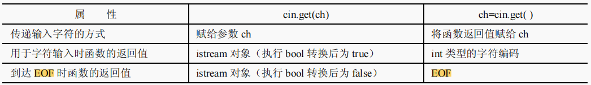

1. cin.get(ch)
   
    ①通常，逐个字符读取输入的程序需要检查每个字符，包括空格、制表符和换行符。成员函数cin.get(ch)读取输入中的下一个字符，即使是空格，并赋给变量ch。
    
    ②**其中，cin.get()参数声明为引用类型**。

    ③返回一个指向用于调用它的**istream类引用**。

    ```cpp
    cin.get(ch1).get(ch2)>>ch3; 
    ```

    ④如果cin.get(char&)到达文件结尾，它不给参数赋值，此时还将调用setstate(failbit)导致cin的结果为false，也就是说，可以将存在有效输入作为while循环的条件。

    ```cpp
    char ch;
    //若存在有效输入，返回值为对象cin，判断结果为true
    while(cin.get(ch))
    {
        //expression
    }
    ```


2. cin.get()
   
    ①能够读取空白(空格，制表，换行)赋值给字符变量,返回类型为int。
    
    ②如果成功，则返回代表读取字符的整数代码；如果不成功，则**在流上设置错误代码**并**返回特殊值EOF**。

    ③一旦到达文件尾(不管是真正文件尾还是模拟的文件尾)，cin.get(void)将返回值EOF，iostream中提供的符号常量(值为-1)。因此也可以用作控制条件。
    ```cpp
    int ch;
    //括号不能省!=优先级高于=，否则将!=的比较结果赋值给ch
    while((ch=cin.get())!=EOF)
    {
        //expression
    }
    ```

    ④不能够使用cin.get().get().get()...的形式来简写读取多个字符，原因为cin.get()返回为int值而并非对象。但下面的写法是正确的：

    ```cpp
    cin.get(ch1).get();
    ```

3. istream &get(char*,int) 和 istream &get(char*,int,char)

   1. 第一个参数为放置存储字符串的内存单元的地址。
   2. 第二个参数为**比需要读取的字符数大1的int值**(显然额外的字符**用于自动添加的字符串的结尾空字符\0**)。
   3. 第三个字符为分界符，表示读到此不在读，若此处缺省即第一种情况，**默认分界符为换行符**。get()读到换行符或者分界符或者达到需要读取字符的数目后后立即终止读入。
   4. 分界符没有被读入，并且**仍然留在输入流中**；getline()也不会读入，但会将分界符从输入流中删除。
   5. 空格和制表均会被读取
   6. 从下面两张图可以看出，分界符还在输入流中
   
        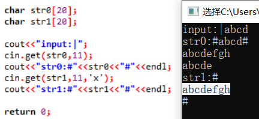

        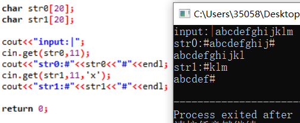
        
4. 总结
   1. cin.get(char)成员函数通过返回转换为false的bool值来指出已经到达EOF
   2. cin.get()成员函数则通过返回EOF值来指出已到达EOF
   
### 8.3 cin.getline()成员函数
1. istream &getline(char*,int) 和 istream &getline(char*,int,char)
    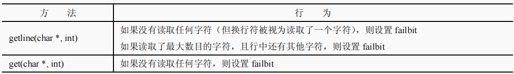
    1. get()和getline()的区别是，前者将分界符保存在输入流中，后者则抽取并丢弃。
   
        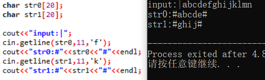


    2. 图中**getline**中**如果读取了最大数目的字符，且行中还有除分界符以外的字符，则设置failbit**。为什么说是除了分界符以外可以看第二张图。

        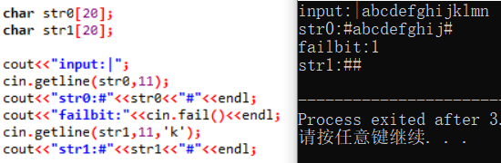

        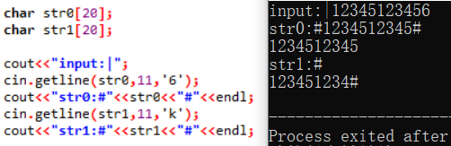

### 8.4 gets()

1. 原型为char* gets(char* buffer);
2. 输入的时候以换行符作为结束，空格键和制表符正常写入。由于此函数不会检查是否溢出，应保证buffer空间足够。
3. 如果溢出，多出来的字符将被写入到堆栈中，这就覆盖了堆栈原先的内容，破坏一个或多个不相关变量的值。这个事实导致gets函数只适用于玩具程序。


### 8.5 cin.clear()

1. cin>>发生错误时，failbit被置为1，只有用clear()将failbit修改到原来的状态0，输入才得以继续。其中错误字符仍然会留在输入流中。

### 8.6 cin.peek()

1. 调用形式为cin.peek()。

2. 其返回值是一个char型的字符，是指针指向的当前字符，但它只是观测，指针仍停留在当前位置，并不后移。如果要访问的字符是文件结束符，则函数值是EOF（-1）。
   
3. 其功能是从输入流中读取一个字符 但该字符并未从输入流中删除若把输入流比作一个 栈类 那么这里的peek函数就相当于栈的成员函数front 而如果cin.get()则相当于栈的成员函数pop。

### 8.7 cin.fail()

```cpp
cin.get(ch);
while(cin.fail()==false)
{

}

while(!cin.fail())
{

}

//比!cin.fail()、!cin.eof()更通用
//可以检测其他失败原因，如磁盘故障
while(cin)
{

}
```


<br>
<br>

## 九、EOF相关

1. 如果输入来自于文件，可以使用一种功能更强大的技术——检测文件尾(EOF，被定义为值-1)。C++输入工具和操作系统协同工作，来检测文件尾并将这种信息告诉程序。
2. 很多操作系统（Unix，Linux，Windows命令提示符模式）都支持重定向，允许用文件替换键盘输入。
3. 很多操作系统都允许通过键盘来模拟文件尾条件。
   1. Unix中，可以在行首按下Ctrl+D来实现。
   2. Windows中，可以在任意位置按Ctrl+Z和Enter。
4. **检测到EOF后，cin将eofbit和failbit都设置为1。可以通过成员函数eof()来查看eofbit是否被设置**。如果eofbit或failbit被设置为1，则fail()成员函数返回true，否则返回fail。
5. 注意：**eof()和fail()方法报告最近的读取结果，就是说他们在事后报告，而非预先报告**。因此，应将cin.eof()或cin.fail()测试放在读取后。可以看一个例子：
    ```cpp
    ifstream in;
    ofstream out;
    char ch;
    in.open("data.txt",ios_base::in);
    if(!in.is_open())
    {
        return -1;
    }
    out.open("result.txt",ios_base::out);
    if(!out.is_open())
    {
        in.close();
        return -1;
    }
    //这里是正确的方式，不会有FF
    //	while(in.get(ch))
    //	{
    //		out.put(ch);
    //	}
    //这个是错误的方式会导致FF(-1->EOF)
    while(!in.eof())
    {
        ch=in.get();
        out.put(ch);
    }
    ```

    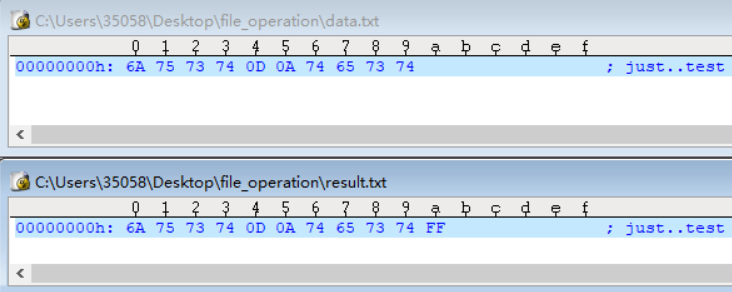

6. 除了当前所做的修改外，关于使用cin.get()还有一个微妙而重要的问题。由于EOF表示的不是有效字符编码，因此可能不与char类型兼容。例如，在有些系统中，char类型是没有符号的，因此char变量不可能为EOF
值（−1）。由于这种原因，如果使用cin.get()（没有参数）并测试 EOF，则必须将返回值赋给int变量，而不是char变量。另外，如果将ch的类型声明为int，而不是char，则必须在显示ch时将其强制转换为char类型。
7. 需要知道的是，**EOF不表示输入中的字符，而是指出没有字符**

<br>
<br>
<br>

## 十、回车、换行相关

1. 回车 CR (**Carriage Return**)
   
    '\r'  ASCII: 0x0D(13)

    将光标移动到当前行的开头

2. 换行 LF (**Line Feed**)

    '\n'  ASCII: 0x0A(10)

    将光标垂直移动到下一行

3. Dos和Windows采用回车+换行表示下一行

    Linux和UNIX采用换行符表示下一行

    MacOS采用回车符表示下一行

4. 总结
   
    所以Windows平台上换行在文本文件中使用的是0D、0A两个字节，而UNIX、Linux、MacOS使用一个字节表示。

5. 注意
   
    这种差别在编程、不同OS之间传输纯文本时最需要注意

<br>
<br>
<br>

# 从文件读取数据

## C++方式从文件读取数据

1. 从键盘读取数据
   
    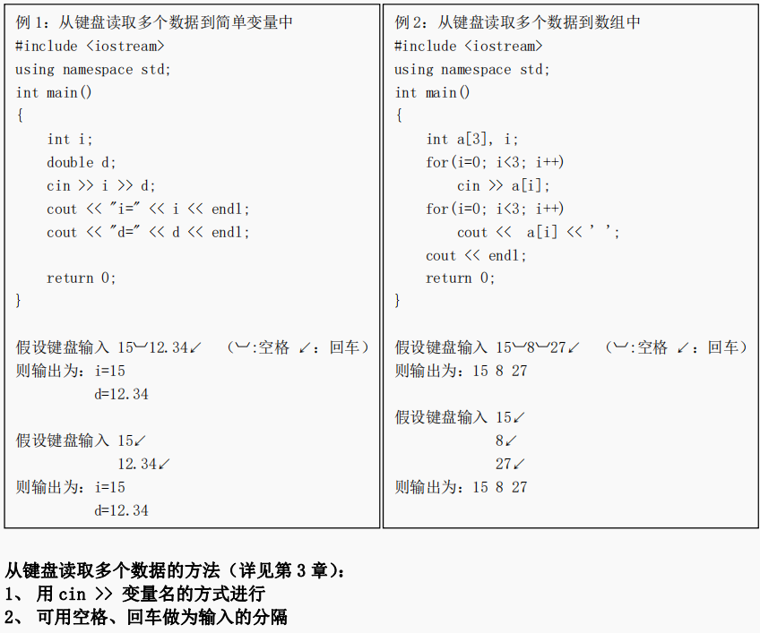

<br>

2. 从文件中读取数据
   
    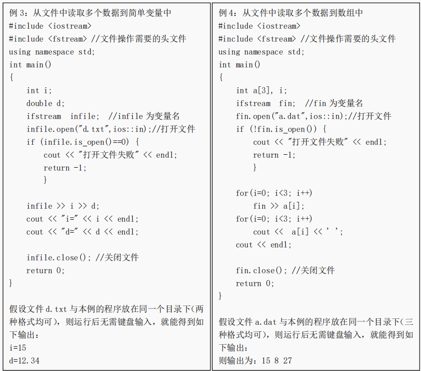

    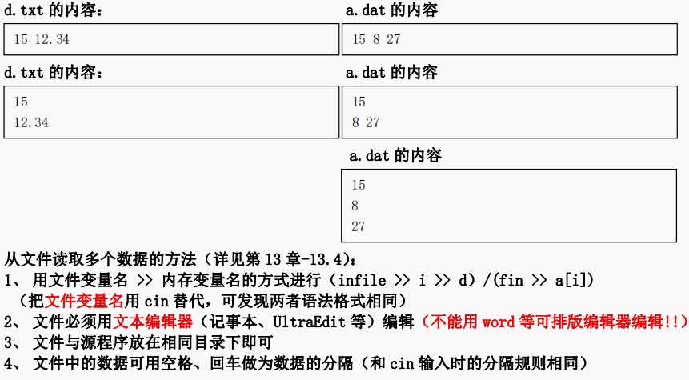

    需要添加头文件
    ```cpp
    #include <fstream>
    ```

3. 操作说明

    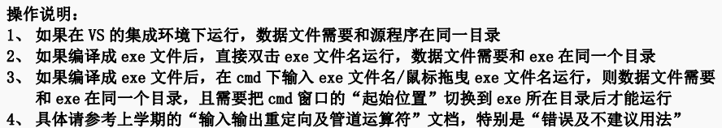

## C++方式将输出放入文件

1. 读取数据并输出到屏幕

    

2. 读取文件并输出到文件

    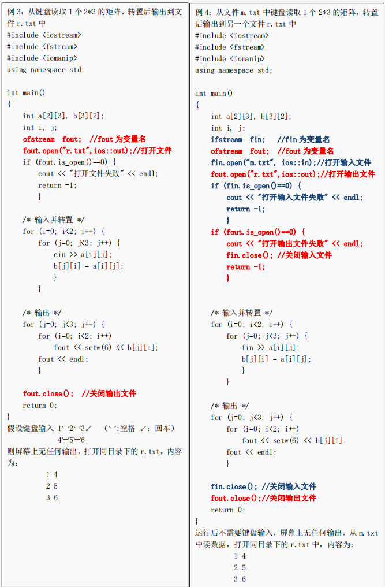

3. 操作说明
   
    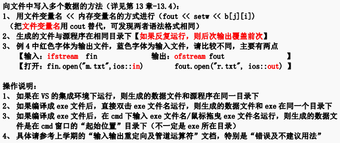

## C方式从文件读取数据

1. 从键盘读取数据
   
    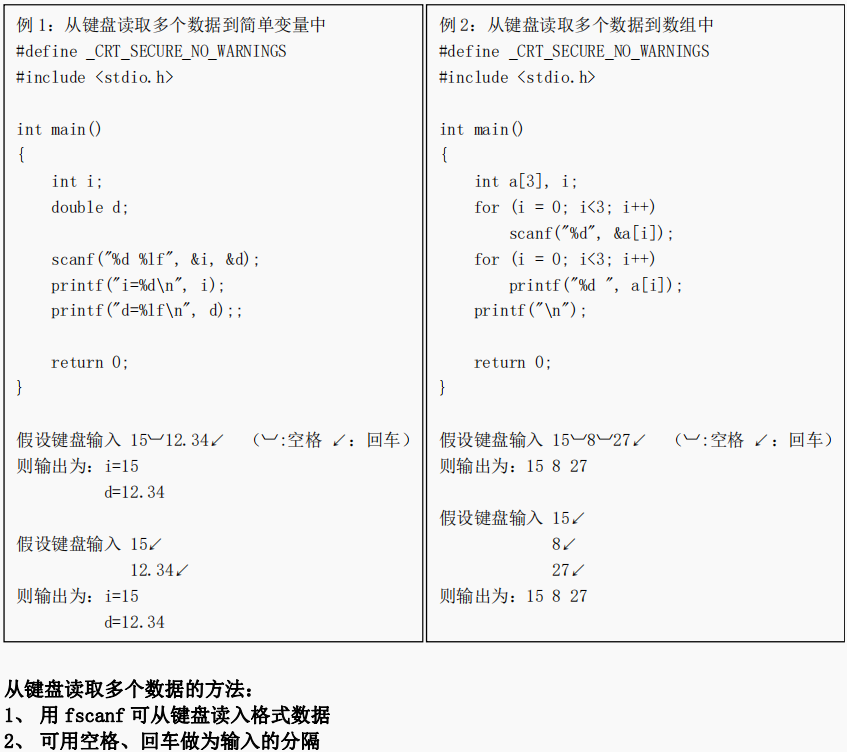

2. 从文件读取数据

    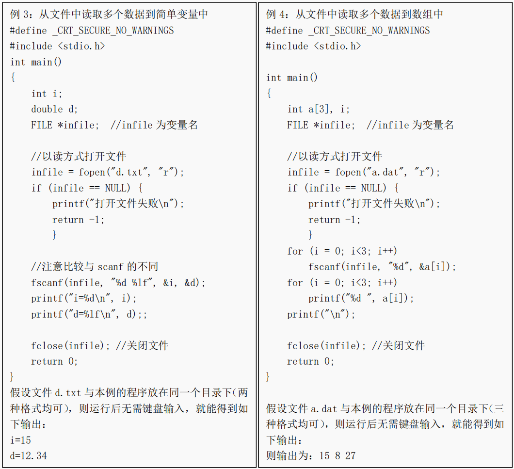

    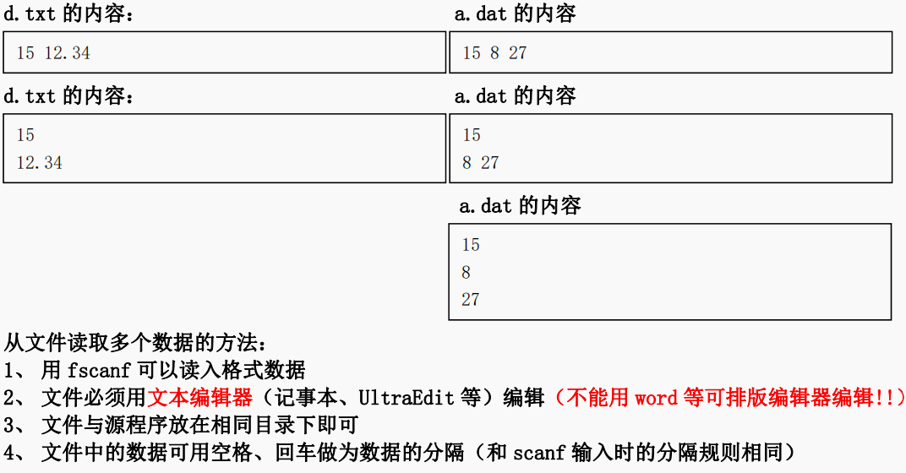

3. 操作说明
    
    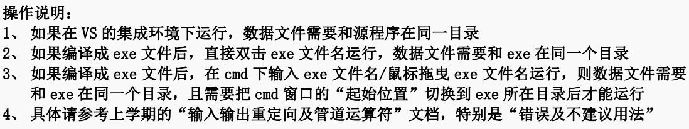

## C方式将输出放入文件

1. 读取数据并输出到屏幕

    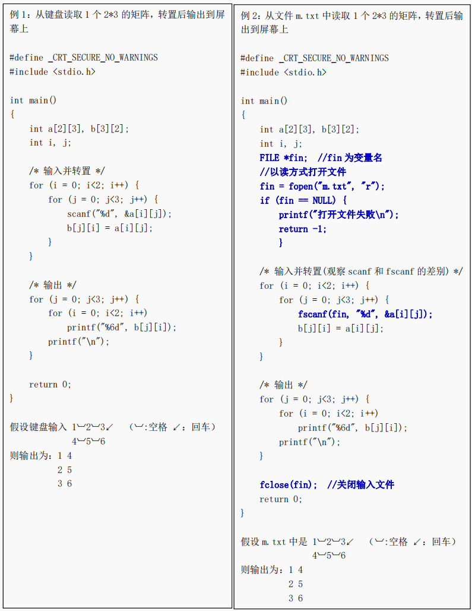

2. 读取数据并输出到文件

    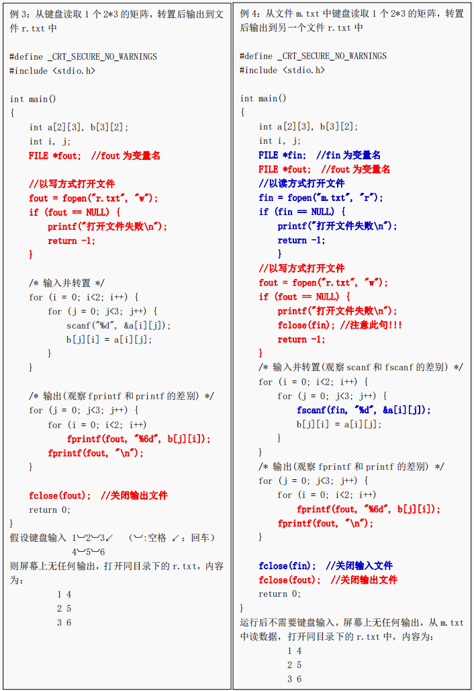

3. 操作说明

    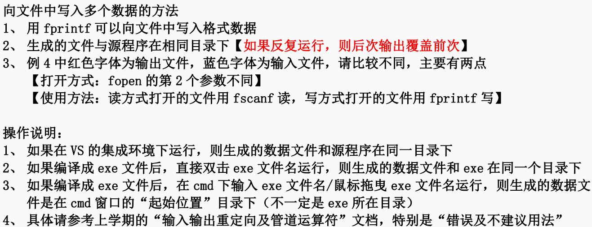


# 一些传送门

[shenjianB站主页](https://space.bilibili.com/385714455)

[一篇优质博客](https://blog.csdn.net/qianhen123/article/details/19088839)


