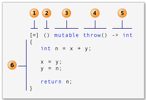
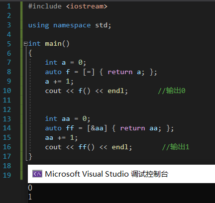

# Lambda 表达式

C++11的一大亮点就是引入了Lambda表达式。利用Lambda表达式，可以方便的定义和创建匿名函数。对于C++这门语言来说来说，“Lambda表达式”或“匿名函数”这些概念听起来好像很深奥，但很多高级语言在很早以前就已经提供了Lambda表达式的功能，如C#，Python等。

<br>
<br>

## 声明Lambda表达式

### Lambda表达式完整的声明



```cpp
[capture list] (params list) mutable -> return type { function body }
```
各项具体含义如下：
1. capture list：捕获外部变量列表
2. params list：形参列表
3. mutable指示符：用来说用是否可以修改捕获的变量
    可以填mutable,exception,attribute（选填）

    mutable说明lambda表达式体内的代码可以修改被捕获的变量，并且可以访问被捕获的对象的non-const方法。

    exception说明lambda表达式是否抛出异常以及何种异常。

    attribute用来声明属性。

4. exception：异常设定
5. return type：返回类型
6. function body：函数体

<br>

### 声明不完整的Lambda表达式

此外，我们还可以省略其中的某些成分来声明“不完整”的Lambda表达式，常见的有以下几种：
1. [capture list] (params list) -> return type {function body}
2. [capture list] (params list) {function body}
3. [capture list] {function body}

格式1声明了const类型的表达式，这种类型的表达式不能修改捕获列表中的值。

格式2省略了返回值类型，但编译器可以根据以下规则推断出Lambda表达式的返回类型： 
1. 如果function body中存在return语句，则该Lambda表达式的返回类型由return语句的返回类型确定； 
2. 如果function body中没有return语句，则返回值为void类型。

格式3中省略了参数列表，类似普通函数中的无参函数。


<br>
<br>

## 捕获外部变量

Lambda表达式可以使用其可见范围内的外部变量，但必须明确声明（明确声明哪些外部变量可以被该Lambda表达式使用）。那么，在哪里指定这些外部变量呢？Lambda表达式通过在最前面的方括号[]来明确指明其内部可以访问的外部变量，这一过程也称过Lambda表达式“捕获”了外部变量。

### (a)值捕获

值捕获和参数传递中的值传递类似，被捕获的变量的值在Lambda表达式创建时通过值拷贝的方式传入，因此随后对该变量的修改不会影响影响Lambda表达式中的值。

```cpp
int a = 123;
auto f = [a] { cout << a << endl; }; 
a = 321;
f(); // 输出：123
```
<br>

### (b)引用捕获

使用引用捕获一个外部变量，只需要在捕获列表变量前面加上一个引用说明符&

```cpp
int a = 123;
auto f = [&a] { cout << a << endl; }; 
a = 321;
f(); // 输出：321
```

<br>

### 注意点

一个容易出错的细节是lambda表达式的延迟调用，lambda表达式按值捕获了所有外部变量。

在捕获的一瞬间，a的值就已经被复制了。如果希望lambda表达式在调用时能即时访问外部变量，我们应当使用引用方式捕获。



注意看第一块，计算后面对a进行修改，输入仍为捕获时的值

没有捕获变量的lambda表达式可以直接转换为函数指针，而捕获变量的lambda表达式则不能转换为函数指针。

```cpp
typedef void(*Ptr)(int*);
 
Ptr p = [](int* p) { delete p; };            //OK
Ptr p1 = [&] (int* p) { delete p; };         //error
```

<br>

### (c)隐式捕获

上面的值捕获和引用捕获都需要我们在捕获列表中显示列出Lambda表达式中使用的外部变量。除此之外，我们还可以让编译器根据函数体中的代码来推断需要捕获哪些变量，这种方式称之为隐式捕获。隐式捕获有两种方式，分别是[=]和[&]。[=]表示以值捕获的方式捕获外部变量，[&]表示以引用捕获的方式捕获外部变量。

```cpp
int a = 123;
auto f = [=] { cout << a << endl; };    // 值捕获
f(); // 输出：123

int a = 123;
auto f = [&] { cout << a << endl; };    // 引用捕获
a = 321;
f(); // 输出：321
```

<br>

### (d)混合方式

上面的例子，要么是值捕获，要么是引用捕获，Lambda表达式还支持混合的方式捕获外部变量，这种方式主要是以上几种捕获方式的组合使用。

|捕获形式|说明|
|-----|---|
|[]|不捕获任何外部变量
|[变量名, …]|默认以值得形式捕获指定的多个外部变量（用逗号分隔），如果引用捕获，需要显示声明（使用&说明符）|
|[this]|以值的形式捕获this指针，捕获当前类中的this指针，让lambda表达式拥有和当前类成员函数同样的访问权限|
|[=]|以值的形式捕获所有外部变量|
|[&]|以引用形式捕获所有外部变量|
|[=, &x]|变量x以引用形式捕获，其余变量以传值形式捕获|
|[&, x]|变量x以值的形式捕获，其余变量以引用形式捕获,|

<br>
<br>

## 修改捕获变量

前面我们提到过，在Lambda表达式中，如果以传值方式捕获外部变量，则函数体中不能修改该外部变量，否则会引发编译错误

修改值捕获的外部变量，就需要使用mutable关键字，该关键字用以说明表达式体内的代码可以修改值捕获的变量

```cpp
int a = 123;
auto f = [a]()mutable { cout << ++a; }; // 不会报错
cout << a << endl; // 输出：123
f(); // 输出：124
```

需要注意：

被mutable修饰的lambda表达式就算没有参数也要**写明参数列表**。

<br>

原因：

lambda表达式可以说是就地定义仿函数闭包的“语法糖”。

它的捕获列表捕获住的任何外部变量，最终均会变为闭包类型的成员变量。

按照C++标准，lambda表达式的operator()默认是const的，一个const成员函数是无法修改成员变量的值的。

而mutable的作用，就在于取消operator()的const。

```cpp
int a = 0;
auto f1 = [=] { return a++; };                  //error
auto f2 = [=] () mutable { return a++; };       //OK
```
<br>
<br>

## Lambda表达式的参数

在Lambda表达式中传递参数还有一些限制，主要有以下几点：
1. 参数列表中不能有默认参数
2. 不支持可变参数
3. 所有参数必须有参数名

通过“函数体”后面的‘()’传入参数

```cpp
int n = [] (int x, int y) { return x + y; }(5, 4);
```

<br>
<br>

