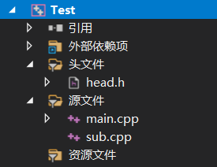

# 指针在头文件中的注意事项

## 一个简单案例

有一个项目由如下文件组成：



头文件：head.h
```cpp
#pragma once
#include <iostream>

const char p0[3] = "p0";
const char* p1 = "p1";
const char* const p2 = "p2";
char* const p3 = (char*)"p3";
const char p4[2][3] = {"p4","p4"};
char p5[2][3] = {"p5", "p5"};
```

主源文件：main.cpp
```cpp
#include <iostream>
#include "head.h"

using namespace std;

int main()
{

	return 0;
}
```

次源文件：sub.cpp
```cpp
#include <iostream>
#include "head.h"

using namespace std;
```

在这短短几行代码中，就有一处错误，也是我在做Shenjian老师大作业的时候遇到的。

照理来说，常变量可以放在头文件中定义，但是哪里有错误呢？

错误如下：


可以看出，头文件中的
```cpp
const char* p1 = "p1";
char p5[2][3] = {"p5", "p5"};
```
是导致出错的关键

## 原因分析

&emsp;&emsp;在Yemaoyao学长的帮助下，我明白了为什么。

<br>

&emsp;&emsp;首先我们需要了解C++的编译过程。C++中，每个.cpp文件都是一个单独的翻译单元，#include包含头文件是简单的文本替换，各自独立编译完成后，再链接起来。

&emsp;&emsp;如果你在头文件中定义了一个变量，那么，每个翻译单元都会包含这个变量，链接的时候，就会报出多重定义的错误了。因此，头文件中只能定义常量。

<br>

&emsp;&emsp;对于指针变量，少加了第二个const就成了变量了。（第一个const代表指向的内容不变，而第二个const表示指向的位置不变）。从上述例子中，不难发现，其实第二个const是不能少的。

&emsp;&emsp;而对于数组来说，本身的地址就是不能变的，所以需要加上第一个const代表本身的内容也不变（从p4、p5的不同结果可以看出）。


