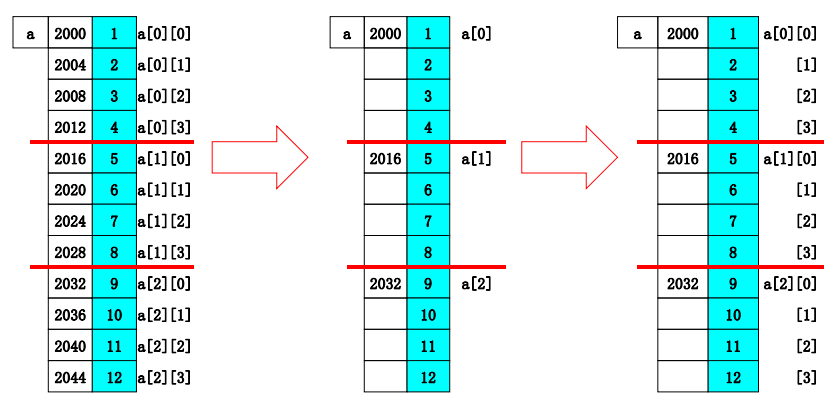
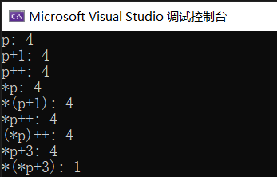

# 指针

## 指针基础

### 一、基本概念

 数据在内存中的存放:

&emsp;&emsp;根据不同的类型存放在动态/静态数据区

&emsp;&emsp;数据所占内存大小由变量类型决定：sizeof()

<br>

 内存地址

&emsp;&emsp;①给内存中的每一个字节的编号

&emsp;&emsp;②内存地址的表示根据内存地址的大小分为（16、32、64位）

&emsp;&emsp;（一般称为地址总线的宽度，是CPU的理论最大寻址范围）

<br>

内存中内容的访问

&emsp;&emsp;①直接访问：按变量的地址取变量值
     
&emsp;&emsp;②间接访问：通过某个变量取另一个变量的地址，再取另一变量的值（访问两次内存）

<br>


指针变量与指针

&emsp;&emsp;指针变量：存放地址的变量

&emsp;&emsp;指 针 ：某一变量的地址  （地址==指针）

<br>


### 二、变量与指针
定义指针变量

&emsp;&emsp;数据类型 *变量名;  （表示该变量为指针变量，指向该数据类型） 
    
&emsp;&emsp;变量中存放的是指向该数据类型的地址

指针变量所占空间

&emsp;&emsp;与基类型无关，与系统的地址总线宽度有关

&emsp;&emsp;eg:16位地址（2字节），32位地址（4字节）


**&emsp;&emsp;基类型的作用是指定通过该指针变量间接访问的变量类型及所占空间大小**


*、&的使用

&emsp;&emsp;变量名 = 地址
&emsp;&emsp;*变量名 = 值

&emsp;&emsp;&表示取变量的地址，*表示取指针变量的值
&emsp;&emsp;两者优先级相同，右结合

指针变量的++/--
    
&emsp;&emsp;指针变量++/--的单位是该指针变量的 **基类型**

<br>
<br>

## 指针进阶

### 一、多维数组与指针

1、一维数组的地址

一维数组的理解方法（下标法、指针法）
```cpp
int a[12]={1,2,3,4,5,6,7,8,9,10,11,12};
```

&emsp;&emsp;**a** : 数组名/数组的首元素地址(<=>&a[0])

&emsp;&emsp;**&a[i]** : 第i个元素的地址（下标法）

&emsp;&emsp;**a+i** : 第i个元素的地址（指针法）

&emsp;&emsp;**a[i]** : 第i个元素的值（下标法）

&emsp;&emsp;**\*(a+i)** : 第i个元素的值（指针法）


<br>

2、二维数组的地址
```cpp
int a[3][4]={{1,2,3,4},
             {5,6,7,8},
             {9,10,11,12}};
```


*建立的数组*

**&emsp;&emsp; 注意 ：计算机内部数组都是一维的 ！！**

&emsp;&emsp;**a** :&emsp; 1. 二维数组的数组名，即a

&emsp;&emsp;&emsp;&emsp; 2. 三元素一维数组的数组名

&emsp;&emsp;&emsp;&emsp; 3. 三元素一维数组的首元素地址，&a[0]

&emsp;&emsp;**&a[i]** : 三元素一维数组的第i个元素的地址

&emsp;&emsp;**a + i** : 三元素一维数组的第i个元素的地址（同上）

&emsp;&emsp;**a[i]** : 三元素一维数组的第i个元素的值

&emsp;&emsp;&emsp;&emsp;（即四元素一维数组的数组名，也即四元素一维数组的首元素的地址）

&emsp;&emsp;**\*(a+i)** : 三元素一维数组的第i个元素的值（同上）

**&emsp;&emsp;P.S. 三元素一维数组的元素就是四元素一维数组的数组名**


*二维数组加两个下标的理解方法*


*地址增量的变化规律*

<br>


**运行实例**
```cpp
#include <iostream>

using namespace std;

int main()
{
	cout << "这里的输出的结果是十六进制" << endl;
	cout << "想要看到具体相差字节数可将十六进制转为十进制" << endl;

	int a[3][4] = { 0, };
	//行地址
	cout << "a        :" << a << endl;           //a地址，&a[0]，基类型是一个四元素数组（16字节）
	cout << "(a+1)    :" << (a + 1) << endl;     //a地址+16 （四元素数组占16字节）
	cout << "(a+1)+1  :" << (a + 1) + 1 << endl; //a地址+32 （不要被这里的+1，+1迷惑，其实相当于(a+2)）
	//元素地址
	cout << "*(a+1)   :" << *(a + 1) << endl;    //a地址+16  *(a+1) => *(&a[1]) => a[1] => &a[1][0] ，基类型是一个int
	cout << "*(a+1)+1 :" << *(a + 1) + 1 << endl;//a地址+20  在上一行的基础上加一个基类型int（4字节）
	cout << "a[2]     :" << a[2] << endl;        //a地址+32  a[2] => &a[2][0]
	cout << "a[2]+1   :" << a[2] + 1 << endl;	 //a地址+36  在上一行的基础上加一个基类型int（4字节）
	//行地址
	cout << "&a[2]    :" << &a[2] << endl;       //a地址+32  和第一组一样，基类型是四元素数组（16字节）
	cout << "&a[2]+1  :" << &a[2] + 1 << endl;   //a地址+48  在上一行的基础上加一个基类型（16字节）
	return 0;
}
```
*结果如下：*


<br>


**另一种验证方法**

### 心得:
**&emsp;&emsp;在研究高维指针的时候，如果遇到像a这样难以分析的情况，我们可以将他写为&a[0],这样就可以比较容易的进行分析。同时因注意指针的基类型。**


```cpp
#include <iostream>

using namespace std;

int main()
{
	int a[3][4] = { {1,2,3,4} ,
					{5,6,7,8},
					{9,10,11,12} };
	//按一维方式循环
	int *p = &a[0][0];
	for (int i = 0; i < 12; i++)
	{
		cout << *p++ << "  ";
		//优先级结合性，先后缀++，再解引用（但是还是对p进行解引用，此时p还没有++）
		if (i % 4 == 3)
			cout << endl;
	}
	//按二维方式
	int(*q)[4] = &a[0];
	for (int i = 0; i < 3; i++)
	{
		for (int j = 0; j < 4; j++)
		{
			cout << *(*(q + i) + j) << "  ";
		}
		cout << endl;
	}

	return 0;
}
```
*结果如下：*


&emsp;&emsp;当然我们也可以换一种函数参数传递方式（本质上仍然是指向m个元素组成的一维数组的指针变量）：

```cpp
#include <iostream>

using namespace std;

void f1(int (*x1)[4])
{
	cout << "sizeof(x1)   : " << sizeof(x1) << endl;//指针&a[0]（退化了）
	cout << "sizeof(*x1)  : " << sizeof(*x1) << endl;//a[0]数组，四元素
	cout << "sizeof(**x1) : " << sizeof(**x1) << endl;//int型
}
void f2(double (*x1)[4])
{
	cout << "sizeof(x1)   : " << sizeof(x1) << endl;//指针&b[0]（退化了）
	cout << "sizeof(*x1)  : " << sizeof(*x1) << endl;//b[0]数组，四元素
	cout << "sizeof(**x1) : " << sizeof(**x1) << endl;//double型
}

int main()
{
	int a[3][4] = { {1,2,3,4} ,
					{5,6,7,8},
					{9,10,11,12} };
	double b[3][4] = { {1,2,3,4} ,
					{5,6,7,8},
					{9,10,11,12} };
	cout << "int:" << endl;
	cout << "a_size:      : " << sizeof(a) << endl;
	cout << "sizeof(a + 0): " << sizeof(a + 0) << endl;
	f1(a);
	cout << endl;

	cout << "double:" << endl;
	cout << "b_size:      : " << sizeof(b) << endl;
	cout << "sizeof(b + 0): " << sizeof(b + 0) << endl;
	f2(b);

	return 0;
}
```


<br>
<br>
<br>

## 函数指针
### 一、函数的地址
程序（代码）区：存放程序的执行代码

&emsp;&emsp;由若干函数的代码组成，每个函数占据一段**连续**的内存空间

&emsp;&emsp;每个函数的内存空间的起始地址，称为**函数的地址（指针）**

&emsp;&emsp;**函数名代表函数的首地址**

### 二、用函数指针变量调用函数
①函数指针变量的定义：

&emsp;&emsp;数据类型 （\*指针变量名）（形参表）;

&emsp;&emsp;指针变量的数据类型和形参表应与想要指向的函数**保持一致**

&emsp;&emsp;eg:
```cpp
	int (*p)(int,int);//函数指针变量，函数的形参为两个int,返回类型是int
```

&emsp;&emsp;**注意：这里的 \* p必须用括号括起，因为（）的优先级比\*高 ！！！！**

②函数指针变量的使用：

&emsp;&emsp;赋&emsp;初&emsp;值： 指针变量名=函数名 **不要参数表**

&emsp;&emsp;调&emsp;&emsp;&emsp;用： 指针变量名（函数实参表列）


```cpp
#include <iostream>

using namespace std;

int fun()
{
	return 37;
}

int main()
{
	int (*p)();
	p = fun;

	cout << "fun(): " << fun() << endl;
	cout << "fun  : " << fun << endl;
	cout << "*fun : " << *fun << endl;

	cout << "p()  : " << p() << endl;
	cout << "p    : " << p << endl;
	cout << "*p   : " << *p << endl;

	return 0;
}
```


&emsp;&emsp;由此可见：p和\*p都是函数的首地址

三、使用指针来调用函数

&emsp;&emsp;有如下两种方式：
```cpp
	double pam(int);
	double (*pf)(int);
	pf=pam;  //赋值不用参数名
	//方式1：
	double x=(*pf)(4);
	//方式2：
	double y=pf(4);  //C++也允许这样
```
&emsp;&emsp;第一种的格式虽然不太好看，但它给出了强有力的提示————**代码正在使用函数指针**。虽然我们*shenjian*老师的PPT上写着“都正确，一般使用后者”，但是我觉得前者会更好一些。

C++ Primer Plus中给出的解释（**历史原因**）:

&emsp;&emsp;*"真是非常棒的语法！为何 pf 和（\*pf）等价呢？一种学派认为，由于 pf 是函数指针，而\*pf 是函数，
因此应将（\*pf）( )用作函数调用。另一种学派认为，由于函数名是指向该函数的指针，指向函数的指针的
行为应与函数名相似，因此应将 pf( )用作函数调用使用。C++进行了折衷—这 2 种方式都是正确的，或
者至少是允许的，虽然它们在逻辑上是互相冲突的。在认为这种折衷粗糙之前，应该想到，容忍逻辑上无
法自圆其说的观点正是人类思维活动的特点。"*

<br>
<br>

&emsp;&emsp;**指向函数的指针的形参表声明时，与被调用函数的形参表类型、顺序、数量一致，但是是否带形参变量名、名称是否一致不做要求。**

&emsp;&emsp;**另外，对指向函数的指针变量进行指针运算是无意义的**

<br>
<br>

## 指向类对象的成员、成员函数的指针
我觉得这部分用法比较“古怪”，而且比较容易出错，所以单独列出来一章。
```cpp
#include <iostream>

using namespace std;

class Example
{
private:
	int feet;
	int inches;
public:
	Example();//构造函数
	Example(int ft);//构造函数重载
	~Example();//析构函数
	void show_in() ;
	void show_ft() const;
	void use_ptr() const;
	//const表示不会改变类对象的成员
};//注意这里的分号不要漏掉

```
先定义一个指向标识符 inches 的成员指针：
```cpp
	int Example::*pt=&Example::inches;
```
&emsp;&emsp;**注意：** 这种指针与常规指针有所差别。常规指针指向特定的内存单元，而 pt 指针并不指向特定的内存单元，因为声明中没有指出具体的对象。指针 pt 指的是 **inches 成员在任意 Example 对象中的位置。**

**还有一点需要注意的是，这个例子是*C++ Primer Plus*中的，但是我在实际测试中，发现他是有问题的，这里'inches'是private,是无法通过指针访问的，只有public成员才可以这样访问**测试如下：


可以看到，test可以访问，而feet不行。


<br>
<br>

### 指向成员函数的指针
一、指向成员函数的指针的声明和赋值

定义（声明）：**成员函数返回类型 (类::\*指针变量名)(形参表)**

赋&emsp;&emsp;&emsp;值&emsp;： **指针变量名=&类::成员函数名;**

&emsp;&emsp;声明指向成员函数的指针时，必须指出该函数所属的类。

```cpp
	Example obj;

	void (Example:: * fp1)();
	void (Example:: * fp2)() const;

	fp1 = &Example::show_in;
	fp2 = &Example::show_ft;
```
&emsp;&emsp;编译不会有任何问题。

&emsp;&emsp;**注意①： Example::\*fp 必须放在括号中，否则根据优先级结合性，fp会先于括号结合**

&emsp;&emsp;**注意②： 和普通函数指针的赋值不然，这里必须使用地址运算符\&**


&emsp;&emsp;另外，对于常量成员函数，声明指针的时候，也要对应加上关键字 **const** 否则编译器将会报错（声明时报错，调用报错）。实验结果如下：

```cpp
	//注意：与上方的代码并不相同
	Example obj;

	void (Example:: * fp1)() const;
	void (Example:: * fp2)() ;

	fp1 = &Example::show_in;
	fp2 = &Example::show_ft;
```


二、指向成员函数的指针的调用

使&emsp;&emsp;&emsp;用&emsp;：**(对象名.\*指针变量名)(实参表)**
```cpp
	Example obj;

	void (Example:: * fp1)();
	void (Example:: * fp2)() const;

	fp1 = &Example::show_in;
	fp2 = &Example::show_ft;

	(obj.*fp1)();
	(obj.*fp2)();
```
&emsp;&emsp;**注意：\*不要忘记**

<br>

## 返回指针值的函数

定&emsp;&emsp;&emsp;义&emsp;：
**返回基类型 \*函数名 (形参表)**

```cpp
int *fun(int x);
float *
```
&emsp;&emsp;**注意①： 这里并不需要加括号，否则就成了函数指针**

&emsp;&emsp;**注意②： 函数的返回值必须是指针，即应该返回一个指针（地址）**

&emsp;&emsp;**注意③： 不能返回一个自动变量或是形参的地址，否则可能出错，（VS2019下有编译警告），读非法空间而未写，不会死机，空间被释放**

<br>

### 补充：类和结构体相关
```cpp
#include <iostream>

using namespace std;

struct stu
{
	int num;
	int number;
	void my_print()
	{
		cout << "num: " << num << endl;
	}
};

class Stu
{
private:
	int num;
public:
	int number;
	Stu(int a, int c)
	{
		num = a, number = c;
	}
	void my_print()
	{
		cout << "num: " << this->num << endl;
	}
};

int main()
{
	stu lzy = { 1234,12 };//结构体
	Stu LZY(5678, 56);//类

	//结构体
	int *ps = &lzy.number;//直接指向一个结构体变量的成员
	cout << *ps << endl;//直接使用解引用运算符*即可
	void (stu:: * pps)() = &stu::my_print;//指向成员函数
	(lzy.*pps)();//使用时不要忘记加上类对象名，.和*，还有括号
	int stu:: *ppps = &stu::number;//指向每一个结构体变量的同一成员
	cout << lzy.*ppps << endl;//使用时需要加上结构体变量名以及.和*
	cout << endl << endl;
	//类
	int *p = &LZY.number;//直接指向一个类对象的成员
	cout << *p << endl;//直接使用解引用运算符*即可
	void (Stu:: * pp)() = &Stu::my_print;//指向成员函数
	(LZY.*pp)();//使用时不要忘记加上类对象名，.和*，还有括号
	int Stu:: *ppp = &Stu::number;//指向每一个类对象的同一成员
	cout << LZY.*ppp << endl;//使用时需要加上类对象名以及.和*
	
	return 0;
}
```
结果如图所示：


&emsp;&emsp;总结，通过上述代码可以看到，其实结构体和类的成员、成员函数的调用方式十分类似。

&emsp;&emsp;对于成员函数，我们只有一种方式。声明时，我们需要使用如下方式：

&emsp;&emsp;**成员函数返回类型 (类/结构体名:: \* 指针名)(形参表) = &类/结构体名::成员函数名;**

&emsp;&emsp;调用时，要使用如下方式：

&emsp;&emsp;**(类对象/结构体变量名.\*指针名)(实参表);**

&emsp;&emsp;注意括号不要少。

&emsp;&emsp;对于成员，我们有两种方式，一是直接指向某一个类对象的某一个成员，另外一种是指向所有成员函数的某一个变量。值得注意的是，无论是哪一种都需要成员是**public**（类对象要保证public，结构体默认public）。

```cpp
class test
{
private:
	int a = 5;
public:
	void output1()const
	{
		cout << "1"<< endl;
	}
	void output2()const
	{
		cout << "2" << endl;
	}
	
};


int main()
{
	test t;
	void(test:: * fp[2])()const = { &test::output1,&test::output2 };
	void(test:: * fp1)()const = &test::output1;
	void(test:: * fp2)()const = &test::output2;

	(t.*fp1)();
	(t.*fp2)();
	(t.*fp[0])();
	(t.*fp[1])();

	return 0;
}
```

<br>
<br>
<br>

## 空指针NULL
&emsp;&emsp;指针允许有空值NULL（系统宏定义#define NULL 0），表示不知向任何变量（若定义指针变量未赋初值，则随机指向，称为野指针）。

&emsp;&emsp;任何操作系统的地址0都不可能被分配给普通变量，因为是操作系统中的重要内容,所以用0代表空指针，与未赋初值不同。

### NULL与空字符串的区别
```cpp
char *s1=NULL;
char *s2="";
char s3[]="";
char s4[]=NULL;//错误
```
&emsp;&emsp;s1是指针，存放地址0，地址0中的内容不一定是'\0'，即strlen(s1)不一定为0。

&emsp;&emsp;s2是指针，存放一个长度为0的无名字符串常量的首地址（有效的地址一定是非0），strlen(s2)=0。

&emsp;&emsp;char s3[]="";<=>char s3[1]=""，sizeof(s3)=1，占一个字节，内容是尾零，strlen是0

&emsp;&emsp;char s4[]=NULL; 错，不能用无{}的一个数字来初始化

**系统的字符串操作函数若传入参数为NULL则会出错（包括strcpy、strcat、strcmp、strlen、strncpy、strncmp等等）**


<br>
<br>

## 不同基类型的指针相互赋值
原则：**不同类型的指针变量不能相互赋值，若要赋值，则需要进行强制类型转换。**

<br>
<br>

## 指针数组

含义：元素类型是指针的数组

定义：**数据类型 \*数组名[数组长度]**

```cpp
int *p[4];
```
理解：按照优先级结合性。p[4]代表p是一个数组，然后int \*指明数组的元素类型是基类型为int的指针。

使用：**保证数组的每一个元素为基类型为数据类型的指针**，使用时匹配即可，可进行所允许的任何运算。

### 二维字符数组和一维指针数组的区别
二维字符数组：


优点：
1. 与无名字符串常量**分占不同空间**
2. 字符串的值可以**修改**

缺点：
1. 空间浪费（填不满）
2. 交换空间麻烦，需要使用**strcpy**等函数

<br>
<br>

一维指针数组：


优点：
1. 节约空间
2. 交换只需要交换指针值即可，**效率高**

缺点：
1. 指针指向的是无名字符串常量，无法改变字符串的值

总结：
1. 二维字符数组分配实际的字符串存储空间，在执行过程中可以修改字符串任意位置的值
2. 一维指针数组不分配实际的字符串存储空间，只是指向字符串常量，执行过程中字符串值不能改变

<br>
<br>

## 指向指针的指针

定义：**数据类型 \*\*指针变量名**

&emsp;&emsp;int **p;

理解：*p表示p是一个指针变量，它指向一个指针变量a，该指针变量a的基类型是int

定义时赋初值：**int i=10,\*t=&i,\*\*p=&t;**

1. p->地址（指向普通变量的指针变量的地址）
2. \*p->地址（普通变量的地址）
3. \*\*p->普通变量

```cpp
#include <iostream>

using namespace std;

int main()
{
	const char *a[3] = { "china","student","s" };
	const char **p;
	p = a;

	cout << "p: " << sizeof(p) << endl;
	cout << "p+1: " << sizeof(p + 1) << endl;
	cout << "p++: " << sizeof(p++) << endl;
	cout << "*p: " << sizeof(*p) << endl;
	cout << "*(p+1): " << sizeof(*(p + 1)) << endl;
	cout << "*p++: " << sizeof(*p++) << endl;
	cout << "(*p)++: " << sizeof((*p)++) << endl;
	cout << "*p+3: " << sizeof(*p + 3) << endl;
	cout << "*(*p+3): " << sizeof(*(*p + 3)) << endl;

	return 0;
}
```

<br>



具体理解如下：


<br>
<br>
<br>

## const指针
共用数据的保护：

&emsp;&emsp;一个数据可以通过不同的方式进行共享访问，因此可能导致数据因为误操作而改变，为了达到既能共享，又不会因误操作而改变，引入公用数据保护的概念。

### 指向常量的指针变量

形式：

const 数据类型 *指针变量名; &emsp;或 &emsp;数据类型 const *指针变量名; 

作用：
1. 不能通过指针修改变量的值（**仍可以通过变量修改**）
2. 指针变量可u有指向其他同类型变量（**不必在定义时初始化**）
3. 适用于不希望通过指针修改变量值的情况
4. **指向常量的指针可以指向常变量、普通变量，但是普通指针不能指向常变量**

对应于函数参数传递，有如下原则：

①&emsp;形参：普通指针

&emsp;&emsp;实参：普通变量指针（*不能是常变量指针*）

②&emsp;形参：常变量指针

&emsp;&emsp;形参：普通变量指针、常变量指针均可


综上，基本原则：**赋权不能大于原权！！！**

<br>

### 常指针
形式：**数据类型 \*const 指针变量名;**

作用：
1. 可以通过指针修改变量的值
2. 指针变量指向固定变量（**必须在定义时初始化**）后，**不能**再指向其他变量
3. 适用于希望指针始终指向某个变量的情况
4. 常指针不能指向常变量。原因：常变量是只读的，而常指针是可读可写的。（解决方案：**指向常量的常指针**）
```cpp
#include <iostream>

using namespace std;

void f(int *const p)
{
	return;
}

int main()
{
	const int x = 10;
	int *const px = &x;
	f(&x);
	return 0;
}
```


<br>

一些例子：
```cpp
void f1(int *p)
{
	return;
}

void f2(int *const p)
{
	return;
}

int main()
{
	int x = 0;
	int *const p = &x;
	f1(p);
	f2(p);
	f1(&x);
	f2(&x);

	return 0;
}
```
上述程序能够运行，没有error和warning。

容易让人产生疑惑的是f1(p)，因为基本原则是**赋权不能大于原权**，而显然，p是一个常指针，而f1函数的形参是一个普通指针变量，难道不会有问题吗？我在这里也纠结了很久，但后来发现了，**进行f1()函数并不会改变p的指向，而通过p改变x的值是可行的**，所以上述程序都能运行。

<br>
<br>

### 指向常量的常指针
形式：**const 数据类型 \* const 指针变量名;**

作用:
1. 不能通过指针值修改变量值
2. 指针变量指向固定变量（必须在定义时初始化）后，不能再指向其他同类型变量
3. 适用于即希望始终指向固定变量，又不希望通过指针修改变量值的情况。

两个例子：

Example①：程序可以正常运行
```cpp
void f(int const *const p)
{
	return;
}

int main()
{
	int x1 = 0;
	f(&x1);
	const int x2 = 10;
	f(&x2);

	return 0;
}
```

Example②：两个错误
```cpp
void f(int *p)
{
	return;
}

int main()
{
	int x1 = 0;
	int const *const p1 = &x1;
	f(p1);
	const int x2 = 10;
	int const *const p2 = &x2;
	f(p2);

	return 0;
}
```


<br>
<br>

## void指针类型
含义：指向空类型的指针变量

使用：
1. 不能直接通过void指针访问数据，**不知道基类型**，必须强制类型转换为某种确定数据类型后才能访问
2. 非void型指针可直接赋值给void类型指针（反正指针大小相同），反之则必须强制类型转换
3. void型指针变量不能进行相互运算**不知道基类型**

<br>
<br>

## 小练习
练习①：
```cpp
int *(*p)();//1
int *(*p)[n];//2
int (*p[n])();//3
int *(*p[n])();//4
```
1. 函数指针，返回类型为int*
2. 数组指针，数组元素为int*
3. 函数指针数组，返回类型为int，形参表为空
4. 函数指针数组，返回类型为int*，形参表为空

<br>

练习②：以下例子均正确，可以与上面的练习配套理解


<br>
<br>

## 引用

### 基本使用
int a=10,&b=a;

访问a就是访问b，对a的修改就是对b的修改。


函数形参声明为引用，实参传自身即可。
```cpp
void swap(int &a,int &b)
{
	int t=0;
	t=a;
	a=b;
	b=t;
}
int main()
{
	int i=3,j=5;
	swap(i,j);
	cout<<i<<"  "<<j<<endl;
	return 0;
}
```
函数没有给a、b分配空间，只是i、j的别名。与传地址不同，地址分配了空间。

### 数组引用做函数参数
```cpp
#include <iostream>

using namespace std;

void test1(char *s1, const char *s2)
{
	cout << sizeof(s1) << endl;
	cout << sizeof(s2) << endl;
}
void test2(char(&s1)[10], const char *s2)//这里的10必须和实参大小的10保持一致
{
	cout << sizeof(s1) << endl;
	cout << sizeof(s2) << endl;
}

int main()
{
	char s[10], t[] = "This is an apple.";
	test1(s, t);
	test2(s, t);
	return 0;
}
```


解释：**当形参为实参数组的引用，能够取得实参数组的大小**

注意：**test1()&test2()不能重载，因为调用时参数列表相同**

另外，**并不实用，形参是实参数组的引用，形参的声明大小与实参定义大小必须一致，无法适应不同长度的实参数组，否则会报错。**

推论：**形参是二维数组的引用，则形参声明与实参定义的行列大小都必须保持一致**

<br>

**两个重要例子**

**Example①**

```cpp
#include <iostream>

using namespace std;

void test(char(&ss)[10])
{}

int main()
{
	char s[10],*p=s;
	test(s);
	test(p);
	return 0;
}
```


结论：如果形参是数组的引用，则实参必须是数组名，而不能是指向数组的指针变量。

<br>

**Example②**

```cpp
#include <iostream>

using namespace std;

void test2(char(&s2)[10])
{
	cout << sizeof(s2) << endl;
}

void test1(char s1[])
{
	cout << sizeof(s1) << endl;
	test2(s1);//s1已经退化为指针，不再是数组名
}

int main()
{
	char s[10];
	test1(s);
	return 0;
}
```


结论：数组的引用在函数之间传递时，必须始终保持数组引用方式。

### 关于引用的特别说明
1. 引用在需要改变实参值的函数调用时比指针更容易理解，形式也更简洁，不容易出错
2. 引用不能完全替代指针
3. 引用是C++新增的，纯C的编译器不支持，后续学习中接触的大量底层代码仍是使用C编写的，无法使用引用

<br>
<br>

## 有意思的指针

