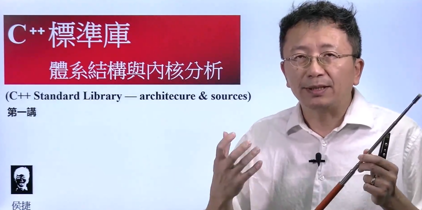
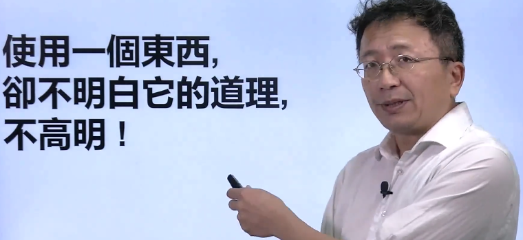
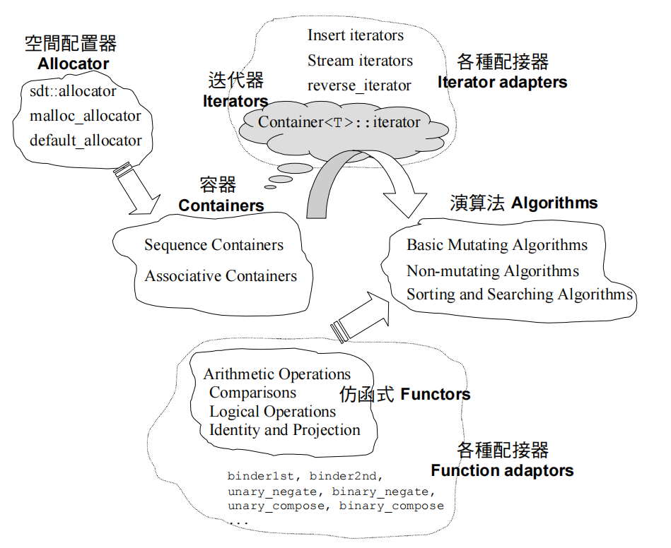
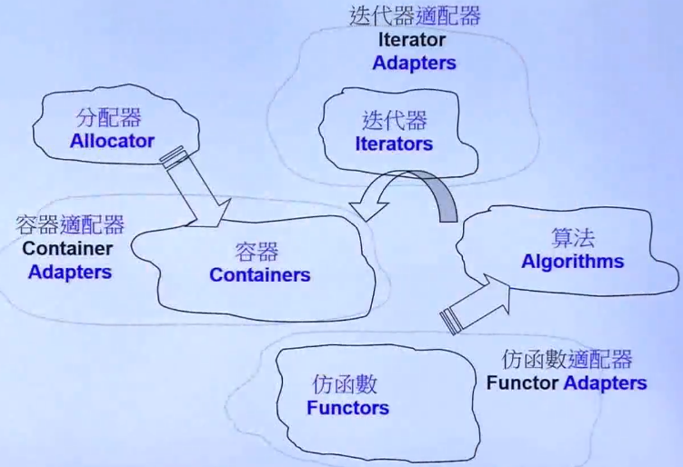
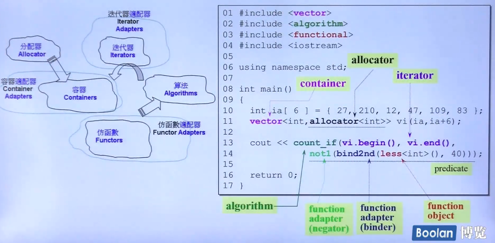
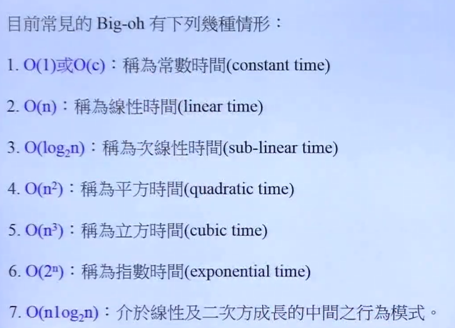
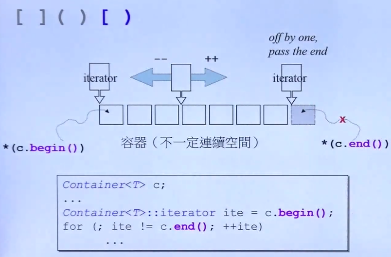
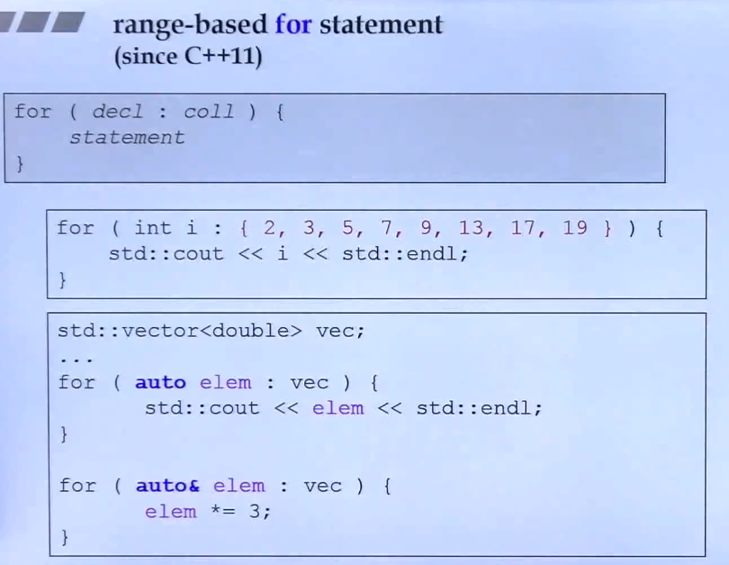
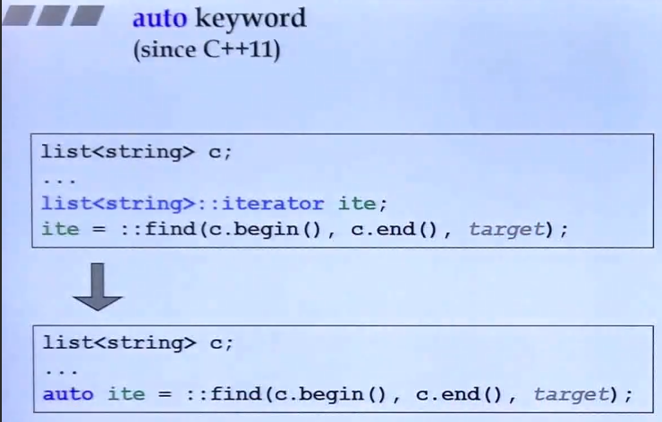
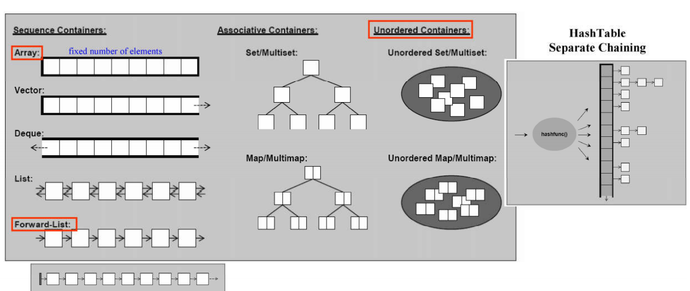

# STL

## Table of Contents

- [STL](#stl)
  - [Table of Contents](#table-of-contents)
- [全面理解STL标准库 - 双笙子佯谬](#全面理解stl标准库---双笙子佯谬)
- [C++ 标准库 体系结构 与 内核分析 - 侯捷](#c-标准库-体系结构-与-内核分析---侯捷)
  - [01 认识headers、版本、重要资源](#01-认识headers版本重要资源)
  - [02 STL体系结构基础介绍](#02-stl体系结构基础介绍)
  - [03 容器 分类与各种测试 1](#03-容器-分类与各种测试-1)
  - [04 容器 分类与各种测试 2](#04-容器-分类与各种测试-2)
  - [05 容器 分类与各种测试 3](#05-容器-分类与各种测试-3)
  - [06 容器 分类与各种测试 4](#06-容器-分类与各种测试-4)
  - [07 分配器 测试](#07-分配器-测试)
  - [08 源代码之分布 VC, GCC](#08-源代码之分布-vc-gcc)
  - [09 OOP 面向对象编程 vs GP 泛型编程](#09-oop-面向对象编程-vs-gp-泛型编程)
  - [10 技术基础：操作符重载and模板泛化, 全特化, 偏特化](#10-技术基础操作符重载and模板泛化-全特化-偏特化)
  - [11 分配器](#11-分配器)
  - [12 容器之间的实现关系与分类](#12-容器之间的实现关系与分类)
  - [13 深度探索 list (上)](#13-深度探索-list-上)
  - [14 深度探索 list (下)](#14-深度探索-list-下)
  - [15 迭代器的设计原则和Iterator Traits的作用与设计](#15-迭代器的设计原则和iterator-traits的作用与设计)
  - [16 vector 深度探索](#16-vector-深度探索)
  - [17 array、forward list 深度探索](#17-arrayforward-list-深度探索)
  - [18 deque、queue和 stack 深度探索 (上)](#18-dequequeue和-stack-深度探索-上)
  - [19 deque、queue和 stack 深度探索 (下)](#19-dequequeue和-stack-深度探索-下)
  - [20 RB tree 深度探索](#20-rb-tree-深度探索)
  - [21 set、multiset 深度探索](#21-setmultiset-深度探索)
  - [22 map、multimap 深度探索](#22-mapmultimap-深度探索)
  - [23 hashtable 深度探索 (上)](#23-hashtable-深度探索-上)
  - [24 hashtable 深度探索 (下)](#24-hashtable-深度探索-下)
  - [25 hash set、hash multiset, hash map、hash multimap 概念](#25-hash-sethash-multiset-hash-maphash-multimap-概念)
  - [26 unordered 容器概念](#26-unordered-容器概念)
  - [27 算法的形式](#27-算法的形式)
  - [28 迭代器的分类 category](#28-迭代器的分类-category)
  - [29 迭代器分类 category 对算法的影响](#29-迭代器分类-category-对算法的影响)
  - [30 算法源代码剖析 11个例子](#30-算法源代码剖析-11个例子)
  - [31 仿函数 和 函数对象](#31-仿函数-和-函数对象)
  - [32 存在多种Adapter](#32-存在多种adapter)
  - [33 Binder2nd](#33-binder2nd)
  - [34 not1](#34-not1)
  - [35 bind](#35-bind)
  - [36 reverse iterator](#36-reverse-iterator)
  - [37 inserter](#37-inserter)
  - [38 ostream iterator](#38-ostream-iterator)
  - [39 istream iterator](#39-istream-iterator)
  - [40 一个万用的 hash function](#40-一个万用的-hash-function)
  - [41 Tuple 用例](#41-tuple-用例)
  - [42 type traits](#42-type-traits)
  - [43 type traits 实现](#43-type-traits-实现)
  - [44 cout](#44-cout)
  - [45 movable 元素对于 deque 速度效能的影响](#45-movable-元素对于-deque-速度效能的影响)
  - [46 测试函数](#46-测试函数)
- [Understanding the C++ Standard Template Library](#understanding-the-c-standard-template-library)
  - [01.模板观念与函数模板](#01模板观念与函数模板)
    - [C++模板简介](#c模板简介)

---

# 全面理解STL标准库 - 双笙子佯谬

[全面理解STL标准库 vector容器 精讲](https://www.bilibili.com/video/BV1qF411T7sd/)

五大件
1. container    容器    - 存储数据
2. iterator     迭代器  - 指向数据，前后移动，类似指针(重载运算符)
3. algorithm    算法
4. functor      仿函数
5. allocator    分配器

---

# C++ 标准库 体系结构 与 内核分析 - 侯捷

[侯捷 - YouTube](https://www.youtube.com/playlist?list=PLTcwR9j5y6W2Bf4S-qi0HBQlHXQVFoJrP)

[侯捷 - Bilibili](https://www.bilibili.com/video/BV19u4y1J7dB/)

[侯捷 - Github](https://github.com/ZachL1/Bilibili-plus)

[STL 源码剖析 - 侯捷 - libgen](https://libgen.is/book/index.php?md5=6537AB49A4188713DD279012B0064A59)

## 01 认识headers、版本、重要资源

Generic Programming 泛型编程 使用 模板 template 为主要工具

STL 即为 泛型编程最成功的作品

**标准库 ≠ STL**
1. **ST**L - **Standard Template Library** - 标准模板库
2. **C++标准库** - **Standard Library**
   1. 以 header files 头文件 形式呈现
   2. **包括 STL**，还包括输入/输出(I/O, iostream)、多线程支持、时间和日期处理、随机数生成、智能指针、异常处理等其他功能
   3. 可以不带 `.h` 后缀 (`<vector>`, `<cstdio>`)
   4. 组件封装于 `std` 命名空间  `using namespace std;`

重要网页
1. [cplusplus.com](https://cplusplus.com)
2. [CppReference.com](https://CppReference.com)
3. [gcc.gnu.org](https://gcc.gnu.org)

## 02 STL体系结构基础介绍

六大部件 components
1. Container  - 容器
2. Allocator  - 分配器 (帮助容器分配内存，可以不写，有默认分配器)
3. Algorithm  - 算法 (模板函数)
4. Iterator   - 迭代器 (类似指针)
5. Adapter    - 适配器 (转换)
6. Functor    - 仿函数 (别称 function object)

**面向对象 OOP** - 数据 & 算法 在一个类中

**泛型编程 GP**  - 数据 & 算法 不在一个类中

`count_if` 允许指定一个 predicate (谓词，判断式)，这个 predicate 是一个函数或者函数对象，用来检查元素是否满足某个条件

`bind2nd` 接受这个函数对象 `less<int>()` 和一个值 40，然后创建一个新的一元函数对象

`bind2nd` 的基本作用是将 二元函数对象 和 特定的值 绑定，从而创建 新的一元函数对象，二元函数的第二个参数被固定为一个特定值，而第一个参数保持开放，新生成的一元函数对象在调用时只需要提供一个参数

`less<int>()` 是一个函数对象，用于比较两个 int 类型的值

**时间复杂度 Big-O**

**前闭后开区间** `[)`

所有容器都提供 `c.begin()` & `c.end()`

**C++11 新的遍历写法** coll = collection

使用 `auto&` 表示取出的是引用，可以用于修改值

**auto 关键词**

当 `::` 前面没有任何前缀时，它表示全局命名空间

## 03 容器 分类与各种测试 1

分类
1. **Sequence Container 序列式**
   1. Array   数组，前后都无法扩充
   2. Vector  向量，前不可扩充，后可扩充，分配器负责自动增长
   3. Deque   双向队列，两端可进可出
   4. List    双向链表
   5. Forward-List  单向链表，内存消耗比 List 少
2. **Associative Container 关联式**(元素有 key&value, 适合查找)，内部使用 红黑树(高度平衡二叉树，避免查找最坏情况)
   1. Set/Multiset
      1. 只存储 键key，不区分 key&value
      2. Set 内部 元素 不能重复，Multiset 可以重复
   2. Map/Multimap
      1. 每个节点有 key&value
      2. Map 内部 key 不能重复，Multimap 可以重复
3. **Unordered Container 不定序**(也属于 **Associative Container**)，内部使用 HashTable(Separate Chaining) 实现
   1. Unordered Set/Multiset
   2. Unordered Map/Multimap

## 04 容器 分类与各种测试 2

## 05 容器 分类与各种测试 3

## 06 容器 分类与各种测试 4

## 07 分配器 测试

## 08 源代码之分布 VC, GCC

## 09 OOP 面向对象编程 vs GP 泛型编程

## 10 技术基础：操作符重载and模板泛化, 全特化, 偏特化

## 11 分配器

## 12 容器之间的实现关系与分类

## 13 深度探索 list (上)

## 14 深度探索 list (下)

## 15 迭代器的设计原则和Iterator Traits的作用与设计

## 16 vector 深度探索

## 17 array、forward list 深度探索

## 18 deque、queue和 stack 深度探索 (上)

## 19 deque、queue和 stack 深度探索 (下)

## 20 RB tree 深度探索

## 21 set、multiset 深度探索

## 22 map、multimap 深度探索

## 23 hashtable 深度探索 (上)

## 24 hashtable 深度探索 (下)

## 25 hash set、hash multiset, hash map、hash multimap 概念

## 26 unordered 容器概念

## 27 算法的形式

## 28 迭代器的分类 category

## 29 迭代器分类 category 对算法的影响

## 30 算法源代码剖析 11个例子

## 31 仿函数 和 函数对象

## 32 存在多种Adapter

## 33 Binder2nd

## 34 not1

## 35 bind

## 36 reverse iterator

## 37 inserter

## 38 ostream iterator

## 39 istream iterator

## 40 一个万用的 hash function

## 41 Tuple 用例

## 42 type traits

## 43 type traits 实现

## 44 cout

## 45 movable 元素对于 deque 速度效能的影响

## 46 测试函数

---

# Understanding the C++ Standard Template Library

## 01.模板观念与函数模板

### C++模板简介

