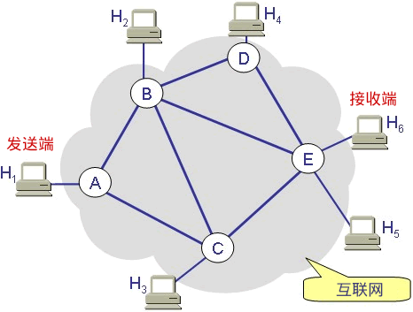

# Learn Socket


[toc]

## 00 传送门

[socket编程入门](http://c.biancheng.net/socket/)

在Visual Studio中需要加入
```cpp
#define _WINSOCK_DEPRECATED_NO_WARNINGS
```
deprecate vt. 不赞成, 反对


函数原型：

1. Windows
   ```cpp
   SOCKET socket(int af, int type, int protocol);
   //创建一个socket：地址，传输方式，协议

   int bind(SOCKET sock, const struct sockaddr *addr, int addrlen);
   //自身socket，bind的自己的信息，bind的信息的大小
   //addr自己写
   int connect(SOCKET sock, const struct sockaddr *serv_addr, int addrlen);
   //自身socket，connect的目的地信息，connectd信息的大小
   //addr自己写

   int listen(SOCKET sock, int backlog);
   //需要进入监听状态的socket，请求队列的长度
   SOCKET accept(SOCKET sock, struct sockaddr *addr, int *addrlen); 
   //返回用于通信的socket：监听socket，客户端信息，信息大小
   //addr由accept得到

   int send(SOCKET sock, const char *buf, int len, int flags);
   //自己是哪个socket，len是字节数
   int recv(SOCKET sock, char *buf, int len, int flags);
   //自己是哪个socket，len是字节数
   ```
2. Linux
   ```cpp
   int socket(int af, int type, int protocol);

   int bind(int sock, struct sockaddr *addr, socklen_t addrlen);
   int connect(int sock, struct sockaddr *serv_addr, socklen_t addrlen);

   int listen(int sock, int backlog);
   int accept(int sock, struct sockaddr *addr, socklen_t *addrlen);

   ssize_t write(int fd, const void *buf, size_t nbytes);
   ssize_t read(int fd, void *buf, size_t nbytes);
   ```


未学习内容标识：LZY_NEED_TO_LEARN

## 01 socket是什么？

网络编程就是编写程序使两台联网的计算机相互交换数据。

两台计算机之间用什么传输数据呢？
1. 首先需要物理连接。如今大部分计算机都已经连接到互联网，因此不用担心这一点。
2. 其次编写数据传输程序。操作系统已经提供了 socket，通过 socket 来编程。

### 什么是 socket？

socket 的原意是“插座”，在计算机通信领域，socket 被翻译为“套接字”，它是计算机之间进行通信的一种约定或一种方式。通过 socket 这种约定，一台计算机可以接收其他计算机的数据，也可以向其他计算机发送数据。

为了与远程计算机进行数据传输，需要连接到因特网，socket 就是用来连接到因特网的工具。

socket 的典型应用就是 Web 服务器和浏览器：浏览器获取用户输入的 URL，向服务器发起请求，服务器分析接收到的 URL，将对应的网页内容返回给浏览器，浏览器再经过解析和渲染，就将文字、图片、视频等元素呈现给用户。

#### UNIX/Linux 中的 socket 是什么？

在 UNIX/Linux 系统中，为了统一对各种硬件的操作，简化接口，不同的硬件设备也都被看成一个文件。对这些文件的操作，等同于对磁盘上普通文件的操作。

**UNIX/Linux 中的一切都是文件！**

为了表示和区分已经打开的文件，UNIX/Linux 会给每个文件分配一个 ID，这个 ID 就是一个整数，被称为文件描述符（File Descriptor）。例如：
1. 通常用 0 来表示标准输入文件（stdin），它对应的硬件设备就是键盘；
2. 通常用 1 来表示标准输出文件（stdout），它对应的硬件设备就是显示器。

UNIX/Linux 程序在执行任何形式的 I/O 操作时，都是在读取或者写入一个文件描述符。一个文件描述符只是一个和打开的文件相关联的整数，它的背后可能是一个硬盘上的普通文件、FIFO、管道、终端、键盘、显示器，甚至是一个网络连接。

**网络连接也是一个文件，它也有文件描述符！**

我们可以通过 socket() 函数来创建一个网络连接，或者说打开一个网络文件，socket() 的返回值就是文件描述符。有了文件描述符，我们就可以使用普通的文件操作函数来传输数据了，例如：
1. 用 read() 读取从远程计算机传来的数据；
2. 用 write() 向远程计算机写入数据。

只要用 socket() 创建了连接，剩下的就是文件操作了。

#### Window 系统中的 socket 是什么？

Windows 也有类似“文件描述符”的概念，但通常被称为“文件句柄”。

Windows 会区分 socket 和文件，Windows 就把 socket 当做一个网络连接来对待，因此需要调用专门针对 socket 而设计的数据传输函数，针对普通文件的输入输出函数就无效了。

<br>
<br>

## 02 socket有哪些类型？

根据数据的传输方式，可以将 Internet 套接字分成两种类型。通过 socket() 函数创建连接时，必须告诉它使用哪种数据传输方式。

### 流格式套接字（SOCK_STREAM）

流格式套接字（Stream Sockets）也叫“面向连接的套接字”，在代码中使用 SOCK_STREAM 表示。

**SOCK_STREAM 是一种可靠的、双向的通信数据流，数据可以准确无误地到达另一台计算机，如果损坏或丢失，可以重新发送。**

SOCK_STREAM 有以下几个特征：
1. 数据在传输过程中不会消失
2. 数据是按照顺序传输的
3. 数据的发送和接收不是同步的

可以将 SOCK_STREAM 比喻成一条**传送带**，只要传送带本身没有问题（不会断网），就能保证数据不丢失；同时，较晚传送的数据不会先到达，较早传送的数据不会晚到达，这就保证了数据是按照顺序传递的。

使用了 TCP 协议（The Transmission Control Protocol，传输控制协议），TCP 协议会控制你的数据按照顺序到达并且没有错误。

TCP/IP
1. TCP 用来确保数据的正确性
2. IP（Internet Protocol，网络协议）用来控制数据如何从源头到达目的地，也就是常说的“路由”

流格式套接字的内部有一个缓冲区（也就是字符数组），通过 socket 传输的数据将保存到这个缓冲区。接收端在收到数据后并不一定立即读取，只要数据不超过缓冲区的容量，接收端有可能在缓冲区被填满以后一次性地读取，也可能分成好几次读取。

不管数据分几次传送过来，接收端只需要根据自己的要求读取，不用非得在数据到达时立即读取。传送端有自己的节奏，接收端也有自己的节奏，它们是不一致的。（**数据的发送和接收不同步**）

浏览器所使用的 http 协议就基于面向连接的套接字，因为必须要确保数据准确无误，否则加载的 HTML 将无法解析。

<br>

### 数据报格式套接字（SOCK_DGRAM）

数据报格式套接字（Datagram Sockets）也叫“无连接的套接字”，在代码中使用 SOCK_DGRAM 表示。

计算机只管传输数据，不作数据校验，如果数据在传输中损坏，或者没有到达另一台计算机，是没有办法补救的。也就是说，数据错了就错了，无法重传。

**因为数据报套接字所做的校验工作少，所以在传输效率方面比流格式套接字要高。**

SOCK_DGRAM 有以下特征：
1. 强调快速传输而非传输顺序
2. 传输的数据可能丢失也可能损毁
3. 限制每次传输的数据大小
4. 数据的发送和接收是同步的

**类似于收发快递，接收次数应该和发送次数相同**

数据报套接字也使用 IP 协议作路由，但是它不使用 TCP 协议，而是使用 UDP 协议（User Datagram Protocol，用户数据报协议）。

QQ 视频聊天和语音聊天就使用 SOCK_DGRAM 来传输数据，因为首先要保证通信的效率，尽量减小延迟，而数据的正确性是次要的，即使丢失很小的一部分数据，视频和音频也可以正常解析，最多出现噪点或杂音，不会对通信质量有实质的影响。

SOCK_DGRAM 没有想象中的糟糕，不会频繁的丢失数据，数据错误只是小概率事件。

<br>
<br>

## 03 面向连接和无连接的套接字到底有什么区别

流格式套接字（Stream Sockets）就是“面向连接的套接字”，它基于 TCP 协议

数据报格式套接字（Datagram Sockets）就是“无连接的套接字”，它基于 UDP 协议

### 简化的网络模型



上图是一个简化的互联网模型，H1 ~ H6 表示计算机，A~E 表示路由器，发送端发送的数据必须经过路由器的转发才能到达接收端。

设 H1 要发送若干个数据包给 H6，那么有多条路径可以选择，比如：
1. 路径①：H1 --> A --> C --> E --> H6
2. 路径②：H1 --> A --> B --> E --> H6
3. 路径③：H1 --> A --> B --> D --> E --> H6
4. 路径④：H1 --> A --> B --> C --> E --> H6
5. 路径⑤：H1 --> A --> C --> B --> D --> E --> H6

**数据包的传输路径是路由器根据算法来计算出来的，算法会考虑很多因素，比如网络的拥堵状况、下一个路由器是否忙碌等。**

### 无连接的套接字

对于无连接的套接字，每个数据包可以选择不同的路径。它们也可以选择相同的路径，那也只不过是巧合而已。

每个数据包之间都是独立的，各走各的路，谁也不影响谁，除了迷路的或者发生意外的数据包，最后都能到达 H6。但是，到达的顺序是不确定的。

总之，对于无连接的套接字，数据包在传输过程中会发生各种不测，也会发生各种奇迹。H1 只负责把数据包发出，至于它什么时候到达，先到达还是后到达，有没有成功到达，H1 都不管了；H6 也没有选择的权利，只能被动接收，收到什么算什么，爱用不用。

无连接套接字遵循的是「尽最大努力交付」的原则，就是尽力而为，实在做不到了也没办法。无连接套接字提供的没有质量保证的服务。

### 面向连接的套接字

面向连接的套接字在正式通信之前要先确定一条路径，没有特殊情况的话，以后就固定地使用这条路径来传递数据包了。当然，路径被破坏的话，比如某个路由器断电了，那么会重新建立路径。

这条路径是由路由器维护的，路径上的所有路由器都要存储该路径的信息（实际上只需要存储上游和下游的两个路由器的位置就行），所以路由器是有开销的。H1 和 H6 通信完毕后，要断开连接，销毁路径，这个时候路由器也会把之前存储的路径信息擦除。

在很多网络通信教程中，这条预先建立好的路径被称为“虚电路”，就是一条虚拟的通信电路。

为了保证数据包准确、顺序地到达，发送端在发送数据包以后，必须得到接收端的确认才发送下一个数据包；如果数据包发出去了，一段时间以后仍然没有得到接收端的回应，那么发送端会重新再发送一次，直到得到接收端的回应。这样一来，发送端发送的所有数据包都能到达接收端，并且是按照顺序到达的。

发送端发送一个数据包，如何得到接收端的确认呢？很简单，为每一个数据包分配一个 ID，接收端接收到数据包以后，再给发送端返回一个数据包，告诉发送端我接收到了 ID 为 xxx 的数据包。

面向连接的套接字会比无连接的套接字多出很多数据包，因为发送端每发送一个数据包，接收端就会返回一个数据包。此外，建立连接和断开连接的过程也会传递很多数据包。

不但是数量多了，每个数据包也变大了：除了源端口和目的端口，面向连接的套接字还包括序号、确认信号、数据偏移、控制标志（通常说的 URG、ACK、PSH、RST、SYN、FIN）、窗口、校验和、紧急指针、选项等信息；而无连接的套接字则只包含长度和校验和信息。

有连接的数据包比无连接大很多，这意味着更大的负载和更大的带宽。许多即时聊天软件采用 UDP 协议（无连接套接字），与此有莫大的关系。

### 总结

两种套接字各有优缺点：
1. 无连接套接字传输效率高，但是不可靠，有丢失数据包、捣乱数据的风险
2. 有连接套接字非常可靠，万无一失，但是传输效率低，耗费资源多

两种套接字的特点决定了它们的应用场景，有些服务对可靠性要求比较高，必须数据包能够完整无误地送达，那就得选择有连接的套接字（TCP 服务），比如 HTTP、FTP 等；而另一些服务，并不需要那么高的可靠性，效率和实时才是它们所关心的，那就可以选择无连接的套接字（UDP 服务），比如 DNS、即时聊天工具等。

## 04 OSI网络七层模型简明教程

LZY_NEED_TO_LEARN

## 05 TCP/IP协议族

LZY_NEED_TO_LEARN

## 06 IP、MAC和端口号——网络通信中确认身份信息的三要素

### IP地址

IP地址是 Internet Protocol Address 的缩写，译为“网际协议地址”。

目前大部分软件使用 IPv4 地址，但 IPv6 也正在被人们接受，尤其是在教育网中，已经大量使用。

一台计算机可以拥有一个独立的 IP 地址，一个局域网也可以拥有一个独立的 IP 地址（对外就好像只有一台计算机）。对于目前广泛使用 IPv4 地址，它的资源是非常有限的，一台计算机一个 IP 地址是不现实的，往往是一个局域网才拥有一个 IP 地址。

在因特网上进行通信时，必须要知道对方的 IP 地址。实际上数据包中已经附带了 IP 地址，把数据包发送给路由器以后，路由器会根据 IP 地址找到对方的地理位置，完成一次数据的传递。路由器有非常高效和智能的算法，很快就会找到目标计算机。

### MAC地址

现实的情况是，一个局域网往往才能拥有一个独立的 IP；换句话说，IP 地址只能定位到一个局域网，无法定位到具体的一台计算机。

真正能唯一标识一台计算机的是 MAC 地址，每个网卡的 MAC 地址在全世界都是独一无二的。计算机出厂时，MAC 地址已经被写死到网卡里面了。

局域网中的路由器/交换机会记录每台计算机的 MAC 地址。

**MAC 地址是 Media Access Control Address 的缩写，直译为“媒体访问控制地址”，也称为局域网地址（LAN Address），以太网地址（Ethernet Address）或物理地址（Physical Address）。**

数据包中除了会附带对方的 IP 地址，还会附带对方的 MAC 地址，当数据包达到局域网以后，路由器/交换机会根据数据包中的 MAC 地址找到对应的计算机，然后把数据包转交给它，这样就完成了数据的传递。

### 端口号

有了 IP 地址和 MAC 地址，虽然可以找到目标计算机，但仍然不能进行通信。一台计算机可以同时提供多种网络服务，例如 Web 服务（网站）、FTP 服务（文件传输服务）、SMTP 服务（邮箱服务）等，仅有 IP 地址和 MAC 地址，计算机虽然可以正确接收到数据包，但是却不知道要将数据包交给哪个网络程序来处理，所以通信失败。

为了区分不同的网络程序，计算机会为每个网络程序分配一个独一无二的端口号（Port Number），例如，Web 服务的端口号是 80，FTP 服务的端口号是 21，SMTP 服务的端口号是 25。

端口（Port）是一个虚拟的、逻辑上的概念。可以将端口理解为一道门，数据通过这道门流入流出，每道门有不同的编号，就是端口号。

## 07 Linux下的socket演示程序

LZY_NEED_TO_LEARN

## 08 Windows下的socket演示程序

①服务器端代码 server.cpp：
```cpp
#include <stdio.h>
#include <winsock2.h>
#pragma comment (lib, "ws2_32.lib")  //加载 ws2_32.dll

int main(){
    //初始化 DLL
    WSADATA wsaData;//WSAData 结构体
    WSAStartup( MAKEWORD(2, 2), &wsaData);

    //创建套接字
    SOCKET servSock = socket(PF_INET, SOCK_STREAM, IPPROTO_TCP);

    //绑定套接字
    struct sockaddr_in sockAddr;
    memset(&sockAddr, 0, sizeof(sockAddr));  //每个字节都用0填充
    sockAddr.sin_family = PF_INET;  //使用IPv4地址
    sockAddr.sin_addr.s_addr = inet_addr("127.0.0.1");  //具体的IP地址
    sockAddr.sin_port = htons(1234);  //端口
    bind(servSock, (SOCKADDR*)&sockAddr, sizeof(SOCKADDR));

    //进入监听状态
    listen(servSock, 20);

    //接收客户端请求
    SOCKADDR clntAddr;
    int nSize = sizeof(SOCKADDR);
    SOCKET clntSock = accept(servSock, (SOCKADDR*)&clntAddr, &nSize);

    //向客户端发送数据
    char *str = "Hello World!";
    send(clntSock, str, strlen(str)+sizeof(char), NULL);

    //关闭套接字
    closesocket(clntSock);
    closesocket(servSock);

    //终止 DLL 的使用
    WSACleanup();

    return 0;
}
```

②客户端代码 client.cpp：
```cpp
#include <stdio.h>
#include <stdlib.h>
#include <WinSock2.h>
#pragma comment(lib, "ws2_32.lib")  //加载 ws2_32.dll

int main(){
    //初始化DLL
    WSADATA wsaData;
    WSAStartup(MAKEWORD(2, 2), &wsaData);

    //创建套接字
    SOCKET sock = socket(PF_INET, SOCK_STREAM, IPPROTO_TCP);

    //向服务器发起请求
    struct sockaddr_in sockAddr;
    memset(&sockAddr, 0, sizeof(sockAddr));  //每个字节都用0填充
    sockAddr.sin_family = PF_INET;
    sockAddr.sin_addr.s_addr = inet_addr("127.0.0.1");
    sockAddr.sin_port = htons(1234);
    connect(sock, (SOCKADDR*)&sockAddr, sizeof(SOCKADDR));

    //接收服务器传回的数据
    char szBuffer[MAXBYTE] = {0};
    recv(sock, szBuffer, MAXBYTE, NULL);

    //输出接收到的数据
    printf("Message form server: %s\n", szBuffer);

    //关闭套接字
    closesocket(sock);

    //终止使用 DLL
    WSACleanup();

    system("pause");
    return 0;
}
```

```cpp
将 server.cpp 和 client.cpp 分别编译为 server.exe 和 client.exe，先运行 server.exe，再运行 client.exe，输出结果为：
Message form server: Hello World!
```

使用要点
1. Windows 下的 socket 程序依赖 Winsock.dll 或 ws2_32.dll，必须提前加载。
2. Linux 下使用 read() / write() 函数读写，而 Windows 下使用 recv() / send() 函数发送和接收。
3. Linux 下使用 read() / write() 函数读写，而 Windows 下使用 recv() / send() 函数发送和接收。
4. 关闭 socket 时，Linux 使用 close() 函数，而 Windows 使用 closesocket() 函数。


## 09 Windows下使用WSAStartup()函数加载DLL

W**inSock（Windows Socket）**编程依赖于系统提供的**动态链接库**(DLL)，有两个版本：
1. 较早的DLL是 wsock32.dll，大小为 28KB，对应的头文件为 winsock1.h
2. **最新的DLL是 ws2_32.dll**，大小为 69KB，对应的**头文件为 winsock2.h**(几乎所有的 Windows 操作系统都已经支持 ws2_32.dll)

使用 DLL 之前必须把 DLL 加载到当前程序，你可以在编译时加载，也可以在程序运行时加载

这里使用#pragma命令，在编译时加载：

```cpp
#pragma comment (lib, "ws2_32.lib")
```

### WSAStartup()函数

使用 DLL 之前，还需要调用 WSAStartup() 函数进行初始化（**先要创建一个WSADATA类型的对象**），以指明 WinSock 规范的版本，它的原型为：

```cpp
int WSAStartup(WORD wVersionRequested, LPWSADATA lpWSAData);
```

**wVersionRequested 为 WinSock 规范的版本号**，低字节为主版本号，高字节为副版本号（修正版本号）；**lpWSAData 为指向 WSAData 结构体的指针**。

**WSAStartup的第一个参数是请求的版本号，第二个参数是一个WSADATA结构，其内容由WSAStartup填写，这个结构中的wVersion和wHighVersion才是实际使用的WinSock的版本号，这个版本号可能与你请求的值不同。返回0表示初始化成功。**

如果在WSAStartup函数第一个参数中设置的版本号不存在，那么会自动使用WinSock库中最低的版本1.1。

WinSock 规范的最新版本号为 2.2，较早的有 2.1、2.0、1.1、1.0，ws2_32.dll 支持所有的规范，而 wsock32.dll 仅支持 1.0 和 1.1。

wsock32.dll 已经能够很好的支持 TCP/IP 通信程序的开发，ws2_32.dll 主要增加了对其他协议的支持，不过建议使用最新的 2.2 版本。

wVersionRequested 参数用来指明我们希望使用的版本号，它的类型为 WORD，等价于 unsigned short，是一个整数，所以需要用 MAKEWORD() **宏函数对版本号进行转换**。例如：

```cpp
MAKEWORD(1, 2);  //主版本号为1，副版本号为2，返回 0x0201
MAKEWORD(2, 2);  //主版本号为2，副版本号为2，返回 0x0202
```

**WSAStartup() 函数执行成功后，会将与 ws2_32.dll 有关的信息写入 WSAData 结构体变量**。WSAData 的定义如下：

```cpp
typedef struct WSAData {
    WORD           wVersion;  //ws2_32.dll 建议我们使用的版本号
    WORD           wHighVersion;  //ws2_32.dll 支持的最高版本号
    //一个以 null 结尾的字符串，用来说明 ws2_32.dll 的实现以及厂商信息
    char           szDescription[WSADESCRIPTION_LEN+1];
    //一个以 null 结尾的字符串，用来说明 ws2_32.dll 的状态以及配置信息
    char           szSystemStatus[WSASYS_STATUS_LEN+1];
    unsigned short iMaxSockets;  //2.0以后不再使用
    unsigned short iMaxUdpDg;  //2.0以后不再使用
    char FAR       *lpVendorInfo;  //2.0以后不再使用
} WSADATA, *LPWSADATA;
```

最后3个成员已弃之不用，szDescription 和 szSystemStatus 包含的信息基本没有实用价值，读者只需关注前两个成员即可。请看下面的代码：

```cpp
#include <stdio.h>
#include <winsock2.h>
#pragma comment (lib, "ws2_32.lib")
int main(){
    WSADATA wsaData;
    WSAStartup( MAKEWORD(2, 2), &wsaData);//&表示地址（指针）
    printf("wVersion: %d.%d\n", LOBYTE(wsaData.wVersion), HIBYTE(wsaData.wVersion));
    printf("wHighVersion: %d.%d\n", LOBYTE(wsaData.wHighVersion), HIBYTE(wsaData.wHighVersion));
    printf("szDescription: %s\n", wsaData.szDescription);
    printf("szSystemStatus: %s\n", wsaData.szSystemStatus);
    return 0;
}

//运行结果：
//wVersion: 2.2
//wHighVersion: 2.2
//szDescription: WinSock 2.0
//szSystemStatus: Running
```

**综上所述：WinSock 编程的第一步就是加载 ws2_32.dll，然后调用 WSAStartup() 函数进行初始化，并指明要使用的版本号。**

五步标准操作：
1. 包含头文件，#include <winsock2.h>
2. 加载DLL，#pragma comment (lib,"ws2_32.lib")
3. 定义一个WSADATA对象
4. 使用WSAStartup(版本号,上一步创建的对象地址) 函数对WSADATA对象进行初始化
5. 在WSAStartup()中使用MAKEWORD(a,b) 函数
6. 关闭socket，closesocket(SOCKET) 函数
7. 停止DLL使用，WSACleanup() 函数

## 10 使用socket()函数创建套接字

不管是 Windows 还是 Linux，都使用 socket() 函数来创建套接字。socket() 在两个平台下的参数是相同的，不同的是返回值。
1. Linux 中的一切都是文件，每个文件都有一个整数类型的文件描述符；socket 也是一个文件，也有文件描述符。使用 socket() 函数创建套接字以后，返回值就是一个 int 类型的文件描述符。
2. Windows 会区分 socket 和普通文件，它把 socket 当做一个网络连接来对待，调用 socket() 以后，返回值是 SOCKET 类型，用来表示一个套接字。

### 在Windows下创建socket

```cpp
SOCKET socket(int af, int type, int protocol);//上面的int返回类型是linux的使用方式
```

#### af

af 为**地址族（Address Family）**，也就是**IP 地址类型**，常用的有 AF_INET 和 AF_INET6。

AF 是"Address Family"的简写，INET是“Inetnet”的简写

AF_INET 表示 IPv4 地址（**4字节**），例如 127.0.0.1

AF_INET6 表示 IPv6 地址（**16字节**），例如 1030::C9B4:FF12:48AA:1A2B。

**需要记住127.0.0.1，它是一个特殊IP地址，表示本机地址**

也可以使用 PF 前缀，PF 是"Protocol Family"的简写，它和 AF 是一样的。例如，PF_INET 等价于 AF_INET，PF_INET6 等价于 AF_INET6。

#### type

type 为**数据传输方式/套接字类型**，常用的有 
1. **SOCK_STREAM**（流格式套接字/面向连接的套接字） TCP
2. **SOCK_DGRAM**（数据报套接字/无连接的套接字） UDP

#### protocol

protocol 表示**传输协议**，常用的有 **IPPROTO_TCP** 和 **IPPTOTO_UDP**，分别表示 TCP 传输协议和 UDP 传输协议。

为什么还需要第三个参数（已经有了地址类型和数据传输方式）？

一般情况下有了 af 和 type 两个参数就可以创建套接字了，操作系统会自动推演出协议类型，除非遇到这样的情况：有两种不同的协议支持同一种地址类型和数据传输类型。如果我们不指明使用哪种协议，操作系统是没办法自动推演的。

只有一种协议满足条件，可以将 protocol 的值设为 0，系统会自动推演出应该使用什么协议

#### 示例

Windows 下也使用 socket() 函数来创建套接字，原型为：

```cpp
SOCKET socket(int af, int type, int protocol);//上面的int返回类型是linux的使用方式
```

除了**返回值类型和Linux的不同**，其他都是相同的。**Windows 不把套接字作为普通文件对待**，而是**返回 SOCKET 类型的句柄**。

```cpp
SOCKET sock = socket(AF_INET, SOCK_STREAM, 0);  //创建TCP套接字
```

### Linux下的socket()函数

#### 示例

```cpp
//如果使用 SOCK_STREAM 传输数据，那么满足这两个条件的协议只有 TCP
int tcp_socket = socket(AF_INET, SOCK_STREAM, IPPROTO_TCP);  //IPPROTO_TCP表示TCP协议
//如果使用 SOCK_DGRAM 传输方式，那么满足这两个条件的协议只有 UDP
int udp_socket = socket(AF_INET, SOCK_DGRAM, IPPROTO_UDP);  //IPPROTO_UDP表示UDP协议
int tcp_socket = socket(AF_INET, SOCK_STREAM, 0);  //创建TCP套接字
int udp_socket = socket(AF_INET, SOCK_DGRAM, 0);  //创建UDP套接字
```

<br>
<br>

## 11 bind()和connect()函数

socket() 函数用来创建套接字，确定套接字的各种属性，然后**服务器端要用 bind() 函数将套接字与特定的 IP 地址和端口绑定起来**，只有这样，流经该 IP 地址和端口的数据才能交给套接字处理。类似地，**客户端也要用 connect() 函数建立连接**。

1. 服务器端用bind() listen() accept()
2. 客户端用connect

### bind()函数

bind()函数原型
```cpp
int bind(int sock, struct sockaddr *addr, socklen_t addrlen);  //Linux
int bind(SOCKET sock, const struct sockaddr *addr, int addrlen);  //Windows
```

绑定成功返回0，失败返回-1

sock 为 socket 文件描述符，addr 为 sockaddr 结构体变量的指针，addrlen 为 addr 变量的大小，可由 sizeof() 计算得出。

将创建的套接字与IP地址 127.0.0.1、端口 1234 绑定
```cpp
//创建套接字
int serv_sock = socket(AF_INET, SOCK_STREAM, IPPROTO_TCP);

//创建sockaddr_in结构体变量，bind时候需要使用
struct sockaddr_in serv_addr;
memset(&serv_addr, 0, sizeof(serv_addr));  //每个字节都用0填充
serv_addr.sin_family = AF_INET;  //使用IPv4地址
serv_addr.sin_addr.s_addr = inet_addr("127.0.0.1");  //具体的IP地址
serv_addr.sin_port = htons(1234);  //端口

//将套接字和IP、端口绑定
bind(serv_sock, (struct sockaddr*)&serv_addr, sizeof(serv_addr));
```

这里我们使用 sockaddr_in 结构体，然后再强制转换为 sockaddr 类型，后边会讲解为什么这样做。

#### sockaddr_in 结构体
成员变量如下：

```cpp
struct sockaddr_in{
    sa_family_t     sin_family;   //地址族（Address Family），也就是地址类型
    uint16_t        sin_port;     //16位的端口号
    struct in_addr  sin_addr;     //32位IP地址
    char            sin_zero[8];  //不使用，一般用0填充//windows没有，linux有
};
```
1. sin_family 和 socket() 的第一个参数的含义相同，**取值也要保持一致**。

2. **sin_prot 为端口号**。uint16_t 的长度为两个字节，**理论上端口号的取值范围为 0~65536**，但 **0~1023 的端口一般由系统分配给特定的服务程序**，例如 Web 服务的端口号为 80，FTP 服务的端口号为 21，所以我们的程序要**尽量在 1024~65536 之间分配端口号**。端口号需要**用 htons() 函数转换**。
   
3. sin_addr 是 **struct in_addr 结构体类型的变量**。

4. sin_zero[8] 是多余的8个字节，没有用，一般使用 memset() 函数填充为 0。上面的代码中，**先用 memset() 将结构体的全部字节填充为 0**，再给前3个成员赋值，剩下的 sin_zero 自然就是 0 了。


#### in_addr 结构体
sockaddr_in 的第3个成员是 in_addr 类型的结构体，该结构体只包含一个成员。

```cpp
struct in_addr{
    in_addr_t  s_addr;  //32位的IP地址
};

```
**in_addr_t** 在头文件 <netinet/in.h> 中定义，**等价于 unsigned long**，长度为4个字节。也就是说，**s_addr 是一个整数，而IP地址是一个字符串**，所以**需要 inet_addr() 函数进行转换**，inet_addr返回的整数形式是网络字节序。


#### 疑问

为什么要搞这么复杂，结构体中嵌套结构体，而不用 sockaddr_in 的一个成员变量来指明IP地址呢？socket() 函数的第一个参数已经指明了地址类型，为什么在 sockaddr_in 结构体中还要再说明一次呢，这不是啰嗦吗？

①为什么使用 sockaddr_in 而不使用 sockaddr？

bind() 第二个参数的类型为 sockaddr，而代码中却使用 sockaddr_in，然后再强制转换为 sockaddr

sockaddr结构体定义：
```cpp
struct sockaddr{
    sa_family_t  sin_family;   //地址族（Address Family），也就是地址类型
    char         sa_data[14];  //IP地址和端口号
};
```


sockaddr 和 sockaddr_in 的长度相同，都是16字节，只是将IP地址和端口号合并到一起，用一个成员 sa_data 表示。要想给 sa_data 赋值，必须同时指明IP地址和端口号，例如”127.0.0.1:80“，遗憾的是，没有相关函数将这个字符串转换成需要的形式，也就很难给 sockaddr 类型的变量赋值，所以使用 sockaddr_in 来代替。这两个结构体的长度相同，强制转换类型时不会丢失字节，也没有多余的字节。

```cpp
unsigned long ip = inet_addr("127.0.0.1");
printf("%ld\n", ip);
//运行结果：16777343
//16777343二进制结果如下
//00000001 00000000 00000000 01111111
//    1        0        0       127
```

可以认为，**sockaddr 是一种通用的结构体**，可以**用来保存多种类型的IP地址和端口号**，而 **sockaddr_in 是专门用来保存 IPv4 地址**的结构体。

另外还有 sockaddr_in6，用来保存 IPv6 地址，它的定义如下：

```cpp
struct sockaddr_in6 { 
    sa_family_t sin6_family;  //(2)地址类型，取值为AF_INET6
    in_port_t sin6_port;  //(2)16位端口号
    uint32_t sin6_flowinfo;  //(4)IPv6流信息
    struct in6_addr sin6_addr;  //(4)具体的IPv6地址
    uint32_t sin6_scope_id;  //(4)接口范围ID
};
```
由于通用结构体 sockaddr 使用不便，才针对不同的地址类型定义了不同的结构体。

### connect()函数
```cpp
int connect(int sock, struct sockaddr *serv_addr, socklen_t addrlen);  //Linux
int connect(SOCKET sock, const struct sockaddr *serv_addr, int addrlen);  //Windows
```

连接成功返回0，连接失败返回-1

各个参数的说明和 bind() 相同。

<br>
<br>

## 12 listen()和accept()函数

对于服务器端程序，使用 bind() 绑定套接字后，还需要使用 listen() 函数让套接字进入被动监听状态，再调用 accept() 函数，就可以随时响应客户端的请求了。

### listen()函数
通过 listen() 函数可以让套接字进入**被动监听状态**，它的原型为：
```cpp
int listen(int sock, int backlog);  //Linux
int listen(SOCKET sock, int backlog);  //Windows
```

成功返回0，失败返回-1

sock 为需要进入监听状态的套接字，backlog 为请求队列的最大长度。

所谓**被动监听**，是指当没有客户端请求时，套接字处于“睡眠”状态，只有当接收到客户端请求时，套接字才会被“唤醒”来响应请求。

#### 请求队列

当套接字正在处理客户端请求时，如果有新的请求进来，套接字是没法处理的，只能把它放进缓冲区，待当前请求处理完毕后，再从缓冲区中读取出来处理。如果不断有新的请求进来，它们就按照先后顺序在缓冲区中排队，直到缓冲区满。这个缓冲区，就称为**请求队列（Request Queue）**。

缓冲区的长度（能存放多少个客户端请求）可以通过 listen() 函数的 backlog 参数指定，但究竟为多少并没有什么标准，可以根据你的需求来定，并发量小的话可以是10或者20。

如果**将 backlog 的值设置为 SOMAXCONN**，就由系统来决定请求队列长度，这个值一般比较大，可能是几百，或者更多。

**当请求队列满时，就不再接收新的请求**，对于 Linux，客户端会收到 ECONNREFUSED 错误，对于 Windows，客户端会收到 WSAECONNREFUSED 错误。

### accept()函数

当套接字处于监听状态时，可以通过 accept() 函数来接收客户端请求。

```cpp
int accept(int sock, struct sockaddr *addr, socklen_t *addrlen);  //Linux
SOCKET accept(SOCKET sock, struct sockaddr *addr, int *addrlen);  //Windows
```

它的参数与 listen() 和 connect() 是相同的：sock 为服务器端套接字，addr 为 sockaddr_in 结构体变量，addrlen 为参数 addr 的长度，可由 sizeof() 求得。

**accept() 返回一个新的套接字来和客户端通信**，**addr 保存了客户端的IP地址和端口号**，而 **sock 是服务器端的套接字**，注意区分。后面和客户端通信时，要使用这个新生成的套接字，而不是原来服务器端的套接字。

最后需要说明的是：**listen() 只是让套接字进入监听状态**，并**没有真正接收客户端请求**，listen() 后面的代码会继续执行，直到遇到 accept()。accept() 会阻塞程序执行（后面代码不能被执行），直到有新的请求到来。

<br>
<br>

## 13 send()/recv()和write()/read()函数

在 Linux 和 Windows 平台下，使用不同的函数发送和接收 socket 数据。

### Linux下数据的接收和发送

LZY_NEED_TO_LEARN

### Windows下数据的接收和发送

Windows 和 Linux 不同，Windows 区分普通文件和套接字，并定义了专门的接收和发送的函数。

从服务器端发送数据使用 send() 函数，它的原型为：
```cpp
int send(SOCKET sock, const char *buf, int len, int flags);
```
sock 为要发送数据的套接字，buf 为要发送的数据的缓冲区地址，len 为要发送的数据的字节数，flags 为发送数据时的选项。

最后的 flags 参数一般设置为 0 或 NULL

在客户端接收数据使用 recv() 函数，它的原型为：
```cpp
int recv(SOCKET sock, char *buf, int len, int flags);
```

<br>
<br>

## 14 socket编程实现回声客户端

Server

```cpp
#include <stdio.h>
#include <winsock2.h>
#pragma comment (lib, "ws2_32.lib")  //加载 ws2_32.dll

#define BUF_SIZE 100

int main(){
    WSADATA wsaData;
    WSAStartup( MAKEWORD(2, 2), &wsaData);

    //创建套接字
    SOCKET servSock = socket(AF_INET, SOCK_STREAM, 0);

    //绑定套接字
    struct sockaddr_in sockAddr;
    memset(&sockAddr, 0, sizeof(sockAddr));  //每个字节都用0填充
    sockAddr.sin_family = PF_INET;  //使用IPv4地址
    sockAddr.sin_addr.s_addr = inet_addr("127.0.0.1");  //具体的IP地址
    sockAddr.sin_port = htons(1234);  //端口
    bind(servSock, (SOCKADDR*)&sockAddr, sizeof(SOCKADDR));

    //进入监听状态
    listen(servSock, 20);

    //接收客户端请求
    SOCKADDR clntAddr;
    int nSize = sizeof(SOCKADDR);
    SOCKET clntSock = accept(servSock, (SOCKADDR*)&clntAddr, &nSize);
    char buffer[BUF_SIZE];  //缓冲区
    int strLen = recv(clntSock, buffer, BUF_SIZE, 0);  //接收客户端发来的数据
    send(clntSock, buffer, strLen, 0);  //将数据原样返回

    //关闭套接字
    closesocket(clntSock);
    closesocket(servSock);

    //终止 DLL 的使用
    WSACleanup();

    return 0;
}
```

Client

```cpp
#include <stdio.h>
#include <stdlib.h>
#include <WinSock2.h>
#pragma comment(lib, "ws2_32.lib")  //加载 ws2_32.dll

#define BUF_SIZE 100

int main(){
    //初始化DLL
    WSADATA wsaData;
    WSAStartup(MAKEWORD(2, 2), &wsaData);

    //创建套接字
    SOCKET sock = socket(PF_INET, SOCK_STREAM, IPPROTO_TCP);

    //向服务器发起请求
    struct sockaddr_in sockAddr;
    memset(&sockAddr, 0, sizeof(sockAddr));  //每个字节都用0填充
    sockAddr.sin_family = PF_INET;
    sockAddr.sin_addr.s_addr = inet_addr("127.0.0.1");
    sockAddr.sin_port = htons(1234);
    connect(sock, (SOCKADDR*)&sockAddr, sizeof(SOCKADDR));
    //获取用户输入的字符串并发送给服务器
    char bufSend[BUF_SIZE] = {0};
    printf("Input a string: ");
    scanf("%s", bufSend);
    send(sock, bufSend, strlen(bufSend), 0);
    //接收服务器传回的数据
    char bufRecv[BUF_SIZE] = {0};
    recv(sock, bufRecv, BUF_SIZE, 0);

    //输出接收到的数据
    printf("Message form server: %s\n", bufRecv);

    //关闭套接字
    closesocket(sock);

    //终止使用 DLL
    WSACleanup();

    system("pause");
    return 0;
}
```

<br>
<br>

## 15 如何让服务器端持续不断地监听客户端的请求？

前面的程序，不管服务器端还是客户端，都有一个问题，就是处理完一个请求立即退出了，没有太大的实际意义。

像Web服务器那样一直接受客户端的请求，使用 while 循环即可。

while(1) 让代码进入死循环，除非用户关闭程序，否则服务器端会一直监听客户端的请求。客户端也是一样，会不断向服务器发起连接。

需要注意的是：
**server 中调用 closesocket()** 不仅会**关闭服务器端的 socket**，还会**通知客户端连接已断开**。
**客户端也会清理 socket 相关资源**，所以 **client.cpp 中需要将 socket() 放在 while 循环内部**。
因为每次请求完毕都会清理 socket，下次发起请求时需要重新创建。

### 服务器端

```cpp
#include <stdio.h>
#include <winsock2.h>
#pragma comment (lib, "ws2_32.lib")  //加载 ws2_32.dll

#define BUF_SIZE 100

int main(){
    WSADATA wsaData;
    WSAStartup( MAKEWORD(2, 2), &wsaData);

    //创建套接字
    SOCKET servSock = socket(AF_INET, SOCK_STREAM, 0);

    //绑定套接字
    struct sockaddr_in sockAddr;
    memset(&sockAddr, 0, sizeof(sockAddr));  //每个字节都用0填充
    sockAddr.sin_family = PF_INET;  //使用IPv4地址
    sockAddr.sin_addr.s_addr = inet_addr("127.0.0.1");  //具体的IP地址
    sockAddr.sin_port = htons(1234);  //端口
    bind(servSock, (SOCKADDR*)&sockAddr, sizeof(SOCKADDR));

    //进入监听状态
    listen(servSock, 20);

    //接收客户端请求
    SOCKADDR clntAddr;
    int nSize = sizeof(SOCKADDR);
    char buffer[BUF_SIZE] = {0};  //缓冲区
    while(1){
        SOCKET clntSock = accept(servSock, (SOCKADDR*)&clntAddr, &nSize);
        int strLen = recv(clntSock, buffer, BUF_SIZE, 0);  //接收客户端发来的数据
        send(clntSock, buffer, strLen, 0);  //将数据原样返回

        closesocket(clntSock);  //关闭套接字
        memset(buffer, 0, BUF_SIZE);  //重置缓冲区
    }

    //关闭套接字
    closesocket(servSock);

    //终止 DLL 的使用
    WSACleanup();

    return 0;
}
```

### 客户端

```cpp
#include <stdio.h>
#include <WinSock2.h>
#include <windows.h>
#pragma comment(lib, "ws2_32.lib")  //加载 ws2_32.dll

#define BUF_SIZE 100

int main(){
    //初始化DLL
    WSADATA wsaData;
    WSAStartup(MAKEWORD(2, 2), &wsaData);

    //向服务器发起请求
    struct sockaddr_in sockAddr;
    memset(&sockAddr, 0, sizeof(sockAddr));  //每个字节都用0填充
    sockAddr.sin_family = PF_INET;
    sockAddr.sin_addr.s_addr = inet_addr("127.0.0.1");
    sockAddr.sin_port = htons(1234);
   
    char bufSend[BUF_SIZE] = {0};
    char bufRecv[BUF_SIZE] = {0};

    while(1){
        //创建套接字
        SOCKET sock = socket(PF_INET, SOCK_STREAM, IPPROTO_TCP);
        connect(sock, (SOCKADDR*)&sockAddr, sizeof(SOCKADDR));
        //获取用户输入的字符串并发送给服务器
        printf("Input a string: ");
        gets(bufSend);
        send(sock, bufSend, strlen(bufSend), 0);
        //接收服务器传回的数据
        recv(sock, bufRecv, BUF_SIZE, 0);
        //输出接收到的数据
        printf("Message form server: %s\n", bufRecv);
       
        memset(bufSend, 0, BUF_SIZE);  //重置缓冲区
        memset(bufRecv, 0, BUF_SIZE);  //重置缓冲区
        closesocket(sock);  //关闭套接字
    }

    WSACleanup();  //终止使用 DLL
    return 0;
}
```

<br>
<br>

## 16 socket缓冲区以及阻塞模式

### socket缓冲区

**每个 socket 被创建后，都会分配两个缓冲区，输入缓冲区和输出缓冲区。**

**write()/send() 并不立即向网络中传输数据，而是先将数据写入缓冲区中，再由TCP协议将数据从缓冲区发送到目标机器**。一旦将数据写入到缓冲区，函数就可以成功返回，不管它们有没有到达目标机器，也不管它们何时被发送到网络，这些都是TCP协议负责的事情。

TCP协议独立于 write()/send() 函数，数据有可能刚被写入缓冲区就发送到网络，也可能在缓冲区中不断积压，多次写入的数据被一次性发送到网络，这取决于当时的网络情况、当前线程是否空闲等诸多因素，不由程序员控制。

**read()/recv() 函数也是如此，也从输入缓冲区中读取数据，而不是直接从网络中读取。**


这些I/O缓冲区特性可整理如下：
1. I/O缓冲区在每个TCP套接字中单独存在；
2. I/O缓冲区在创建套接字时自动生成；
3. 即使关闭套接字也会继续传送输出缓冲区中遗留的数据；
4. 关闭套接字将丢失输入缓冲区中的数据。

输入输出缓冲区的默认大小一般都是 8K，可以通过 getsockopt() 函数获取：
```cpp
unsigned optVal;
int optLen = sizeof(int);
getsockopt(servSock, SOL_SOCKET, SO_SNDBUF, (char*)&optVal, &optLen);
printf("Buffer length: %d\n", optVal);
```

### 阻塞模式

对于TCP套接字（默认情况下）

当使用 write()/send() 发送数据时：

1. 首先会**检查缓冲区**，如果**缓冲区的可用空间长度小于要发送的数据，那么 write()/send() 会被阻塞（暂停执行）**，直到缓冲区中的数据被发送到目标机器，腾出足够的空间，才唤醒 write()/send() 函数继续写入数据。

2. **如果TCP协议正在向网络发送数据，那么输出缓冲区会被锁定**，不允许写入，**write()/send() 也会被阻塞，直到数据发送完毕缓冲区解锁**，write()/send() 才会被唤醒。

3. **如果要写入的数据大于缓冲区的最大长度，那么将分批写入**。

4. **直到所有数据被写入缓冲区 write()/send() 才能返回**。

当使用 read()/recv() 读取数据时：
1. 首先会**检查缓冲区，如果缓冲区中有数据，那么就读取**，**否则函数会被阻塞，直到网络上有数据到来**。

2. **如果要读取的数据长度小于缓冲区中的数据长度，那么就不能一次性将缓冲区中的所有数据读出**，剩余数据将不断积压，直到有 read()/recv() 函数再次读取。

3. **直到读取到数据后 read()/recv() 函数才会返回，否则就一直被阻塞**。

这就是TCP套接字的阻塞模式。所谓阻塞，就是**上一步动作没有完成，下一步动作将暂停**，直到上一步动作完成后才能继续，以保持同步性。

<br>
<br>

## 17 TCP粘包问题(数据的无边界性)

**上节我们讲到了socket缓冲区和数据的传递过程，可以看到数据的接收和发送是无关的，read()/recv() 函数不管数据发送了多少次，都会尽可能多的接收数据。也就是说，read()/recv() 和 write()/send() 的执行次数可能不同。**

**数据的“粘包”问题，客户端发送的多个数据包被当做一个数据包接收。也称数据的无边界性，read()/recv() 函数不知道数据包的开始或结束标志（实际上也没有任何开始或结束标志），只把它们当做连续的数据流来处理。**

<br>
<br>

## 18 TCP数据报结构以及三次握手(图解)

<br>
<br>

## 19 TCP数据的传输过程

<br>
<br>

## 20 TCP四次握手断开连接(图解)

<br>
<br>

## 21 如何优雅地断开TCP连接？

<br>
<br>

## 22 socket编程实现文件传输功能

<br>
<br>

## 23 网络数据传输时的大小端问题

<br>
<br>

## 24 在socket编程中使用域名

<br>
<br>

## 25 再谈UDP和TCP

<br>
<br>

## 26 基于UDP的服务器端和客户端

<br>
<br>

## 99 小知识

127.0.0.1 ：全世界的电脑人手一个。代表自己，用于自我冥想。

192.168.x.x ，10.x.x.x ，172.16.x.x -172.31.x.x ：这些地址可以自由有序使用，但不能随便乱使用。在家庭、公司、机构为单位的网络里，要保证地址的唯一性。

