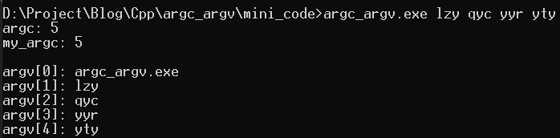

# argc argv

```c++
#include <iostream>

using namespace std;

int main(int argc, char* argv[])
{
	int my_argc = 0;
	while (1)
	{
        //*******key*******
		if (argv[my_argc] != nullptr)
			my_argc++;

		else
			break;
	}
	cout << "argc: " << argc << endl;
	cout << "my_argc: " << my_argc << endl;
	
	cout<<endl;
	for(int i=0; i<my_argc;i++)
	{
		cout << "argv[" << i << "]: " << argv[i] << endl;
	}

	return 0;
}
```

看起来argv后面会放置一个nullptr。




