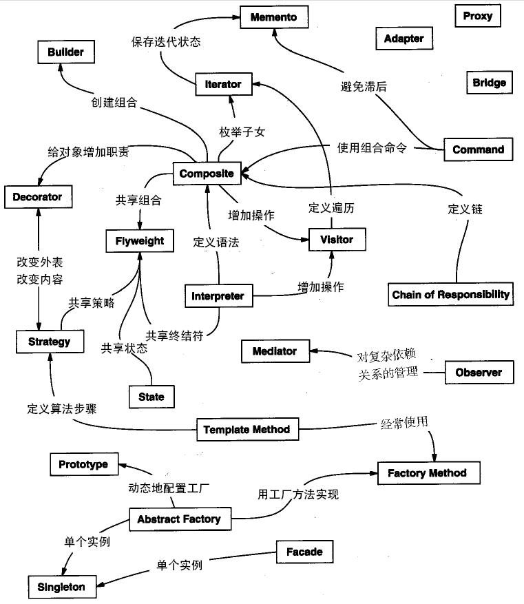

# Design Pattern 设计模式

[toc]

---

# 菜鸟教程

[菜鸟教程 - 设计模式](https://www.runoob.com/design-pattern/design-pattern-tutorial.html)

## 设计模式简介

设计模式是一套被反复使用的、多数人知晓的、经过分类编目的、代码设计经验的总结

解决方案是众多软件开发人员经过相当长的一段时间的试验和错误总结出来的

使用设计模式是为了==重用代码、让代码更容易被他人理解、保证代码可靠性==

设计模式提供了一个标准的术语系统，且具体到特定的情景

提供了软件开发过程中面临的一般问题的最佳解决方案

学习这些模式有助于经验不足的开发人员通过一种简单快捷的方式来学习软件设计

## GOF (四人帮，全拼 Gang of Four)

四人合著出版 Design Patterns - Elements of Reusable Object-Oriented Software (设计模式 - 可复用的面向对象软件元素)
1. Erich Gamma
2. Richard Helm
3. Ralph Johnson
4. John Vlissides

提出的设计模式主要是基于以下的面向对象设计原则
1. 对接口编程而不是对实现编程
2. 优先使用对象组合而不是

## 设计模式的六大原则

原则
1. 开闭原则 (Open Close Principle)
   1. **对扩展开放，对修改关闭**
   2. 在程序需要进行拓展的时候，不能去修改原有的代码，实现一个热插拔的效果
   3. 使程序的扩展性好，易于维护和升级
   4. 需要使用接口和抽象类
2. 里氏代换原则 (Liskov Substitution Principle)
   1. **任何基类可以出现的地方，子类一定可以出现**
   2. LSP 是继承复用的基石，只有当派生类可以替换掉基类，且软件单位的功能不受到影响时，基类才能真正被复用，而派生类也能够在基类的基础上增加新的行为
   3. 里氏代换原则是对开闭原则的补充
   4. 实现开闭原则的关键步骤就是抽象化，而基类与子类的继承关系就是抽象化的具体实现
3. 依赖倒转原则 (Dependence Inversion Principle)
   1. 是开闭原则的基础，**针对接口编程，依赖于抽象而不依赖于具体**
4. 接口隔离原则 (Interface Segregation Principle)
   1. **使用多个隔离的接口，比使用单个接口要好**
   2. **降低类之间的耦合度**
5. 迪米特法则，又称最少知道原则 (Demeter Principle)
   1. **一个实体应当尽量少地与其他实体之间发生相互作用，使得系统功能模块相对独立**
6. 合成复用原则 (Composite Reuse Principle)
   1. **尽量使用合成/聚合的方式，而不是使用继承**

## 设计模式的类型

设计模式
1. 创建型模式 (Creational) - 提供了一种在**创建对象的同时隐藏创建逻辑的方式**，而不是使用 new 运算符直接实例化对象
   1. 工厂模式 (Factory)
   2. 抽象工厂模式 (Abstract Factory) 
   3. 单例模式 (Singleton) 
   4. 建造者模式 (Builder)
   5. 原型模式 (Prototype)
2. 结构型模式 (Structural) - 关注对象之间的**组合和关系**，旨在解决如何**构建灵活且可复用的类和对象结构**
   1. 适配器模式 (Adapter) 
   2. 桥接模式 (Bridge)
   3. 过滤器模式 (Filter、Criteria)
   4. 组合模式 (Composite)
   5. 装饰器模式 (Decorator)
   6. 外观模式 (Facade)
   7. 享元模式 (Flyweight)
   8. 代理模式 (Proxy)
3. 行为型模式 (Behavioral) - 关注对象之间的**通信和交互**，旨在解决**对象之间的责任分配和算法的封装**
   1. 责任链模式 (Chain of Responsibility)
   2. 命令模式 (Command)
   3. 解释器模式 (Interpreter)
   4. 迭代器模式 (Iterator)
   5. 中介者模式 (Mediator)
   6. 备忘录模式 (Memento)
   7. 观察者模式 (Observer)
   8. 状态模式 (State)
   9. 空对象模式 (Null Object)
   10. 策略模式 (Strategy)
   11. 模板模式 (Template)
   12. 访问者模式 (Visitor)
4. J2EE 设计模式 - 特别关注**表示层**。这些模式是由 Sun Java Center 鉴定的
   1. MVC 模式 (MVC)
   2. 业务代表模式 (Business Delegate)
   3. 组合实体模式 (Composite Entity)
   4. 数据访问对象模式 (Data Access Object)
   5. 前端控制器模式 (Front Controller)
   6. 拦截过滤器模式 (Intercepting Filter)
   7. 服务定位器模式 (Service Locator)
   8. 传输对象模式 (Transfer Object)

## 创建型模式 (Creational)

### 工厂模式 (Factory)

工厂模式提供了一种将对象的实例化过程封装在工厂类中的方式

使用工厂模式，可以将对象的创建与使用代码分离，提供一种统一的接口来创建不同类型的对象

在工厂模式中，我们在创建对象时不会对客户端暴露创建逻辑，并且是通过使用一个共同的接口来指向新创建的对象

核心角色
1. 抽象产品 Abstract Product ：定义了产品的共同接口或抽象类。它可以是具体产品类的父类或接口，规定了产品对象的共同方法
2. 具体产品 Concrete Product ：实现了抽象产品接口，定义了具体产品的特定行为和属性
3. 抽象工厂 Abstract Factory ：声明了创建产品的抽象方法，可以是接口或抽象类。它可以有多个方法用于创建不同类型的产品
4. 具体工厂 Concrete Factory ：实现了抽象工厂接口，负责实际创建具体产品的对象

### 抽象工厂模式 (Abstract Factory) 

围绕一个超级工厂创建其他工厂，该超级工厂又称为其他工厂的工厂

在抽象工厂模式中，接口是负责创建一个相关对象的工厂，不需要显式指定它们的类

每个生成的工厂都能按照工厂模式提供对象

抽象工厂模式提供了一种创建一系列相关或相互依赖对象的接口，而无需指定具体实现类

通过使用抽象工厂模式，可以将客户端与具体产品的创建过程解耦，使得客户端可以通过工厂接口来创建一族产品

   2. 单例模式 (Singleton) 
   3. 建造者模式 (Builder)
   4. 原型模式 (Prototype)
## 结构型模式 (Structural)
   1. 适配器模式 (Adapter) 
   2. 桥接模式 (Bridge)
   3. 过滤器模式 (Filter、Criteria)
   4. 组合模式 (Composite)
   5. 装饰器模式 (Decorator)
   6. 外观模式 (Facade)
   7. 享元模式 (Flyweight)
   8. 代理模式 (Proxy)
## 行为型模式 (Behavioral)
   1. 责任链模式 (Chain of Responsibility)
   2. 命令模式 (Command)
   3. 解释器模式 (Interpreter)
   4. 迭代器模式 (Iterator)
   5. 中介者模式 (Mediator)
   6. 备忘录模式 (Memento)
   7. 观察者模式 (Observer)
   8. 状态模式 (State)
   9. 空对象模式 (Null Object)
   10. 策略模式 (Strategy)
   11. 模板模式 (Template)
   12. 访问者模式 (Visitor)
## J2EE 设计模式

---

# 大话设计模式 - 程杰

