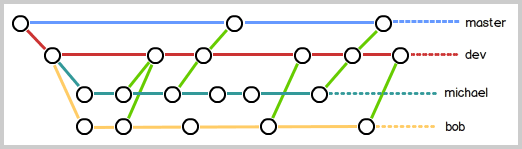
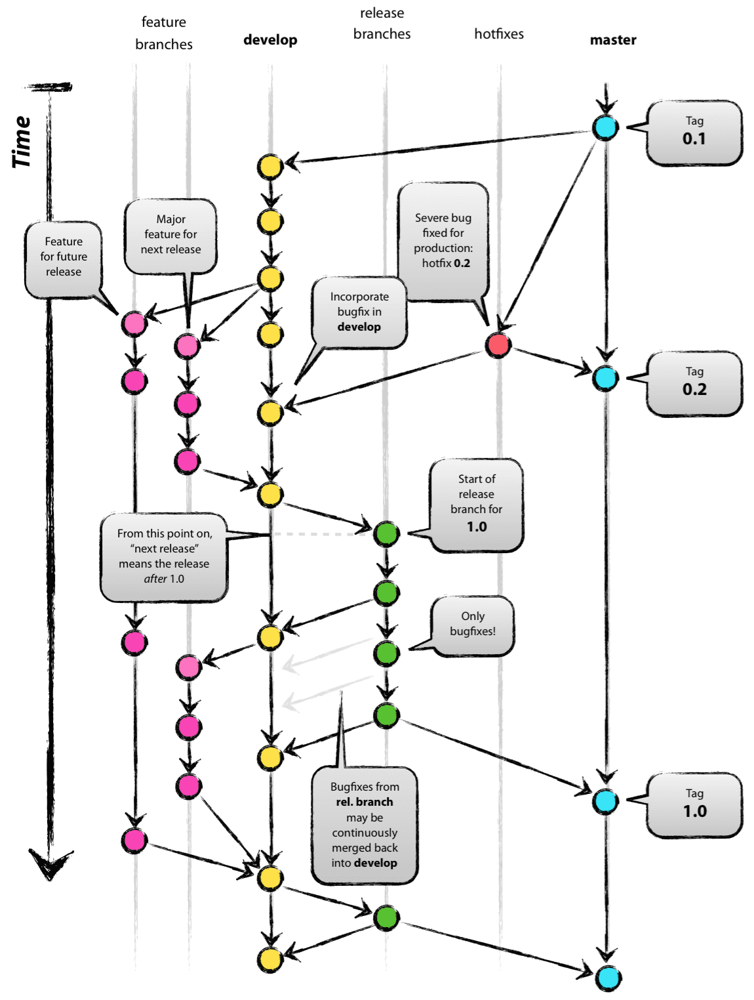
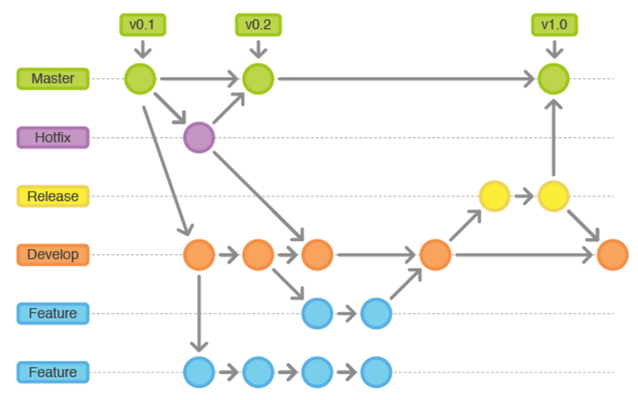

**工作区 (Working Directory)**
1. 在本地文件系统中看到的 文件夹 和 文件，也是你进行代码开发的地方
2. 所有未被添加到 Git 版本控制的 文件 或 修改，都会出现在工作区中
3. 命令
   1. `git add` : 将工作区的改动提交到 暂存区 (Staging)
   2. `git reset` : 撤销从工作区到暂存区的更改，即将文件从暂存区移回工作区


**暂存区 (Staging Area)**
1. 临时的存储区域，用于保存 即将提交到本地仓库的改动 (准备提交的状态)
2. 命令
   1. `git commit` : 将暂存区的所有改动提交到本地仓库，生成一次新的提交(commit)

**本地仓库 (Local Repository)**
1. 本地仓库保存的是当前分支的 所有历史提交记录(commits)
2. 命令
   1. `git push` : 将本地仓库的改动上传到远程仓库
   2. `git reset` : 撤销本地仓库的提交，并将改动返回到工作区或暂存区 - TODO

**远程仓库 (Remote Repository)**
1. 存储在服务器上的代码库，用于团队协作
2. 命令
   1. `git fetch` : 从远程仓库下载改动，但不自动合并到本地分支，更新远程跟踪分支的信息，不影响本地分支
   2. `git pull` : 从远程仓库下载改动并自动合并到当前分支

**远程跟踪分支 (Remote Branch Tracking)**
1. 远程跟踪分支是本地对远程分支的一个引用，它用来追踪远程分支的最新状态

**储藏区 (Stash)**
1. 储藏区是一个临时存储空间，用于保存未完成的工作


---

[廖雪峰 - Git 教程](https://liaoxuefeng.com/books/git/introduction/index.html)

Installation & Configuration
```bash
sudo apt install git

git --version

# --global 表示这台机器上所有的Git仓库都会使用这个配置
git config --global user.name "Your Name"
git config --global user.email "email@example.com"
git config --list
```

Git 是 分布式版本控制系统，所以 每个机器 都必须自报家门

创建版本库
```bash
cd <local_repository>
git init  # 把这个目录变成Git可以管理的仓库
# 新增 .git 目录(默认隐藏) Git来跟踪管理版本库的
```

所有的版本控制系统(包括 Git)，其实只能跟踪 文本文件的 改动，比如 TXT文件、网页、程序代码 等

而图片、视频这些二进制文件，虽然也能由版本控制系统管理，但没法跟踪文件的变化

如果要真正使用版本控制系统，就要以纯文本方式编写文件

强烈建议使用标准的`UTF-8`编码，所有语言使用同一种编码，既没有冲突，又被所有平台所支持

千万不要使用 Windows 自带的 记事本 编辑任何文本文件

Git命令必须**在Git仓库目录内执行**


```bash
git add <filePath>  # 可以多次add不同的文件
git commit -m "<comment>"  # commit可以一次提交很多文件
```

```bash
git status  # 掌握仓库当前的状态
git diff <filePath>
```

`git diff`
1. 不支持直接比较未跟踪文件 (untracked files)
2. 只比较以下几种情况
   1. `git diff` : **工作区** 与 **暂存区** 之间的差异
   2. `git diff --cached` : 比较 **暂存区** 和 `HEAD` 的差异(即将提交的内容)
   3. `git diff HEAD -- <file>` : 比较 **工作区** 和 `HEAD` 的差异(包括已暂存和未暂存的所有更改)
   4. `git diff HEAD~1` : 比较 工作区 和上一条提交(`HEAD~1`)之间的差异
   5. 工作区或暂存区 与 指定提交(如 HEAD) 的差异

快照在 Git 中被称为 **commit**

一旦你把文件改乱了，或者误删了文件，还可以从最近的一个 **commit** 恢复

`git log` 命令显示从最近到最远的提交日志，`--pretty=oneline` 参数，单行显示
1. 版本号 `commit id`，是一个 SHA1 计算出来的一个非常大的数字，用十六进制表示
2. Git是分布式的版本控制系统，需要处理多人协作


`git reset --<mode> <commit>` 3种模式(假设已经 commit 了)
1. |模式       |工作区状态             |暂存区状态             |文件内容是否保留|
   |----------|---------------------|----------------------|-------------|
   |`--soft`  | 保留 不改变           | 保留 所有改动仍在暂存区 | 保留         |
   |`--mixed` | 保留 工作区显示所有改动 | 清空 改动移回工作区    | 保留         |
   |`--hard`  | 清空	             | 清空                 | 删除(丢失)    |
2. `git reset` 不会影响 **未被跟踪的文件**
3. `git reset` 恢复方法 `git reflog`


`HEAD` - 当前版本(最新的提交 commit)
1. HEAD 是一个指针，指向当前所在的 commit，通常指向当前分支的最新提交
2. 当你切换分支 `git checkout` 时，`HEAD` 会更新为指向新分支的最新提交
3. 上一个版本 `HEAD^`，上上个版本 `HEAD^^`，方便表示 `HEAD~100`


`.git` **Git的版本库**(隐藏目录)
1. 
2. 存在于每个 Git 项目的根目录下
3. Git 用于存储和管理版本控制信息的核心目录
4. 包含
   1. commits
   2. branches (包含 master，Git 自动创建的第一个分支)
   3. staging area
   4. config
   5. HEAD 指针
5. `add` - 把要提交的所有修改放到暂存区
6. `commit` - 一次性把暂存区的所有修改提交到分支(只负责把暂存区的修改提交)


Git跟踪并管理的是**修改**，而非文件

`git reset/checkout <file>`
1. 用**版本库**里的版本替换工作区的版本，无论工作区是修改还是删除，都可以 一键还原
2. 如果使用 `rm` 误删了，可以用其恢复
3. 从来没有被添加到版本库就被删除的文件，是无法恢复的

`git rm` 用于删除一个文件
1. 默认会从工作区(Working Directory)中删除文件
2. 同时也会把 **删除操作** 加入到暂存区
3. 相当于执行了 git add 让 Git 追踪 **删除操作**
4. 恢复
   1. `git checkout HEAD -- <file>`
   2. `git restore --staged <file>` + `git restore <file>`


`ssh`
1. 命令
   ```bash
   cd ~/.ssh
   ssh-keygen -t rsa -C "<email>"  # 一路回车，生成 id_rsa 和 id_rsa.pub
   ```
2. `id_rsa`是**私钥**，不能泄露出去，`id_rsa.pub`是**公钥**，可以放心地告诉任何人
3. 登录 Github，进入 Settings，SSH and GPG keys，粘贴 公钥
4. GitHub 需要识别出你推送的提交确实是你推送的，而不是别人冒充的
5. GitHub允许你添加多个Key (对应多个电脑)

Github
1. 注意 : **GitHub 自 2021 年 8 月 13 日起 不再支持通过 密码 进行 HTTPS 认证登录**，强制要求使用 更安全的身份验证方式，如 SSH 密钥 或 Personal Access Token (PAT)
2. 使用 SSH
   1. `ssh -T git@github.com` - 测试 SSH 连接
      1. `The authenticity of host 'github.com (140.82.114.3)' can't be established.` - 输入 yes
   2. `git remote set-url origin git@github.com:leizhenyu-lzy/Blog.git`
3. PAT
   1. Github
   2. Settings -> Developer Settings -> Personal Access Token -> Tokens(classic) -> Generate New Token
   3. 当你被要求输入密码时，使用你刚才生成的 Personal Access Token，而不是 GitHub 账户的密码


添加远程库
1. 本地创建了一个Git仓库后，又想在GitHub创建一个Git仓库，并且让这两个仓库进行远程同步
2. 在 github 创建仓库
3. `git remote add origin xxx`
   1. 远程库的名字就是 **origin**
4. `git push -u origin master`
   1. 用 git push 命令，实际上是把当前分支 master 推送到远程
   2. 加上了`-u`参数，Git不但会把 本地的master分支内容 推送到 远程新的master分支，还会把 本地的master分支 和 远程的master分支 关联起来
5. `git remote -v` 查看远程库信息
6. `git remote rm <name>` - `rm` 其实是解除了本地和远程的绑定关系，并不是物理上删除了远程库

克隆一个仓库，首先必须知道仓库的地址，然后使用 `git clone` 命令克隆

当我们 `clone` 远程仓库时其实自动建立了 本地master分支 与 远程master分支 的追踪关系

**分支管理**
1. Git的分支是与众不同的，无论创建、切换和删除分支，Git在1秒钟之内就能完成
2. HEAD 严格来说不是指向提交，而是指向 **master**，master 才是指向 提交
3. 当我们创建新的分支，例如 dev 时，Git 新建了一个指针叫 dev，指向 master 相同的提交，再把 HEAD 指向 dev，就表示当前分支在 dev
   1. 全部操作 : 增加 dev 指针，更改 HEAD 指向
4. 现在开始，对工作区的修改和提交就是针对 dev 分支了，新提交后，dev 移动，master 指针不变


`git checkout -b <branch>`(创建并切换) = `git branch <branch>` + `git checkout <branch>`

`git checkout -b dev origin/dev`
1. 创建一个新的本地分支 dev
2. 基于远程分支 `origin/dev` 进行创建，使 dev 继承 `origin/dev` 的所有提交
3. 切换到 dev 分支

`git branch --set-upstream-to=origin/<branch> <branch>` 指定 本地分支 与 远程分支 的链接

也可以使用 `switch`

`git switch -c dev`(创建并切换，直接切换不用 `-c`)


`git branch -a` 显示本地和远端的所有分支(当前分支有 * 号)

`git branch -d <branch>` delete a branch

`git branch -vv` 查看本地分支的远程跟踪情况


`git merge`

`git merge <branch>` 命令会将指定的 `<branch>` 分支合并到当前所在的分支，Git 通过当前的 `HEAD` 所指向的分支来确定合并的目标，而 `<branch>` 是你要合并进来的分支

分支合并
1. 会有提示，属于那种合并
2. **快进合并** - Fast-Forward Merge
   1. 合并分支时，如果可能，Git会用Fast forward模式，但这种模式下，删除分支后，会丢掉分支信息，可以使用 `--no-ff` 强制禁用，在 merge 时 产生一个 新 commit
   2. main 还没有新提交
   3. Git 只需简单地把 HEAD 指针向前移动，而不会创建额外的合并提交
3. **三方合并** - Three-Way Merge
   1. main 分支有自己的新提交，而 feature 分支也有不同的提交
   2. Git 需要创建一个新的合并提交，整合两个分支的更改
   3. 运行原理
      1. Git 计算 main 和 feature 的最近共同祖先
      2. 结合两个分支的不同更改，创建一个新的合并提交 (merge commit)
4. 如果 git merge 遇到同一文件在两个分支中有不同的修改，Git 无法自动合并，会提示**冲突**
   1. 解决步骤
      1. **手动**编辑冲突文件
      2. `add` 到 暂存区
      3. `commit` 提交
      4. 删除无用的 branch
5. 撤销
   1. `git merge --abort`
   2. `git reset --hard HEAD~1`


分支策略
1. master分支应该是非常稳定的，也就是仅用来发布新版本，平时不能在上面干活
2. 干活都在dev分支上，也就是说，dev分支是不稳定的
3. 每个人都在dev分支上干活，每个人都有自己的分支，时不时地往dev分支上合并就可以了
   1. 

`stash` - TODO https://liaoxuefeng.com/books/git/branch/bug/index.html


远程库
1. `git remote`  查看远程库信息，`-v` 显示更详细的信息 (fetch & push)，如果没有推送权限，就看不到push的地址
2. `git remote show origin`

`git pull` (从远程仓库获取最新代码，并自动合并到当前分支)
1. `git pull origin main` 实际上执行
   1. `git fetch origin main` + `git merge origin/main`
2. 远程分支冲突 : 先 `git pull` 将最新提交抓下，在本地合并，解决冲突(和本地冲突同样的解决方法)，再推送
3. `git pull --rebase` 相当于
   1. `git fetch origin main` + `git rebase origin/main`

`get fetch` 仅从远程仓库获取最新代码，但不会自动合并，它只会更新本地的远程分支信息


`GitFlow`
1. 
2. 

`git rebase` - 通过重新应用提交，避免创建合并提交，没有 merge commit，历史更加整洁

Feature 分支 - TODO https://liaoxuefeng.com/books/git/branch/feature/index.html
1. master 分支非常强调环境的稳定性，开发一个新功能，最好新建一个分支
2. 完成开发后，需要提交 pull request 将 feature 分支合并回 master 分支中


