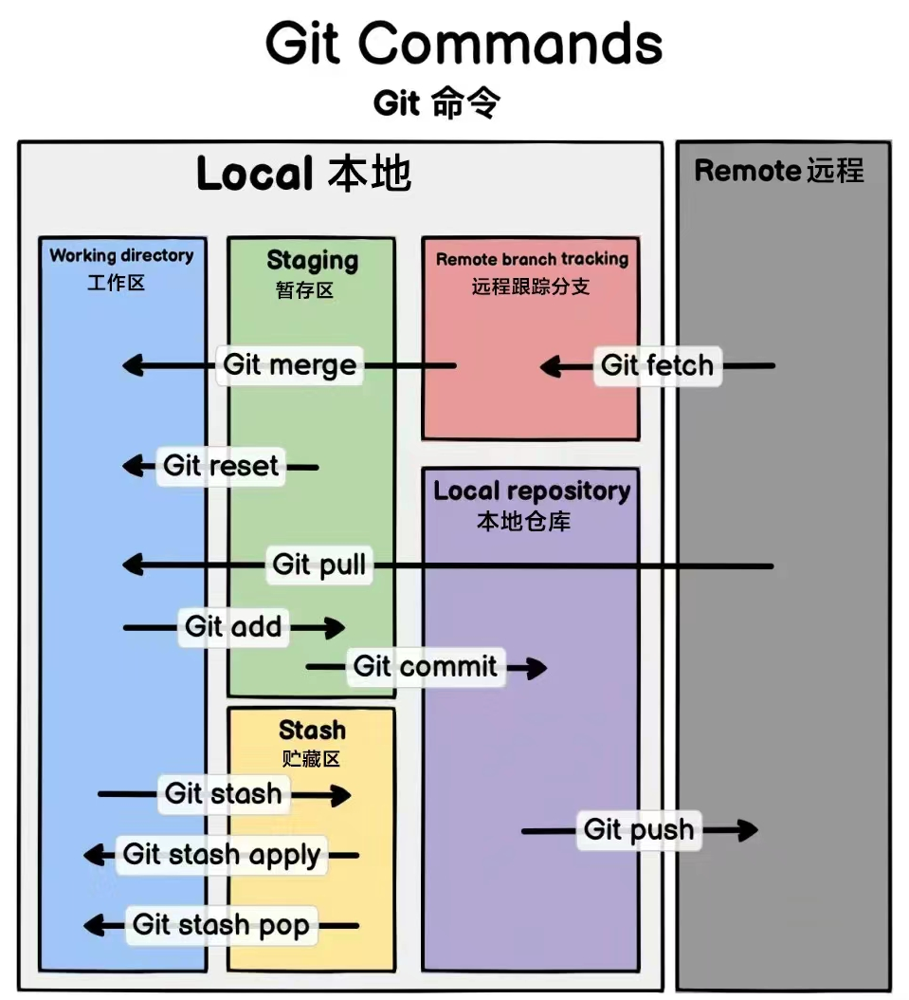
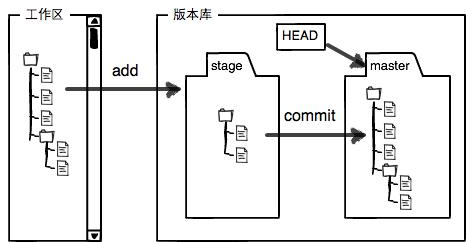

**工作区 (Working Directory)**
1. 在本地文件系统中看到的 文件夹 和 文件，也是你进行代码开发的地方
2. 所有未被添加到 Git 版本控制的 文件 或 修改，都会出现在工作区中
3. 命令
   1. `git add` : 将工作区的改动提交到 暂存区 (Staging)
   2. `git reset` : 撤销从工作区到暂存区的更改，即将文件从暂存区移回工作区


**暂存区 (Staging Area)**
1. 临时的存储区域，用于保存 即将提交到本地仓库的改动 (准备提交的状态)
2. 命令
   1. `git commit` : 将暂存区的所有改动提交到本地仓库，生成一次新的提交(commit)

**本地仓库 (Local Repository)**
1. 本地仓库保存的是当前分支的 所有历史提交记录(commits)
2. 命令
   1. `git push` : 将本地仓库的改动上传到远程仓库
   2. `git reset` : 撤销本地仓库的提交，并将改动返回到工作区或暂存区 - TODO

**远程仓库 (Remote Repository)**
1. 存储在服务器上的代码库，用于团队协作
2. 命令
   1. `git fetch` : 从远程仓库下载改动，但不自动合并到本地分支，更新远程跟踪分支的信息，不影响本地分支
   2. `git pull` : 从远程仓库下载改动并自动合并到当前分支

**远程跟踪分支 (Remote Branch Tracking)**
1. 远程跟踪分支是本地对远程分支的一个引用，它用来追踪远程分支的最新状态

**储藏区 (Stash)**
1. 储藏区是一个临时存储空间，用于保存未完成的工作


---

[廖雪峰 - Git 教程](https://liaoxuefeng.com/books/git/introduction/index.html)

Installation & Configuration
```bash
sudo apt install git

git --version

# --global 表示这台机器上所有的Git仓库都会使用这个配置
git config --global user.name "Your Name"
git config --global user.email "email@example.com"
git config --list
```

Git 是 分布式版本控制系统，所以 每个机器 都必须自报家门

创建版本库
```bash
cd <local_repository>
git init  # 把这个目录变成Git可以管理的仓库
# 新增 .git 目录(默认隐藏) Git来跟踪管理版本库的
```

所有的版本控制系统(包括 Git)，其实只能跟踪 文本文件的 改动，比如 TXT文件、网页、程序代码 等

而图片、视频这些二进制文件，虽然也能由版本控制系统管理，但没法跟踪文件的变化

如果要真正使用版本控制系统，就要以纯文本方式编写文件

强烈建议使用标准的`UTF-8`编码，所有语言使用同一种编码，既没有冲突，又被所有平台所支持

千万不要使用 Windows 自带的 记事本 编辑任何文本文件

Git命令必须**在Git仓库目录内执行**


```bash
git add <filePath>  # 可以多次add不同的文件
git commit -m "<comment>"  # commit可以一次提交很多文件
```

```bash
git status  # 掌握仓库当前的状态
git diff <filePath>
```

`git diff`
1. 不支持直接比较未跟踪文件 (untracked files)
2. 只比较以下几种情况
   1. `git diff` : **工作区** 与 **暂存区** 之间的差异
   2. `git diff --cached` : 比较 **暂存区** 和 `HEAD` 的差异(即将提交的内容)
   3. `git diff HEAD -- <file>` : 比较 **工作区** 和 `HEAD` 的差异(包括已暂存和未暂存的所有更改)
   4. `git diff HEAD~1` : 比较 工作区 和上一条提交(`HEAD~1`)之间的差异
   5. 工作区或暂存区 与 指定提交(如 HEAD) 的差异

快照在 Git 中被称为 **commit**

一旦你把文件改乱了，或者误删了文件，还可以从最近的一个 **commit** 恢复

`git log` 命令显示从最近到最远的提交日志，`--pretty=oneline` 参数，单行显示
1. 版本号 `commit id`，是一个 SHA1 计算出来的一个非常大的数字，用十六进制表示
2. Git是分布式的版本控制系统，需要处理多人协作


`git reset --<mode> <commit>` 3种模式(假设已经 commit 了)
1. |模式       |工作区状态             |暂存区状态             |文件内容是否保留|
   |----------|---------------------|----------------------|-------------|
   |`--soft`  | 保留 不改变           | 保留 所有改动仍在暂存区 | 保留         |
   |`--mixed` | 保留 工作区显示所有改动 | 清空 改动移回工作区    | 保留         |
   |`--hard`  | 清空	             | 清空                 | 删除(丢失)    |
2. `git reset` 不会影响 **未被跟踪的文件**
3. `git reset` 恢复方法 `git reflog`


`HEAD` - 当前版本(最新的提交 commit)
1. HEAD 是一个指针，指向当前所在的 commit，通常指向当前分支的最新提交
2. 当你切换分支 `git checkout` 时，`HEAD` 会更新为指向新分支的最新提交
3. 上一个版本 `HEAD^`，上上个版本 `HEAD^^`，方便表示 `HEAD~100`


`.git` **Git的版本库**(隐藏目录)
1. 
2. 存在于每个 Git 项目的根目录下
3. Git 用于存储和管理版本控制信息的核心目录
4. 包含
   1. commits
   2. branches (包含 master，Git 自动创建的第一个分支)
   3. staging area
   4. config
   5. HEAD 指针
5. `add` - 把要提交的所有修改放到暂存区
6. `commit` - 一次性把暂存区的所有修改提交到分支(只负责把暂存区的修改提交)


Git跟踪并管理的是**修改**，而非文件

`git reset/checkout <file>`
1. 用**版本库**里的版本替换工作区的版本，无论工作区是修改还是删除，都可以 一键还原
2. 如果使用 `rm` 误删了，可以用其恢复
3. 从来没有被添加到版本库就被删除的文件，是无法恢复的

`git rm` 用于删除一个文件
1. 默认会从工作区(Working Directory)中删除文件
2. 同时也会把 **删除操作** 加入到暂存区
3. 相当于执行了 git add 让 Git 追踪 **删除操作**
4. 恢复
   1. `git checkout HEAD -- <file>`
   2. `git restore --staged <file>` + `git restore <file>`


`ssh`
1. 命令
   ```bash
   cd ~/.ssh
   ssh-keygen -t rsa -C "<email>"  # 一路回车，生成 id_rsa 和 id_rsa.pub
   ```
2. `id_rsa`是**私钥**，不能泄露出去，`id_rsa.pub`是**公钥**，可以放心地告诉任何人
3. 登录 Github，进入 Settings，SSH and GPG keys，粘贴 公钥
4. GitHub 需要识别出你推送的提交确实是你推送的，而不是别人冒充的
5. GitHub允许你添加多个Key (对应多个电脑)


