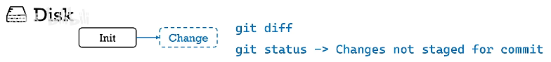
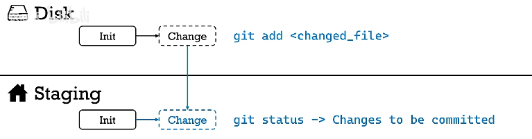
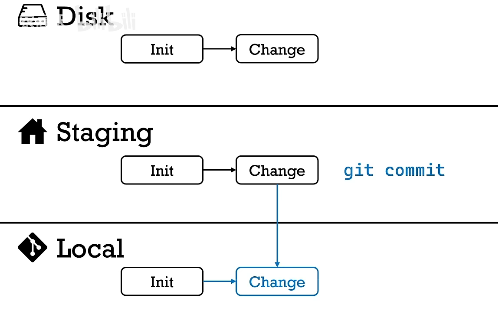
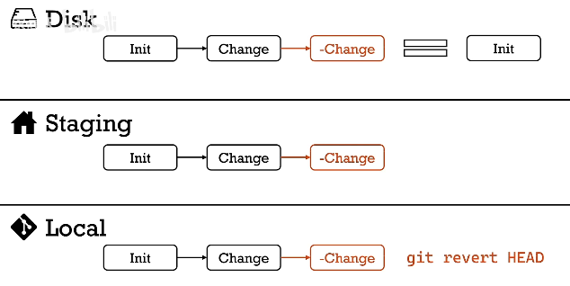
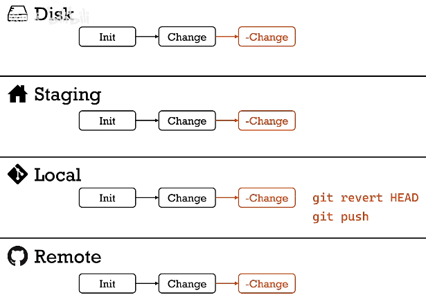
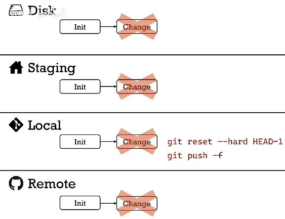

# Git Time Machine

---

# B站视频 - 码农高天

[十分钟学会常用git撤销操作，全面掌握git的时光机 - B站视频(高天)](https://www.bilibili.com/video/BV1ne4y1S7S9/)

4个区域
1. 硬盘 (Disk)
2. 暂存区 (Staging)
3. 本地Git (Local)
4. 远程Git (Remote)

初始状态下，保持同步 均为 init commit

## 在 本地 Disk

对代码文件进行修改
1. 使用 `git diff` 可以查看修改内容
2. 使用 `git status` 会显示 Changes not staged for commit (**红色**)

想要撤销所有对文件的修改 (对于新版本 git 可以使用 git restore)
1. 

## 在 暂存区 Staging

使用了 `git add`，同步到 Staging

使用 `git status` 会显示 Changes to be committed (**绿色**)

要把修改从暂存区移出，但还 **保留硬盘修改** (即想要 撤销 `git add`)
1. 

想要撤销所有的修改，包括 暂存区 & 硬盘 (**会丢失硬盘上的修改**)
1. 

HEAD 在 git 中表示 **最近一次的commit**

## 在 本地 Git Local

单纯的撤销 commit，不改变硬盘的文件，变化也会被保留在暂存区，**只是没有commit了**
1. 
2. local git 变成 上次 commit 也就是 init

~1 表示 HEAD 之前一次的 commit (HEAD 现在是 Change，~1 是 init)

若想同时撤销 commit & add，将文件**从暂存区拿出**，只保留硬盘修改 (默认 --mixed)
1. 

若想同时从 local git 中撤销 commit & add，将文件从暂存区拿出，并丢弃硬盘修改 (即完全恢复到初始状态) (可撤销，不会立刻删除，但是找回较麻烦)
1. 

`git revert xxx` (xxx代表一个或多个commit) 本质是**增加一个commit**，其效果是xxx commit的反作用，再放到 git 中 (添加反作用)
1. 
2. revert 相比 reset 更灵活，更安全，**可以撤销 任意一个 commit**

## 在 远程Git Remote

git push 到远端

判断远程分支是 公共分支(不止一个人使用的分支 eg : master/main) / 个人分支(feature branch)

对于**公共分支**，只能向前不能后退(只能增加，不能减少)，故**只能使用 revert**，减少会导致其他人分支乱套

revert 是 **从结果上撤销修改**，还是增加 一个commit，可以正常 push
1. 

对于**个人分支**，可以使用 `reset --hard`，但是 push 到远端 时，需要加 `-f`
1. `-f` = force，因为远端git 发现分支少了 commit
2. 

对于**公共分支** 应避免使用 `-f`，对于**个人分支**可以使用

