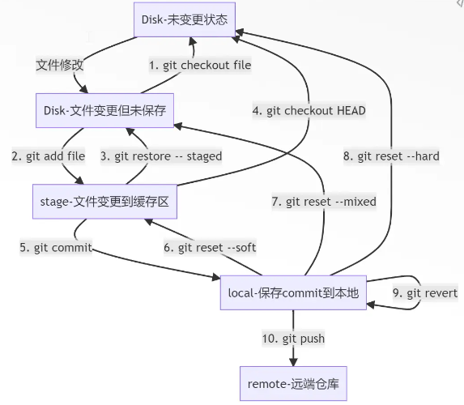

# Git Workflow

---

## Table of Contents

- [Git Workflow](#git-workflow)
  - [Table of Contents](#table-of-contents)
- [Git 核心区域](#git-核心区域)
- [Git 分支](#git-分支)
- [Git 团队协作 工作流](#git-团队协作-工作流)
- [Git 命令](#git-命令)
  - [Push](#push)
  - [Reset \& Restore \& Revert \& Checkout (回退操作)](#reset--restore--revert--checkout-回退操作)
  - [Merge \& Rebase (分支合并策略)](#merge--rebase-分支合并策略)
  - [Cherry-Pick (精准移植 commit)](#cherry-pick-精准移植-commit)
- [HEAD](#head)
- [Git AutoMerge](#git-automerge)


---

# Git 核心区域


**工作区 (Working Directory)**
1. 在本地文件系统中看到的 文件夹 和 文件，进行代码开发的地方
2. 所有未被添加到 Git 版本控制的 文件 或 修改，都会出现在工作区中
3. 命令
   1. `git add` : 将 工作区 的改动 提交到 暂存区
   2. `git reset` (默认 --mixed) : 撤销从 工作区 到 暂存区 的更改，即将文件从暂存区移回工作区
      1. `git reset --soft` : 移动 HEAD 指针，保留 暂存区 & 工作区 的修改，code 在，**commit 从 git log 的历史树上被摘下**(常用于 **合并/压缩 commit**)
      2. `git reset --hard` : 重置 暂存区 和 工作区，**会丢失** 工作区的修改


**暂存区 (Staging Area)**
1. 临时的存储区域，用于保存 即将提交到 本地仓库 的改动 (准备提交的状态)
2. 命令
   1. `git commit` : 将 暂存区 的所有改动 提交 本地仓库，生成一次新的提交(commit)

**储藏区 (Stash)**
1. 储藏区是一个临时存储空间，用于保存未完成的工作
2. 命令
   1. `git stash` : 保存当前未 commit 的工作
   2. `git stash pop` : 恢复最新的进度，并 **删除** 暂存记录
   3. `git stash apply` : 恢复最新的进度，**保留** 暂存记录 (适用于需要多次应用同一处修改)

**本地仓库 (Local Repository)**
1. 本地仓库保存的是 **整个项目** 的 **所有分支的历史提交记录**(commits)
2. 命令
   1. `git push` : 将 本地仓库的改动 上传 远程仓库
   2. `git reset` : 撤销本地仓库的提交 (HEAD 指针移动)，并将改动返回到工作区或暂存区 (取决于 --soft/mixed/hard)

**远程仓库 (Remote Repository)**
1. 存储在 服务器 的代码库，用于 团队协作
2. 命令
   1. `git remote add <name> <url>` : 将一个远程仓库添加到本地，并起一个别名 `<name>` (通常叫 `origin`)，让本地知道往哪里推送
   2. `git fetch` : 从远程仓库下载最新改动，**更新远程跟踪分支** (`origin/master`)，但 **不合并** 到本地工作分支
   3. `git pull` : = `git fetch` + `git merge`
      1. 先执行 `fetch` 更新 远程跟踪分支
      2. 再将 远程跟踪分支 的内容 `merge` 到 当前本地分支

**远程跟踪分支 (Remote Branch Tracking)**
1. 远程跟踪分支 是 本地 对 远程分支 的 引用， 追踪远程分支 最新状态

---

# Git 分支

分支类型
1. main/master : 主分支
2. develop : 整合 日常开发
3. feature : 开发 具体 新功能
4. hotfix : 紧急修复 bug

查看分支
1. `git branch` : 仅显示本地分支
2. `--all / -a` : 显示本地和远程所有分支
3. `-r` : 仅显示远程分支

切换分支
1. `git checkout <xxx>`
2. `git switch <xxx>`

创建分支
1. `git branch <xxx>` : 不自动切换
2. `git checkout -b <xxx>` : 创建 + 切换，`-b` 是 branch 缩写

合并分支 步骤
1. 切换到目标分支，eg : main/master
2. `git merge <branch_name>`
3. git 生成 特殊的 合并提交，连接两个分支的历史
4. 解决 **合并冲突** (通常位于 同一文件 同一位置 不同修改)
   1. 手动编辑解决 (保留 当前/合并/both 或者 重新实现)
   2. 验证/测试 解决方案
   3. add 添加到 暂存区 Staging，并 commit 提交解决方案

删除分支 (合并后的分支可以安全删除)
1. 删除本地分支
   1. 安全删除 : `git branch -d <branch_name>`，只有已合并才允许删
   2. 强制删除 : `git branch -D <branch_name>`，不管合没合并，直接删
2. 删除远程分支
   1. `git push origin --delete <branch_name>` : 告诉 origin 删除指定分支


Best Practice
1. 命名规范
   1. feature - 功能名
   2. bugfix  - 问题描述
   3. hotfix  - 紧急修复
2. 定期同步
   1. 经常拉取 主分支 最新更改
   2. 及时合并变更 到工作分支
   3. 避免分支过期，导致集成困难
3. 保持整洁
   1. 及时删除已合并分支
   2. 避免长时间分支特性开发
   3. 小步快跑迭代，频繁 & 短周期


---

# Git 团队协作 工作流

对比
1. 
2. 只有 最合适的 工作流


集中式工作流
1. 
2. 概念来自于 SVN 等 传统版本 控制系统
3. 所有代码变工都推送到 main 分支
4. 频繁冲突(后 push 的人 会遇到冲突)，缺乏并行开发能力


==功能分支流==
1. 每个功能 使用独立分支 开发，避免直接在 main 开发
2. **并行开发**，在各自分支上提交修改，互不干扰(时间上可以重叠，空间上独立)
3. **开发是并行的，继承是有序的**
4. ==Pull Request (PR) 机制== - 保证代码质量
   1. 名称来源 : 站在 仓库管理员 Maintainer 的角度，程序员 push 代码，请求 管理员 pull 回去
   2. 功能
      1. 合并请求
      2. 代码审查
      3. 自动化测试
      4. 团队讨论
   3. 全部通过后 才能合并到 main 分支
   4. 后续 PR，需要先 同步(pull) 最新 main 分支，解决潜在冲突后 再合并
      ```bash
      # feature branch 上同步最新的 main，将 main 的更新合并到 feature branch
      git checkout feature_branch
      git pull origin main  # 或者 git fetch origin main + git merge origin/main
      # 解决可能的冲突，git add & commit
      # 将更新后的 feature branch push 到远程
      git push origin feature_branch
      ```
   5. **PR 提交后的维护流程**
      1. 提交 PR 后，应**定期检查** main 分支是否有更新 (其他 PR 合并后)
      2. 如果 main 有更新，在 feature branch 上 `git pull origin main`
      3. 解决可能的冲突后，`git push origin feature_branch`
      4. **不需要 重新提交 PR**，已有的 PR 会自动更新(显示 新的提交 & 冲突解决)，继续代码审查流程
   6. **冲突检测与通知**
      1. 当其他 PR 合并到 main 后，**不会自动通知**其他 PR 的作者
      2. 但 **CI/CD 系统** 通常会检测到冲突，并在 PR 页面标记为 需要更新 或 有冲突
         1. **CI/CD** = Continuous Integration / Continuous Deployment (持续集成/持续部署)
         2. **不是 maintainer**，而是**自动化系统/工具**，由 maintainer 配置
         3. **功能** : 自动运行测试、检查代码质量、检测冲突、部署 等
      3. 最佳实践 : 开发者应 **主动定期检查** 自己的 PR 状态，或设置 GitHub/GitLab 通知关注 main 分支的更新
      4. **即使没有冲突，也应该同步最新的 main**：
         1. 确保代码基于最新版本，避免后续合并时出现意外问题
         2. 保持代码库的一致性，可能虽然没有直接冲突，但逻辑上需要适配新的代码
         3. 让 PR 的 diff 更清晰，审查者可以看到基于最新 main 的改动


GitHub Flow
1. 
2. 随着 敏捷开发 & DevOps，追求 更快的 交付速度
3. 在 **Git Flow** 基础上 **极简化处理**
   1. 相比 Git Flow (main、develop、feature、release、hotfix 多个分支)，GitHub Flow **只有 main & feature & 自动部署**
   2. 简单发布流程，特性分支 -> PR -> 代码审查 & 自动化测试 -> 合并 & **自动部署到生产环境**
   3. 没有 develop 分支，所有开发直接基于 main 分支
   4. 没有 release 分支，不需要专门的发布准备流程
   5. 没有 hotfix 分支，紧急修复也通过 feature branch + PR 处理
4. **main 分支 始终可部署**，可发布到生产环境
6. 依赖
   1. 自动化测试 : 保证 代码质量
   2. CI/CD 流水线 : 保证 部署可靠性
   3. 监控系统 : 保证 生产环境稳定性
7. 适用于 需要频繁发布的项目，敏捷开发、Web应用、API服务


Git Flow
1. 
2. 最完整 & 最严格 的 分支管理策略
3. 当 项目变的复杂，需要支持多个版本，有严格发布计划
4. 每种分支 有明确的 职责 & 生命周期
5. **双 主分支 架构**
   1. main **生产发布**
      1. 只包含 生产就绪的代码
      2. 只接受 来自 release & hotfix 的合并
      3. 每个提交 都是一个 发布版本
   2. develop
      1. 开发主线，功能开发主体，包含下一个版本的最新功能
      2. (日常开发集成)
6. 三类 支撑分支
   1. feature : **功能开发**，从 **develop** 创建，完成后 合并回 develop
   2. release : **集成测试，发布准备**，从 **develop** 创建，测试后 同时 合并到 main & develop
   3. hotfix  : **紧急修复**，从 **main** 创建，修复后 同时 合并到 main & develop
7. 严格 版本管理 & 明确 发布流程
8. **main 分支更新频率较低**，只在正式发布时更新


**Git Flow vs GitHub Flow** :
1. **Git Flow** : 有完整的版本管理流程，包含 main、develop、feature、release、hotfix 多个分支
2. **GitHub Flow** : 在 Git Flow 基础上**极简化**，只有 main 和 feature 分支
3. **主要区别** :
   1. **分支结构** : Git Flow 有 5 种分支类型，GitHub Flow 只有 2 种
   2. **发布流程** : Git Flow 需要 release 分支准备发布，GitHub Flow 合并到 main 就自动部署
   3. **开发分支** : Git Flow 有 develop 分支用于日常开发集成，GitHub Flow 直接在 main 上开发
   4. **适用场景** : Git Flow 适合需要严格版本管理的项目，GitHub Flow 适合快速迭代的 Web 应用、API 服务


**main 分支更新频率说明** :
1. **功能分支流 & GitHub Flow** : main 分支**可以频繁更新**，每次 PR 合并都会更新，这是正常的开发流程
2. **Git Flow** : main 分支更新频率较低，主要在正式发布时更新，日常开发在 develop 分支
3. **频繁更新是正常的**，特别是在敏捷开发中，关键是开发者要及时同步自己的 feature branch
4. **main频繁更新的权衡**：
   1. **实际情况** : 如果 main 频繁更新，开发者确实需要频繁同步并解决冲突
   2. **这是正常的** : 在敏捷开发中，这是并行开发的代价，但带来的好处是：
      1. 代码始终基于最新版本，减少最终合并时的"大爆炸"式冲突
      2. 问题可以及早发现和解决，而不是积累到最后
      3. 团队可以快速迭代，功能可以更快交付
   3. **减轻负担的最佳实践**：
      1. **小步快跑** : 保持 PR 小而专注，快速合并，减少需要同步的次数
      2. **及时同步** : 每天或每次开始工作前同步一次，而不是等到 PR 审查时才同步
      3. **关注通知** : 设置通知关注 main 分支更新，及时响应
      4. **团队协调** : 如果多个 PR 可能冲突，团队可以协调合并顺序


---


# Git 命令


## Push

`git push`
1. `git push <远程主机名> <本地分支名>:<远程分支名>`
2. 强制推送
   1. `--force` (**use with caution**)
      1. 强行覆盖
      2. 如果别人推了新的 commit，但是 没有 同步到 本地，该 提交 在远程 丢失(被覆盖)
      3. 除非 确定 只有一个人 在这个分支上开发，否则慎用
   2. `--force-with-lease` (**recommended**)
      1. 强行覆盖，**前提** : 本地的 `origin/xxx`(远程跟踪分支) 和 远程真正的 `xxx` 分支一致
      2. 一致 说明 没人动过，允许覆盖
      3. 不一致，拒绝覆盖，并报错提示你先 fetch 一下


## Reset & Restore & Revert & Checkout (回退操作)

[Git Time Machine - 个人笔记 from 码农高天](./GitTimeMachine.md)



`git reset`
1. 作用对象 : 本地仓库 (Local Repository) 的 **HEAD 指针**
   1. 执行 `git reset <commit>`，Git 首先做的事就是把当前分支的 HEAD 指针(最近的 commit) 强行移动到那个 `<commit>` 上
   2. 修改 本地仓库 的状态
2. `--soft/mixed/hard`
   1. `git reset --soft` : 仅 移动 HEAD 指针，撤销 commit，保留 暂存区 & 工作区 的修改，commit (常用于 **合并/压缩 commit**)，code 在，但是 commit 从 git log 的历史树上被摘下
   2. `git reset --mixed` (**default**) : 撤销 commit & 暂存，将文件从 暂存区 移回 工作区，保留 工作区 修改
   3. `git reset --hard` (**use with caution**) : 重置 暂存区 和 工作区，**会丢失** 工作区的修改


`git restore`
1. `git restore <file>` (无 `--staged`)
   1. 用 暂存区(如果为空则用HEAD) 的内容 替换 工作区 的文件
   2. **会丢失** 工作区未暂存的修改 (不可逆)
   3. 不同于 `git reset --hard`，只影响指定的文件
2. ``git restore --staged <file>`
   1. 仅操作 暂存，修改内容还在
   2. 不同于 `git reset --mixed`，可以指定具体文件


`git revert <commit>`
1. 新的 commit，撤销 问题 commit 的所有更改
2. 解决问题 & 保留项目完整历史
3. 更加安全


`git checkout` (新版本推荐 restore)
1. checkout 的 主要功能 其实是 切换分支
2. `git checkout -- <file>` = `git restore <file>`
   1. 用 暂存区(如果为空则用HEAD) 的内容 替换 工作区 的文件
   2. **会丢失** 工作区未暂存的修改 (不可逆)
   3. `--` : 可以不加，主要为了防止歧义(branch & file)，优先 切换 branch
3. `git checkout <commit>`
   1. 临时查看 历史版本
   2. HEAD 指针指向 对应 commit，进入 **分离 HEAD 状态**
   3. 可以查看代码，但不建议修改
   4. 用来 临时查看 / 测试历史版本


## Merge & Rebase (分支合并策略)

**黄金原则**
1. 公共分支(多人共享的分支) 只能用 Merge，不要 Rebase
2. 只在 私有分支 Rebase
3. 永远不要对 已经推送到远程的 提交 进行 rebase


`git merge`
1. 
2. 合并commit 会有2个 父commit
3. **Pros** : 完整保留 分支开发的 历史轨迹，易于理解分支结构，团队协作安全
4. **Cons** : 历史图复杂，合并提交多


`git rebase`
1. 
2. 不会创建 合并commit
3. 将 feature branch 的 commit 移动到 主分支 最新位置，**变成全新的提交，有不同的 hash 值**
4. 详细步骤拆解 (feature rebase main)
   1. 找 基底 (Base) : Git 会回溯历史，找到 feature 分支是从 main 分支的哪一个 commit 开始分叉出来的，作为 基底
   2. 存补丁 (Save Temporary Patches) : 从 分叉点 到 现在的所有 feature 分支上的 commit，一个个提取出来，变成 临时补丁
   3. 切分支 (Reset HEAD) : Git 会把 feature 分支的指针，强行移动到 main 分支的最新位置(最新的 HEAD)，这时候 feature 分支内容和 main 一样
   4. 打补丁 (Apply patches) : Git 将补丁，按顺序一个个应用在新的基底上
      1. 关键点 : 在应用每一个补丁时，Git 都会尝试 自动合并
      2. 没冲突 : 自动生成一个新的 commit，内容一样，但 Hash 值变了
      3. 有冲突 : 暂停，让你解决冲突
5. **Pros** : 完全线性的提交历史，项目历史 简洁清晰，便于 代码审查 & 问题追踪
6. **Cons** : 修改提交历史，多人协作可能产生冲突
   1. 发生原因举例
      1. X & Y 都在 开发 feature branch
      2. X 提交 commit C1
      3. Y pull，基于 C1 开发 C2
      4. X rebase main，C1 变为 C1'，并且使用 `git push --force` 强行覆盖了远程
      5. Y 想要 push C2，Git 说 C1 在远程已经不存在了，远程现在是 C1'，需要手动处理历史


`merge` & `rebase` 的 Current & Incoming 恰恰相反
1. merge
   1. Current : 当前所在的分支
   2. Incoming : 想要合并进来的分支
2. rebase
   1. Current : 要去的那个分支(一般是 main)
   2. Incoming : 当前所在的分支


## Cherry-Pick (精准移植 commit)

`git cherry-pick`
1. 
2. 从一个 branch 中 挑选 特定 commit，应用到 另一个 branch
3. 公共分支慎用，可能导致 重复提交
4. 使用场景
   1. **紧急修复** : develop分支 修复了一个 bug，希望 引用到 生产分支，但不想整个 develop分支 合并
   2. **功能移植** : 在 实验分支，开发成熟功能，移植到其他分支
   3. **提交恢复** : 误删 / 需要恢复 历史版本中 特定 commit
5. 复制 某个 commit 的改动，创建全新的 commit，有独立的 hash 值
6. 使用步骤
   1. 找到 目标commit 的 hash 值，`git log <feature_branch>`
   2. 切换到 目标branch
   3. 进行 cherry-pick，`git cherry-pick <hash>`
   4. 如果 遇到冲突
      1. 手动解决冲突
      2. `git add` 解决冲突的文件
      3. `git cherry-pick --continue / --abort`
7. 高级技巧
   1. 多个 commits 一次性 cherry-pick，直接写多个 hash 值
      1. **顺序很重要** : Git 会严格按照你提供的 hash 顺序依次应用。
      2. Best Practice : **按时间顺序(从旧到新)**排列，否则可能因依赖缺失导致冲突
   2. 移植连续的 commits (**范围操作**)
      1. `git cherry-pick A..B` : 移植 A 到 B 之间的所有 commits (不包含 A，包含 B)，即 **==左开右闭==**
      2. `git cherry-pick A^..B` : 包含 A 也包含 B
      3. **优势** : Git 会自动按时间顺序应用，无需手动排序
   3. 不自动提交，cherry-pick 后 需要手动修改一下
      1. `git cherry-pick -n <hash>`
      2. 只会把改动 放在 工作区 & 暂存区


---

# HEAD

HEAD : 最近一次的 commit

单一直线分支
1. `HEAD` : 当前提交
2. `HEAD^` = `HEAD~` = `HEAD~1` : 上一个提交（父提交）
3. `HEAD^^` = `HEAD~~` = `HEAD~2` : 上上个提交（爷爷提交）


合并提交 Merge Commit
1. 当 HEAD 指向一个 合并提交(由 两个分支 合并而来，所以 有两个父节点)
2. `~` (波浪号) 表示 第一父系世系
   1. `HEAD~1` : 第一个 父提交(通常是你合并时所在的主分支，如 `master`)
   2. `HEAD~2` : 第一个 父提交的 父提交
3. `^` (脱字符) 表示 第几个父提交 (Parent number)
   1. `HEAD^1` : 第一个 父提交(等同于 `HEAD~1`)
   2. `HEAD^2` : 第二个 父提交(通常是你合并进来的那个分支，如 feature)


---

# Git AutoMerge

核心原理建立在一个称为 三路合并(3-Way Merge) 的算法基础

找到 这2个分支 共同的 parent commit(**Merge Base**)，以此作为基准 判断该保留谁的修改

概念
1. Base : 共同祖先提交
2. Current : 你当前所在的分支
3. Incoming: 你想要合并进来的分支

找到 Base 后，Git 会同时对比 `Base vs Current` 和 `Base vs Incoming` 的变化

可能情况
1. 只有 Incoming 修改 : 自动采纳 Incoming 的修改
2. 只有 Current 修改 : 保留 Current 的修改
3. 双方都修改，但改得一模一样 : 自动合并，不冲突
4. **双方修改 同一处，且内容不同** : Git 无法自动决定，报冲突


