# 测试 Git & Github

# Windows

## 安装

[Git官网](https://git-scm.com/)

版本 : git version 2.42.0.windows.2

安装 (其他默认)
1. Select Destination Location : 修改安装位置
2. Select Components
   1. Additional icons (On the Desktop)
   2. (NEW!)Add a Git Bash Profile to Windows Terminal
3. Choosing the default editor used by Git
   1. Use Visual Studio Code as Git's default editor

## 配置&查看基础信息

git config
1. git config -h   # 在 git bash 中显示帮助信息
2. git config --help   # 打开 file:///C:/Program%20Files/Git/mingw64/share/doc/git-doc/git-config.html
3. git config --system -l = git config --system --list  # 显示系统配置信息
4. git config --global -l = git config --global --list  # 显示全局配置信息
   1. git config --global user.name "[user_name]"   # 修改用户名(github账号名)
   2. git config --global user.email "[user_email]" # 修改邮箱(注册github使用的邮箱)

git -v = git --version  # 查看 git 版本

## 本地创建&修改&提交

本地创建 TestGit 空文件夹(使用 Git Bash 打开)

```bash
lenovo@DESKTOP-M3BPQG1 MINGW64 ~/Desktop/TestGit            # 没有分支
```

git init

出现一个 .git 隐藏文件夹

```bash
lenovo@DESKTOP-M3BPQG1 MINGW64 ~/Desktop/TestGit (master)   # 出现分支，默认master
```

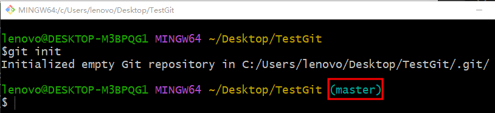

在 TestGit 文件夹中创建 hello.py
```python
print("hello master")
```

git status  # 查看文件状态

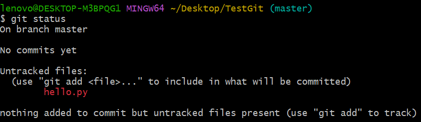

git add .   # 

git status  # 再次查看文件状态 new file : hello.py

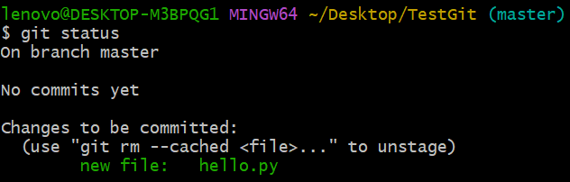

将该文件改为
```python
print("hello git : master")
```

git diff    # 查看更改
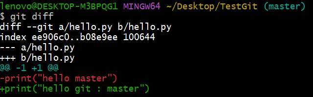

git add .

git status  # 再次查看文件状态 new file : hello.py

git commit -m "create hello.py in master branch"

git status  # 再次查看文件状态
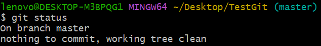

clear   # 清屏

exit    # 退出


## 与Github联动

在 Github 中创建 新Repository 名为 TestGit ，可以按照Github给出的提示进行操作

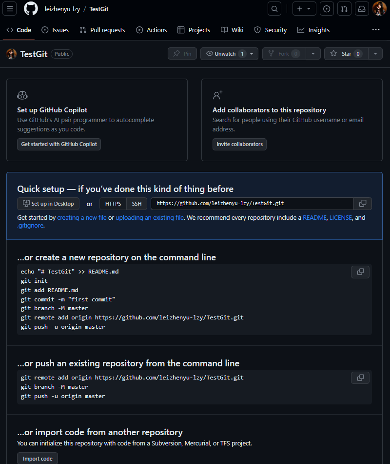

在本地进行操作

echo "# TestGit" >> README.md   # 本地 TestGit 文件夹中 出现 README.md 文件
git add README.md
git commit -m "first commit"
git commit -m "add README.txt & create github repository"

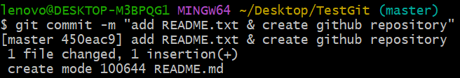

git branch -M xxx   # 修改分支名称 (git branch -h   # 查看帮助)
(-M : move/rename a branch, even if target exists)

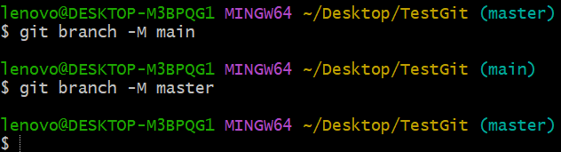

git remote add origin https://github.com/leizhenyu-lzy/TestGit.git

git push -u origin master   # 报错

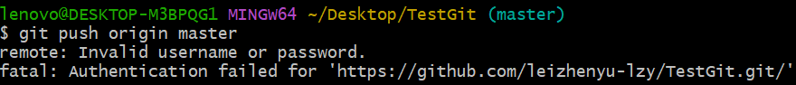

git push -u origin master   # 重试后，使用 Git Credential Manager

登录自己的 GitHub 账号

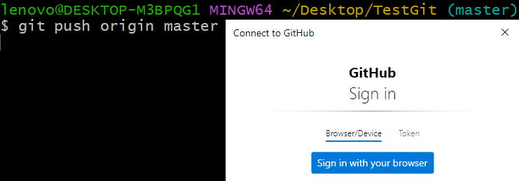

选择 Authorize

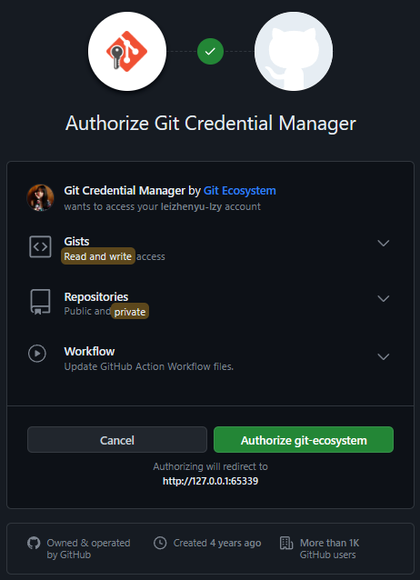

Settings -> Application 可以看到 Authorize 结果

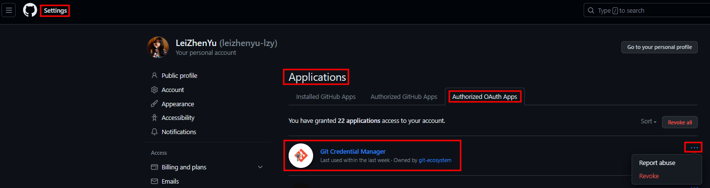

进行提交

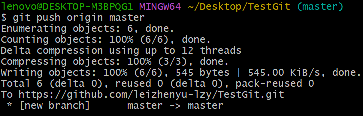

Github 中已能看到

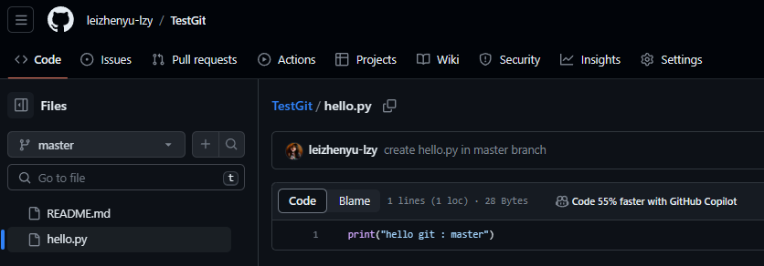

## 克隆操作

git clone https://xxx.git

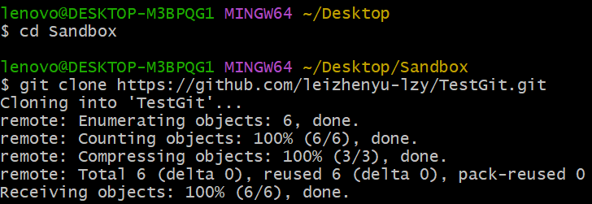

git clone 后 xxx 来源

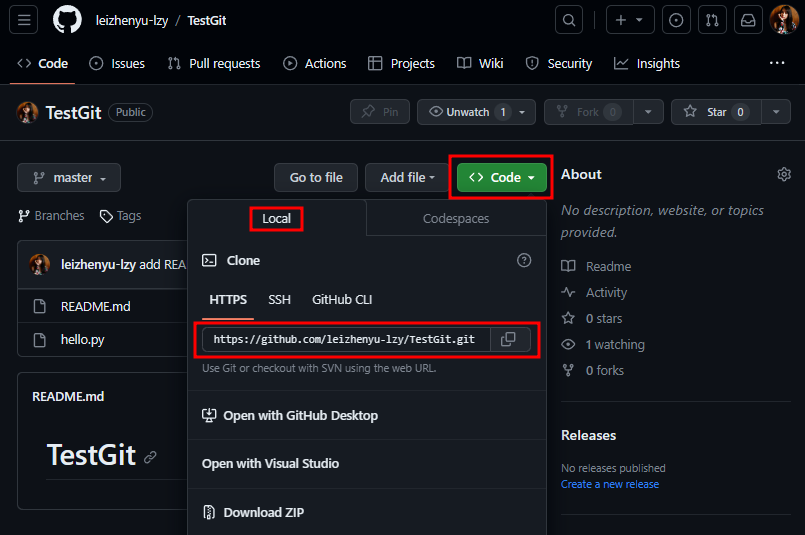

## 分支操作

目前有三个 TestGit
1. 本地 ~/Desktop/TestGit
2. 本地 ~/Desktop/Sandbox/TestGit (刚刚clone的)
3. 远程 TestGit

git branch -a     # 查看分支(本地+远程) (分别在两个本地中查看)

注:名称前面加* 号的是当前的分支

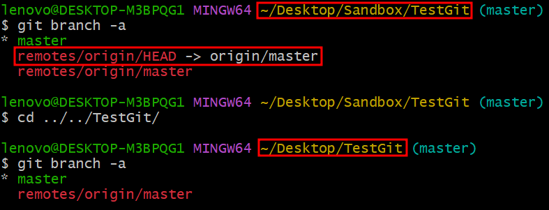

git branch -vv    # 查看本地分支&对应远程分支 (对应关系)

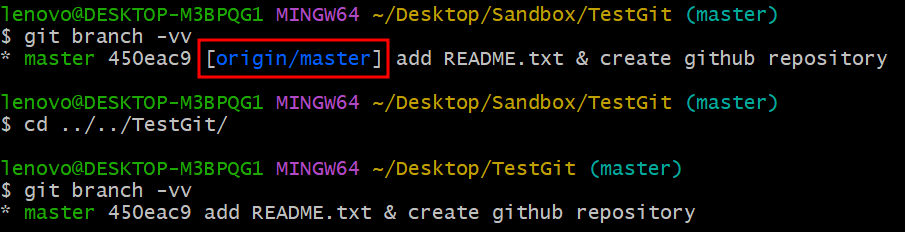

git checkout -b TestDeleteBranch   # 在本地创建一个新分支

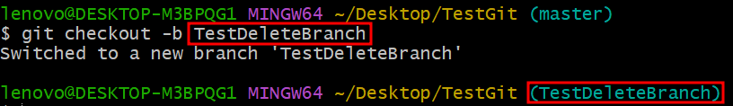

git branch --set-upstream-to=origin/TestDeleteBranch  # 切换当前分支对应的远程分支(如果没有该远程分支，则会报错)

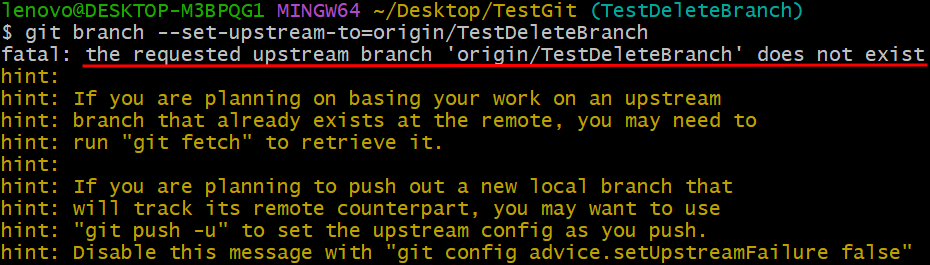

Github 创建远程分支

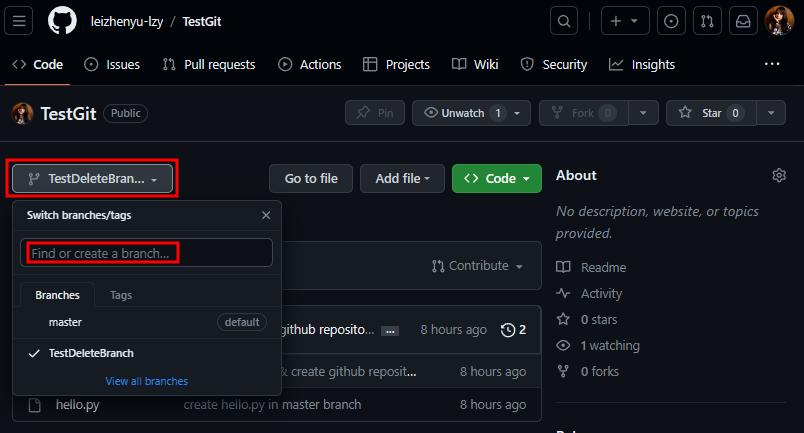


