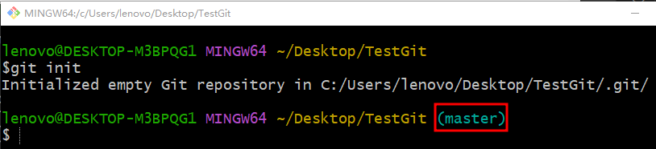
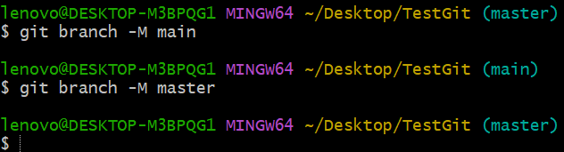
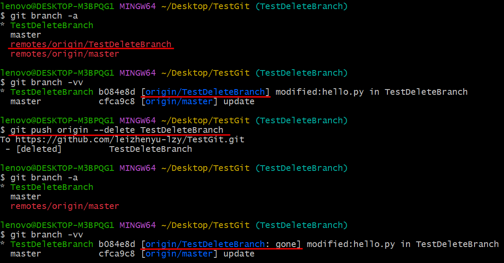

# 测试 Git & Github

# Windows

## 安装

[Git官网](https://git-scm.com/)

版本 : git version 2.42.0.windows.2

安装 (其他默认)
1. Select Destination Location : 修改安装位置
2. Select Components
   1. Additional icons (On the Desktop)
   2. (NEW!)Add a Git Bash Profile to Windows Terminal
3. Choosing the default editor used by Git
   1. Use Visual Studio Code as Git's default editor

## 配置&查看基础信息

git config
1. git config -h   # 在 git bash 中显示帮助信息
2. git config --help   # 打开 file:///C:/Program%20Files/Git/mingw64/share/doc/git-doc/git-config.html
3. git config --system -l = git config --system --list  # 显示系统配置信息
4. git config --global -l = git config --global --list  # 显示全局配置信息
   1. git config --global user.name "[user_name]"   # 修改用户名(github账号名)
   2. git config --global user.email "[user_email]" # 修改邮箱(注册github使用的邮箱)

git -v = git --version  # 查看 git 版本

## 配置代理 proxy

git config --global http.proxy 127.0.0.1:7890
git config --global https.proxy 127.0.0.1:7890
git config --global --get http.proxy
git config --global --get https.proxy


## 本地创建&修改&提交

本地创建 TestGit 空文件夹(使用 Git Bash 打开)

```bash
lenovo@DESKTOP-M3BPQG1 MINGW64 ~/Desktop/TestGit            # 没有分支
```

git init

出现一个 .git 隐藏文件夹

```bash
lenovo@DESKTOP-M3BPQG1 MINGW64 ~/Desktop/TestGit (master)   # 出现分支，默认master
```



在 TestGit 文件夹中创建 hello.py
```python
print("hello master")
```

git status  # 查看文件状态


git add .   # 

git status  # 再次查看文件状态 new file : hello.py


将该文件改为
```python
print("hello git : master")
```

git diff    # 查看更改


git add .

git status  # 再次查看文件状态 new file : hello.py

git commit -m "create hello.py in master branch"

git status  # 再次查看文件状态


clear   # 清屏

exit    # 退出


## 与Github联动

在 Github 中创建 新Repository 名为 TestGit ，可以按照Github给出的提示进行操作


在本地进行操作

echo "# TestGit" >> README.md   # 本地 TestGit 文件夹中 出现 README.md 文件
git add README.md
git commit -m "first commit"
git commit -m "add README.txt & create github repository"


git branch -M xxx   # 修改分支名称 (git branch -h   # 查看帮助)
(-M : move/rename a branch, even if target exists)



git remote add origin https://github.com/leizhenyu-lzy/TestGit.git

git push -u origin master   # 报错


git push -u origin master   # 重试后，使用 Git Credential Manager

登录自己的 GitHub 账号


选择 Authorize


Settings -> Application 可以看到 Authorize 结果


进行提交


Github 中已能看到


## 克隆操作

git clone https://xxx.git


git clone 后 xxx 来源


## 分支操作

目前有三个 TestGit
1. 本地 ~/Desktop/TestGit
2. 本地 ~/Desktop/Sandbox/TestGit (刚刚clone的)
3. 远程 TestGit

git branch -a     # 查看分支(本地+远程) (分别在两个本地中查看)

注:名称前面加* 号的是当前的分支


git branch -vv    # 查看本地分支&对应远程分支 (对应关系)


git checkout -b TestDeleteBranch   # 在本地创建一个新分支


git branch --set-upstream-to=origin/TestDeleteBranch  # 切换当前分支对应的远程分支(由于没有该远程分支，则会报错)


--set-upstream-to 和 -u 等价

在 本地 创建 Github 远程分支

git push origin xxxx # xxx 就是远程仓库的名称


仍需要手动 git branch --set-upstream-to=origin/xxx 建立本地分支与远程分支的连接，之后就可以正常 push

创建不同名远程分支(即通过本地分支 xxx 创建远程分支 yyy)

git push origin HEAD:yyy   # 当前处于本地xxx分支


在 Github 网站 创建远程分支


git pull


git pull origin TestDeleteBranch  # 当你存在多个分支的时候，你需要pull下来分支上面的内容，你需要指定分支进行同步命令


git branch -a  # 可以看到远程分支多了一个


此时 git branch -vv 还不能看到上传关系


git branch --set-upstream-to=origin/TestDeleteBranch

再 git branch -vv 后，可以看到上传关系


有点强迫症，把本地 master 和 远程 master 建立关系

git checkout master
git branch --set-upstream-to=origin/master
git branch -vv


git checkout TestDeleteBranch # 切换回 TestDeleteBranch 分支，并将hello.py 内容改为
```python
print("hello git : TestDeleteBranch")
```

git status 和 git diff  # 查看修改内容


推送至远程


Github 可以看到相应改动


如果此时从 TestDeleteBranch 分支 切换为 master 分支


则 hello.py 文件内容 变回 master 分支 的 hello.py 文件内容 (notepad++ 提示修改)

测试 git checkout . 用于恢复 未 git add 的操作

先将 master 分支中的 hello.py 修改如下(记得 Ctrl+S 保存)

```python
print("hello git : master test modify")
```

git checkout . # 使用后，notepad++显示文件被修改，再用 git status 查看 已经恢复原状


删除本地分支

git branch -d xxx # 删除(对于没有 fully merged 需要用 -D)


注意无法删除当前分支


甚至可以删除 master 分支，已经没有本地 master 分支


如果此时远程的 master 分支还存在，故可以通过远程分支创建本地分支

git checkout -b master origin/master   # 自动切换会被恢复的分支


同样操作删除本地 TestDeleteBranch 分支

测试另一种恢复方式

git reflog show --date=iso # 查看操作记录，并找到对应的 七位数字符串(这里是 b084e8d)


git checkout -b RecoverDeleteBranch b084e8d  # 恢复刚刚删除的分支(故意改了分支名字)


恢复后记得查看并建立与远程的链接

将 RecoverDeleteBranch 分支 中的 hello.py 修改如下
```python
print("hello git : RecoverDeleteBranch")
```

比如此处我想把 RecoverDeleteBranch push 给


删除远程分支

git push origin --delete xxx  # 删除远程名为 xxx 的分支



将 本地xxx分支 推送至 远程yyy分支 和创建不同名远程分支(即通过本地分支 xxx 创建远程分支 yyy)类似


仅仅设置 upstream 不够，仍需要 HEAD:


为测试 merge 将 master分支 和 TestMerge分支 分别修改如下

```python
print("hello git : Master")
print("hello git : Master")
```

```python
print("hello git : TestMerge")
print("hello git : TestMerge")
```

git merge xxx  # 将 本地xxx分支 merge到 当前所在的本地分支，如果遇到不能auto merge的情况则需要手动fix (xxx分支不会被改变)


使用 git status 查看，MERGING表示正在合并状态中


git add 和 git commit 后 MERGING 消失


在 GitHub 中 修改 hello.py 如下 (模拟他人的修改)
```python
print("hello git : TestMerge modify via Github")
```
在 本地 中 修改 hello.py 如下 (模拟自己的修改)
```python
print("hello git : TestMerge modify via notepad++")
```


