# Learn Git

[toc]

## Portals

[狂神说 Git](https://www.bilibili.com/video/BV1FE411P7B3)

[廖雪峰 Git教程](https://www.liaoxuefeng.com/wiki/896043488029600)

[尚硅谷 Git入门到精通](https://www.bilibili.com/video/BV1vy4y1s7k6)

[猴子都能懂的git入门](https://backlog.com/git-tutorial/cn/)


# VSCode 插件

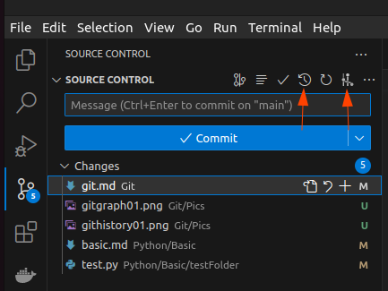

## Git Graph

[[vscode] 最好看最体贴的git插件：Git Graph](https://www.bilibili.com/video/BV1Zb4y1j7Zy/)

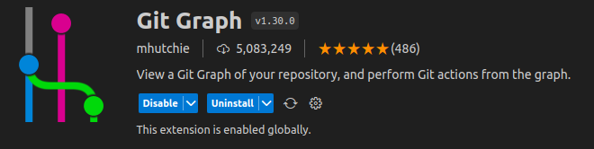

线代表branch(不同颜色)，节点表示commit

顶部可以选择查看的branch(包括查看所有branch)

点击commit可以详细查看信息(commit时间，message，被修改的文件)

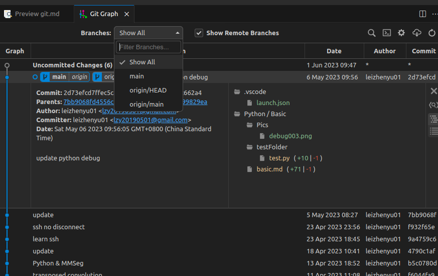

右键commit会出现如下常见命令

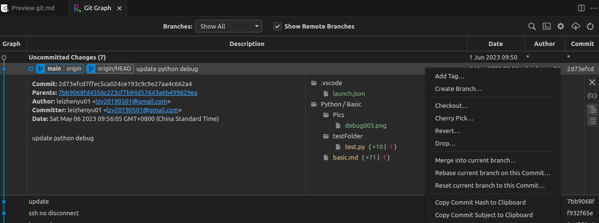

点击commit中的具体文件可以查看具体修改内容(和其父commit的比较)

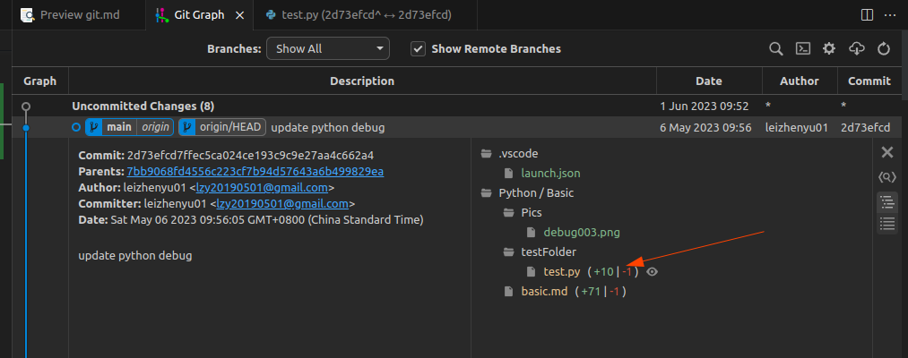

也可以右键具体文件(左右分栏对比)

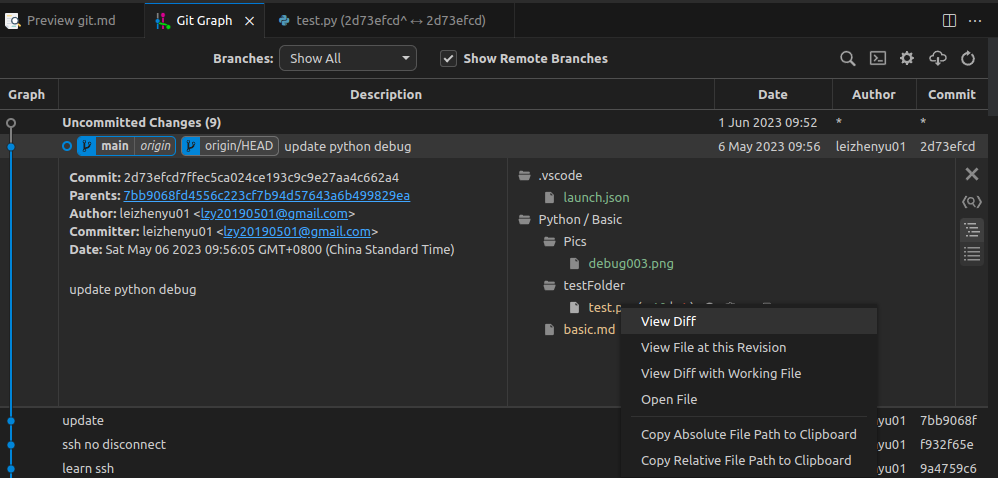

**重点** : 当前commit和任意commit的比较(查看两个commit之间文件的改动)

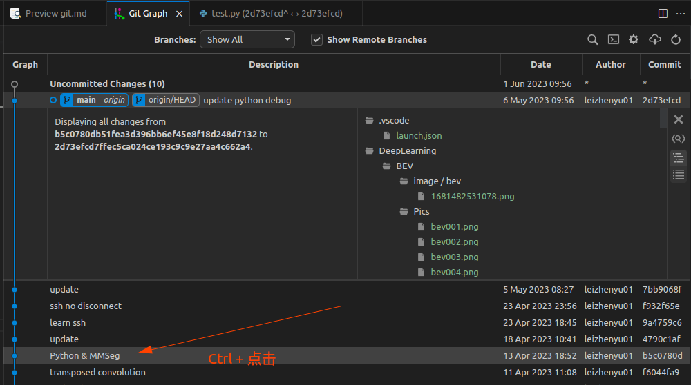

可以查看用户、仓库设置、远程branch

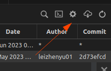

## Git History

[[vscode] 最好用的git比较历史插件: Git History](https://www.bilibili.com/video/BV1DY411L7YJ/)

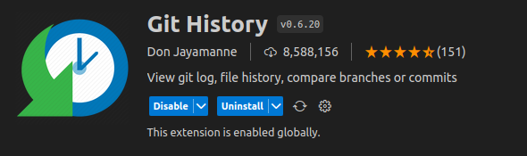

主题界面如下

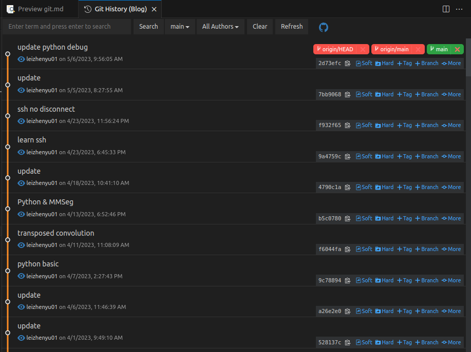

可以搜索、切换branch、切换作者

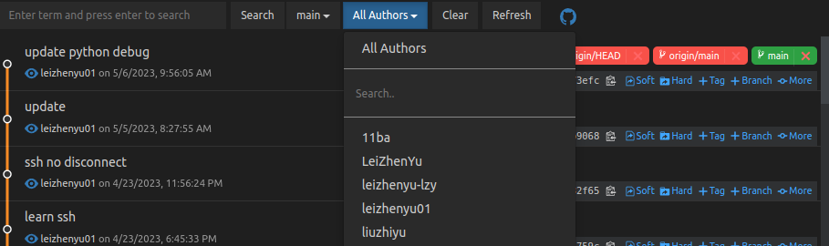

点击任意一个commit会在下方显示修改的文件

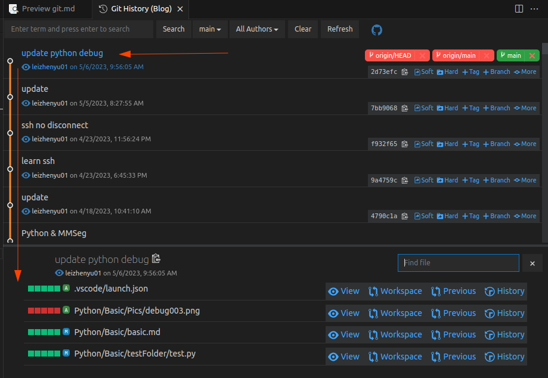

view直接打开文件，previous和父commit比较(左右分栏)

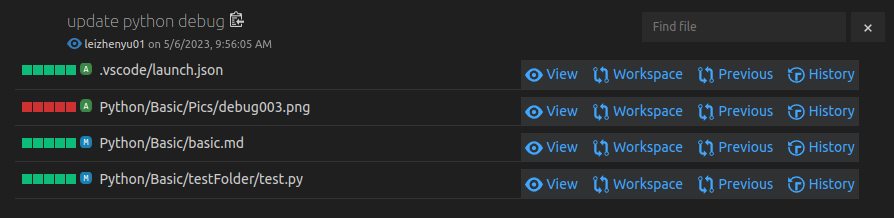

**重点** : 任意两个commit的比较(more->select，more->compare with，侧边栏 Compare Commits)

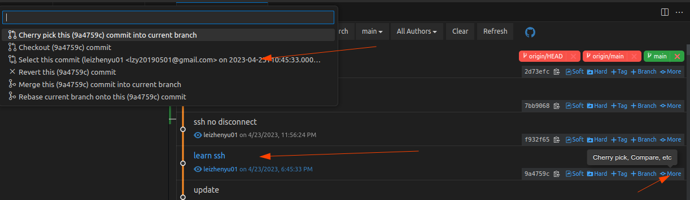

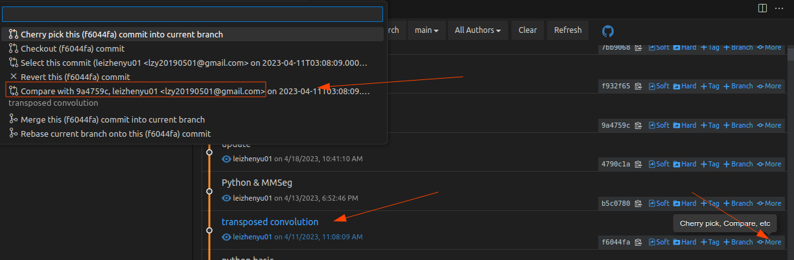

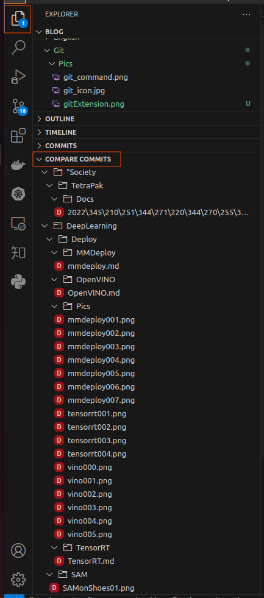

**重点** : 单独查看某个文件历史(文件侧边栏，选择文件，右键，View File History) 也可以在要查看的文件编辑页面右键进行查看

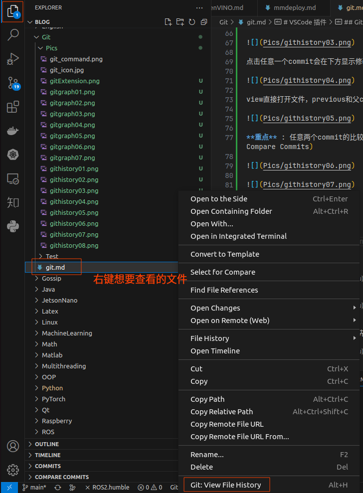

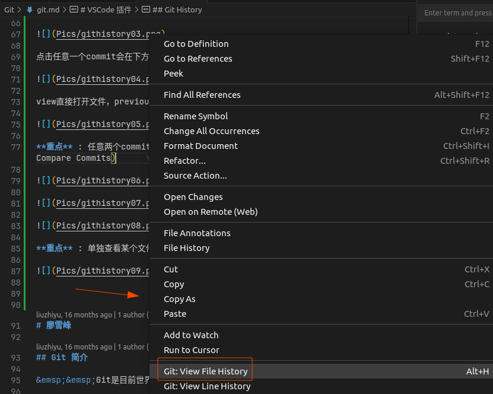

查看结果如下

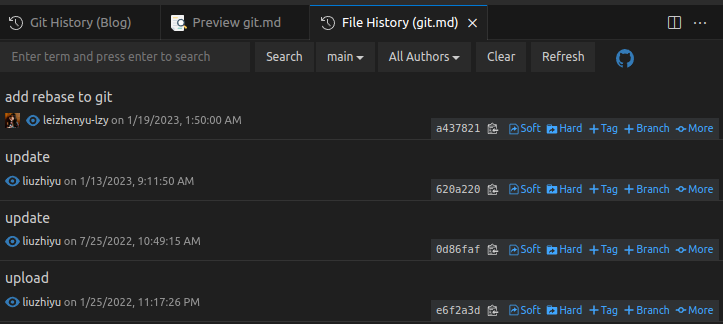

# 版本回退

git status 查看commit状态

git log 查看提交，黄色部分即为版本号 (按q退出显示)

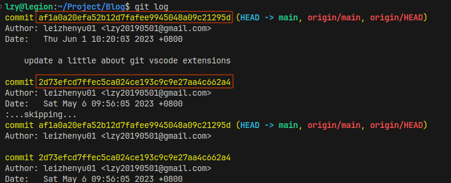

commit 后在vscode中 文件颜色变为白色


git 回滚
1. 已提交，没有push
   1. git reset --soft [之前的版本号] 撤销commit
   2. git reset --mixed [之前的版本号] 撤销commit和add两个动作
2. 已提交，并且push
   1. git reset --hard [之前的版本号] 撤销并舍弃版本号之后的提交记录 **需谨慎使用** 在日志中无法再次查询，完全舍弃“毁尸灭迹”
   2. git revert [要移除的版本号] 撤销但保留提交记录，会新生成一个版本，之前的无用版本也会存在于记录中

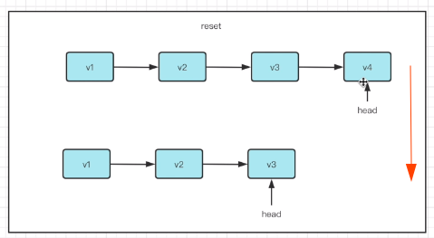

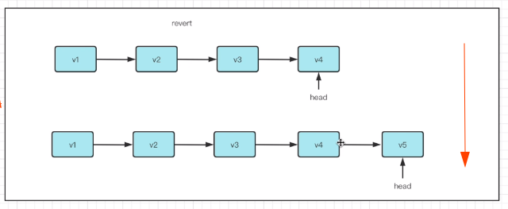


# 廖雪峰

## Git 简介

Git 是目前世界上最先进的分布式版本控制系统

所有的版本控制都只能针对文本内容，像word、excel这样的二进制文件，所谓版本控制，就是文件快照，系统无法比较文件内容的差异

二进制文件，没有所谓行的概念，无法定位更改


### Git 诞生

Linus花了两周时间自己用C写了一个分布式版本控制系统，这就是Git

### 集中式 VS 分布式

Linus 一直痛恨的 CVS 及 SVN 都是集中式的版本控制系统，而Git是分布式版本控制系统

分布式版本控制系统根本没有“中央服务器”，每个人的电脑上都是一个完整的版本库，这样，你工作的时候，就不需要联网了，因为版本库就在你自己的电脑上。既然每个人电脑上都有一个完整的版本库，那多个人如何协作呢？比方说你在自己电脑上改了文件A，你的同事也在他的电脑上改了文件A，这时，你们俩之间只需把各自的修改推送给对方，就可以互相看到对方的修改了。

和集中式版本控制系统相比，分布式版本控制系统的安全性要高很多，因为每个人电脑里都有完整的版本库，某一个人的电脑坏掉了不要紧，随便从其他人那里复制一个就可以了。而集中式版本控制系统的中央服务器要是出了问题，所有人都没法干活了。


## Git安装

TODO

## 创建仓库(Repository)

```cpp
mkdir <DirName>
cd <DirName>

git init //把这个目录变成Git可以管理的仓库

git add <FileName> //告诉Git，把文件添加到仓库
git commit -m <comments> //告诉Git，把文件提交到仓库

//也可以一次提交多个文件


```

# 狂神说

## 版本控制分类

本地版本控制

集中版本控制：所有的版本数据保存在服务器上，开发者从服务器同步更新或上传自己的修改。用户本地只有子集以前同步的版本。不联网无法看到历史版本，也无法切换版本验证问题，或在不同分支工作。版本库在中央服务器。（SVN、CVS、VSS）

分布式版本控制：每个用户拥有全部代码（安全隐患）。所有版本信息仓库全部同步到本地的每一个用户，这样可以在本地查看所有的版本历史（增加了本地存储空间的占用）。可以离线在本地提交，只需在联网时push到相应的服务器或其他用户即可。Git可以直接看到更新了哪些代码和文件。（Git）

## 基本的Linux命令

1. cd 改变目录（直接cd进入默认目录）
2. cd .. 回退上一个目录
3. pwd 查看当前目录
4. ls 列出当前目录的文件
5. ll 更详细的列出目录
6. touch 新建一个文件
7. rm 删除文件
8. mkdir 新疆文件夹
9. rm -r 移除文件夹
10. mv 移动文件
11. reset 重新初始化中断，清屏
12. clear 清屏
13. history 查看历史命令
14. help 帮助
15. exit 退出
16. #表示注释

## Git配置

系统配置文件保存在本地： D:\Git\etc\gitconfig       （与system list内容对应）
用户配置文件保存在本地： C:\Users\35058\.gitconfig  （与global list内容对应）

```git
查看配置       -l 表示list
git config -l

查看系统配置的信息
git config --system --list

查看用户配置的信息（用户名和邮箱） 必须配置 向git服务器说明你是谁
git config --global --list

git config --global user.name "[user_name]"

git config --global user.email "[user_email]"
```

环境变量自动配置了

安装时记得先卸载（包括清理旧的环境变量）

## Git的工作原理

Git的3个本地工作区域+1个远程仓库：
1. 工作目录(Working Directory)：存放项目代码的地方
2. 暂存区(Stage/Index)：暂存区，用于临时存放改动（只是一个文件，保存即将提交的文件列表信息）
3. 资源库(Repository/Git Directory)：安全存放数据的位置，这里面有提交到所有版本的数据。HEAD指向最新存放入仓库的版本
4.
5. 远程Git仓库(Remote Directory)：远程仓库，托管代码的服务器，用于远程数据交换

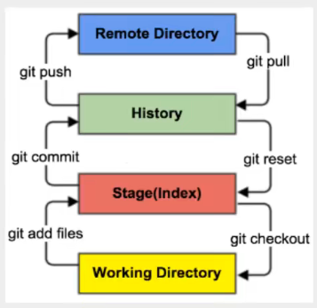

本地的add进暂存区，commit提交的本地仓库，push到远程目录

远程的pull到本地仓库，reset回滚回暂存区，最后

.git隐藏文件夹

**工作流程**
1. 在工作目录中，添加、修改文件
2. 将需要进行版本管理的文件放入暂存区（git add）
3. 将暂存区的文件提交到git仓库（git commit）
4. 推送到远程（git push）

## Git项目创建及克隆

git创建目录方式：
```
初始化仓库（出现.git隐藏文件）
git init


克隆仓库
git clone [url]


撤销所有本地修改
git reset --hard
```

## Git的基本操作命令

**文件4种状态**

Untracked：未跟踪。没有加入到git库种，不参与版本控制。通过git add 变为Staged状态。

Unmodify：文件已入库，未修改，即版本库种文件快照内容与文件夹中的完全一致。两种去处：①被修改变为Modified状态；②git rm拜纳姆Untracked状态。

Modified：文件已修改。两个去处：①git add进入staged状态；②git checkout则丢弃修改，返回unmodify状态。

Staged：暂存状态。git commit命令将修改同步到库中，使得库文件和本地文件抑制。

```

查看文件状态
git status [filename]

查看所有文件状态
git status

添加所有文件到暂存区
git add .

提交暂存区内容到本地仓库  -m 表示提交信息
git commit -m ""
注意这里要不要使用中文引号，否则没用
```


**忽略文件**

.gitignore

文件指明忽略哪些文件

使用#进行注释

可以使用Linux通配符

```
*.txt       忽略所有.txt结尾的文件

!lib.txt    感叹号表示例外

/temp       匹配项目根目录

build/      忽略build下的所有文件

doc/*.txt   忽略文件夹中的某个文件
```


## 配置SSH公钥及创建远程仓库

免密登录

注意可能之前配置了Clash代理，所以上传时需要打开Clash（Gitee和Github）


## IDEA集成Git


## Git中分支说明


## Git后续操作说明


# 报错及解决

##

```
error: failed to push some refs to ‘xxx’
hint: Updates were rejected because a pushed branch tip is behind its remote
hint: counterpart. Check out this branch and integrate the remote changes
hint: (e.g. ‘git pull …’) before pushing again.
hint: See the ‘Note about fast-forwards’ in ‘git push --help’ for details.
```

git pull --rebase origin master
该命令的意思是把远程库中的更新合并到（pull=fetch+merge）本地库中，–-rebase的作用是取消掉本地库中刚刚的commit，并把他们接到更新后的版本库之中。出现如下图执行pull执行成功后，可以成功执行git push

git push -u origin master


[git push 的 -u 参数含义](https://blog.csdn.net/Lakers2015/article/details/111318801)


# Git 常用命令介绍

git config
1. --system --list
2. --global --list
   1. --global user.name "[user_name]"
   2. --global user.email "[user_email]"


git clone
1. xxx.git

git branch
1. -vv   # 查看本地分支&对应远程分支 (对应关系)
2. -a    # 查看所有分支(本地+远程)
3. --set-upstream-to=origin/xxx  # 切换推送分支
4. -d    # 删除本地分支，不能是当前分支(需要先切换checkout为其他分支)

git checkout
1. -b xxx   # 新建xxx分支
2. xxx      # 切换至xxx分支
3. .        # 若还未add，则可以恢复修改

推送分支

git status  # 查看修改文件

git diff    # 查看具体修改内容 q推出

git add .   # 加入缓存，准备提交

git commit -m "xxxx" # 是本地被修改，还需要push到远程

git pull
1. 后面不跟内容   # 更新最新代码

git merge
1. xxx # 将本地xxx分支代码合并到当前分支(xxx分支不变)，可能会遇到冲突，合并失败(git status 查看，并手动调整)

git push
1. origin xxx     # 推送 记得切换(用--set-upstream-to) 也可以直接都不写 xxx远程分支也可以没有
2. origin --delete xxx # 删除远程的xxx分支(需谨慎，需要特别确认，或者用merge查看一下有无区别)
3. -f    # 强制更新到某一结点

git reset
1. --mixed  # 已经add了(提交到缓存区了)，回退
2. HEAD xxx # 已经add了(提交到缓存区了)，回退单个文件(也可以写个.表示全部)
3. --soft HEAD^   # 已经commit了，回退commit命令，再 reset --mixed 就可最终回退add命令 (分两步回退)
4. --hard HEAD^   # 一步完成上条两步操作，并且修改也没有了 (慎用)
5. --hard xxxID   # 回退到该对应ID位置(可能无法push，因为远程版本更高，需要git push -f)

git log
1. 后面不跟内容   # 查看最近提交记录，会显示唯一ID(可用于恢复)
2. --graph --oneline # 图形化展示分支情况
3. --oneline -5   # 查看最近5条


# Git实战丨看故事学git --- 武沛齐

[Git实战丨看故事学git --- 武沛齐](https://www.bilibili.com/video/BV1uD4y1V77L/)

git
1. 分布式 (对应集中式(需要 Central VCS Server))
2. 版本控制
3. 软件


# 集中式版本控制系统 VS 分布式版本控制系统

[集中式版本控制系统 VS. 分布式版本控制系统 --- 知乎博客](https://zhuanlan.zhihu.com/p/366198045)

两种不同的管理模式
1. 集中式版本控制系统，例如：CVS、SVN
2. 分布式版本控制系统，例如：Git

## 集中式

集中式的版本控制系统，所有的版本库是放在中央服务器中的，也就是说每一次的修改上传都是保存在中央服务器中的。中央服务器就是个大仓库，大家把产品都堆里面，每一次需要改进和完善的时候，需要去仓库里面把文件给提出来，然后再操作。

存在问题
1. 协同工作时可能造成的提交文件不完整
2. 版本库损坏
3. A提交，B也提交，C下载的时候可能得到的仅是A,B提交版本中的一部分
4. 必须要联网才能将本地版本推送至服务器进行保存

## 分布式

**分布的含义是每台计算机上都还有一个完整的版本库**。你的修改仅仅需要提交给本地的版本库进行保存就可以了。

不同于集中式版本控制系统的“中央服务器”，分布式版本控制系统可以通过推送版本库，实现不同的计算机之间的版本共享。

就是说对于同一个文件A，如果两个人同时对A文件进行了修改，最新的版本应该都保存在各自的计算机中，想要实现协同开发，只需要将各自的最新版本库推送给对方，就可以得到最新的版本库了。

分布式版本控制系统中通常也会有一台充当“中央服务器”的计算机，大家都把版本推送到这台计算机上，而需要同步的人只需同步这一台固定的计算机就可以。

分布式管理中的“中央服务器”是用来“交换意见”，或者说充当中介作用的

每一台计算机通过和这台固定的中介交换意见以后，都会拥有完整的版本库

## Git使用简介

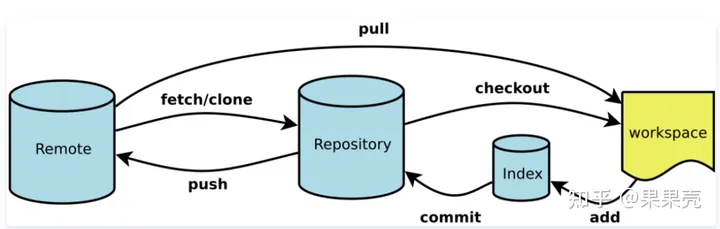

git
1. Workspace
2. Index/Stage
3. Repository  就是我们说的版本库，版本库中每一个文件的修改、删除，Git都能跟踪到
4. Remote


