# 十分钟学会常用git撤销操作，全面掌握git的时光机

[十分钟学会常用git撤销操作，全面掌握git的时光机 - 高天 B站视频](https://www.bilibili.com/video/BV1ne4y1S7S9/)

4个区域
1. 硬盘     Dist
2. 暂存区   Staging
3. 本地Git  Local
4. 远程Git  Remote

初始状态下，保持同步 均为 init commit

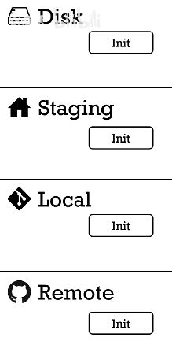

## 在 本地 Disk

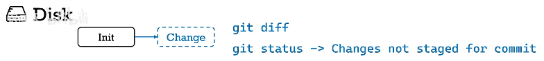

使用 git diff 可以查看修改内容

使用 git status 会显示 Changes not staged for commit (红色)

想要撤销所有对文件的修改 (对于新版本 git 可以使用 git restore)

## 在 暂存区 Staging

使用了 git add

使用 git status 会显示 Changes to be committed (绿色)

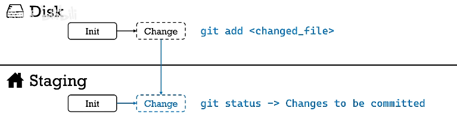

要把修改从暂存区移出，但还保留硬盘上的修改 (即想要撤销 git add)

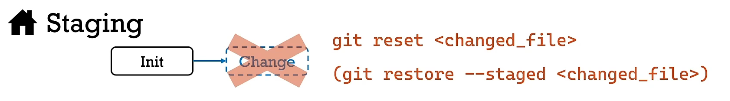

想要撤销所有的修改，包括暂存区和硬盘 (会丢失硬盘上的修改)

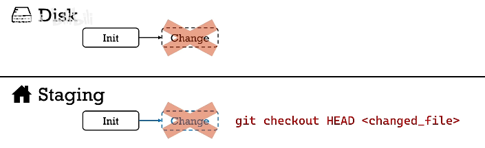

HEAD 在git中表示 最近一次的commit

## 在 本地Git Local

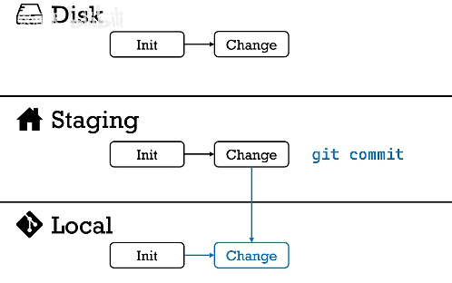

想单纯的撤销commit，不改变硬盘的文件，变化也会被保留在暂存区，只是没有commit了

~1 表示 HEAD 之前一次的 commit

若想同时撤销 commit，并将文件从暂存区拿出，只保留硬盘修改 (默认 --mixed)

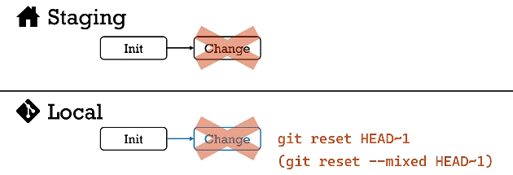

若想同时从 local git 中撤销 commit，将文件从暂存区拿出，并丢弃硬盘修改 (即完全恢复到初始状态) (可撤销，不会立刻删除，但是找回较麻烦)

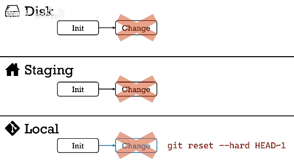

git revert xxx (xxx代表一个或多个commit) 本质是增加一个commit，其效果是xxx commit的反作用，再放到 git 中 (添加反作用)

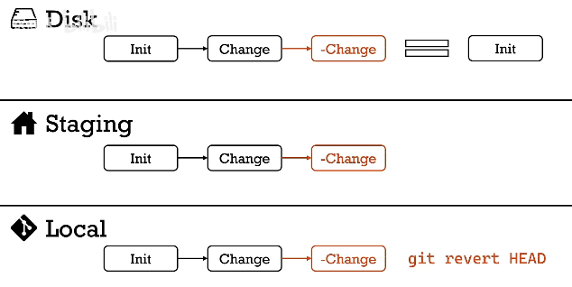

revert 相比 reset 更灵活，更安全，可以撤销 任意一个 commit

## 在 远程Git Remote

git push 到远端

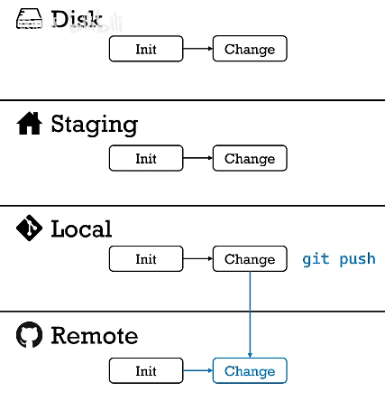

判断远程分支是 公共分支(不止一个人使用的分支 eg.master) / 个人分支(feature branch)

对于**公共分支**，只能向前不能后退(只能增加，不能减少)，故只能使用 revert

revert 是从结果上撤销修改 还是增加 一个commit

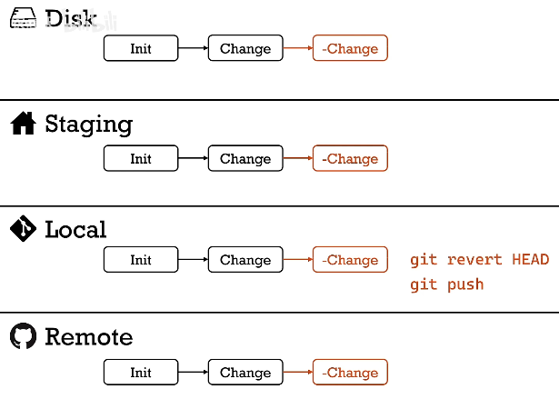

对于**个人分支**，可以使用 reset --hard，但是 push 到远端 时，需要加 -f

-f = force，因为远端git 发现分支少了 commit

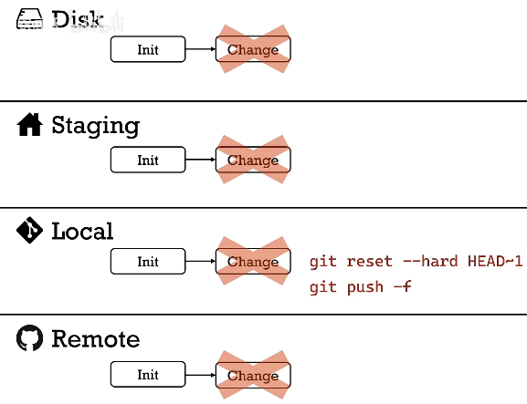

对于**公共分支**因避免使用 -f，对于**个人分支**可以使用

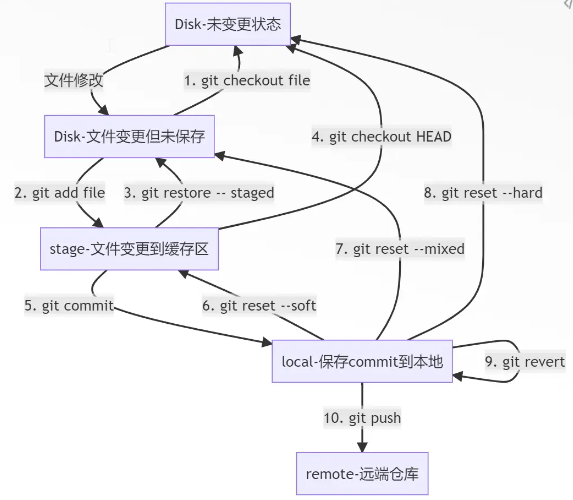