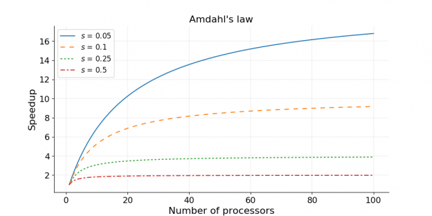
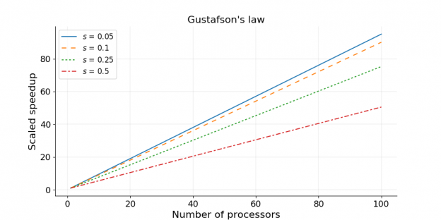

# HPC - High Performance Computing

## Table of Contents

- [HPC - High Performance Computing](#hpc---high-performance-computing)
  - [Table of Contents](#table-of-contents)
- [Strong/Weak Scaling](#strongweak-scaling)

---

# Strong/Weak Scaling

HPC 系统中，关心系统的 并行能力，涉及 strong/weak scaling 两种 metrics
1. Strong scaling : Amdahl's Law
   1. 问题规模固定，通过 增加计算资源(eg : 处理器数量) 来 减少计算时间 的能力
   2. focus 系统解决某特定问题的**时间** (system latency)
   3. $$\text{speedup} = \frac{1}{s + \frac{p}{N}}$$
   4. 
2. Weak scaling: Gustafson's law
   1. 每个处理器上保持工作量不变，通过 增加计算资源 来 处理更大规模的问题 的能力
   2. focus 系统解决某特定问题的**带宽** (system throughput)
   3. $$\text{speedup} = s + p × N$$
   4. 
3. 符号说明
   1. $s$ : 不能被并行的问题的比例
   2. $p$ : 能被并行的问题的比例
   3. $N$ : 处理器的数量

