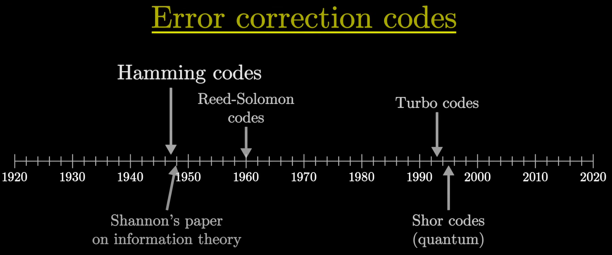

# 汉明码 Hamming Code

[3B1B 汉明码Pa■t1，如何克服噪■ - YouTube](https://www.youtube.com/watch?v=X8jsijhllIA)

有划痕(影响存储的0/1)的光盘，读取的数据确实与原先存储的不同，仍能正确播放原先内容(读取的数据还是能精确decode成原始文件)

resilient to errors 容错

最简单的想法 (redundant copies) : 每个 bit 复制 3 遍
1. 
2. 2/3 redundancy
3. 仍然无法可靠处理 多个bit 同时翻转

hamming code : 256 bit block 中 只有 9 redundancy bit，其他 247 message bit
1. 
2. 如果有 1 bit 被翻转，可以 检测 & 修复 错误
3. 如果有 2 bit 被翻转，可以 检测到2个错误，但不知道如何修复

Error Correction Code 纠错码

Hamming Code 可能没有那么 widely-used

Valid Messages $\subset$

[3B1B 汉明码part2，优雅的全貌 - YouTube](https://www.youtube.com/watch?v=b3NxrZOu_CE)

