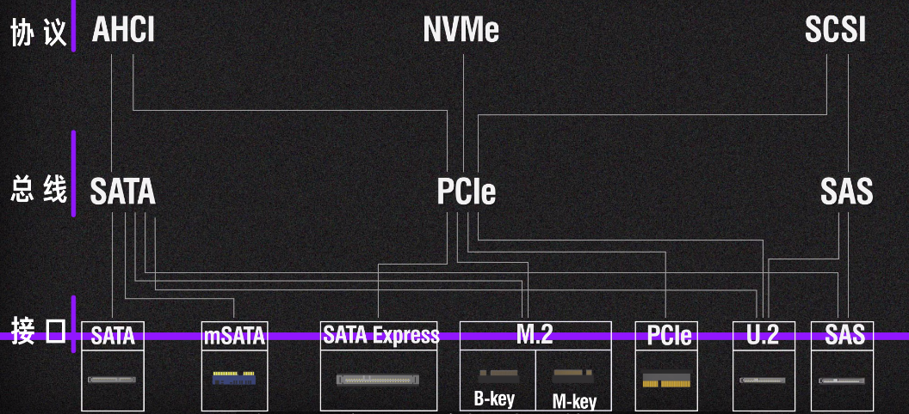
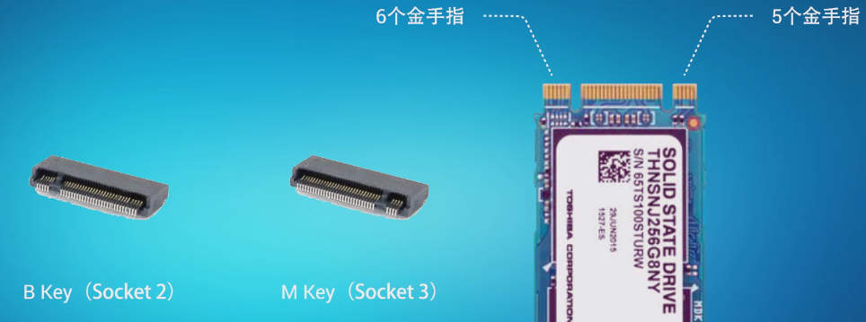
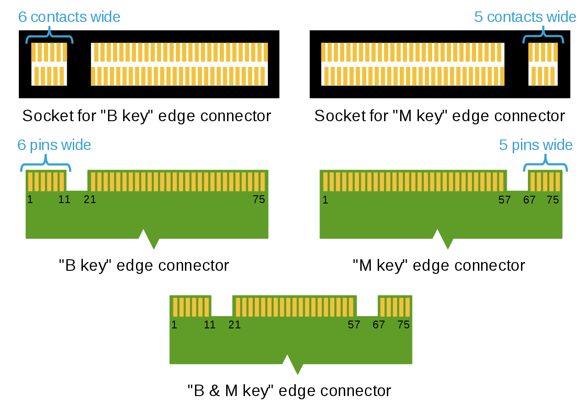
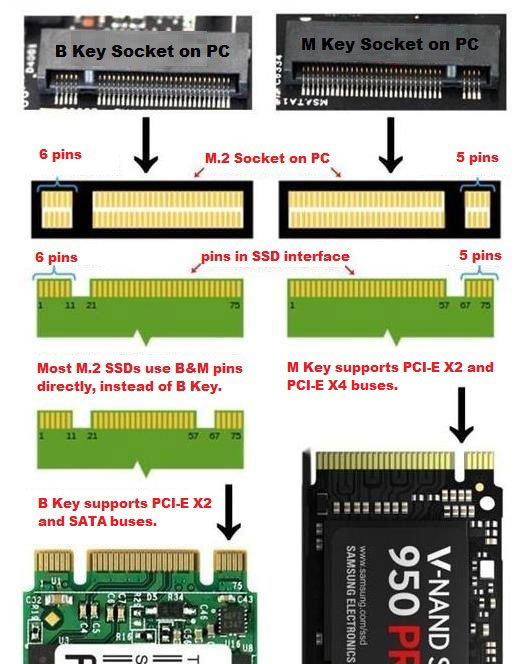
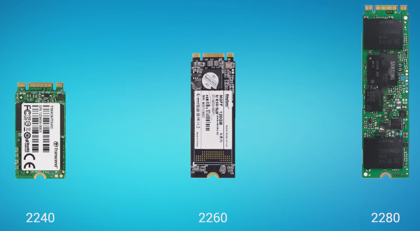
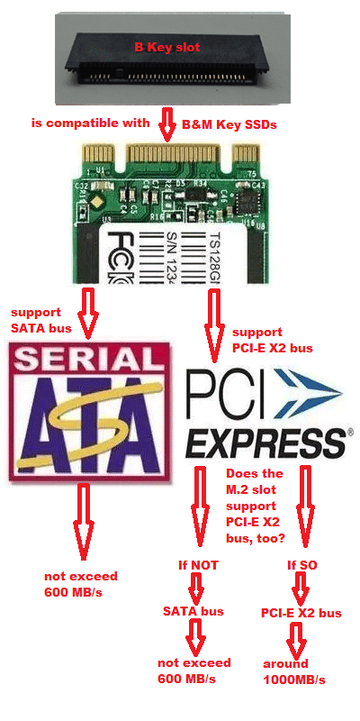
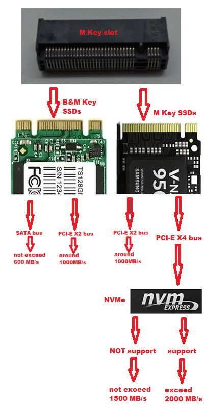
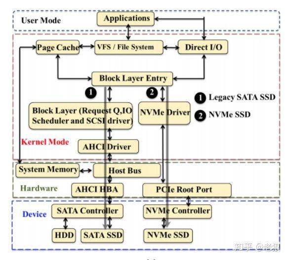
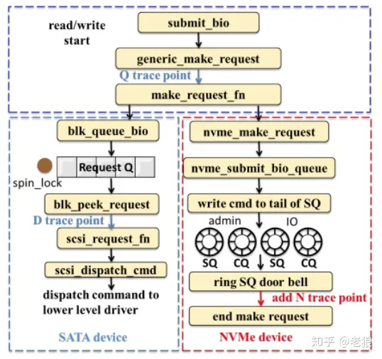

#  Hardware

[toc]

# 拓展坞 - Dcoking Station

# 内存

# 硬盘

三大种类
1. 固态硬盘 - SSD - solid state drive
2. 混合硬盘 - HHD - hybrid hard drive
3. 传统硬盘 - HDD - hard disk drive

## SSD

[M.2、SATA、PCI-E、NVMe都是啥？看看这个就知道了 - 啃芝士](https://www.bilibili.com/video/BV1cx411X7xA/)

[【硬核科普】硬盘的SATA M.2 NGFF NVME是什么意思，详解硬盘的总线、协议与接口 - 硬件茶谈](https://www.bilibili.com/video/BV1Qv411t7ZL/)

[【拯点攻略】2021拯救者全系笔记本内存更换&硬盘加装教程](https://www.bilibili.com/video/BV1RL4y1E7t8/)

[三款性价比PCIe 4.0 SSD对比测试：三星980 PRO、WD_BLACK SN770、致态TiPlus7100](https://zhuanlan.zhihu.com/p/596718372)

总线、协议、接口 需要匹配

按接口
1. SATA - Serial Advanced Technology Attachment - 接口 & 通道
   1. 与目前市面上的机械硬盘在接口方面没有区别，一个供电接口一个数据接口
   2. 最常见的接口类型之一，使用串行ATA技术
   3. 兼容传统硬盘接口，易于升级
   4. 速度受限于SATA标准，最高理论传输速率为6 Gb/s (SATA III)
2. mSATA - Mini-SATA
   1. 尺寸比传统SATA SSD更小，但使用的是SATA协议，因此速度相似
   2. 已被更小型且支持更高速度的M.2接口取代
3. M.2 - 物理接口
   1. 直接插到主板接口上并用螺丝固定
   2. 一种小型化的接口规格，可以跑**SATA和PCIe通道**，M.2插槽可以支持基于SATA和基于PCIe的设备，这意味着一个M.2插槽可能兼容多种类型的SSD
   3. M.2 SSDs可通过**PCIe通道**提供更高的速度，特别是当配合**NVMe协议**时
   4. 适合笔记本和紧凑型设备，具有不同长度和宽度的规格
   5. 插槽两种类型 - B型 & M型 - 有些固态硬盘两种插槽都支持（两个缺口） - M型支持更高的总线标准(拿到一个m key的ssd，就可以直接判定它是支持nvme的，拿到一个b&m key的ssd则无法判定，我只能说绝大多数b&m key都是不支持nvme协议的)
      
      
      
   6. 长度多种规格 - eg : 2280 = 22mm×88mm
      
4. PCIe - Peripheral Component Interconnect Express - 接口 & 通道
   1. 桌面级SSD的顶级产品
   2. 既是一种接口标准，也涉及到协议的概念
   3. 高速接口，直接连接到主板的PCIe插槽
   4. 提供比SATA更高的数据传输速率，特别是在使用NVMe协议时
   5. 用于高端和性能要求高的应用场景

按颗粒类型
1. SLC - Single-Level Cell
   1. 每个存储单元存储1位数据 - 每个单元只需要区分两种状态（0或1），使得电子擦写和重写的过程对存储介质的损耗最小
   2. 优点：最快的读写速度、最高的耐用性、最长的使用寿命
   3. 缺点：成本最高，每GB存储空间的价格最贵
   4. 用途：高端企业级应用，需要极高的性能和可靠性
2. MLC - Multi-Level Cell
   1. 每个存储单元存储2位数据 - 需要区分四种状态（00、01、10、11），这增加了读写错误的概率，并通过更频繁的擦写周期加速了介质的磨损
   2. 优点：较好的速度和耐用性，成本低于SLC
   3. 缺点：速度和耐用性低于SLC，寿命较短
   4. 用途：企业级和高端消费级市场
3. TLC - Triple-Level Cell
   1. 每个存储单元存储3位数据 - 区分八种状态，比MLC更复杂，因此在相同的物理空间内可以存储更多数据，成本更低。但这也导致每个单元的耐用性进一步降低，因为需要更精细的电压控制和更频繁的擦写周期
   2. 优点：存储密度高，制造成本低
   3. 缺点：相较于SLC和MLC，读写速度慢，耐用性和寿命较低
   4. 用途：主流消费级市场，平衡性能和成本

按传输协议
1. AHCI - Advanced Host Controller Interface - 协议
   1. 主要用于SATA接口的一种旧协议，虽然主要与HDDs相关联，但也适用于SSD
2. NVMe - Non-Volatile Memory Express - 协议
   1. 一种优化的协议，**专为SSD通过PCIe接口设计**，提高速度和效率
   2. 提供极低的延迟和高IOPS（输入/输出操作每秒）

协议 protocol : 电脑内部的规矩，规定两设备通讯时：

设备间协议一致或者相容(compatibility)才能通讯

对普通用户购买建议是优先购买大厂**M.2接口**支持**NVMe协议**走PCIe总线的TLC颗粒产品

SATA & NVMe 对比
1. 走SATA协议的M.2 SSD会被连接到南桥的SATA port上，在其上走传统的AHCI协议栈（SCSI的一个子集），漫长而延迟很高。AHCI只有1个命令队列，队列深度32，如果发生大量小文件操作，就会发生拥堵。
2. 走NVMe的SSD，直接走PCIe通道，协议栈很浅。而NVMe可以有65535个队列，每个队列都可以深达65536个命令。NVMe也充分使用了MSI的2048个中断向量优势，延迟大大减小，尤其大量小文件时速度更是飞快。

AHCI还是基于传统的块传输。而NVMe使用了一种叫做“Doorbell”的机制来充分利用了极长的队列，大大减小了延迟。

# 南桥 & 北桥

