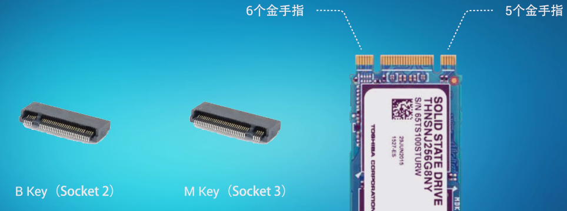

#  Computer Hardware

---

## Table of Contents

- [Computer Hardware](#computer-hardware)
  - [Table of Contents](#table-of-contents)
- [BIOS \& UEFI](#bios--uefi)
  - [BIOS](#bios)
  - [EFI \& UEFI](#efi--uefi)
  - [实模式 \& 保护模式](#实模式--保护模式)
- [拓展坞 - Docking Station](#拓展坞---docking-station)
- [内存](#内存)
  - [DDR4 \& DDR5](#ddr4--ddr5)
- [硬盘](#硬盘)
  - [固态硬盘 SSD](#固态硬盘-ssd)
  - [【硬核科普】硬盘的SATA M.2 NGFF NVMe 是什么意思，详解硬盘的总线、协议与接口 - 硬件茶谈](#硬核科普硬盘的sata-m2-ngff-nvme-是什么意思详解硬盘的总线协议与接口---硬件茶谈)
    - [协议-总线-接口 总图](#协议-总线-接口-总图)
    - [SATA 接口](#sata-接口)
    - [mSATA 接口](#msata-接口)
    - [SATA Express 接口](#sata-express-接口)
    - [M.2 接口 (别名 NGFF)](#m2-接口-别名-ngff)
    - [PCIe 接口](#pcie-接口)
    - [SAS 接口](#sas-接口)
    - [U.2 接口](#u2-接口)
  - [RAID](#raid)
- [主板](#主板)
- [南桥 \& 北桥](#南桥--北桥)
- [注册表 Registry](#注册表-registry)


---

# BIOS & UEFI

两种类型
1. 守旧派 - `BIOS`/**`Legacy BIOS`**/`传统 BIOS`
   [Phoenix](https://www.phoenix.com/) - **守旧派**
   <left></left>
2. 维新派 - `UEFI`/**`UEFI BIOS`**
   [ American Megatrends Inc.](https://www.ami.com/) - **维新派**
   <left></left>


## BIOS

BIOS (Basic Input/Output System)

**BIOS 使用 汇编语言**

是计算机系统中的基本输入输出系统，固化在计算机主板上的软件

BIOS 对计算机来说至关重要，帮助启动计算机，并在操作系统加载之前提供底层的、基本的硬件操作和控制

主要功能
1. 启动引导 - BIOS 是计算机启动过程中的第一个软件程序
   1. 自检 (**POST** - Power-On Self Test)
   2. 检查和初始化系统硬件组件
2. 硬件配置 & 管理 - 提供一个固件界面，允许用户配置硬件设备的设置
   1. 硬件设置
   2. 启动顺序
3. 低级驱动程序 - 第一层驱动程序，提供基础的操作控制
   1. 键盘控制
   2. 屏幕显示
   3. 磁盘读写
4. 系统安全
5. 电源管理 - 电源状态监测、温度控制和风扇速度控制

操作系统本身也是程序，需要将其从磁盘引入内存


**BIOS芯片** - 存储器芯片，它存储了BIOS固件
1. **ROM(Read-Only Memory)** 芯片
2. ROM 断电后程序依然存在
   
   1. Phoenix 公司
   2. AMI 公司 - American Megatrends Inc.


**CMOS芯片** - 主要用于存储BIOS设置和系统时间等信息，这些设置通过BIOS设置界面进行配置，并保存在CMOS芯片
1. **RAM(Random Access Memory)** 芯片，通常集成在主板南桥芯片中，所以从主板上看不到
2. RAM 断电后数据就会丢失，需要加个电源(锂电池)


**BIOS芯片** 和 **CMOS芯片** 在计算机启动和配置过程中互相配合
1. BIOS芯片 负责硬件的初始化和系统启动的基本程序
2. CMOS芯片 存储的设置信息则指导 BIOS 如何对硬件进行配置
3. 进入BIOS设置界面调整配置时，设置被保存在 CMOS 芯片中


BIOS 监测 & 加载顺序
1. 计算机上电，集线器PCH 通过 高速总线 DMI 通知 CPU 初始化，进入**保护模式**，读取 CMOS芯片 & BIOS 芯片中的程序
2. BIOS 进行 硬件自检，连接 南桥，南桥与所连接的部件进行通信
1. 连接 北桥，处理 CPU 与系统内存之间的数据通信，若有错，BIOS 将错误代码输出至屏幕
2. 若正常，CPU 回到 **实模式**，读取磁盘第一个分区的引导文件，启动管理程序
3. 将引导文件加载至内存，并将控制权交给内存
4. CPU 切换回 **保护模式**，加载操作系统 内核

由于实模式 1MB 内存限制，加载厂商驱动困难，需要切换实模式 & 保护模式，而且使用汇编语言

传统的 BIOS 正逐渐被 UEFI(统一可扩展固件接口) 所替代


## EFI & UEFI

<left></left>

[UEFI Forum](https://uefi.org/)

EFI - Extensible Firmware Interface - 可扩展固件接口

UEFI - Unified Extensible Firmware Interface - 统一可扩展固件接口

**使用 C语言编写**

替代 传统 BIOS

UEFI 提供了更多的安全功能、更快的启动时间和对大容量硬盘(超过2TB)的支持，提供了一个更加现代化的界面和更丰富的系统配置选项


[ American Megatrends Inc.](https://www.ami.com/) - **维新派**

[Aptio - American Megatrends Inc.](https://www.ami.com/aptio/)


类似于 雷蛇电脑 上的


## 实模式 & 保护模式

1. 实模式 - Real Mode
   1. Intel 8086和后续处理器的初始运行模式，提供了对原始8086处理器特性的完全访问
   2. 包括一个简单的线性地址空间
   3. 处理器只能访问1MB的内存空间(实地址空间)，地址是通过20位地址线实现的
   4. 没有 内存保护功能
   5. 所有程序都运行在同一地址空间中
   6. 用于 **兼容旧软件** 和 **在系统启动时初始化硬件**
2. 保护模式 - Protected Mode (功能更强大)
   1. 首次引入于Intel 80286处理器
   2. 支持更高级的功能，处理器可以使用扩展的内存
      1. **内存保护** - 防止程序相互干扰，提高系统稳定性和安全性
      2. 硬件级别的**多任务** - 允许操作系统更有效地管理多个同时运行的程序
      3. **虚拟内存** - 使程序能够使用比物理内存更大的地址空间


处理器在启动时首先进入实模式，以兼容旧的8086程序

随后，操作系统通常会将处理器切换到保护模式以使用其高级功能

系统启动时很快就会从实模式切换到保护模式，并在大部分时间里运行在保护模式下


---


# 拓展坞 - Docking Station


# 内存

内存品牌只代表售后服务，决定品质的是内存颗粒(黑色)

大多数内存品牌没有生产制造内存颗粒的能力，从上游厂商购买

各个厂商都有高中低档产品
1. 三星
2. 海力士
3. 镁光
4. 长鑫

高频率内存一定使用好颗粒

使用场景
1. 游戏 - 对内存频率敏感的游戏并不多 - 当显卡不行，内存频率影响不大，内存成为瓶颈 - 内存数据频繁更换
2. 工作 - 更用不上高频 - 像剪视频、建模等都是初始一次性导入很多数据，后续长时间对该数据简单调整

内存超频存在一定风险，可能导致不能稳定运行，甚至无法进入系统

不要轻易动内存电压，可能造成硬件损坏

内存频率越高，时钟周期越短 (内存频率越高越好，时序越低越好)

内存通达 - 内存控制器和内存之间数据交换通道数 - 受CPU中内存控制器限制
1. 双通道 - 大多数平台 - 基本上足够了
2. 四通道 - 大吞吐量 - 线程撕裂者、X299才会支持

## DDR4 & DDR5


同频率的 DDR4 读写性能约等于 DDR5

相同频率，时序越低，延迟越低

DDR4 延迟相对较低


# 硬盘

三大种类
1. 固态硬盘 - SSD - solid state drive
2. 混合硬盘 - HHD - hybrid hard drive
3. 传统硬盘 - HDD - hard disk drive


## 固态硬盘 SSD

[M.2、SATA、PCI-E、NVMe都是啥？看看这个就知道了 - 啃芝士](https://www.bilibili.com/video/BV1cx411X7xA/)

[【硬核科普】硬盘的SATA M.2 NGFF NVMe 是什么意思，详解硬盘的总线、协议与接口 - 硬件茶谈](https://www.bilibili.com/video/BV1Qv411t7ZL/)

[【拯点攻略】2021拯救者全系笔记本内存更换&硬盘加装教程](https://www.bilibili.com/video/BV1RL4y1E7t8/)

[三款性价比PCIe 4.0 SSD对比测试：三星980 PRO、WD_BLACK SN770、致态TiPlus7100](https://zhuanlan.zhihu.com/p/596718372)


总线、协议、接口 需要匹配

读取、写入 设备速率要匹配

耐用问题 - 闪存颗粒 - 概率问题 - 大品牌售后好(三星、西数、闪迪、铠侠、金士顿、英睿达)

按接口
1. SATA - Serial Advanced Technology Attachment - 接口 & 通道
   1. 与目前市面上的机械硬盘在接口方面没有区别，一个供电接口一个数据接口
   2. 最常见的接口类型之一，使用串行ATA技术
   3. 兼容传统硬盘接口，易于升级
   4. 速度受限于SATA标准，最高理论传输速率为6 Gb/s (SATA III)
2. mSATA - Mini-SATA
   1. 尺寸比传统SATA SSD更小，但使用的是SATA协议，因此速度相似
   2. 已被更小型且支持更高速度的M.2接口取代
3. M.2 - 物理接口
   1. 直接插到主板接口上并用螺丝固定
   2. 一种小型化的接口规格，可以跑**SATA和PCIe通道**，M.2插槽可以支持基于SATA和基于PCIe的设备，这意味着一个M.2插槽可能兼容多种类型的SSD
   3. M.2 SSD 可通过**PCIe通道**提供更高的速度，特别是当配合**NVMe协议**时
   4. 适合笔记本和紧凑型设备，具有不同长度和宽度的规格
   5. 插槽两种类型 - B型 & M型 - 有些固态硬盘两种插槽都支持（两个缺口） - M型支持更高的总线标准(拿到一个m key的ssd，就可以直接判定它是支持 NVMe 的，拿到一个b&m key的ssd则无法判定，我只能说绝大多数b&m key都是不支持 NVMe 协议的)
      
      
      
   6. 长度多种规格 - eg : 2280 = 22mm×88mm
      
4. PCIe - Peripheral Component Interconnect Express - 接口 & 通道
   1. 桌面级SSD的顶级产品
   2. 既是一种接口标准，也涉及到协议的概念
   3. 高速接口，直接连接到主板的PCIe插槽
   4. 提供比SATA更高的数据传输速率，特别是在使用NVMe协议时
   5. 用于高端和性能要求高的应用场景

按颗粒类型
1. SLC - Single-Level Cell
   1. 每个存储单元存储1位数据 - 每个单元只需要区分两种状态（0或1），使得电子擦写和重写的过程对存储介质的损耗最小
   2. 优点：最快的读写速度、最高的耐用性、最长的使用寿命
   3. 缺点：成本最高，每GB存储空间的价格最贵
   4. 用途：高端企业级应用，需要极高的性能和可靠性
2. MLC - Multi-Level Cell
   1. 每个存储单元存储2位数据 - 需要区分四种状态（00、01、10、11），这增加了读写错误的概率，并通过更频繁的擦写周期加速了介质的磨损
   2. 优点：较好的速度和耐用性，成本低于SLC
   3. 缺点：速度和耐用性低于SLC，寿命较短
   4. 用途：企业级和高端消费级市场
3. TLC - Triple-Level Cell
   1. 每个存储单元存储3位数据 - 区分八种状态，比MLC更复杂，因此在相同的物理空间内可以存储更多数据，成本更低。但这也导致每个单元的耐用性进一步降低，因为需要更精细的电压控制和更频繁的擦写周期
   2. 优点：存储密度高，制造成本低
   3. 缺点：相较于SLC和MLC，读写速度慢，耐用性和寿命较低
   4. 用途：主流消费级市场，平衡性能和成本

按传输协议
1. AHCI - Advanced Host Controller Interface - 协议
   1. 主要用于SATA接口的一种旧协议，虽然主要与 HDD 相关联，但也适用于SSD
2. NVMe - Non-Volatile Memory Express - 协议
   1. 一种优化的协议，**专为SSD通过PCIe接口设计**，提高速度和效率
   2. 提供极低的延迟和高IOPS（输入/输出操作每秒）

协议 protocol : 电脑内部的规矩，规定两设备通讯时：

设备间协议一致或者相容(compatibility)才能通讯


对普通用户购买建议是优先购买大厂**M.2接口**支持**NVMe协议**走PCIe总线的TLC颗粒产品


SATA & NVMe 对比
1. 走SATA协议的M.2 SSD会被连接到南桥的SATA port上，在其上走传统的AHCI协议栈（SCSI的一个子集），漫长而延迟很高。AHCI只有1个命令队列，队列深度32，如果发生大量小文件操作，就会发生拥堵。
2. 走NVMe的SSD，直接走PCIe通道，协议栈很浅。而NVMe可以有65535个队列，每个队列都可以深达65536个命令。NVMe也充分使用了MSI的2048个中断向量优势，延迟大大减小，尤其大量小文件时速度更是飞快。


AHCI还是基于传统的块传输。而NVMe使用了一种叫做“Doorbell”的机制来充分利用了极长的队列，大大减小了延迟。


## 【硬核科普】硬盘的SATA M.2 NGFF NVMe 是什么意思，详解硬盘的总线、协议与接口 - 硬件茶谈

[【硬核科普】硬盘的SATA M.2 NGFF NVMe 是什么意思，详解硬盘的总线、协议与接口 - 硬件茶谈](https://www.bilibili.com/video/BV1Qv411t7ZL/)

### 协议-总线-接口 总图


**常用接口**
1. 民用：SATA、mSATA、SATA Express、M.2(B-Key & M-Key)、PCIe
2. 企业：U.2、 SAS

其中，**PCIe 总线的硬盘之间的接口大部分可以相互转换**


SATA 3.0 普及较广


$6Gbps × 8/10 = 6/8 GB/s × 8/10 = 0.6 GB/s = 600 MB/s$

PCIe 3.0 4.0 普及较广 (PCIe 带宽和长度有关)


SAS 3.0 普及较广


$12Gbps × 8/10 = 12/8 GB/s × 8/10 = 1.2 GB/s$


### SATA 接口

使用 SATA 总线，AHCI 协议


民用 2.5寸机械硬盘、3.5寸机械硬盘、2.5寸固态硬盘 使用的都是该接口


SATA 接口 分为两部分
1. 供电 - 接驳在电脑电源上
2. 数据 - SATA数据线接驳在主板上

速度上限 600 MB/s

### mSATA 接口

使用 SATA 总线，AHCI 协议

诞生目的 - 给SATA接口的固态缩小体积


速率没有提升，没有前瞻性的提供高带宽，只是单纯的减少体积，因此在 M.2 接口普及后就消失了

### SATA Express 接口

PCIe × 2 总线，可以走 AHCI协议 或 NVMe协议


不够前瞻性，接口体积过于庞大，后被淘汰

### M.2 接口 (别名 NGFF)


走 SATA 总线 AHCI 协议，则和普通的 SATA 硬盘没有区别，速率限制在 500 MB/S

可以走 PCIe 总线， AHCI 协议 或 NVMe 协议，速率上限由 PCIe 版本 和 长度 决定

最常见的组合是 PCIe + NVMe

M.2 接口
1. B-Key(Socket2，豁口在左)，支持 SATA 总线 和 PCIe * 2
2. M-Key(Socket3，豁口在右)，支持 SATA 总线 和 PCIe * 4

无法通过外形判断支持什么协议

### PCIe 接口

PCIe 可以作为总线、传输通道，也可也以接口形式存在


目前直接以 PCIe 为接口的固态硬盘常见于超高性能等级以及企业级固态硬盘上，民用级固态硬盘还是以 M.2 为主

### SAS 接口

SAS 总线、SCSI协议，服务器上用的较多，可以理解为强化版 SATA 接口

SAS 总线可以 一分多，以满足服务器硬盘柜多硬盘要求


由于直接在 SATA 接口上改款而来，**SAS 接口** 可以向下兼容 SATA 硬盘，走 AHCI

而 SAS 硬盘本身是 SAS 总线，SCSI 协议

### U.2 接口

在 SAS 接口上继续改款


兼容 SAS、SATA

额外提供 PCIe × 4 总线 支持


## RAID


# 主板

主板 和 CPU 需要匹配，与机箱

尺寸
1. ATX - 大板 - 7条PCIe
2. M-ATX - 4条PCIe
3. ITX - 1条PCIe

价格区别
1. 供电 - 主板CPU供电
   1. 供电相数越多，每一相承载的电流越少，发热量低，供电稳定
   2. 供电原件质量
2. 扩展性
   1. 内存条插槽数量
   2. PCIe插槽数量
   3. PCIe插槽速度
   4. M.2接口数量
   5. SATA接口数量
   6. 背板接口数量
      1. 视频输出 - HDMI、DP (显示器应该连在独显上，而非主板上)
      2. USB、Type-C、电口
      3. 网口
      4. 音频
      5. WiFi
      6. 蓝牙
   7. 风扇供电接口数量
   8. RGB接口数量
3. BIOS - Basic Input Output System
   1. 对于普通用户没啥用


# 南桥 & 北桥

通过高速总线(如 DMI、HyperTransport)连接起来，形成了整个系统的芯片组架构

南桥 & 北桥
1. 北桥 - NorthBridge
   1. 负责处理与 CPU 直接通信的高速组件，比如内存控制器、PCI Express 总线、显卡 等
   2. 随着技术的发展，现代处理器已经集成了内存控制器和 PCIe 控制器，因此北桥的作用逐渐减弱
2. 南桥 - SouthBridge
   1. 负责处理与 CPU 间接通信的低速组件
      1. 硬盘接口 - SATA、IDE
      2. USB
      3. 网卡
      4. 音频接口
   2. 通常也包含了一些辅助功能，如电源管理、时钟、GPIO(通用输入输出)等


# 注册表 Registry

早期，Windows 将程序的配置文件存储在各自的 `.ini`文件(通常较小，远小于当时FAT16文件系统磁盘格式化的簇/扇区)中，将导致大量空间浪费

在Windows操作系统中，注册表是一个重要的数据库，用于存储系统、应用程序和用户的配置信息，不当的修改注册表可能导致系统不稳定或崩溃

注册表数据库位置

Windows 注册表没有注释功能

```bash
/media/lzy/Windows-SSD/Windows/System32/config
C:\Windows\System32\config
```

Linux 没有统一的注册表

Linux 存在 `/etc` 文件夹，用于存放配置文件

[Linux 目录配置](../../Linux/LinuxSystemic.md#linux-目录配置)

现如今，对于存储的 KB级 浪费已经不在乎

去中心化的配置管理还有利于卸载


