# OpenMP共享内存并行编程

## 00.传送门

https://www.freesion.com/article/66801183997/

[OpenMP共享内存并行编程详解](https://www.cnblogs.com/liangliangh/p/3565234.html)

[OpenMP编程总结表](https://www.cnblogs.com/liangliangh/p/3565136.html)

## 01.介绍

并行计算机可以简单分为共享内存和分布式内存
1. 共享内存就是多个核心共享一个内存，目前的PC就是这类（不管是只有一个多核CPU还是可以插多个CPU，它们都有多个核心和一个内存）
2. 一般的大型计算机结合分布式内存和共享内存结构，即每个计算节点内是共享内存，节点间是分布式内存。
 
想要在这些并行计算机上获得较好的性能，进行并行编程是必要条件。

目前流行的并行程序设计方法是，分布式内存结构上使用MPI，共享内存结构上使用Pthreads或OpenMP。

和Pthreads相比，OpenMP更简单，对于关注算法、只要求对线程之间关系进行最基本控制（同步，互斥等）的我们来说，OpenMP再适合不过了。

<br>
<br>

## 02.创建OpenMP程序

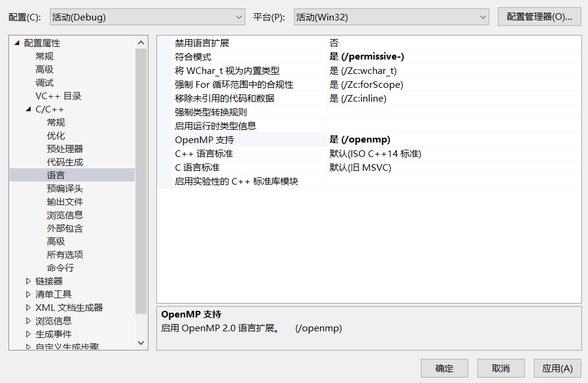

在visual studio中打开对OpenMP的支持

如果是空项目则需要先创建一个源文件，否则没有C/C++选项

```cpp
#include <omp.h> 
#include <iostream> 

int main()
{
	std::cout << "parallel begin:\n";
#pragma omp parallel |编译指导语句|并行块开始
	{
		std::cout << omp_get_thread_num() << " ";
		|调用库函数，返回当前执行代码的线程的编号
	}|并行块结束
	std::cout << "\nparallel end.\n";
	std::cin.get();
	return 0;
}
```

可以看到，我的电脑是12线程的

主线程应该是0

<br>
<br>

## 03.并行原理

OpenMP由**Compiler Directives（编译指导语句）**、**Run-time Library Functions（库函数）**组成，另外还有一些和OpenMP有关的**Environment Variables（环境变量）、Data Types（数据类型）以及_OPENMP宏定义**。之所以说OpenMP非常简单，是因为，所有这些总共只有50个左右，OpenMP2.0 Specification仅有100余页。

共享内存计算机上并行程序的基本思路就是使用多线程，从而将可并行负载分配到多个物理计算核心，从而缩短执行时间（同时提高CPU利用率）。在共享内存的并行程序中，标准的并行模式为fork/join式并行，这个基本模型如下图示：

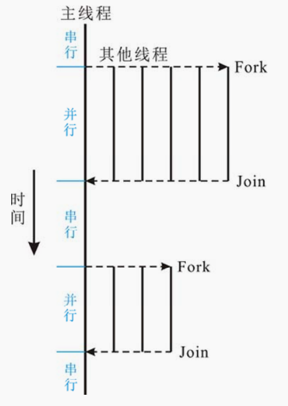

其中，主线程执行算法的顺序部分，当遇到需要进行并行计算式，主线程派生出（创建或者唤醒）一些附加线程。在并行区域内，主线程和这些派生线程协同工作，在并行代码结束时，派生的线程退出或者挂起，同时控制流回到单独的主线程中，称为汇合。

简单来说，OpenMP程序就是在一般程序代码中加入Compiler Directives，这些Compiler Directives指示编译器其后的代码应该如何处理（是多线程执行还是同步什么的）。所以说OpenMP需要编译器的支持。

和Pthreads不同，OpenMP下程序员**只需要设计高层并行结构，创建及调度线程均由编译器自动生成代码完成**。

<br>
<br>

## 04.Compiler Directives

### 一般格式

```cpp
#pragma omp <directive-name> [clause[ [,] clause]...]
```


其中“[]”表示可选，每个Compiler Directive作用于其后的语句（C++中“{}”括起来部分是一个复合语句）。

directive-name可以为（共11个，只有前4个有可选的clause）：
|directive name|功能|
|---|---|
|parallel |定义一个parallel region，该parallel region将被多个线程并行执行|
|for |将C++ for循环的多次迭代划分给多个线程（C++ for需符合一定限制），**块末尾隐含一个barrier**|
|sections |定义包含多个section块的代码区，这些section块将被多个线程并行执行，section块用section定义，**块末尾隐含一个barrier**|
|single |代码将仅被一个线程执行，具体是哪个线程不确定，块末尾隐含一个barrier|
|atomic |变量将被原子的更新，expression-stmt需是 a++, a--, ++a, --a, a?=expr 之一，其中 ? 可以为 +, *, -, /, &, ^, \|, <<, >>|
|barrier |定义一个同步，所有线程都执行到该行后，所有线程才继续执行后面的代码|
|critical |定义一个临界区，保证同一时刻只有一个OpenMP线程访问临界区|
|flush |所有线程对所有共享对象具有相同的内存视图（view of memory），例如，确保将变量的新值写回内存或从内存读取，而不是使用以前读到寄存器或缓存中的值。保证各个OpenMP线程的数据影像的一致性|
|master |代码将仅被主线程执行，块末尾没有隐含的barrier|
|ordered |使用在有ordered clause的for directive（或parallel for）中，代码将被按迭代次序执行（像串行程序一样）|
|threadprivate |将全局或静态变量声明为线程私有的|

clause（子句）相当于是Directive的修饰，定义一些Directive的参数什么的。clause可以为（共13个）：
|clause|功能|可用于的directive list|
|---|---|---|
|copyin(variabl-list) |让threadprivate声明的变量的值和主线程的值相同|parallel|
|copyprivate(variable-list) |不同线程中的私有变量的值在所有线程中共享|single|
|default(shared \| none) |参数shared同于将所有变量用share clause定义，参数none指示对没有用private, shared, reduction, firstprivate, lastprivate clause定义的变量报错|parallel|
|firstprivate(variable-list) |private基础上，拷贝共享变量值初始化线程私有副本|parallel, for, sections, single|
|if(expression) |条件地进行并行化||
|lastprivate(variable-list) |private基础上，将执行最后一次迭代（for）或最后一个section块（sections）的线程的私有副本拷贝到共享变量|for, sections|
|nowait ||
|num_threads(num) |覆盖默认线程数||
|ordered ||
|private(variable-list) |每个线程有一个变量的私有副本，调用默认构造函数初始化|parallel, for, sections, single|
|reduction(operation: variable-list) |定义对变量进行归约操作|parallel, for, sections|
|schedule(type[,size]) ||
|shared(variable-list) |声明变量为线程间共享，相对于private|parallel|

|OpenMP库函数|作用|
|---|---|
|omp_in_parallel|判断当前是否在并行域中|
|omp_set_num_threads|设置后续并行域中线程数量|
|omp_get_num_pros|返回计算系统中处理器的个数|
|omp_get_num_threads|返回当前并行域中的线程数|
|omp_get_thread_num|返回当前线程号|
|omp_get_max_threads|返回当前并行域中可用的最大线程数|
|omp_get_dynamic|判断是否支持动态改变线程数量|
|omp_set_dynamic|启用或关闭线程数量的动态改变|
|omp_init_lock|初始化一个简单锁|
|omp_set_lock|给一个简单锁上锁|
|omp_unset_lock|给一个简单锁解锁|
|omp_destroy_lock|关闭一个锁并释放内存|
|omp_get_wtime|相对于某一个任意参考时刻而言已经经历的时间|

**以omp_set开头的OpenMP库函数只能在并行区域外调用**

### 变量作用域

共享变量：所有线程共同拥有的变量

私有变量：个别线程拥有的变量

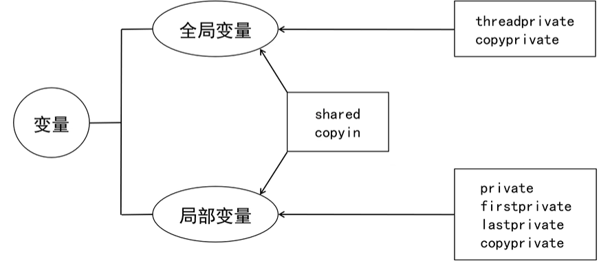


#### 同步机制

OpenMP支持两种同步机制
1. 互斥锁：保护共享的存储空间，使得访问同一存储空间的操作串行化，保证数据完整性
2. 事件同步：保证多个线程的执行顺序

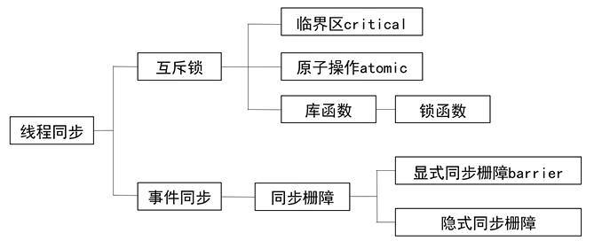

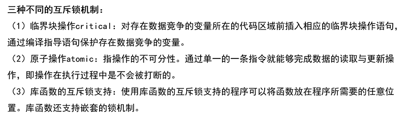


同步是指在时间上使各自执行计算的子线程必须互相等待，从而保证各个线程的执行实现在时间上的一致性。同步的目的是保证各个线程不会同时访问共享资源，或者保证在开始新工作前，已经完成共享资源的准备工作

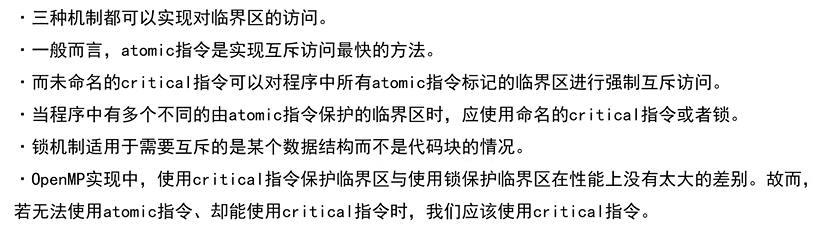

注意事项
1. 对同一个临界区不应混合使用不同的互斥机制
2. 互斥执行不保证公平性
3. 嵌套互斥结构可能导致产生死锁等情况

### 详细解释

#### parallel

parallel表示其后语句将被多个线程并行执行

```cpp
#pragma omp parallel//后面的语句（或者，语句块）被称为parallel region
```

#### if

可以用if clause条件地进行并行化

判断是否要并行

#### num_thread

用num_threads clause覆盖默认线程数：

```cpp
int a = 0;
#pragma omp parallel if(a) num_threads(6)
{
    std::cout << omp_get_thread_num();
}

int a=7;
#pragma omp parallel if(a) num_threads(6)
{
    std::cout << omp_get_thread_num();
}
```

多个线程的执行顺序是不能保证的。

#### for

我们一般并不是要对相同代码在多个线程并行执行，而是**对一个计算量庞大的任务，对其进行划分，让多个线程分别执行计算任务的每一部分，从而达到缩短计算时间的目的**。

这里的关键是，每个线程执行的计算互不相同（操作的数据不同或者计算任务本身不同），多个线程协作完成所有计算。

OpenMP **for指示将C++ for循环的多次迭代划分给多个线程**（划分指，每个线程执行的迭代互不重复，所有线程的迭代并起来正好是C++ for循环的所有迭代）。

这里C++ for循环需要一些限制从而能在执行C++ for之前确定循环次数，例如C++ **for中不应含有break**等。

OpenMP for作用于其后的第一层C++ for循环。

```cpp
const int size = 1000;
int data[size];
#pragma omp parallel
{
    #pragma omp for// schedule...
    for(int i=0; i<size; ++i)
        data[i] = 123;
}
```

默认情况下，上面的代码中，程序执行到“#pragma omp parallel”处会派生出x个线程，加上主线程x+1个线程.C++ for的1000次迭代会被分成连续的x+1段

具体C++ **for的各次迭代在线程间如何分配可以由schedule(type[,size])指示**，后面会具体说。

正确使用for directive有两个条件：
1. C++ for**符合特定限制，否则编译器将报告错误**
2. C++ for的**各次迭代的执行顺序不影响结果正确性**，这是一个逻辑条件

#### schedule 调度

```cpp
schedule(type[,size])
```

schedule子句设置C++ for的多次迭代如何在多个线程间划分，type指的是调度的类型
1. 静态调度： schedule(static, size)将所有迭代按每连续size个为一组，然后将这些组轮转分给各个线程。
2. 动态调度： schedule(dynamic, size)同样分组，然后依次将每组分给目前空闲的线程（故叫动态）。使用内部任务队列的方式，达到先来先服务，解决负载不平衡，需要额外的开销。
3. 指导性调度：schedule(guided, size) 把迭代分组，分配给目前空闲的线程，最初组大小为迭代数除以线程数，然后逐渐按指数方式（依次除以2）下降到size。一开始分配的块较大，随后逐渐减小，使得线程访问队列的时间。
4. 运行调度： schedule(runtime)的划分方式由环境变量OMP_SCHEDULE定义。运行时调度的实现仍然是上述三种调度方式的一种。

#### sections

除了循环结构可以进行并行之外，还可以进行**分段并行**（parallel section）

```cpp
int main()
{
#pragma omp parallel num_threads(4)
	{
#pragma omp sections //第1个sections
		{
#pragma omp section //sections1的section1
			cout << "section 1 线程ID：" << omp_get_thread_num() << "\n";
#pragma omp section //sections1的section2
			cout << "section 2 线程ID：" << omp_get_thread_num() << "\n";
		}
#pragma omp sections //第2个sections
		{
#pragma omp section //sections2的section1
			cout << "section 3 线程ID：" << omp_get_thread_num() << "\n";
#pragma omp section //sections2的section2
			cout << "section 4 线程ID：" << omp_get_thread_num() << "\n";
		}
	}
	return 0;
}
```

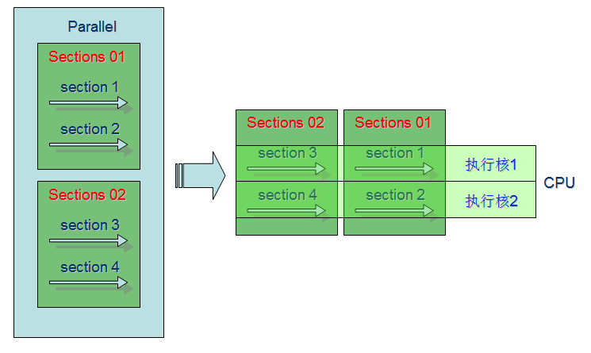

第一个sections与第二个sections在程序中处于串行，而第一个sections中的section1和section2它们处于并行，第二个sections中的section3和section4也处于并行。如果要使sections之间并行，只需要在sections后加上nowait指令即可

#### single

指示代码将仅被一个线程执行，具体是哪个线程不确定

```cpp
int main()
{
#pragma omp parallel num_threads(4) 
	{
#pragma omp single
		{
			cout << "sad" << omp_get_thread_num() << endl;
		}
		cout << "happy" << omp_get_thread_num() << endl;
	}
	return 0;
}
```

#### master

指示代码将仅被主线程执行，功能类似于single directive，但single directive时具体是哪个线程不确定（有可能是当时闲的那个）。

```cpp
int main()
{
#pragma omp parallel num_threads(4) 
	{
#pragma omp master
		{
			cout << "sad" << omp_get_thread_num() << endl;
			cout << "happy" << omp_get_thread_num() << endl;
		}
	}
	return 0;
}
```

#### critical

定义一个临界区，保证同一时刻只有一个线程访问临界区。后面可以写临界区的名字。

对于代码块需要用大括号括起来，否则没有效果。

```cpp
int main()
{
	cout << "with interruption" << endl;
#pragma omp parallel num_threads(4) 
	{
#pragma omp critical
		cout << "thread ID: " << omp_get_thread_num() << endl;
		Sleep(5);
		cout << "thread ID: " << omp_get_thread_num() << endl;
	}

	cout << endl << endl;

	cout << "without interruption" << endl;
#pragma omp parallel num_threads(4) 
	{
#pragma omp critical
		{
			cout << "thread ID: " << omp_get_thread_num() << endl;
			Sleep(5);
			cout << "thread ID: " << omp_get_thread_num() << endl;
		}
	}
	return 0;
}
```

注意：**critical语句不允许互相嵌套**

某些地方未使用critical时可能存在问题，当块内共同操作了共享的资源时，不对其做互斥保护就可能会在运行时出问题。

因为**只能保证一次汇编级的指令是原子的，甚至不能保证一条C语言语句在并发执行过程中不会发生线程的切换**，在并行的情况下就更加危险了：

#### barrier

barrier分为显式的（explicit）和隐式的（implicit）

barrier会减慢程序的执行速度，增加时间消耗，但是保证了程序的正确性

先说显式的

定义一个同步，所有线程都执行到该行后，所有线程才继续执行后面的代码

```cpp
	cout << "without barrier" << endl;
#pragma omp parallel num_threads(4) 
	{
#pragma omp critical
		cout << "thread ID: " << omp_get_thread_num() << endl;
#pragma omp critical
		cout << "thread ID: " << omp_get_thread_num()+10 << endl;
	}

	cout << endl << endl;

	cout << "with barrier" << endl;
#pragma omp parallel num_threads(4) 
	{
		cout << "thread ID: " << omp_get_thread_num() << endl;
#pragma omp barrier //所有的线程统一执行到这里
		cout << "thread ID: " << omp_get_thread_num() + 10 << endl;
	}
	return 0;
```

然后还有隐式的

for, sections, single, critical,parallel directives都隐含barrier

隐式的barrier可以通过nowait来disable

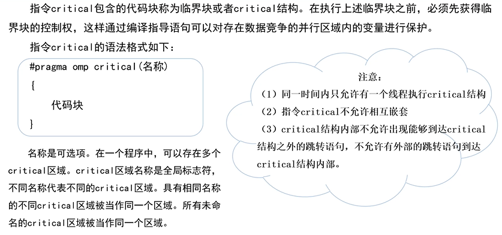

#### atomic

atomic directive保证变量被原子的更新，即同一时刻只有一个线程在更新该变量

和critical directive很像

```cpp
int main()
{
	int m = 0;
#pragma omp parallel num_threads(4)
	{
		for (int i = 0; i < 1000000; i++)
		{
			++m;
		}
	}
	cout << "without atomic m's value : " << m << endl;

	m = 0;

#pragma omp parallel num_threads(4)
	{
		for (int i = 0; i < 1000000; i++)
		{
#pragma omp atomic
			++m;
		}
	}
	cout << "with atomic m's value : " << m << endl;

	return 0;
}
```

第一个代码块的m实际值比预期要小，因为"++m"的汇编代码不止一条指令，假设三条：load, inc, mov（读RAM到寄存器、加1，写回RAM），有可能线程A执行到inc时，线程B执行了load（线程A inc后的值还没写回），接着线程A mov，线程B inc后再mov，原本应该加2就变成了加1。使用atomic directive后可以得到正确结果

当然使用critical directive也可以，但是执行效率会变慢

没有atomic或critical时运行时间短了很多，可见正确性是用性能置换而来的

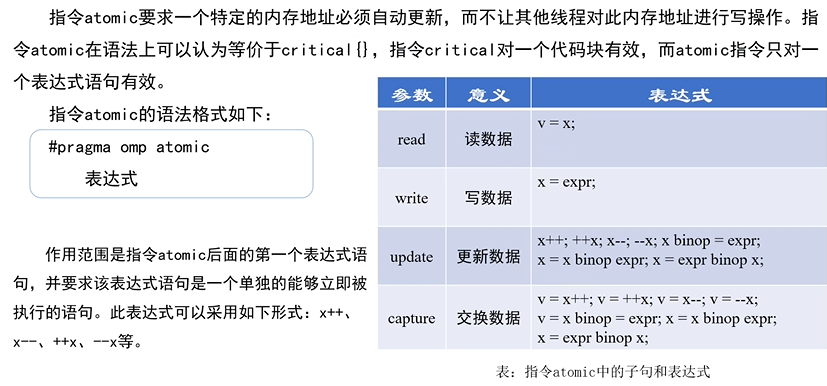

#### flush

指示所有线程对所有共享对象具有相同的内存视图（view of memory），该directive指示将对变量的更新直接写回内存（有时候给变量赋值可能只改变了寄存器，后来才才写回内存，这是编译器优化的结果）

#### ordered

使用在有ordered clause的for directive（或parallel for）中，确保代码将被按迭代次序执行（像串行程序一样）

值得强调的是**for directive的ordered clause只是配合ordered directive使用**，而不是让迭代有序执行的意思。而且第一个ordered一定要写，否则会报错。

OpenMP"ordered"指令必须使用"ordered"子句直接绑定到"for"或"parallel for"指令


```cpp
#pragma omp parallel num_threads(8)
{
    #pragma omp for ordered
    for(int i=0; i<10; ++i){
        #pragma omp critical
            std::cout << i << " ";
        #pragma omp ordered
        {
            #pragma omp critical
                std::cout << "-" << i << " ";
        }
    }
}
```

#### reduction

reduction子句

```cpp
reduction(运算符:变量列表)
```

reduction子句可以对前后有依赖的循环进行规约操作的并行化。每个线程将创建参数的一个副本，在运行结束时，将各线程的副本进行指定的操作，操作的结果赋值给原始的参数。出现在变量列表中的变量是一个标量，其变量属性是私有变量，但他们不能同时出现在所在并行区域的private子句中。

**reduction支持的操作符有限：+ - * / += -= *= /= | & ^**，**且不能是C++重载后的运算符**


#### threadprivate

threadprivate不是子句，private才是子句

基本语法
```cpp
#pragma omp threadprivate(variable_name)
```
**将全局或静态变量声明为线程私有的。**

在parallel region内定义的变量（非堆分配）当然是私有的。

没有特别用clause指定的（上面代码就是这样），在parallel region前（parallel region后的不可见，这点和纯C++相同）定义的变量是共享的。

在堆（用new或malloc函数分配的）上分配的变量是共享的（即使是在多个线程中使用new或malloc，当然指向这块堆内存的指针可能是私有的）。

for directive作用的C++ for的循环变量不管在哪里定义都是私有的。

```cpp
int a;
std::cout << omp_get_thread_num() << ": " << &a << std::endl;//地址
#pragma omp parallel num_threads(8)
{
    int b;
    #pragma omp critical
    std::cout << omp_get_thread_num() << ": " << &a << "  " << &b << std::endl;//地址
}
//第3-7行代码要被8个线程执行8遍，变量a是线程之间共享的，变量b是每个线程都有一个（在线程自己的栈空间）
```

```cpp
int a;
#pragma omp threadprivate(a)
int main()
{
    std::cout << omp_get_thread_num() << ": " << &a << std::endl;
    #pragma omp parallel num_threads(8)
    {
        int b;
        #pragma omp critical
        std::cout << omp_get_thread_num() << ": " << &a << "  " << &b << std::endl;
    }
    cout << &a << endl;
    return 0;
}
```
主线程中的a就是第一行定义的a（可以通过地址查看）
其他的a地址各不相同

#### private

private是子句

private子句**将一个或多个变量声明为线程的私有变量**。每个线程都有他自己的变量私有副本，其他线程无法访问。即使在并行区外有同名的共享变量，共享变量在并行区内不起任何作用，**并且并行区不会操作到外面的共享变量**。

**对于每个线程**，**声明为私有的变量未初始化**

从申明的并行区域开始，为每个线程声明一个相同类型的新对象，对原始对象的所有引用都将替换为对新对象的引用。

```cpp
int A = 100;
	cout << &A << endl;

#pragma omp parallel for private(A) num_threads(5)
	for (int i = 0; i < 5; i++)
	{
		A = i;
		cout << &A << "  " << A << endl;
	}
	cout << "A:" << A << endl;
	return 0;
//result: 
//00A6F8C4
//00A6F6D4  0
//014FF97C  4
//0127FEA4  2
//013BF8EC  3
//0113F914  1
//A:100
```
并行区外的变量（第一个定义的A）和并行区内的private变量（之后的A）没有任何关系，不会修改到并行区外的A，每个线程中的A的初始值也不确定。如果不进行初始化，会报错。

#### firstprivate

firstprivate子句指定的变量不仅是private作用范围，同时在进入并行区域构造前根据其原始对象的值初始化。

#### lastprivate

lastprivate子句指定的变量不仅是private作用范围，同时会将最后一次迭代或最后一个section执行的值复制回原来的变量。

#### shared

shared是子句，与private对应。

share子句将变量列表中一个或多个变量声明为线程组中子线程共享的变量。所有线程只拥有改变了的一个内存地址，**所有线程对共享变量的访问即是对同一地址的访问**。

不要轻易使用，会造成数据竞争，可能需要加以保护（critical）。

#### default

default子句

```cpp
default(shared|none)
```

用来控制并行区域内变量的共享属性，取值有**shared和none**两种。指定为shared表示，在没有显式指定访问权限时，传入并行区的变量访问权限为shared；指定为none表示必须显式的为这些变量指定访问权限。

OpenMP默认变量访问权限为shared，可能导致问题。建议显式调用default(none)，去掉变量的默认访问权限。

已经显式指定访问权限的变量不会受default影响。

#### copyin

#### copyprivate

## 05.加速比

<br>
<br>
<br>

# Introduction to OpenMP - Intel - Tim Mattson

## Portal

[Introduction to OpenMP -- Intel](https://www.bilibili.com/video/BV1SW411s7ST)


Moore's law

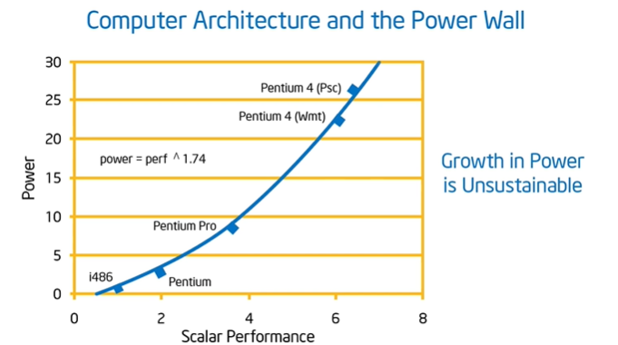


程序员不考虑性能，而是将其留给硬件工程师。这导致了处理器的功耗大大增加。

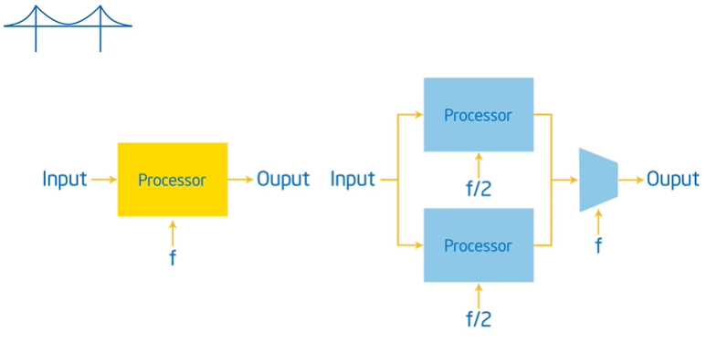

多核降低功耗。

没有编译器能够将串行代码修改为并行，我们需要自己写并行的代码。

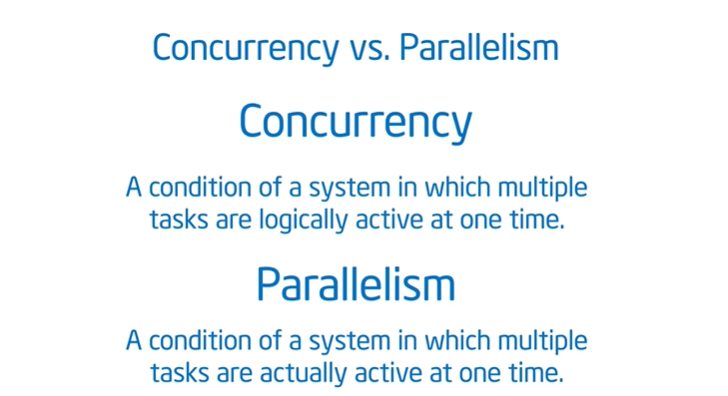

**Concurrency:Things may not happening at the same time, but you have multiply things active and able to make progress at the same time.**

**Parallelism is a subset of Concurrency, taking some of the concurrency and executing at the same time.**

并行是并发的子集。


**Need to expose the concurrency in a problem and map it onto processing units so that they execute at the same time.**

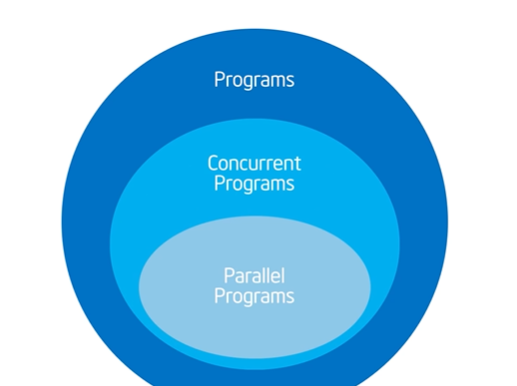

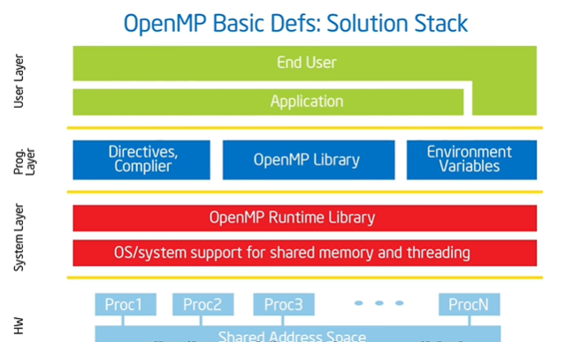

omp_get_thread_num() --- identifier for each thread(0 --- num of threads -1)

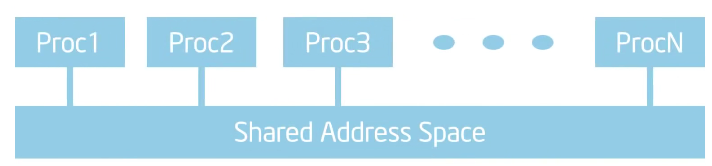

Shared Memory Computer:any computer composed of multiple processing elements that shared an address space.
1. SMP(Symmetric Memory Processor)
2. NUMA(Non Uniform Address Space Multiprocessor)

things will interleave

Cache缓存的出现使得现在的CPU都不是绝对意义上的SMP。

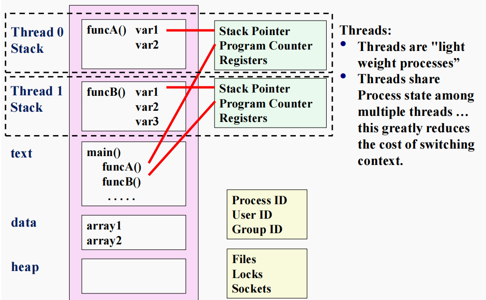

一个进程内含了多个线程，每一个线程都拥有自己的一块stack、Program Pointer、寄存器。这些线程共享text、data、heap region，这使得线程间通信十分方便。

线程数可以超过电脑核数。

OpenMP is a multi-threading, shared address model.

Threads communicate by sharing variables.(heap)

这些数据的共享可能是不安全的。

Prevent race condition.(the program's outcome changes as the threads are scheduled differently)

To control race conditions, use synchronization to protect data conflicts.(to have organized and disciplined access to share data) 

Synchronization is expensive. Change how data is accessed to minimize the need for synchronization.
(意思是同步等待？)

<br>

Fork-Join Parallelism


master thread's ID: 0

sequential parts of the program and parallel regions

nest threads is valid


```cpp
omp_set_num_threads(int);

int=omp_get_thread_num();

double omp_get_wtime();
```

**再omp的语段内定义（分配）的变量在线程的栈空间，是thread私有的。而在外分配的变量在堆空间，是线程可以共享的。**

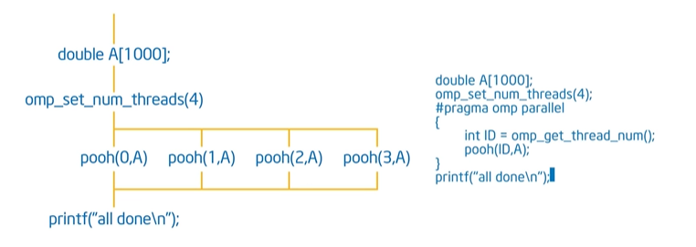

计算$\pi$

```cpp
//串行
static long num_steps = 100000;
double step;
int main()
{
	int i = 0;
	double x = 0, pi = 0, sum = 0;
	step = 1.0 / num_steps;
	for (i = 0; i < num_steps; i++)
	{
		x = (i + 0.5) * step;
		sum += 4.0 / (1.0 + x * x);
	}
	pi = step * sum;
	cout << "pi: " << pi << endl;
	return 0;
}
```

the SPMD algorithm strategy

```cpp
const int num_threads = 20;//我希望申请到的线程数量
	const long num_steps = 100000;
	int realthreads = 0;//系统实际分配给我的数量，不会大于我希望申请到的，但是有可能小于
	double pi = 0.0;
	double part_sum[num_threads] = { 0.0,0.0 };
	double step = 1.0 / num_steps;
	double start_time = omp_get_wtime();
#pragma omp parallel num_threads(num_threads)
	{
		int id, nthrds;
		double x = 0.0;
		id = omp_get_thread_num();
		nthrds = omp_get_num_threads();
		if (id == 0)
			realthreads = nthrds;
		for (int i = 0; i < num_steps; i += nthrds)
		{
			x = (i + 0.5) * step;
			part_sum[id] += 4.0 / (1 + x * x) * step;
		}
	}

	for (int i = 0; i < realthreads; i++)
		pi += part_sum[i];
	cout << "PI: " << pi << endl;
	double end_time = omp_get_wtime();
	cout << "Time: " << end_time - start_time << endl;
```

对于单线程来说，使用OpenMP会略微慢一些。

False sharing

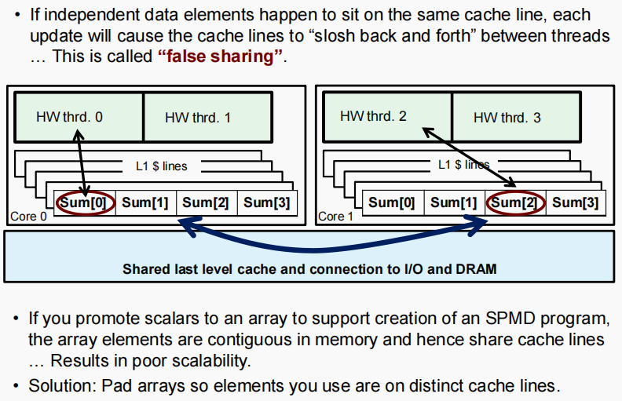

如果公用一个cache，将会拖慢速度。


Barrier

Mutual Exclusion-->critical construct -->critical section

不应该让critical中的程序过多，否则又变为串行，牺牲了性能

atomic --> shortcut to critical, certain constructs in hardware supported in hardware, doing quick update of values in memory.

critical is more general, but if doing simple update(binop=、x++、++x、--x、x--)use atomic faster.

```cpp
	const int NumThreads = 8;//我希望申请到的线程数量
	const long NumSteps = 100000;
	int realthreads = 0;//系统实际分配给我的数量，不会大于我希望申请到的，但是有可能小于
	double pi = 0.0;
	double step = 1.0 / NumSteps;
	double start_time = omp_get_wtime();
#pragma omp parallel num_threads(NumThreads)
	{
		int id, nthrds;
		double sum = 0.0;
		double x = 0.0;
		id = omp_get_thread_num();
		nthrds = omp_get_num_threads();
		if (id == 0)
			realthreads = nthrds;
		for (int i = 0; i < NumSteps; i += realthreads)
		{
			x = (i + 0.5) * step;
			sum += 4.0 / (1 + x * x) * step;
		}
#pragma omp atomic
		pi += sum;
	}

	cout << "PI: " << pi << endl;
```

**最好不要在thread中的for循环中使用critical来传递数据给共享的变量，这样会拖慢速度。可以在线程中创建一个sum用来临时存放。**


WorkSharing
1. loop Construct
2. section Construct
3. single Construct
4. task Construct

Loop Worksharing Construct(for loop)
```cpp
#pragma omp for schedule
//schedule 告诉编译器如何将for进行划分
```

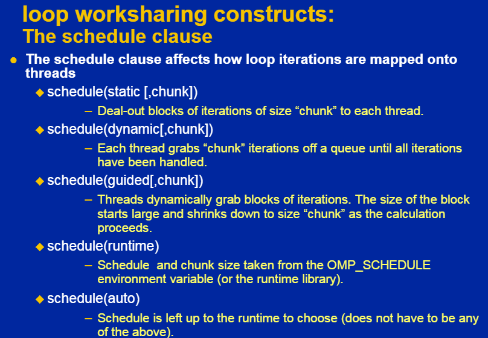

loop independence

Reduction

```cpp
reduction(op:list);
```

**A local copy of each list variable is made and initialized depending on the "op". When the work is done, local copies are reduced into a single value and combined with the original global value.**


通过for和reduction重新计算$\pi$的程序

```cpp
const long NumSteps = 100000;
	double step = 1.0 / NumSteps;
	double pi = 0.0; 
	double sum = 0.0;

#pragma omp parallel for reduction(+:pi) num_threads(10)
	for (int i = 0; i < NumSteps; i++)
	{
		double x = (i + 0.5) * step;
		pi += 4.0 / (1.0 + x * x);
	}
	pi *= step;
	cout << pi << endl;
```

Barrier & Nowait

```cpp
#pragma omp barrier

#pragma omp for nowait
```

Master & Single
```cpp
#pragma omp master//如果让其他线程等待需要barrier

#pragma omp single//含有隐含barrier，可以加nowait
```

Sections & Section

一个thread执行一个Section


Lock

```cpp
omp_init_lock();//initialize the lock variable
omp_set_lock();//grab a lock of mine
omp_unset_lock();//done with the lock, someone else can grab the lock
omp_destroy_lock();//free up the space 
omp_test_lock();//whether the lock is available
```


Shared Private
