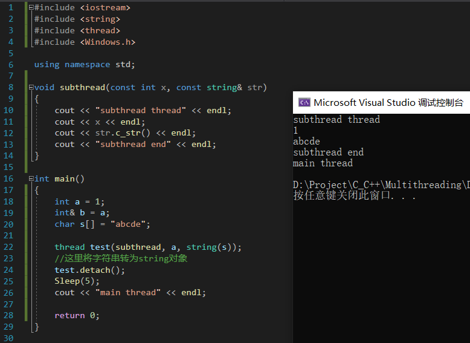

# C++11 并发与多线程

## 《课程目录》
章节1前言
    课时1.1 前言
章节2正式开讲
    课时2.1 并发基本概念及实现，进程、线程基本概念
    课时2.2 线程启动、结束，创建线程多法、join，detach
    课时2.3 线程传参详解，detach()大坑，成员函数做线程函数
    课时2.4 创建多个线程、数据共享问题分析、案例代码
    课时2.5 互斥量概念、用法、死锁演示及解决详解
    课时2.6 unique_lock详解
    课时2.7 单例设计模式共享数据分析、解决，call_once
    课时2.8 condition_variable、wait、notify_one、notify_all
    课时2.9 async、future、packaged_task、promise
    课时2.10 future其他成员函数、shared_future、atomic
    课时2.11 std::atomic续谈、std::async深入谈
    课时2.12 windows临界区、其他各种mutex互斥量
    课时2.13 补充知识、线程池浅谈、数量谈、总结
章节3结束语
    课时3.1 课程总结与展望

## 01 并发基本概念及实现，进程、线程基本概念

### 并发

并发：两个或者更多的任务同时发生，一个程序同时执行多个独立的任务

对单核CPU：

某一时刻只能执行一个任务，由操作系统调度，快速切换

这是伪并发，切换上下文需要时间开销，操作系统需要保存各种状态、执行信息等信息，切换回来时需要复原

多核CPU：

能够实现真正的并行执行多个任务（硬件并发）

使用并发的原因是同时执行多个任务，提高性能

### 可执行程序

磁盘上的一个文件，扩展名为.exe(Windows)

可以运行

### 进程(Process)

可执行文件运行起来，就创建了一个进程

当一个程序开始运行时，它就是一个进程，进程包括运行中的程序和程序所使用到的内存和系统资源

而一个进程又是由多个线程所组成的

### 线程(thread)

每一个进程都有一个主线程，且主线程唯一（一个进程最少有一个线程）

当执行一个可执行程序，产生一个进程后，主线程随着进程**自动**启动

主进程核进程同时产生同时消失

线程真正执行代码，理解为代码的执行通路

除了主线程之外，可以通过代码创建其他线程（非主线程），并发

每创建一个新线程，就可以同时读执行一份代码

线程相比进程的特性
1. 线程启动速度更快，更轻量级
2. 系统资源开销更小
3. 执行速度快，例如使用了共享内存的通信方式
4. 使用有难度，须小心处理数据一致性问题

### 多线程（并发）

多线程是指程序中包含多个执行流，即在一个程序中可以同时运行多个不同的线程来执行不同的任务，也就是说允许单个程序创建多个并行执行的线程来完成各自的任务。

1. 优点：
   1. 可以提高CPU的利用率。在多线程程序中，一个线程必须等待的时候，CPU可以运行其它的线程而不是等待，这样就大大提高了程序的效率。
2. 缺点
   1. 线程也是程序，所以线程需要占用内存（独立的堆栈空间），线程越多占用内存也越多，需要保存很多中间状态
   2. 多线程需要协调和管理，所以需要CPU时间跟踪线程
   3. 切换线程会耗费本该属于程序运行的时间
   4. 线程之间对共享资源的访问会相互影响，必须解决竞用共享资源的问题
   5. 线程太多会导致控制太复杂，最终可能造成很多Bug

有些事情必须使用多线程解决

如果多个线程同时访问同一个资源，则效率将不高

### 并发的实现方法

1. 多进程
2. 在单独的进程中创建多个线程，创建主线程之外的其他线程

### 多进程并发

进程间有通信保护机制

进程之间通信
1. 同一电脑上：管道、文件、消息队列、共享内存
2. 不同电脑上：socket通信技术

### 多线程并发

单个进程中，创建多个线程

但是一个进程中所有的线程共享地址空间（共享内存）

线程中传递方法
1. 全局变量、指针、引用
2. 使用多线程开销远远小于多进程

共享内存带来新问题，数据一致性问题，可能会相互覆盖

一般优先考虑多线程手段

### C++11新标准线程库

以往的多线程不能跨平台编译

pthread(POSIX thread)是跨平台的，但是须进行配置

从C++11新标准，C++语言本身增加对多线程的支持，增加可移植性（跨平台），减少开发人员工作量

<br>
<br>

## 02 线程启动、结束，创建线程多法、join、detach

main函数的执行就是主线程在执行，主线程从main函数返回则整个进程执行完毕

自己创建的线程也需要从一个函数开始执行（初始函数），一旦这个函数运行完毕，代表该线程运行完毕

整个进程是否执行完毕的标志是**主线程**是否执行完毕，如果主线程执行完毕则代表整个进程执行完毕

一般情况，如果其他子线程还没有执行完毕，那么这些子线程也会被操作系统强行终止

所以一般情况下，如果想保持子线程（自己用代码创建的）的运行，则需要让主线程一直保持运行

### thread

1. 包含一个头文件thread
   ```cpp
   #include  <thread>
   ```
2. 创建一个初始函数，让线程从初始函数开始运行
3. main中写代码
   ```cpp
   void func_name
   {
       //function
   }
   thread thread_name(func_name);//传入构造函数参数
   //创建线程，线程起点是func_name
   thread_name.join();
   ```
4. 有两条（多条）线在执行，即使一条被堵住，另一条还是可以继续执行
5. thread是标准库中的一类，用于创建线程，初始函数作为一个可调用对象，是线程构造函数的实参
6. thread thread_name做了两件事情
   1. 创建线程，线程起点是func_name
   2. 该线程开始执行

### join()

```cpp
thread_name.join()
```
决定程序的执行顺序

阻塞主线程，让主线程在这里等待子线程执行完毕，然后子线程和主线程汇合，然后主线程继续执行，之前主线程和子线程可能有交叉，使用Sleep函数可以观察清楚

```cpp
void th()
{
	for (int i = 0; i < 15; i++)
	{cout << i << endl;}
}

thread t(th);
Sleep(5);
cout << "main start" << endl;
Sleep(5);
cout << "main end" << endl;
t.join();
```

当子线程执行完毕，join()执行完毕，主线程继续执行

如果没有join()，程序运行会产生**异常**，而且程序执行混乱

不加join()，可能导致主线程执行完毕，而子线程没有执行完毕，产生异常，这种程序不合格

一个良好的程序应该是等待子线程执行完毕，进行收尾工作，自己才能退出

主线程的责任通过join()体现

### detch

```cpp
thread_name.detach();
```

有例外，主线程可以不等待子线程执行完毕

子线程不与主线程汇合，主线程不需要等待子线程，主线程可以先执行结束

引入detach原因：创建很多子线程，让主线程逐个等待子线程，有时不合适

但是不推荐，最好还是让主线程统一进行收尾

一旦detach()之后，与这个主线程关联的thread对象就会失去与主线程的关联关系。此时子线程就会驻留在后台运行。子线程就被C++运行时库接管，当子线程执行完毕，由运行时库负责清理相关资源（**守护线程**）

如果被C++运行时库接管，如果进程结束，则输出不到命令行窗口

从detach开始线程就在后台执行，不能再使用join()，否则会报出异常

<br>
<br>

### joinable

判断是否可以使用join()，detach()

返回true（可以join或者detach）或false（不可以join或者detach）

<br>
<br>

### 其他创建线程的手法

#### 用类对象
 
通过写仿函数使得类称为可调用对象

```cpp
class CTH
{
public:
	void operator()()//仿函数
	{
		cout << "class thread start" << endl;
		//
		cout << "class thread end" << endl;
	}
};

CTH temp;
thread class_th(temp);
class_th.join();
cout << "main is over" << endl;
```

如果使用detach，而且类数据成员是主线程的数据的引用或者指针，则可能产生不可预料结果。主线程执行结束，主线程的数据被系统回收，子线程不可信

虽然子线程在主线程通过类对象创建，如果主线程执行结束，该对象被回收，但实际上这个对象是被复制到线程中（**调用拷贝构造函数**），虽然原对象被消耗，但是被复制的对象仍然存在。如果类对象中没有引用、指针，就不会产生问题。或者从根本上不使用detach即可

#### 用lambda表达式

```cpp
auto mylambda = []
{
    cout << "thread start" << endl;
    cout << "thread end" << endl;
};

thread th(mylambda);
th.join();

cout << "main" << endl;
```

如果使用detach，虽然lambda表达式可以写在main函数之中，但是随着主线程结束，子线程输入的内容仍会输出不到控制台

<br>
<br>
<br>

## 03 线程传参详解，detach()大坑，成员函数做线程函数

### 传递临时对象作为线程参数

有时候希望线程根据自己的编号做相应的工作

如果使用了detach，而且子线程如果使用了主线程中的引用，其实也不要紧，实际上进行了复制，是值传递（地址不同，假引用）。所以即使主线程结束，detach了的子线程仍能继续执行，使用的是复制出来的。但是在detach子线程时，使用指针一定会有问题，地址相同。传递指针和引用都不推荐

<br>

如何传递指针（字符串）？

首先想到的是使用隐式类型转换，子线程函数接收string类的引用(string&)，这样就会有一份“拷贝”，似乎是没问题。但是实际上存在一种可能，就是字符串被回收了，系统才去转string，这样的结果是不可预料的。

正确稳定的写法如下：



通过转成临时的string对象解决问题。


### 临时对象作为线程参数


### 传递类对象、智能指针作为线程参数


### 用成员函数指针做线程参数


<br>
<br>

## 04 创建多个线程、数据共享问题分析、案例代码


<br>
<br>
<br>


# 并行与并发

并行（parallelism）

这个概念很好理解。所谓并行，就是同时执行的意思，无需过度解读。判断程序是否处于并行的状态，就看同一时刻是否有超过一个“工作单位”在运行就好了。所以，单线程永远无法达到并行状态。

要达到并行状态，最简单的就是利用多线程和多进程。但是 Python 的多线程由于存在著名的 GIL，无法让两个线程真正“同时运行”，所以实际上是无法到达并行状态的。

<br>

顾名思义，「并发」强调的是可以一起「出『发』」，「并行」强调的是可以一起「执『行』」

与可以一起出发的并发（concurrent）相对的是不可以一起出发的顺序（sequential）：

顺序：上一个开始指向的任务完成后，当前任务才能开始执行

并发：无论上一个开始执行的任务是否完成，当前任务都可以开始执行

与可以一起执行的并行（parallel）相对的是不可以一起执行的串行（serial）：

串行：有一个任务执行单元，从物理上只能一个任务一个任务执行

并行：有多个任务执行单元，从物理上可以多个任务一起执行

单核CPU多任务：并发、串行

多线程：并发、串行（所有线程都在同一个核上执行）；并发、并行（不同线程在不同核上执行）


综上，并发与并行并不是互斥的概念，前者关注任务的抽象调度、后者关注任务的实际执行。但相关，并行一定允许并发。
