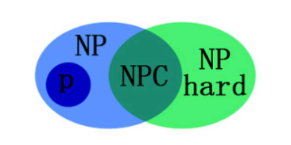

# P问题、NP问题、NP完全问题、NP难问题

时间复杂度：o(1)<o(n)<o(nlgn)<o(n^2)<o(n^a)<o(e^n)<o(n!)

多项式级别：o(1)<o(n)<o(nlgn)<o(n^2)<o(n^a)

非多项式级别：o(e^n)<o(n!)，计算机难以承受

 

## P问题

P类问题（P：polynominal，多项式）：存在多项式时间算法的问题。以排序为例，在排序这个大问题里，是可以找到一种时间复杂度为多项式o(n^2)，o(nlogn)的算法(如冒泡排序法，快速排序)来求解排序问题的，所以我们说排序问题是一个有多项式时间算法的问题。所以我们称，P类问题就是存在多项式时间算法的问题。

 

## NP问题

NP类问题（NP:Nondeterministic polynominal，非确定性多项式）：能在多项式时间内验证得出一个正确解的问题。P类问题是NP问题的子集，因为存在多项式时间解法的问题，总能在多项式时间内验证他。

 

## NP完全问题

NPC类问题（Nondeterminism Polynomial complete）：存在这样一个NP问题，所有的NP问题都可以约化成它。换句话说，只要解决了这个问题，那么所有的NP问题都解决了。其定义要满足2个条件：

它得是一个NP问题；
所有的NP问题都可以约化到它。
要证明NPC问题的思路就是： 先证明它至少是一个NP问题，再证明其中一个已知的NPC问题能约化到它。

 

## NP难问题

NP难问题（NP-hard问题）：它满足NPC问题定义的第二条但不一定要满足第一条（就是说，NP-Hard问题要比 NPC问题的范围广，NP-Hard问题没有限定属于NP），即所有的NP问题都能约化到它，但是他不一定是一个NP问题。

NP-Hard问题同样难以找到多项式的算法，但它不列入我们的研究范围，因为它不一定是NP问题。即使NPC问题发现了多项式级的算法，NP-Hard问题有可能仍然无法得到多项式级的算法。事实上，由于NP-Hard放宽了限定条件，它将有可能比所有的NPC问题的时间复杂度更高从而更难以解决。
